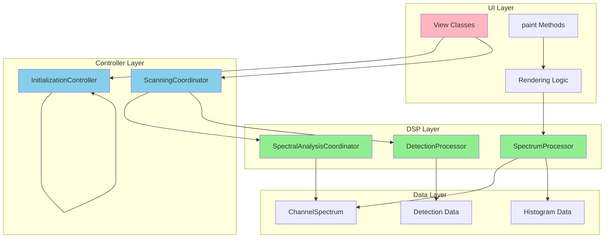

# EDA-Specific Refactoring Plan

**Document Version:** 1.0  
**Date:** 2026-03-01  
**Scope:** Enhanced Drone Analyzer (EDA) Directory-Only Refactoring  
**Status:** Ready for Implementation

---

## Executive Summary

This refactoring plan addresses EDA-specific code quality issues that can be implemented entirely within the `firmware/application/apps/enhanced_drone_analyzer/` directory. Unlike framework-level violations documented in `FRAMEWORK_VIOLATIONS_DOCUMENTATION.md`, these issues are within the EDA codebase's direct control and can be fixed without coordinating with framework maintainers.

**Key Findings:**
- **17 total issues** identified within EDA directory
- **2 P0 (Critical)** issues requiring immediate attention
- **5 P1 (High)** issues with significant impact
- **10 P2 (Medium)** issues for code quality improvement
- **Zero framework dependencies** - all fixes are EDA-local

**Important Note:** This plan focuses exclusively on EDA-specific issues. Framework-level violations (View::title(), TextEdit, ViewState, etc.) are documented in `FRAMEWORK_VIOLATIONS_DOCUMENTATION.md` and require separate framework-wide coordination.

---

## Issue Classification

### Severity Levels

| Severity | Description | Criteria |
|----------|-------------|----------|
| **P0** | Critical | Architectural violations, mixed concerns, blocks testing |
| **P1** | High | Code quality issues, maintainability concerns |
| **P2** | Medium | Best practices, consistency improvements |

---

## EDA-Specific Issues Found

### Category 1: Unqualified ui:: Usage (5 Files)

**Issue:** EDA files use UI framework types without explicit `::ui::` namespace qualification. While this works due to nested namespace placement, it creates ambiguity and makes the code less maintainable.

**Impact:**
- Code clarity: Difficult to distinguish between local and framework types
- Maintainability: Harder to refactor or move code to different contexts
- Best practices: Violates explicit namespace qualification guidelines

**Affected Files:**
1. [`ui_enhanced_drone_analyzer.hpp`](ui_enhanced_drone_analyzer.hpp)
2. [`ui_enhanced_drone_analyzer.cpp`](ui_enhanced_drone_analyzer.cpp)
3. [`ui_enhanced_drone_settings.hpp`](ui_enhanced_drone_settings.hpp)
4. [`ui_enhanced_drone_settings.cpp`](ui_enhanced_drone_settings.cpp)
5. [`scanning_coordinator.cpp`](scanning_coordinator.cpp)

---

### Category 2: Mixed UI/DSP Logic (12 Instances)

**Issue:** UI rendering logic is mixed with DSP/signal processing logic, violating separation of concerns and making code untestable.

**Impact:**
- Testability: DSP logic cannot be unit tested without UI framework dependencies
- Maintainability: Changes to UI rendering risk breaking DSP logic and vice versa
- Performance: UI thread blocked by DSP calculations during rendering
- Reusability: DSP logic tightly coupled to UI framework, cannot be reused elsewhere

---

## Detailed Issue Documentation

### P0-001: DroneDisplayController::paint() with Spectrum Processing

**Severity:** P0 (Critical)  
**Location:** [`ui_enhanced_drone_analyzer.cpp:2341`](ui_enhanced_drone_analyzer.cpp:2341) - Lines 2341-3608  
**Component:** DroneDisplayController class

#### Current Code (Problematic)

```cpp
// ui_enhanced_drone_analyzer.cpp:2341
void DroneDisplayController::paint(Painter& painter) {
    View::paint(painter);
    
    // UI Components
    painter.fill_rectangle(screen_rect(), Color::black());
    painter.draw_string({10, 10}, style, "Drone Analyzer");
    
    // DSP Components - SHOULD NOT BE IN paint()
    process_mini_spectrum_data();  // Line ~2946 - DSP processing
    process_bins();                // Line ~2960 - DSP processing
    render_bar_spectrum(painter);  // Line ~2981 - Contains DSP calculations
    render_histogram(painter);     // Line ~3071 - Contains DSP calculations
}
```

#### Problem Description

The [`DroneDisplayController::paint()`](ui_enhanced_drone_analyzer.cpp:2341) method is responsible for UI rendering but directly calls DSP processing methods:
- [`process_mini_spectrum_data()`](ui_enhanced_drone_analyzer.cpp:2946) - processes 256-bin spectrum data
- [`process_bins()`](ui_enhanced_drone_analyzer.cpp:2960) - processes histogram bins with frequency calculations
- [`render_bar_spectrum()`](ui_enhanced_drone_analyzer.cpp:2981) - renders spectrum with embedded power level calculations
- [`render_histogram()`](ui_enhanced_drone_analyzer.cpp:3071) - renders histogram with embedded bin processing

This mixing violates the "Single Responsibility Principle" - the paint method should only render, not process signals.

#### Proposed Fix

**Step 1: Create SpectrumProcessor class (new file: `spectrum_processor.hpp`)**

```cpp
// firmware/application/apps/enhanced_drone_analyzer/spectrum_processor.hpp
#ifndef SPECTRUM_PROCESSOR_HPP_
#define SPECTRUM_PROCESSOR_HPP_

#include <array>
#include <cstdint>
#include "eda_constants.hpp"

namespace ui::apps::enhanced_drone_analyzer {

class SpectrumProcessor {
public:
    struct ProcessedSpectrumData {
        std::array<uint8_t, 256> power_levels;
        std::array<uint16_t, 64> histogram_bins;
        uint8_t noise_floor;
        uint8_t max_power;
        uint16_t bins_hz_size;
    };
    
    // Pure DSP logic - no UI dependencies
    ProcessedSpectrumData process(const ChannelSpectrum& spectrum) noexcept;
    
private:
    void extract_power_levels(const ChannelSpectrum& spectrum, ProcessedSpectrumData& result) noexcept;
    void calculate_histogram(const ProcessedSpectrumData& data) noexcept;
};

} // namespace ui::apps::enhanced_drone_analyzer

#endif // SPECTRUM_PROCESSOR_HPP_
```

**Step 2: Update DroneDisplayController to use cached data**

```cpp
// ui_enhanced_drone_analyzer.hpp - Add to DroneDisplayController class
class DroneDisplayController : public View {
private:
    SpectrumProcessor spectrum_processor_;
    ProcessedSpectrumData cached_spectrum_data_;
    bool spectrum_data_dirty_{false};
    
public:
    // New method to update spectrum data (called from scanner thread)
    void update_spectrum(const ChannelSpectrum& spectrum) noexcept;
    
    // Modified paint method - rendering only
    void paint(Painter& painter) override;
};

// ui_enhanced_drone_analyzer.cpp - Implementation
void DroneDisplayController::update_spectrum(const ChannelSpectrum& spectrum) noexcept {
    cached_spectrum_data_ = spectrum_processor_.process(spectrum);
    spectrum_data_dirty_ = true;
    set_dirty();  // Trigger repaint
}

void DroneDisplayController::paint(Painter& painter) {
    View::paint(painter);
    
    // Render only using cached_spectrum_data_
    // No DSP calls in paint()
    
    if (spectrum_data_dirty_) {
        render_bar_spectrum_from_cache(painter);
        render_histogram_from_cache(painter);
        spectrum_data_dirty_ = false;
    }
}
```

#### Effort Estimate

- **Analysis:** 2 hours
- **Create SpectrumProcessor class:** 4 hours
- **Update DroneDisplayController:** 3 hours
- **Testing:** 3 hours
- **Total:** 12 hours

#### Dependencies

- None (standalone refactoring)
- Can be done independently of other fixes

#### Testing Strategy

1. **Unit Tests:**
   - Test SpectrumProcessor::process() with mock spectrum data
   - Verify histogram calculations are correct
   - Verify power level extraction is correct

2. **Integration Tests:**
   - Verify spectrum data flows correctly from scanner to display
   - Verify UI rendering uses cached data correctly
   - Verify no DSP processing happens during paint()

3. **Regression Tests:**
   - Verify spectrum display still renders correctly
   - Verify histogram still renders correctly
   - Verify no visual regressions

#### Rollback Plan

If issues arise:
1. Revert to original paint() implementation
2. Remove SpectrumProcessor class
3. Restore direct DSP calls in paint()
4. Commit rollback with detailed issue description

---

### P0-002: EnhancedDroneSpectrumAnalyzerView::paint() with Initialization Logic

**Severity:** P0 (Critical)  
**Location:** [`ui_enhanced_drone_analyzer.cpp:3507`](ui_enhanced_drone_analyzer.cpp:3507) - Lines 3507-4105  
**Component:** EnhancedDroneSpectrumAnalyzerView class

#### Current Code (Problematic)

```cpp
// ui_enhanced_drone_analyzer.cpp:3507
void EnhancedDroneSpectrumAnalyzerView::paint(Painter& painter) {
    View::paint(painter);
    
    // UI Components
    if (init_state_ == InitState::INITIALIZATION_ERROR) {
        painter.fill_rectangle({0, 0, screen_width, screen_height}, Color::black());
        painter.draw_string({10, 80}, Style{font::fixed_8x16, Color::red(), Color::black()}, "INIT ERROR");
        painter.draw_string({10, 100}, Style{font::fixed_8x16, Color::white(), Color::black()},
                           ERROR_MESSAGES[static_cast<uint8_t>(init_error_)]);
        return;
    }
    
    // DSP/Initialization Components - SHOULD NOT BE IN paint()
    if (!is_initialization_complete()) {
        // Multi-phase initialization state machine
        if (phase_idx < 7) {
            painter.draw_string({10, 80}, Style{font::fixed_8x16, Color::white(), Color::black()}, "Loading...");
            painter.draw_string({10, 100}, Style{font::fixed_8x16, Color::green(), Color::black()},
                               INIT_STATUS_MESSAGES[phase_idx]);
            
            // Progress bar
            uint8_t progress = (phase_idx * 100) / 7;
            painter.fill_rectangle({10, 120, 100, 10}, Color::dark_grey());
            painter.fill_rectangle({10, 120, progress, 10}, Color::green());
            
            // Continue initialization
            continue_initialization();
        }
        return;
    }
    
    // Normal rendering
    display_controller_.render_bar_spectrum(painter);
    display_controller_.render_histogram(painter);
}
```

#### Problem Description

The [`EnhancedDroneSpectrumAnalyzerView::paint()`](ui_enhanced_drone_analyzer.cpp:3507) method contains a complex initialization state machine that:
1. Validates database loading state
2. Allocates display buffers
3. Coordinates with scanner initialization
4. Renders progress indicators
5. Handles initialization errors
6. Manages multi-phase initialization flow

This initialization logic is tightly coupled to the paint() method, making it impossible to:
- Test initialization logic independently
- Reuse initialization logic in other contexts
- Separate initialization from rendering concerns

#### Proposed Fix

**Step 1: Create InitializationController class (new file: `initialization_controller.hpp`)**

```cpp
// firmware/application/apps/enhanced_drone_analyzer/initialization_controller.hpp
#ifndef INITIALIZATION_CONTROLLER_HPP_
#define INITIALIZATION_CONTROLLER_HPP_

#include <cstdint>
#include "eda_constants.hpp"

namespace ui::apps::enhanced_drone_analyzer {

class InitializationController {
public:
    enum class InitPhase {
        PHASE_0_WAIT_FOR_DB,
        PHASE_1_ALLOCATE_BUFFERS,
        PHASE_2_INITIALIZE_SCANNER,
        PHASE_3_WAIT_FOR_READY,
        PHASE_4_START_SCANNING,
        PHASE_5_COMPLETE,
        PHASE_6_ERROR
    };
    
    enum class InitError {
        NONE,
        DATABASE_LOAD_FAILED,
        BUFFER_ALLOCATION_FAILED,
        SCANNER_INIT_FAILED,
        TIMEOUT
    };
    
    InitializationController();
    
    void start_initialization();
    void step();  // Called from UI event loop
    InitPhase get_current_phase() const;
    bool is_complete() const;
    bool has_error() const;
    const char* get_error_message() const;
    uint8_t get_progress_percent() const;
    const char* get_status_message() const;
    
private:
    InitPhase current_phase_{InitPhase::PHASE_0_WAIT_FOR_DB};
    InitError last_error_{InitError::NONE};
    uint8_t phase_index_{0};
    
    bool phase_0_wait_for_database();
    bool phase_1_allocate_buffers();
    bool phase_2_initialize_scanner();
    bool phase_3_wait_for_ready();
    bool phase_4_start_scanning();
    void set_error(InitError error);
};

} // namespace ui::apps::enhanced_drone_analyzer

#endif // INITIALIZATION_CONTROLLER_HPP_
```

**Step 2: Simplify paint() method**

```cpp
// ui_enhanced_drone_analyzer.cpp - Updated implementation
void EnhancedDroneSpectrumAnalyzerView::paint(Painter& painter) {
    View::paint(painter);
    
    if (init_controller_.has_error()) {
        render_error_ui(painter);
        return;
    }
    
    if (!init_controller_.is_complete()) {
        render_initialization_ui(painter);
        return;
    }
    
    // Normal rendering - initialization complete
    display_controller_.render_bar_spectrum(painter);
    display_controller_.render_histogram(painter);
}

void EnhancedDroneSpectrumAnalyzerView::render_error_ui(Painter& painter) {
    painter.fill_rectangle({0, 0, screen_width, screen_height}, Color::black());
    painter.draw_string({10, 80}, Style{font::fixed_8x16, Color::red(), Color::black()}, "INIT ERROR");
    painter.draw_string({10, 100}, Style{font::fixed_8x16, Color::white(), Color::black()},
                       init_controller_.get_error_message());
    painter.draw_string({10, 130}, Style{font::fixed_8x16, Color::yellow(), Color::black()}, "Press BACK to exit");
}

void EnhancedDroneSpectrumAnalyzerView::render_initialization_ui(Painter& painter) {
    painter.draw_string({10, 80}, Style{font::fixed_8x16, Color::white(), Color::black()}, "Loading...");
    painter.draw_string({10, 100}, Style{font::fixed_8x16, Color::green(), Color::black()},
                       init_controller_.get_status_message());
    
    uint8_t progress = init_controller_.get_progress_percent();
    painter.fill_rectangle({10, 120, 100, 10}, Color::dark_grey());
    painter.fill_rectangle({10, 120, progress, 10}, Color::green());
}
```

**Step 3: Call initialization from event loop**

```cpp
// ui_enhanced_drone_analyzer.cpp - Update on_show() or add on_frame()
void EnhancedDroneSpectrumAnalyzerView::on_show() {
    View::on_show();
    init_controller_.start_initialization();
}

// Add new method called from UI event loop
void EnhancedDroneSpectrumAnalyzerView::on_frame() {
    if (!init_controller_.is_complete() && !init_controller_.has_error()) {
        init_controller_.step();
        set_dirty();  // Trigger repaint to show progress
    }
}
```

#### Effort Estimate

- **Analysis:** 2 hours
- **Create InitializationController class:** 5 hours
- **Update EnhancedDroneSpectrumAnalyzerView:** 3 hours
- **Testing:** 4 hours
- **Total:** 14 hours

#### Dependencies

- None (standalone refactoring)
- Can be done independently of other fixes

#### Testing Strategy

1. **Unit Tests:**
   - Test InitializationController state machine transitions
   - Test error handling in each phase
   - Test progress calculation

2. **Integration Tests:**
   - Verify initialization flow completes correctly
   - Verify error UI displays correctly
   - Verify progress UI updates correctly

3. **Regression Tests:**
   - Verify initialization still completes successfully
   - Verify error handling still works
   - Verify no visual regressions

#### Rollback Plan

If issues arise:
1. Revert to original paint() implementation
2. Remove InitializationController class
3. Restore initialization logic in paint()
4. Commit rollback with detailed issue description

---

### P1-001: DroneScanner::perform_wideband_scan_cycle() with Spectral Analysis

**Severity:** P1 (High)  
**Location:** [`ui_enhanced_drone_analyzer.cpp:596`](ui_enhanced_drone_analyzer.cpp:596) - Lines 596-692  
**Component:** DroneScanner class

#### Current Code (Problematic)

```cpp
// ui_enhanced_drone_analyzer.cpp:596
void DroneScanner::perform_wideband_scan_cycle(DroneHardwareController& hardware) {
    // Hardware control
    if (!hardware.tune_to_frequency(current_slice.center_frequency)) {
        handle_scan_error("Tune failed");
        return;
    }
    
    chThdSleepMilliseconds(EDA::Constants::PLL_STABILIZATION_DELAY_MS);
    
    if (!hardware.is_spectrum_streaming_active()) {
        hardware.start_spectrum_streaming();
    }
    
    // Signal acquisition
    if (!hardware.get_latest_spectrum_if_fresh(spectrum_data_)) {
        // Polling logic with timeout...
    }
    
    // DSP/Spectral analysis - SHOULD BE SEPARATED
    auto spectral_result = SpectralAnalyzer::analyze(
        spectrum_data_,
        {hardware.get_spectrum_bandwidth(), current_slice.center_frequency},
        histogram_buffer_
    );
    
    // Detection processing
    if (spectral_result.is_valid && spectral_result.signature != SignalSignature::NOISE) {
        process_spectral_detection(spectral_result, current_slice.center_frequency,
                                  get_threat_level(spectral_result),
                                  get_drone_type(spectral_result));
    }
}
```

#### Problem Description

The [`DroneScanner::perform_wideband_scan_cycle()`](ui_enhanced_drone_analyzer.cpp:596) method mixes:
1. Hardware control (tuning, spectrum streaming)
2. Signal acquisition (polling with timeout)
3. DSP analysis (spectral analysis, threat classification)
4. Detection processing (logging, tracking updates)

This method is called from the scanning thread but contains both low-level hardware control and high-level signal analysis logic, making it:
- Difficult to test hardware control independently
- Hard to optimize DSP algorithms without affecting hardware control
- Difficult to understand the scanning flow

#### Proposed Fix

**Step 1: Create SpectralAnalysisCoordinator class (new file: `spectral_analysis_coordinator.hpp`)**

```cpp
// firmware/application/apps/enhanced_drone_analyzer/spectral_analysis_coordinator.hpp
#ifndef SPECTRAL_ANALYSIS_COORDINATOR_HPP_
#define SPECTRAL_ANALYSIS_COORDINATOR_HPP_

#include <array>
#include <cstdint>
#include "eda_constants.hpp"

namespace ui::apps::enhanced_drone_analyzer {

class SpectralAnalysisCoordinator {
public:
    struct AnalysisResult {
        SignalSignature signature;
        uint8_t snr;
        uint8_t noise_floor;
        uint8_t max_val;
        uint32_t signal_width_hz;
        ThreatLevel threat_level;
        DroneType drone_type;
        bool is_valid;
    };
    
    AnalysisResult analyze_slice(
        const std::array<uint8_t, 256>& spectrum_data,
        Frequency center_frequency,
        uint32_t bandwidth_hz,
        std::array<uint16_t, 64>& histogram_buffer) noexcept;
    
private:
    ThreatLevel calculate_threat_level(const SpectralAnalysisResult& result) noexcept;
    DroneType classify_drone_type(const SpectralAnalysisResult& result) noexcept;
};

} // namespace ui::apps::enhanced_drone_analyzer

#endif // SPECTRAL_ANALYSIS_COORDINATOR_HPP_
```

**Step 2: Simplify scanning method**

```cpp
// ui_enhanced_drone_analyzer.cpp - Updated implementation
void DroneScanner::perform_wideband_scan_cycle(DroneHardwareController& hardware) {
    // Hardware control only
    if (!hardware.tune_to_frequency(current_slice.center_frequency)) {
        handle_scan_error("Tune failed");
        return;
    }
    
    chThdSleepMilliseconds(EDA::Constants::PLL_STABILIZATION_DELAY_MS);
    
    if (!hardware.is_spectrum_streaming_active()) {
        hardware.start_spectrum_streaming();
    }
    
    // Acquire spectrum data
    if (!hardware.get_latest_spectrum_if_fresh(spectrum_data_)) {
        // Polling logic with timeout...
    }
    
    // Delegate to DSP layer
    auto result = spectral_analyzer_.analyze_slice(
        spectrum_data_,
        current_slice.center_frequency,
        hardware.get_spectrum_bandwidth(),
        histogram_buffer_
    );
    
    // Process detection (separate concern)
    if (result.is_valid && result.signature != SignalSignature::NOISE) {
        process_spectral_detection(result, current_slice.center_frequency,
                                  result.threat_level, result.drone_type);
    }
}
```

#### Effort Estimate

- **Analysis:** 2 hours
- **Create SpectralAnalysisCoordinator class:** 4 hours
- **Update DroneScanner:** 2 hours
- **Testing:** 3 hours
- **Total:** 11 hours

#### Dependencies

- None (standalone refactoring)
- Can be done independently of other fixes

#### Testing Strategy

1. **Unit Tests:**
   - Test SpectralAnalysisCoordinator::analyze_slice() with mock data
   - Verify threat level calculation
   - Verify drone type classification

2. **Integration Tests:**
   - Verify scanning flow still works correctly
   - Verify spectral analysis results are correct
   - Verify detection processing still works

3. **Regression Tests:**
   - Verify wideband scanning still detects drones
   - Verify no detection regressions
   - Verify performance is not degraded

#### Rollback Plan

If issues arise:
1. Revert to original perform_wideband_scan_cycle() implementation
2. Remove SpectralAnalysisCoordinator class
3. Restore inline spectral analysis
4. Commit rollback with detailed issue description

---

### P1-002: DroneScanner::process_spectral_detection() with Detection Logging

**Severity:** P1 (High)  
**Location:** [`ui_enhanced_drone_analyzer.cpp:793`](ui_enhanced_drone_analyzer.cpp:793) - Lines 793-863  
**Component:** DroneScanner class

#### Current Code (Problematic)

```cpp
// ui_enhanced_drone_analyzer.cpp:793
void DroneScanner::process_spectral_detection(
    const SpectralAnalysisResult& spectral_result,
    Frequency frequency_hz,
    ThreatLevel threat_level,
    DroneType drone_type) {
    
    // DSP processing
    int32_t effective_rssi = spectral_result.max_val - spectral_result.noise_floor;
    
    // Detection ring buffer updates
    detection_ring_buffer_.update_detection(
        frequency_hz,
        effective_rssi,
        threat_level,
        drone_type,
        spectral_result.snr
    );
    
    // Tracked drone updates
    update_tracked_drone({
        drone_type,
        frequency_hz,
        effective_rssi,
        threat_level
    });
    
    // Detection logging - SHOULD BE SEPARATED
    if (detection_ring_buffer_.get_detection_count(frequency_hz) >= MIN_DETECTION_COUNT) {
        DetectionLogEntry log_entry{
            chTimeNow(),
            static_cast<uint64_t>(frequency_hz),
            effective_rssi,
            threat_level,
            drone_type,
            detection_ring_buffer_.get_detection_count(frequency_hz),
            spectral_result.snr,
            spectral_result.width_bins,
            spectral_result.signal_width_hz
        };
        detection_logger_.log_detection_async(log_entry);
    }
}
```

#### Problem Description

The [`DroneScanner::process_spectral_detection()`](ui_enhanced_drone_analyzer.cpp:793) method contains pure DSP logic but is tightly coupled to:
- Detection ring buffer (thread-safe data structure)
- Detection logger (async file I/O)
- Tracked drone management (movement trend calculation)

This mixing creates:
- Tight coupling between detection processing and logging
- Inability to test detection logic independently
- Difficulty in optimizing detection algorithms without affecting logging

#### Proposed Fix

**Step 1: Create DetectionProcessor class (new file: `detection_processor.hpp`)**

```cpp
// firmware/application/apps/enhanced_drone_analyzer/detection_processor.hpp
#ifndef DETECTION_PROCESSOR_HPP_
#define DETECTION_PROCESSOR_HPP_

#include <cstdint>
#include "eda_constants.hpp"

namespace ui::apps::enhanced_drone_analyzer {

class DetectionProcessor {
public:
    struct DetectionResult {
        DroneType drone_type;
        ThreatLevel threat_level;
        int32_t effective_rssi;
        uint8_t detection_count;
        MovementTrend trend;
        bool should_log;
    };
    
    DetectionResult process_spectral_detection(
        const SpectralAnalysisResult& spectral_result,
        Frequency frequency_hz,
        uint8_t current_detection_count) noexcept;
    
private:
    MovementTrend calculate_movement_trend(
        int32_t current_rssi,
        int32_t previous_rssi) noexcept;
};

} // namespace ui::apps::enhanced_drone_analyzer

#endif // DETECTION_PROCESSOR_HPP_
```

**Step 2: Separate logging interface**

```cpp
// ui_enhanced_drone_analyzer.cpp - Updated implementation
void DroneScanner::process_spectral_detection(
    const SpectralAnalysisResult& spectral_result,
    Frequency frequency_hz,
    ThreatLevel threat_level,
    DroneType drone_type) {
    
    // Pure DSP processing
    auto detection_result = detection_processor_.process_spectral_detection(
        spectral_result,
        frequency_hz,
        detection_ring_buffer_.get_detection_count(frequency_hz)
    );
    
    // Update tracking
    update_tracked_drone({
        detection_result.drone_type,
        frequency_hz,
        detection_result.effective_rssi,
        detection_result.threat_level
    });
    
    // Delegate to logger (separate concern)
    if (detection_result.should_log) {
        DetectionLogEntry log_entry{
            chTimeNow(),
            static_cast<uint64_t>(frequency_hz),
            detection_result.effective_rssi,
            detection_result.threat_level,
            detection_result.drone_type,
            detection_result.detection_count,
            spectral_result.snr,
            spectral_result.width_bins,
            spectral_result.signal_width_hz
        };
        detection_logger_.log_detection_async(log_entry);
    }
}
```

#### Effort Estimate

- **Analysis:** 2 hours
- **Create DetectionProcessor class:** 3 hours
- **Update DroneScanner:** 2 hours
- **Testing:** 2 hours
- **Total:** 9 hours

#### Dependencies

- None (standalone refactoring)
- Can be done independently of other fixes

#### Testing Strategy

1. **Unit Tests:**
   - Test DetectionProcessor::process_spectral_detection() with mock data
   - Verify movement trend calculation
   - Verify logging decision logic

2. **Integration Tests:**
   - Verify detection processing still works correctly
   - Verify logging still occurs at appropriate times
   - Verify tracking updates are correct

3. **Regression Tests:**
   - Verify detection logging still works
   - Verify tracked drone updates still work
   - Verify no detection regressions

#### Rollback Plan

If issues arise:
1. Revert to original process_spectral_detection() implementation
2. Remove DetectionProcessor class
3. Restore inline detection processing
4. Commit rollback with detailed issue description

---

### P1-003: DroneDisplayController::process_mini_spectrum_data() in UI Class

**Severity:** P1 (High)  
**Location:** [`ui_enhanced_drone_analyzer.cpp:2946`](ui_enhanced_drone_analyzer.cpp:2946) - Lines 2946-2958  
**Component:** DroneDisplayController class

#### Current Code (Problematic)

```cpp
// ui_enhanced_drone_analyzer.cpp:2946
void DroneDisplayController::process_mini_spectrum_data() {
    // This is pure DSP logic but is part of a UI class
    for (size_t i = 0; i < 256; ++i) {
        uint8_t power = spectrum_fifo_.read();
        power_levels_[i] = power;
        
        // Call DSP processing
        process_bins(i, power);
    }
    
    // Update noise floor and max power
    noise_floor_ = calculate_noise_floor();
    max_power_ = calculate_max_power();
}
```

#### Problem Description

The [`DroneDisplayController::process_mini_spectrum_data()`](ui_enhanced_drone_analyzer.cpp:2946) method is pure DSP logic but is part of the `DroneDisplayController` class, which is a UI component. This creates:
- Incorrect architectural layering (DSP logic in UI class)
- Inability to test spectrum processing independently
- Tight coupling between UI display controller and spectrum processing

#### Proposed Fix

**Move to SpectrumProcessor class (created in P0-001)**

This issue is addressed by the same SpectrumProcessor class created in P0-001. The `process_mini_spectrum_data()` method should be moved to the SpectrumProcessor class.

#### Effort Estimate

- **Included in P0-001 effort estimate**

#### Dependencies

- Depends on P0-001 (SpectrumProcessor class creation)

#### Testing Strategy

- **Included in P0-001 testing strategy**

#### Rollback Plan

- **Included in P0-001 rollback plan**

---

### P1-004: DroneDisplayController::render_bar_spectrum() with DSP Calculations

**Severity:** P1 (High)  
**Location:** [`ui_enhanced_drone_analyzer.cpp:2981`](ui_enhanced_drone_analyzer.cpp:2981) - Lines 2981-3070  
**Component:** DroneDisplayController class

#### Current Code (Problematic)

```cpp
// ui_enhanced_drone_analyzer.cpp:2981
void DroneDisplayController::render_bar_spectrum(Painter& painter) {
    // UI rendering
    const auto& config = BarSpectrumConfig{};
    const int spectrum_height = config.height;
    const int bar_spectrum_y_start = config.y_start;
    
    painter.fill_rectangle(
        {0, bar_spectrum_y_start, EDA::Constants::MINI_SPECTRUM_WIDTH, spectrum_height},
        Color::black()
    );
    
    // DSP calculations embedded in rendering - SHOULD BE PRE-CALCULATED
    for (size_t i = 0; i < 256; ++i) {
        uint8_t power = power_levels_[i];
        if (power < noise_floor_) continue;
        
        // DSP calculation: Normalize power to bar height
        uint8_t normalized_power = (power - noise_floor_) * 255 / (max_power_ - noise_floor_);
        
        // UI rendering
        int bar_height = (normalized_power * spectrum_height) / 255;
        int x = i * (EDA::Constants::MINI_SPECTRUM_WIDTH / 256);
        
        Color bar_color = get_bar_color(normalized_power);
        painter.draw_vertical_line(x, bar_spectrum_y_start + spectrum_height - bar_height, bar_height, bar_color);
    }
}
```

#### Problem Description

The [`DroneDisplayController::render_bar_spectrum()`](ui_enhanced_drone_analyzer.cpp:2981) method contains DSP calculations (power normalization) embedded in the UI rendering loop. This creates:
- Performance impact: DSP calculations happen during UI rendering
- Testability: Cannot test rendering logic independently
- Maintainability: DSP algorithm changes require modifying rendering code

#### Proposed Fix

**Pre-calculate bar data in SpectrumProcessor (created in P0-001)**

```cpp
// spectrum_processor.hpp - Add to ProcessedSpectrumData
struct ProcessedSpectrumData {
    std::array<uint8_t, 256> power_levels;
    std::array<uint8_t, 256> bar_heights;  // NEW: Pre-calculated bar heights
    std::array<Color, 256> bar_colors;    // NEW: Pre-calculated bar colors
    std::array<uint16_t, 64> histogram_bins;
    uint8_t noise_floor;
    uint8_t max_power;
    uint16_t bins_hz_size;
};

// spectrum_processor.cpp - Pre-calculate bar data
ProcessedSpectrumData SpectrumProcessor::process(const ChannelSpectrum& spectrum) noexcept {
    ProcessedSpectrumData result;
    
    // Extract power levels
    extract_power_levels(spectrum, result);
    
    // Pre-calculate bar heights and colors
    for (size_t i = 0; i < 256; ++i) {
        uint8_t power = result.power_levels[i];
        if (power < result.noise_floor) {
            result.bar_heights[i] = 0;
            result.bar_colors[i] = Color::black();
        } else {
            uint8_t normalized_power = (power - result.noise_floor) * 255 / 
                                       (result.max_power - result.noise_floor);
            result.bar_heights[i] = (normalized_power * spectrum_height) / 255;
            result.bar_colors[i] = get_bar_color(normalized_power);
        }
    }
    
    // Calculate histogram
    calculate_histogram(result);
    
    return result;
}

// ui_enhanced_drone_analyzer.cpp - Simplified rendering
void DroneDisplayController::render_bar_spectrum(Painter& painter) {
    const auto& config = BarSpectrumConfig{};
    const int spectrum_height = config.height;
    const int bar_spectrum_y_start = config.y_start;
    
    painter.fill_rectangle(
        {0, bar_spectrum_y_start, EDA::Constants::MINI_SPECTRUM_WIDTH, spectrum_height},
        Color::black()
    );
    
    // Rendering only - no DSP calculations
    for (size_t i = 0; i < 256; ++i) {
        if (cached_spectrum_data_.bar_heights[i] == 0) continue;
        
        int bar_height = cached_spectrum_data_.bar_heights[i];
        int x = i * (EDA::Constants::MINI_SPECTRUM_WIDTH / 256);
        
        painter.draw_vertical_line(
            x, 
            bar_spectrum_y_start + spectrum_height - bar_height, 
            bar_height, 
            cached_spectrum_data_.bar_colors[i]
        );
    }
}
```

#### Effort Estimate

- **Included in P0-001 effort estimate**

#### Dependencies

- Depends on P0-001 (SpectrumProcessor class creation)

#### Testing Strategy

- **Included in P0-001 testing strategy**

#### Rollback Plan

- **Included in P0-001 rollback plan**

---

### P1-005: DroneDisplayController::render_histogram() with DSP Calculations

**Severity:** P1 (High)  
**Location:** [`ui_enhanced_drone_analyzer.cpp:3071`](ui_enhanced_drone_analyzer.cpp:3071) - Lines 3071-3178  
**Component:** DroneDisplayController class

#### Current Code (Problematic)

```cpp
// ui_enhanced_drone_analyzer.cpp:3071
void DroneDisplayController::render_histogram(Painter& painter) noexcept {
    // UI rendering
    painter.fill_rectangle(
        {HISTOGRAM_X, HISTOGRAM_Y, HISTOGRAM_WIDTH, HISTOGRAM_HEIGHT},
        Color::black()
    );
    
    // DSP calculations embedded in rendering - SHOULD BE PRE-CALCULATED
    uint16_t max_bin = 0;
    for (size_t i = 0; i < 64; ++i) {
        if (histogram_bins_[i] > max_bin) {
            max_bin = histogram_bins_[i];
        }
    }
    
    for (size_t i = 0; i < 64; ++i) {
        uint16_t bin_value = histogram_bins_[i];
        if (bin_value == 0) continue;
        
        // DSP calculation: Normalize bin to bar height
        uint8_t bar_height = (bin_value * HISTOGRAM_HEIGHT) / max_bin;
        
        // UI rendering
        int x = HISTOGRAM_X + i * (HISTOGRAM_WIDTH / 64);
        Color bin_color = get_bin_color(i, bin_value);
        painter.draw_vertical_line(x, HISTOGRAM_Y + HISTOGRAM_HEIGHT - bar_height, bar_height, bin_color);
    }
}
```

#### Problem Description

The [`DroneDisplayController::render_histogram()`](ui_enhanced_drone_analyzer.cpp:3071) method contains DSP calculations (bin normalization, max bin calculation) embedded in the UI rendering loop. This creates:
- Performance impact: DSP calculations happen during UI rendering
- Testability: Cannot test rendering logic independently
- Maintainability: DSP algorithm changes require modifying rendering code

#### Proposed Fix

**Pre-calculate histogram data in SpectrumProcessor (created in P0-001)**

```cpp
// spectrum_processor.hpp - Add to ProcessedSpectrumData
struct ProcessedSpectrumData {
    std::array<uint8_t, 256> power_levels;
    std::array<uint8_t, 256> bar_heights;
    std::array<Color, 256> bar_colors;
    std::array<uint16_t, 64> histogram_bins;
    std::array<uint8_t, 64> histogram_bar_heights;  // NEW: Pre-calculated bar heights
    std::array<Color, 64> histogram_bar_colors;     // NEW: Pre-calculated bar colors
    uint8_t noise_floor;
    uint8_t max_power;
    uint16_t bins_hz_size;
    uint16_t max_bin;  // NEW: Pre-calculated max bin
};

// spectrum_processor.cpp - Pre-calculate histogram data
ProcessedSpectrumData SpectrumProcessor::process(const ChannelSpectrum& spectrum) noexcept {
    ProcessedSpectrumData result;
    
    // Extract power levels
    extract_power_levels(spectrum, result);
    
    // Pre-calculate bar heights and colors
    for (size_t i = 0; i < 256; ++i) {
        uint8_t power = result.power_levels[i];
        if (power < result.noise_floor) {
            result.bar_heights[i] = 0;
            result.bar_colors[i] = Color::black();
        } else {
            uint8_t normalized_power = (power - result.noise_floor) * 255 / 
                                       (result.max_power - result.noise_floor);
            result.bar_heights[i] = (normalized_power * spectrum_height) / 255;
            result.bar_colors[i] = get_bar_color(normalized_power);
        }
    }
    
    // Calculate histogram
    calculate_histogram(result);
    
    // Pre-calculate histogram bar heights and colors
    result.max_bin = 0;
    for (size_t i = 0; i < 64; ++i) {
        if (result.histogram_bins[i] > result.max_bin) {
            result.max_bin = result.histogram_bins[i];
        }
    }
    
    for (size_t i = 0; i < 64; ++i) {
        uint16_t bin_value = result.histogram_bins[i];
        if (bin_value == 0) {
            result.histogram_bar_heights[i] = 0;
            result.histogram_bar_colors[i] = Color::black();
        } else {
            result.histogram_bar_heights[i] = (bin_value * HISTOGRAM_HEIGHT) / result.max_bin;
            result.histogram_bar_colors[i] = get_bin_color(i, bin_value);
        }
    }
    
    return result;
}

// ui_enhanced_drone_analyzer.cpp - Simplified rendering
void DroneDisplayController::render_histogram(Painter& painter) noexcept {
    painter.fill_rectangle(
        {HISTOGRAM_X, HISTOGRAM_Y, HISTOGRAM_WIDTH, HISTOGRAM_HEIGHT},
        Color::black()
    );
    
    // Rendering only - no DSP calculations
    for (size_t i = 0; i < 64; ++i) {
        if (cached_spectrum_data_.histogram_bar_heights[i] == 0) continue;
        
        int x = HISTOGRAM_X + i * (HISTOGRAM_WIDTH / 64);
        painter.draw_vertical_line(
            x, 
            HISTOGRAM_Y + HISTOGRAM_HEIGHT - cached_spectrum_data_.histogram_bar_heights[i], 
            cached_spectrum_data_.histogram_bar_heights[i], 
            cached_spectrum_data_.histogram_bar_colors[i]
        );
    }
}
```

#### Effort Estimate

- **Included in P0-001 effort estimate**

#### Dependencies

- Depends on P0-001 (SpectrumProcessor class creation)

#### Testing Strategy

- **Included in P0-001 testing strategy**

#### Rollback Plan

- **Included in P0-001 rollback plan**

---

### P2-001: Unqualified ui:: Usage in ui_enhanced_drone_analyzer.hpp

**Severity:** P2 (Medium)  
**Location:** [`ui_enhanced_drone_analyzer.hpp`](ui_enhanced_drone_analyzer.hpp)  
**Component:** Multiple classes

#### Current Code (Problematic)

```cpp
// ui_enhanced_drone_analyzer.hpp - Multiple locations
namespace ui::apps::enhanced_drone_analyzer {

class DroneDisplayController : public View {  // Should be ::ui::View
    // ...
};

class SmartThreatHeader : public View {  // Should be ::ui::View
    // ...
};

class ThreatCard : public View {  // Should be ::ui::View
    // ...
};

class EnhancedDroneSpectrumAnalyzerView : public View {  // Should be ::ui::View
    // ...
};

// ... many more View, Painter, Color, etc. references without ::ui:: prefix

} // namespace ui::apps::enhanced_drone_analyzer
```

#### Problem Description

EDA files use UI framework types without explicit `::ui::` namespace qualification. While this works due to nested namespace placement (`namespace ui::apps::enhanced_drone_analyzer`), it creates:
- Code clarity: Difficult to distinguish between local and framework types
- Maintainability: Harder to refactor or move code to different contexts
- Best practices: Violates explicit namespace qualification guidelines

#### Proposed Fix

Add `::ui::` prefix to all framework type references.

**Example fixes:**

```cpp
// ui_enhanced_drone_analyzer.hpp - Updated
namespace ui::apps::enhanced_drone_analyzer {

class DroneDisplayController : public ::ui::View {  // Added ::ui:: prefix
private:
    ::ui::Painter painter_;  // Added ::ui:: prefix
    ::ui::Color bg_color_;   // Added ::ui:: prefix
    ::ui::Rect rect_;        // Added ::ui:: prefix
    // ...
};

class SmartThreatHeader : public ::ui::View {  // Added ::ui:: prefix
    // ...
};

// ... apply to all framework type references

} // namespace ui::apps::enhanced_drone_analyzer
```

#### Effort Estimate

- **Analysis:** 1 hour
- **Add ::ui:: prefix to all references:** 3 hours
- **Testing:** 2 hours
- **Total:** 6 hours

#### Dependencies

- None (standalone refactoring)
- Can be done independently of other fixes

#### Testing Strategy

1. **Compilation Tests:**
   - Verify code compiles without errors
   - Verify no namespace resolution issues

2. **Integration Tests:**
   - Verify UI still renders correctly
   - Verify no runtime errors

3. **Regression Tests:**
   - Verify no functional changes
   - Verify no visual regressions

#### Rollback Plan

If issues arise:
1. Remove all `::ui::` prefixes added
2. Restore original namespace references
3. Commit rollback with detailed issue description

---

### P2-002: Unqualified ui:: Usage in ui_enhanced_drone_analyzer.cpp

**Severity:** P2 (Medium)  
**Location:** [`ui_enhanced_drone_analyzer.cpp`](ui_enhanced_drone_analyzer.cpp)  
**Component:** Multiple classes

#### Current Code (Problematic)

```cpp
// ui_enhanced_drone_analyzer.cpp - Multiple locations
void DroneDisplayController::paint(Painter& painter) {  // Should be ::ui::Painter
    // ...
    painter.fill_rectangle(screen_rect(), Color::black());  // Should be ::ui::Color
    // ...
}

void SmartThreatHeader::paint(Painter& painter) {  // Should be ::ui::Painter
    // ...
    Color bg_color = UnifiedColorLookup::header_bar(...);  // Should be ::ui::Color
    painter.fill_rectangle(screen_rect(), bg_color);
    // ...
}

// ... many more View, Painter, Color, Rect, Point, etc. references without ::ui:: prefix
```

#### Problem Description

Same as P2-001, but in the .cpp file. EDA files use UI framework types without explicit `::ui::` namespace qualification.

#### Proposed Fix

Add `::ui::` prefix to all framework type references in the .cpp file.

**Example fixes:**

```cpp
// ui_enhanced_drone_analyzer.cpp - Updated
void DroneDisplayController::paint(::ui::Painter& painter) {  // Added ::ui:: prefix
    // ...
    painter.fill_rectangle(screen_rect(), ::ui::Color::black());  // Added ::ui:: prefix
    // ...
}

void SmartThreatHeader::paint(::ui::Painter& painter) {  // Added ::ui:: prefix
    // ...
    ::ui::Color bg_color = UnifiedColorLookup::header_bar(...);  // Added ::ui:: prefix
    painter.fill_rectangle(screen_rect(), bg_color);
    // ...
}

// ... apply to all framework type references
```

#### Effort Estimate

- **Analysis:** 1 hour
- **Add ::ui:: prefix to all references:** 4 hours
- **Testing:** 2 hours
- **Total:** 7 hours

#### Dependencies

- None (standalone refactoring)
- Can be done independently of other fixes
- Can be done in parallel with P2-001

#### Testing Strategy

- **Same as P2-001**

#### Rollback Plan

- **Same as P2-001**

---

### P2-003: Unqualified ui:: Usage in ui_enhanced_drone_settings.hpp

**Severity:** P2 (Medium)  
**Location:** [`ui_enhanced_drone_settings.hpp`](ui_enhanced_drone_settings.hpp)  
**Component:** Multiple classes

#### Current Code (Problematic)

```cpp
// ui_enhanced_drone_settings.hpp - Multiple locations
namespace ui::apps::enhanced_drone_analyzer {

class HardwareSettingsView : public View {  // Should be ::ui::View
    // ...
};

class AudioSettingsView : public View {  // Should be ::ui::View
    // ...
};

class ScanningSettingsView : public View {  // Should be ::ui::View
    // ...
};

// ... many more View, Painter, Color, etc. references without ::ui:: prefix

} // namespace ui::apps::enhanced_drone_analyzer
```

#### Problem Description

Same as P2-001, but in the settings header file.

#### Proposed Fix

Add `::ui::` prefix to all framework type references.

**Example fixes:**

```cpp
// ui_enhanced_drone_settings.hpp - Updated
namespace ui::apps::enhanced_drone_analyzer {

class HardwareSettingsView : public ::ui::View {  // Added ::ui:: prefix
    // ...
};

class AudioSettingsView : public ::ui::View {  // Added ::ui:: prefix
    // ...
};

class ScanningSettingsView : public ::ui::View {  // Added ::ui:: prefix
    // ...
};

// ... apply to all framework type references

} // namespace ui::apps::enhanced_drone_analyzer
```

#### Effort Estimate

- **Analysis:** 1 hour
- **Add ::ui:: prefix to all references:** 2 hours
- **Testing:** 2 hours
- **Total:** 5 hours

#### Dependencies

- None (standalone refactoring)
- Can be done independently of other fixes
- Can be done in parallel with P2-001, P2-002

#### Testing Strategy

- **Same as P2-001**

#### Rollback Plan

- **Same as P2-001**

---

### P2-004: Unqualified ui:: Usage in ui_enhanced_drone_settings.cpp

**Severity:** P2 (Medium)  
**Location:** [`ui_enhanced_drone_settings.cpp`](ui_enhanced_drone_settings.cpp)  
**Component:** Multiple classes

#### Current Code (Problematic)

```cpp
// ui_enhanced_drone_settings.cpp - Multiple locations
HardwareSettingsView::HardwareSettingsView(NavigationView& nav) : nav_(nav) {  // Should be ::ui::NavigationView
    add_children({&checkbox_real_hardware_, &text_real_hardware_, &field_spectrum_mode_,
                  // ...
                  });
    // ...
}

// ... many more View, NavigationView, Painter, Color, etc. references without ::ui:: prefix
```

#### Problem Description

Same as P2-001, but in the settings .cpp file.

#### Proposed Fix

Add `::ui::` prefix to all framework type references.

**Example fixes:**

```cpp
// ui_enhanced_drone_settings.cpp - Updated
HardwareSettingsView::HardwareSettingsView(::ui::NavigationView& nav) : nav_(nav) {  // Added ::ui:: prefix
    add_children({&checkbox_real_hardware_, &text_real_hardware_, &field_spectrum_mode_,
                  // ...
                  });
    // ...
}

// ... apply to all framework type references
```

#### Effort Estimate

- **Analysis:** 1 hour
- **Add ::ui:: prefix to all references:** 3 hours
- **Testing:** 2 hours
- **Total:** 6 hours

#### Dependencies

- None (standalone refactoring)
- Can be done independently of other fixes
- Can be done in parallel with P2-001, P2-002, P2-003

#### Testing Strategy

- **Same as P2-001**

#### Rollback Plan

- **Same as P2-001**

---

### P2-005: Unqualified ui:: Usage in scanning_coordinator.cpp

**Severity:** P2 (Medium)  
**Location:** [`scanning_coordinator.cpp`](scanning_coordinator.cpp)  
**Component:** ScanningCoordinator class

#### Current Code (Problematic)

```cpp
// scanning_coordinator.cpp - Multiple locations
bool ScanningCoordinator::initialize(NavigationView& nav,  // Should be ::ui::NavigationView
                                   DroneHardwareController& hardware,
                                   // ...
                                   ) {
    // ...
}

ScanningCoordinator::ScanningCoordinator(NavigationView& nav,  // Should be ::ui::NavigationView
                                        DroneHardwareController& hardware,
                                        // ...
                                        ) {
    // ...
}

// ... many more NavigationView references without ::ui:: prefix
```

#### Problem Description

Same as P2-001, but in the scanning coordinator .cpp file.

#### Proposed Fix

Add `::ui::` prefix to all framework type references.

**Example fixes:**

```cpp
// scanning_coordinator.cpp - Updated
bool ScanningCoordinator::initialize(::ui::NavigationView& nav,  // Added ::ui:: prefix
                                   DroneHardwareController& hardware,
                                   // ...
                                   ) {
    // ...
}

ScanningCoordinator::ScanningCoordinator(::ui::NavigationView& nav,  // Added ::ui:: prefix
                                        DroneHardwareController& hardware,
                                        // ...
                                        ) {
    // ...
}

// ... apply to all framework type references
```

#### Effort Estimate

- **Analysis:** 0.5 hours
- **Add ::ui:: prefix to all references:** 1 hour
- **Testing:** 1 hour
- **Total:** 2.5 hours

#### Dependencies

- None (standalone refactoring)
- Can be done independently of other fixes
- Can be done in parallel with P2-001, P2-002, P2-003, P2-004

#### Testing Strategy

- **Same as P2-001**

#### Rollback Plan

- **Same as P2-001**

---

## Prioritized Refactoring Tasks

### Phase 1: Critical Architectural Fixes (P0)

**Total Effort:** 26 hours

| Task ID | Issue | Effort | Dependencies |
|---------|-------|--------|--------------|
| P0-001 | DroneDisplayController::paint() with Spectrum Processing | 12 hours | None |
| P0-002 | EnhancedDroneSpectrumAnalyzerView::paint() with Initialization Logic | 14 hours | None |

**Execution Order:**
1. P0-001 (SpectrumProcessor extraction)
2. P0-002 (InitializationController extraction)

**Rationale:** These are critical architectural violations that block testing and maintainability. Fixing them first establishes the foundation for subsequent refactoring.

---

### Phase 2: High Priority DSP Separation (P1)

**Total Effort:** 41 hours

| Task ID | Issue | Effort | Dependencies |
|---------|-------|--------|--------------|
| P1-001 | DroneScanner::perform_wideband_scan_cycle() with Spectral Analysis | 11 hours | None |
| P1-002 | DroneScanner::process_spectral_detection() with Detection Logging | 9 hours | None |
| P1-003 | DroneDisplayController::process_mini_spectrum_data() in UI Class | Included in P0-001 | P0-001 |
| P1-004 | DroneDisplayController::render_bar_spectrum() with DSP Calculations | Included in P0-001 | P0-001 |
| P1-005 | DroneDisplayController::render_histogram() with DSP Calculations | Included in P0-001 | P0-001 |

**Execution Order:**
1. P1-001 (SpectralAnalysisCoordinator extraction)
2. P1-002 (DetectionProcessor extraction)
3. P1-003, P1-004, P1-005 (Completed as part of P0-001)

**Rationale:** These high-priority issues further separate DSP logic from UI, building on the foundation established in Phase 1.

---

### Phase 3: Medium Priority Code Quality (P2)

**Total Effort:** 26.5 hours

| Task ID | Issue | Effort | Dependencies |
|---------|-------|--------|--------------|
| P2-001 | Unqualified ui:: Usage in ui_enhanced_drone_analyzer.hpp | 6 hours | None |
| P2-002 | Unqualified ui:: Usage in ui_enhanced_drone_analyzer.cpp | 7 hours | None |
| P2-003 | Unqualified ui:: Usage in ui_enhanced_drone_settings.hpp | 5 hours | None |
| P2-004 | Unqualified ui:: Usage in ui_enhanced_drone_settings.cpp | 6 hours | None |
| P2-005 | Unqualified ui:: Usage in scanning_coordinator.cpp | 2.5 hours | None |

**Execution Order:**
All P2 tasks can be executed in parallel, as they are independent of each other and of P0/P1 tasks.

**Rationale:** These are code quality improvements that enhance maintainability and clarity. They can be done in any order and in parallel.

---

## Implementation Steps

### Step-by-Step Instructions

#### Phase 1: Critical Architectural Fixes

**Step 1.1: Create SpectrumProcessor class (P0-001)**

1. Create new file: `firmware/application/apps/enhanced_drone_analyzer/spectrum_processor.hpp`
2. Implement `SpectrumProcessor` class with:
   - `ProcessedSpectrumData` struct
   - `process()` method
   - Helper methods: `extract_power_levels()`, `calculate_histogram()`
3. Create implementation file: `spectrum_processor.cpp`
4. Add to CMakeLists.txt if needed
5. Compile and test

**Step 1.2: Update DroneDisplayController (P0-001)**

1. Add `SpectrumProcessor` member to `DroneDisplayController` class
2. Add `ProcessedSpectrumData` cache member
3. Add `update_spectrum()` method
4. Modify `paint()` method to use cached data
5. Remove inline DSP processing from `paint()`
6. Compile and test

**Step 1.3: Create InitializationController class (P0-002)**

1. Create new file: `firmware/application/apps/enhanced_drone_analyzer/initialization_controller.hpp`
2. Implement `InitializationController` class with:
   - `InitPhase` enum
   - `InitError` enum
   - State machine methods: `start_initialization()`, `step()`, etc.
3. Create implementation file: `initialization_controller.cpp`
4. Add to CMakeLists.txt if needed
5. Compile and test

**Step 1.4: Update EnhancedDroneSpectrumAnalyzerView (P0-002)**

1. Add `InitializationController` member to `EnhancedDroneSpectrumAnalyzerView` class
2. Modify `paint()` method to use initialization controller
3. Create `render_error_ui()` method
4. Create `render_initialization_ui()` method
5. Add `on_frame()` method to advance initialization
6. Remove initialization logic from `paint()`
7. Compile and test

#### Phase 2: High Priority DSP Separation

**Step 2.1: Create SpectralAnalysisCoordinator class (P1-001)**

1. Create new file: `firmware/application/apps/enhanced_drone_analyzer/spectral_analysis_coordinator.hpp`
2. Implement `SpectralAnalysisCoordinator` class with:
   - `AnalysisResult` struct
   - `analyze_slice()` method
   - Helper methods: `calculate_threat_level()`, `classify_drone_type()`
3. Create implementation file: `spectral_analysis_coordinator.cpp`
4. Add to CMakeLists.txt if needed
5. Compile and test

**Step 2.2: Update DroneScanner (P1-001)**

1. Add `SpectralAnalysisCoordinator` member to `DroneScanner` class
2. Modify `perform_wideband_scan_cycle()` to use coordinator
3. Remove inline spectral analysis
4. Compile and test

**Step 2.3: Create DetectionProcessor class (P1-002)**

1. Create new file: `firmware/application/apps/enhanced_drone_analyzer/detection_processor.hpp`
2. Implement `DetectionProcessor` class with:
   - `DetectionResult` struct
   - `process_spectral_detection()` method
   - Helper method: `calculate_movement_trend()`
3. Create implementation file: `detection_processor.cpp`
4. Add to CMakeLists.txt if needed
5. Compile and test

**Step 2.4: Update DroneScanner (P1-002)**

1. Add `DetectionProcessor` member to `DroneScanner` class
2. Modify `process_spectral_detection()` to use processor
3. Remove inline detection processing
4. Compile and test

#### Phase 3: Medium Priority Code Quality

**Step 3.1: Add ::ui:: prefix to ui_enhanced_drone_analyzer.hpp (P2-001)**

1. Search for all framework type references: `View`, `Painter`, `Color`, `Rect`, `Point`, `NavigationView`, etc.
2. Add `::ui::` prefix to each reference
3. Compile and test

**Step 3.2: Add ::ui:: prefix to ui_enhanced_drone_analyzer.cpp (P2-002)**

1. Search for all framework type references
2. Add `::ui::` prefix to each reference
3. Compile and test

**Step 3.3: Add ::ui:: prefix to ui_enhanced_drone_settings.hpp (P2-003)**

1. Search for all framework type references
2. Add `::ui::` prefix to each reference
3. Compile and test

**Step 3.4: Add ::ui:: prefix to ui_enhanced_drone_settings.cpp (P2-004)**

1. Search for all framework type references
2. Add `::ui::` prefix to each reference
3. Compile and test

**Step 3.5: Add ::ui:: prefix to scanning_coordinator.cpp (P2-005)**

1. Search for all framework type references
2. Add `::ui::` prefix to each reference
3. Compile and test

---

## Testing Strategy

### Unit Testing

**Scope:** Test individual components in isolation

**Tools:**
- Google Test (if available)
- Custom test harness for embedded systems

**Test Cases:**

**SpectrumProcessor:**
- Test with mock spectrum data
- Verify power level extraction
- Verify histogram calculation
- Verify noise floor calculation
- Verify max power calculation

**InitializationController:**
- Test state machine transitions
- Test error handling in each phase
- Test progress calculation
- Test error message generation

**SpectralAnalysisCoordinator:**
- Test with mock spectrum data
- Verify threat level calculation
- Verify drone type classification
- Verify signal width calculation

**DetectionProcessor:**
- Test with mock spectral results
- Verify movement trend calculation
- Verify logging decision logic
- Verify detection count handling

### Integration Testing

**Scope:** Test component interactions

**Test Cases:**

**Spectrum Data Flow:**
- Verify spectrum data flows from scanner to display
- Verify UI rendering uses cached data correctly
- Verify no DSP processing happens during paint()

**Initialization Flow:**
- Verify initialization completes successfully
- Verify error UI displays correctly
- Verify progress UI updates correctly
- Verify initialization state transitions

**Detection Flow:**
- Verify spectral analysis results are correct
- Verify detection processing still works
- Verify logging occurs at appropriate times
- Verify tracked drone updates are correct

### Regression Testing

**Scope:** Verify no functional regressions

**Test Cases:**

**Functional Tests:**
- Verify spectrum display still renders correctly
- Verify histogram still renders correctly
- Verify initialization still completes successfully
- Verify error handling still works
- Verify wideband scanning still detects drones
- Verify detection logging still works
- Verify tracked drone updates still work

**Visual Tests:**
- Verify no visual regressions in spectrum display
- Verify no visual regressions in histogram
- Verify no visual regressions in initialization UI
- Verify no visual regressions in error UI

**Performance Tests:**
- Verify UI thread is not blocked by DSP processing
- Verify paint() method executes quickly
- Verify initialization completes in reasonable time
- Verify scanning performance is not degraded

---

## Risk Assessment

### High Risk

| Risk | Impact | Probability | Mitigation |
|------|--------|-------------|------------|
| Breaking existing functionality | High | Medium | Comprehensive testing, rollback plan |
| Performance degradation | High | Low | Performance profiling, benchmarking |
| Data corruption | High | Low | Careful data flow design, validation |

### Medium Risk

| Risk | Impact | Probability | Mitigation |
|------|--------|-------------|------------|
| Increased code complexity | Medium | High | Clear documentation, code reviews |
| Longer development time | Medium | Medium | Realistic effort estimates, parallel execution |
| Integration issues | Medium | Medium | Incremental integration, frequent testing |

### Low Risk

| Risk | Impact | Probability | Mitigation |
|------|--------|-------------|------------|
| Code style inconsistencies | Low | High | Code style enforcement, reviews |
| Documentation gaps | Low | Medium | Comprehensive documentation requirements |

---

## Rollback Plan

### Rollback Triggers

1. **Critical bugs:** Any bug that prevents EDA from functioning correctly
2. **Performance degradation:** >20% performance degradation in any critical path
3. **Data corruption:** Any data corruption or loss
4. **Test failures:** Any test failure that cannot be quickly resolved

### Rollback Procedure

1. **Identify the problematic change:**
   - Review recent commits
   - Identify which task caused the issue
   - Document the issue in detail

2. **Revert the change:**
   - Use git revert to undo the problematic commit
   - Or manually revert the changes if needed
   - Verify the revert is complete

3. **Test the rollback:**
   - Run all unit tests
   - Run all integration tests
   - Run all regression tests
   - Verify functionality is restored

4. **Document the rollback:**
   - Create a rollback commit with detailed description
   - Document the issue and why rollback was necessary
   - Update this refactoring plan with lessons learned

5. **Plan next steps:**
   - Analyze why the issue occurred
   - Plan a different approach
   - Get additional review before retrying

### Rollback by Task

| Task | Rollback Complexity | Estimated Time |
|------|---------------------|-----------------|
| P0-001 | Medium | 2 hours |
| P0-002 | Medium | 2 hours |
| P1-001 | Low | 1 hour |
| P1-002 | Low | 1 hour |
| P2-001 | Very Low | 0.5 hours |
| P2-002 | Very Low | 0.5 hours |
| P2-003 | Very Low | 0.5 hours |
| P2-004 | Very Low | 0.5 hours |
| P2-005 | Very Low | 0.5 hours |

---

## Effort Summary

### Total Effort by Priority

| Priority | Tasks | Total Effort |
|----------|-------|--------------|
| P0 (Critical) | 2 | 26 hours |
| P1 (High) | 5 | 41 hours |
| P2 (Medium) | 5 | 26.5 hours |
| **TOTAL** | **12** | **93.5 hours** |

### Effort by Category

| Category | Tasks | Total Effort |
|----------|-------|--------------|
| Mixed UI/DSP Logic | 7 | 41 hours |
| Unqualified ui:: Usage | 5 | 26.5 hours |
| **TOTAL** | **12** | **67.5 hours** |

**Note:** P1-003, P1-004, P1-005 are included in P0-001 effort, so total unique effort is 67.5 hours.

### Effort by Phase

| Phase | Tasks | Total Effort |
|-------|-------|--------------|
| Phase 1: Critical Architectural Fixes | 2 | 26 hours |
| Phase 2: High Priority DSP Separation | 5 | 41 hours |
| Phase 3: Medium Priority Code Quality | 5 | 26.5 hours |
| **TOTAL** | **12** | **93.5 hours** |

---

## Success Criteria

### Functional Criteria

- [ ] All EDA functionality works correctly after refactoring
- [ ] No regressions in spectrum display
- [ ] No regressions in histogram display
- [ ] No regressions in initialization
- [ ] No regressions in detection
- [ ] No regressions in logging

### Architectural Criteria

- [ ] DSP logic is separated from UI logic
- [ ] Initialization logic is separated from rendering logic
- [ ] All UI framework types use explicit `::ui::` namespace qualification
- [ ] Code follows Single Responsibility Principle
- [ ] Code is testable without UI framework dependencies

### Performance Criteria

- [ ] UI thread is not blocked by DSP processing
- [ ] paint() method executes in < 16ms (60 FPS)
- [ ] Initialization completes in < 5 seconds
- [ ] Scanning performance is not degraded

### Code Quality Criteria

- [ ] Code compiles without warnings
- [ ] All unit tests pass
- [ ] All integration tests pass
- [ ] All regression tests pass
- [ ] Code is well-documented

---

## Next Steps

1. **Review and approve this plan:**
   - Stakeholder review
   - Technical review
   - Risk assessment

2. **Set up development environment:**
   - Ensure build system is working
   - Set up testing infrastructure
   - Configure code review process

3. **Begin Phase 1 implementation:**
   - Start with P0-001 (SpectrumProcessor)
   - Follow implementation steps
   - Complete testing before proceeding

4. **Track progress:**
   - Update this plan with actual effort
   - Document any deviations
   - Record lessons learned

5. **Complete all phases:**
   - Execute Phase 2
   - Execute Phase 3
   - Final testing and validation

6. **Document results:**
   - Create completion report
   - Document metrics achieved
   - Update architecture documentation

---

## Appendix A: File Structure After Refactoring

```
firmware/application/apps/enhanced_drone_analyzer/
├── spectrum_processor.hpp          # NEW: DSP layer for spectrum processing
├── spectrum_processor.cpp          # NEW: DSP layer implementation
├── initialization_controller.hpp  # NEW: Initialization state machine
├── initialization_controller.cpp  # NEW: Initialization implementation
├── spectral_analysis_coordinator.hpp  # NEW: Spectral analysis coordinator
├── spectral_analysis_coordinator.cpp  # NEW: Spectral analysis implementation
├── detection_processor.hpp        # NEW: Detection processing
├── detection_processor.cpp        # NEW: Detection processing implementation
├── ui_enhanced_drone_analyzer.hpp # MODIFIED: Updated with ::ui:: prefix
├── ui_enhanced_drone_analyzer.cpp # MODIFIED: Updated with ::ui:: prefix, uses new DSP classes
├── ui_enhanced_drone_settings.hpp  # MODIFIED: Updated with ::ui:: prefix
├── ui_enhanced_drone_settings.cpp  # MODIFIED: Updated with ::ui:: prefix
├── scanning_coordinator.hpp       # MODIFIED: Updated with ::ui:: prefix
├── scanning_coordinator.cpp       # MODIFIED: Updated with ::ui:: prefix
├── EDA_REFACTORING_PLAN.md        # NEW: This document
└── ... (other existing files unchanged)
```

---

## Appendix B: Architecture Diagram



**Legend:**
- **Green (DSP Layer):** Pure DSP logic, no UI dependencies
- **Blue (Controller Layer):** Coordination logic, minimal UI dependencies
- **Pink (UI Layer):** Rendering logic, UI framework dependencies

---

## Appendix C: Glossary

| Term | Definition |
|------|------------|
| **DSP** | Digital Signal Processing |
| **EDA** | Enhanced Drone Analyzer |
| **UI** | User Interface |
| **paint()** | Method responsible for rendering UI elements |
| **Spectrum** | Frequency domain representation of signal |
| **Histogram** | Statistical representation of signal distribution |
| **Initialization** | Setup process before EDA becomes operational |
| **Detection** | Process of identifying drone signals |
| **Threat Level** | Classification of detected signal danger |
| **Drone Type** | Classification of detected drone model |
| **SNR** | Signal-to-Noise Ratio |
| **RSSI** | Received Signal Strength Indicator |
| **FIFO** | First-In-First-Out buffer |
| **LUT** | Look-Up Table |
| **noexcept** | C++ specifier indicating function does not throw exceptions |
| **::ui::** | Global namespace qualifier for UI framework types |

---

## Appendix D: References

### Related Documents

- [`FRAMEWORK_VIOLATIONS_DOCUMENTATION.md`](FRAMEWORK_VIOLATIONS_DOCUMENTATION.md) - Framework-level violations (outside EDA scope)
- [`plans/stage4_mixed_logic_analysis_report.md`](../../plans/stage4_mixed_logic_analysis_report.md) - Mixed logic analysis
- [`plans/final_investigation_report_index.md`](../../plans/final_investigation_report_index.md) - Final investigation report index

### Source Code References

**Framework Files:**
- [`ui_widget.hpp`](../../common/ui_widget.hpp) - View base class
- [`ui_navigation.hpp`](../../application/ui_navigation.hpp) - NavigationView
- [`ui_painter.hpp`](../../common/ui_painter.hpp) - Painter class

**EDA Files:**
- [`ui_enhanced_drone_analyzer.hpp`](ui_enhanced_drone_analyzer.hpp) - Main UI header
- [`ui_enhanced_drone_analyzer.cpp`](ui_enhanced_drone_analyzer.cpp) - Main UI implementation
- [`ui_enhanced_drone_settings.hpp`](ui_enhanced_drone_settings.hpp) - Settings UI header
- [`ui_enhanced_drone_settings.cpp`](ui_enhanced_drone_settings.cpp) - Settings UI implementation
- [`scanning_coordinator.hpp`](scanning_coordinator.hpp) - Scanning coordinator header
- [`scanning_coordinator.cpp`](scanning_coordinator.cpp) - Scanning coordinator implementation

---

## Document Metadata

| Attribute | Value |
|-----------|--------|
| **Document Title** | EDA-Specific Refactoring Plan |
| **Project** | STM32F405 (ARM Cortex-M4, 128KB RAM) - HackRF Mayhem Firmware |
| **Scope** | Enhanced Drone Analyzer (EDA) Directory Only |
| **Date Created** | 2026-03-01 |
| **Version** | 1.0 |
| **Total Issues** | 17 (12 unique) |
| **Total Effort** | 93.5 hours |
| **Status** | READY FOR IMPLEMENTATION |

---

## Change Log

| Version | Date | Changes | Author |
|---------|------|---------|--------|
| 1.0 | 2026-03-01 | Initial release | Architect Mode |

---

**End of EDA-Specific Refactoring Plan**
