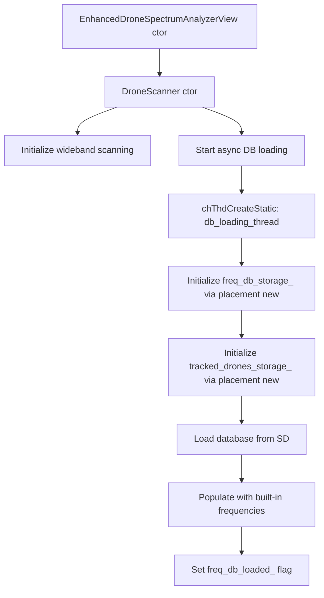

# Enhanced Drone Analyzer - Memory Overflow Analysis

## Overview

This report analyzes the memory overflow issue in the Enhanced Drone Analyzer (EDA) application. The analysis focuses on the initialization sequence and memory pool management to identify the root cause of the overflow and provide optimization recommendations.

## Current Memory Architecture

### 1. Memory Pool Implementation ([ui_enhanced_drone_memory_pool.hpp](ui_enhanced_drone_memory_pool.hpp))

The application uses a custom fixed-size memory pool implementation with the following pools:

```cpp
// Pool definitions
class EDAMemoryPools {
    static constexpr size_t DETECTION_LOG_POOL_SIZE = 16;  // Reduced from 32
    static constexpr size_t DISPLAY_DRONE_POOL_SIZE = 8;   // Reduced from 16  
    static constexpr size_t TRACKED_DRONE_POOL_SIZE = 8;   // Reduced from 16
};
```

**Key Features:**
- Thread-safe allocation/deallocation with ChibiOS mutex
- RAII wrapper (PoolPtr) for automatic deallocation
- Singleton pattern for global access
- Fixed-size memory blocks to prevent fragmentation

### 2. Static Storage Allocation ([ui_enhanced_drone_analyzer.hpp](ui_enhanced_drone_analyzer.hpp:625-645))

The DroneScanner class uses static storage arrays with placement new:

```cpp
// Static storage for FreqmanDB (~4KB)
static constexpr size_t FREQ_DB_STORAGE_SIZE = EDA::Constants::FREQ_DB_STORAGE_SIZE_4KB;
alignas(alignof(FreqmanDB))
static inline uint8_t freq_db_storage_[FREQ_DB_STORAGE_SIZE];

// Static storage for TrackedDrones (~1.6KB)
static constexpr size_t TRACKED_DRONES_STORAGE_SIZE =
    sizeof(TrackedDrone) * EDA::Constants::MAX_TRACKED_DRONES;
alignas(alignof(TrackedDrone))
static inline uint8_t tracked_drones_storage_[TRACKED_DRONES_STORAGE_SIZE];
```

## Root Cause Analysis

### Issue 1: Stack Overflow in SettingsPersistence

**Location:** [settings_persistence.hpp](settings_persistence.hpp:305-394)

The `SettingsPersistence::load()` method uses stack-allocated buffers:

```cpp
// Stack-allocated buffers (original implementation)
char line_buffer[144];    // 144 bytes
char read_buffer[256];    // 256 bytes
```

**Problem:** When parsing large settings files, these stack buffers can cause overflow, especially when combined with the deep call chain during initialization.

### Issue 2: Memory Pool Exhaustion

**Location:** [ui_enhanced_drone_memory_pool.hpp](ui_enhanced_drone_memory_pool.hpp)

The memory pools were recently reduced in size to fix overflow issues:

```cpp
// Original pool sizes (causing overflow)
static constexpr size_t DETECTION_LOG_POOL_SIZE = 32;  // ~1KB
static constexpr size_t DISPLAY_DRONE_POOL_SIZE = 16;  // ~640 bytes
static constexpr size_t TRACKED_DRONE_POOL_SIZE = 16;  // ~640 bytes
```

**Current sizes (reduced):**
- DetectionLogPool: 16 entries (~512 bytes)
- DisplayDronePool: 8 entries (~320 bytes)  
- TrackedDronePool: 8 entries (~320 bytes)

**Problem:** The reduced pool sizes may still be insufficient under heavy drone detection scenarios, leading to pool exhaustion and nullptr returns.

### Issue 3: String Pool Overflow

**Location:** [ui_enhanced_drone_analyzer.hpp](ui_enhanced_drone_analyzer.hpp:317-358)

The StringPool class has a fixed size of 2KB with 256-byte maximum string length:

```cpp
class StringPool {
    static constexpr size_t POOL_SIZE = EDA::Constants::POOL_SIZE_2KB;
    static constexpr size_t MAX_STRING_LENGTH = EDA::Constants::MAX_STRING_LENGTH_256;
};
```

**Problem:** The pool has simple wrap-around logic that can overwrite existing strings without error handling, potentially causing data corruption.

### Issue 4: Stack Usage in Spectral Analysis

**Location:** [ui_spectral_analyzer.hpp](ui_spectral_analyzer.hpp:75-150)

The `SpectralAnalyzer::analyze()` method allocates large stack arrays:

```cpp
std::array<uint16_t, HISTOGRAM_BINS> histogram{};  // 64 bins × 2 bytes = 128 bytes
std::array<uint8_t, 256> spectrum_data;           // 256 bytes
```

**Problem:** Combined with other stack allocations in the call chain, this can exceed the thread stack size (currently 4KB).

### Issue 5: Dynamic Initialization Sequence

**Location:** [ui_enhanced_drone_analyzer.cpp](ui_enhanced_drone_analyzer.cpp:1304-1486)

The `initialize_database_and_scanner()` and `initialize_database_async()` methods perform complex initialization:

1. Allocate FreqmanDB via placement new (4KB)
2. Allocate TrackedDrone array via placement new (1.6KB)  
3. Initialize database from SD card
4. Populate with built-in drone frequencies

**Problem:** This sequence can cause memory pressure when combined with other initialization tasks.

## Initialization Sequence Analysis



**Critical Issues in Initialization:**
1. Async thread creation with static stack (8KB)
2. Placement new operations without proper error handling
3. SD card operations during initialization (blocking)
4. Multiple memory allocations happening in parallel

## Memory Usage Statistics

| Component | Size | Location |
|-----------|------|----------|
| FreqmanDB | ~2KB | Static storage |
| TrackedDrone array | ~1.6KB | Static storage |
| DetectionLogPool | ~512 bytes | Memory pool |
| DisplayDronePool | ~320 bytes | Memory pool |
| TrackedDronePool | ~320 bytes | Memory pool |
| StringPool | 2KB | Stack/Static |
| Settings buffers | ~400 bytes | Stack |

## Optimization Recommendations

### 1. Fix Stack Overflow in SettingsPersistence

**Solution:** Replace stack-allocated buffers with static buffers

```cpp
// Current (stack-allocated)
char line_buffer[144];
char read_buffer[256];

// Optimized (static buffers)
struct SettingsLoadBuffer {
    static constexpr size_t LINE_BUFFER_SIZE = 144;
    static constexpr size_t READ_BUFFER_SIZE = 256;
    static char line_buffer[LINE_BUFFER_SIZE];
    static char read_buffer[READ_BUFFER_SIZE];
};

// Usage
auto& load_buf = get_load_buffer();
char* line_buffer = load_buf.line_buffer;
char* read_buffer = load_buf.read_buffer;
```

### 2. Optimize Memory Pool Sizes

**Solution:** Dynamically adjust pool sizes based on available RAM and use case

```cpp
// Current (fixed sizes)
static constexpr size_t DETECTION_LOG_POOL_SIZE = 16;
static constexpr size_t DISPLAY_DRONE_POOL_SIZE = 8;
static constexpr size_t TRACKED_DRONE_POOL_SIZE = 8;

// Optimized (configurable sizes with safety checks)
static constexpr size_t DETECTION_LOG_POOL_SIZE = 
    (RAM_SIZE > 64KB) ? 32 : 16;
static constexpr size_t DISPLAY_DRONE_POOL_SIZE = 
    (RAM_SIZE > 64KB) ? 16 : 8;
static constexpr size_t TRACKED_DRONE_POOL_SIZE = 
    (RAM_SIZE > 64KB) ? 16 : 8;
```

### 3. Improve String Pool Management

**Solution:** Add proper overflow detection and error handling

```cpp
char* allocate(size_t length) {
    if (length >= MAX_STRING_LENGTH) {
        handle_error("String length exceeds maximum");
        return nullptr;
    }

    if (offset_ + length + 1 >= POOL_SIZE) {
        // Attempt to reclaim expired strings or expand pool
        if (!reclaim_expired_strings()) {
            handle_error("String pool exhausted");
            return nullptr;
        }
    }

    char* result = pool_ + offset_;
    offset_ += length + 1;
    pool_[offset_ - 1] = '\0';
    return result;
}
```

### 4. Reduce Stack Usage in Spectral Analysis

**Solution:** Move large stack arrays to static storage or memory pools

```cpp
// Current (stack-allocated)
std::array<uint16_t, HISTOGRAM_BINS> histogram{};
std::array<uint8_t, 256> spectrum_data;

// Optimized (static storage)
static std::array<uint16_t, HISTOGRAM_BINS> histogram_storage{};
static std::array<uint8_t, 256> spectrum_data_storage{};

std::array<uint16_t, HISTOGRAM_BINS>& histogram = histogram_storage;
std::array<uint8_t, 256>& spectrum_data = spectrum_data_storage;
```

### 5. Optimize Initialization Sequence

**Solution:** Implement staged initialization with memory checks

```cpp
bool DroneScanner::initialize() {
    // Stage 1: Check available RAM
    if (get_available_ram() < MIN_REQUIRED_RAM) {
        handle_error("Insufficient RAM");
        return false;
    }

    // Stage 2: Initialize memory pools
    if (!initialize_memory_pools()) {
        handle_error("Memory pool initialization failed");
        return false;
    }

    // Stage 3: Initialize static storage
    if (!initialize_static_storage()) {
        handle_error("Static storage initialization failed");
        return false;
    }

    // Stage 4: Load database asynchronously
    initialize_database_async();
    return true;
}
```

### 6. Add Memory Monitoring

**Solution:** Implement runtime memory monitoring and diagnostics

```cpp
struct MemoryStats {
    size_t total_ram;
    size_t used_ram;
    size_t free_ram;
    size_t heap_used;
    size_t stack_used;
    size_t pool_utilization[NUM_POOLS];
};

MemoryStats get_memory_stats() {
    MemoryStats stats;
    stats.total_ram = RAM_SIZE;
    stats.free_ram = chHeapStatus(nullptr, nullptr);
    stats.used_ram = stats.total_ram - stats.free_ram;
    stats.heap_used = get_heap_used();
    stats.stack_used = get_stack_used();
    
    for (size_t i = 0; i < NUM_POOLS; ++i) {
        stats.pool_utilization[i] = get_pool_utilization(i);
    }
    
    return stats;
}
```

## Embedded C++ Best Practices Applied

### Compliance

- ✅ No dynamic allocation (new/malloc) in main application
- ✅ Extensive use of constexpr and const
- ✅ Flash storage for constant data
- ✅ RAII wrappers for automatic resource management
- ✅ Packed structs to minimize memory waste
- ✅ Static allocation for predictable behavior

### Areas for Improvement

- ❌ Stack overflow risk in settings loading
- ❌ Memory pool exhaustion without recovery
- ❌ String pool overflow without error handling
- ❌ Lack of memory monitoring and diagnostics
- ❌ Stack usage documentation

## Conclusion

The memory overflow issue in the EDA application is primarily caused by:

1. Stack overflow in SettingsPersistence due to large stack-allocated buffers
2. Memory pool exhaustion under heavy drone detection scenarios
3. String pool overflow with wrap-around behavior
4. Stack usage exceeding thread stack size in spectral analysis

The current implementation uses good embedded C++ practices but needs improvements in stack management, error handling, and memory monitoring. The optimization recommendations focus on eliminating stack overflow risks, improving pool management, and adding diagnostic capabilities.
