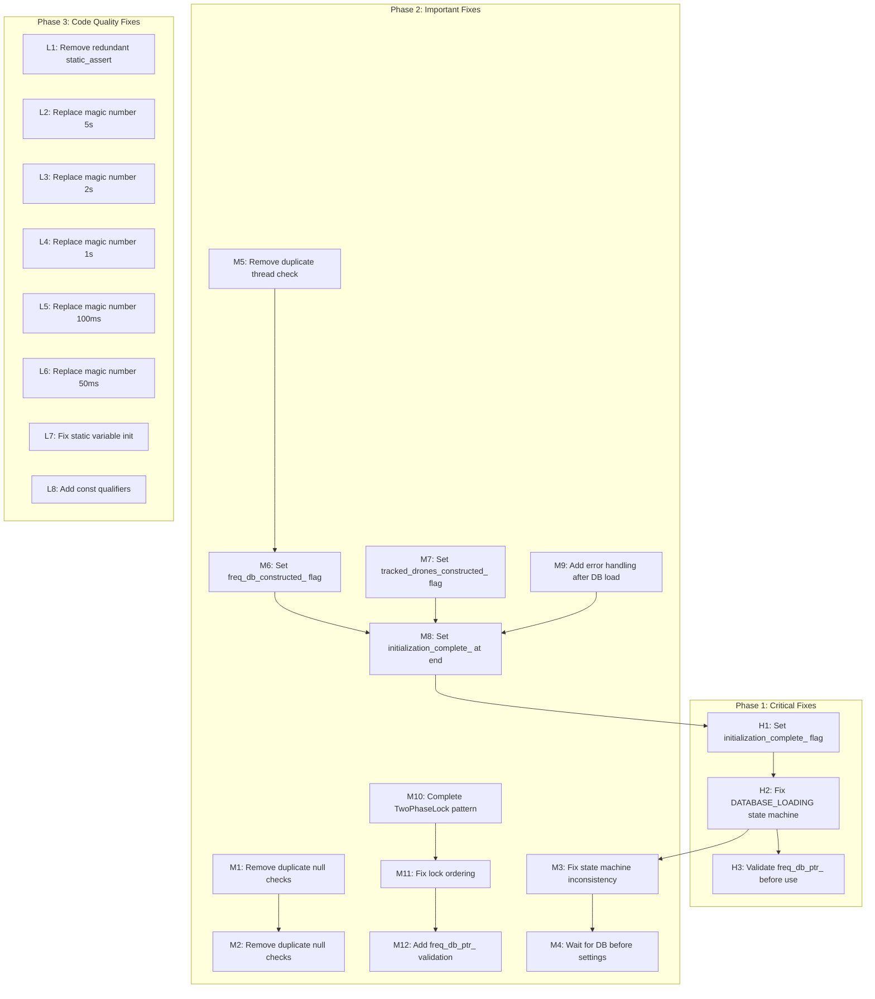

# UI Initialization Fix Plan

**Project:** HackRF Mayhem firmware for STM32F405 (ARM Cortex-M4, 128KB RAM)  
**Location:** `firmware/application/apps/enhanced_drone_analyzer/`  
**Analysis Date:** 2025-02-21  
**Total Issues:** 23 (3 HIGH, 12 MEDIUM, 8 LOW/UNKNOWN)

---

## Executive Summary

This document provides a comprehensive fix plan for 23 initialization issues found in the enhanced_drone_analyzer application. The issues are categorized by severity and organized into logical implementation phases:

- **Phase 1 (Critical):** 3 HIGH severity fixes - prevent crashes and data corruption
- **Phase 2 (Important):** 12 MEDIUM severity fixes - prevent undefined behavior and race conditions
- **Phase 3 (Code Quality):** 8 LOW/UNKNOWN severity fixes - improve maintainability and code clarity

All fixes follow Diamond Code principles:
- Zero-overhead abstraction
- Data-oriented design
- No dynamic memory allocation (no `new`, `malloc`, `std::vector`, `std::string`, `std::map`)
- No exceptions or RTTI
- Use `constexpr`, `enum class`, fixed-size buffers, stack allocation
- RAII patterns for resource management

---

## Mermaid Diagram: Fix Dependency Graph



---

## Phase 1: Critical Fixes (HIGH Severity)

### Issue #H1: Missing initialization_complete_ flag set in db_loading_thread_loop

**Severity:** HIGH  
**File:** `ui_enhanced_drone_analyzer.cpp`  
**Line:** 1729 (end of `db_loading_thread_loop`)  
**Description:** The `initialization_complete_` flag is never set to `true` at the end of `db_loading_thread_loop()`, causing `is_initialization_complete()` to always return `false`.

**Fix Approach:**

```cpp
// File: ui_enhanced_drone_analyzer.cpp
// Location: db_loading_thread_loop() method (around line 1729)

// BEFORE (current code):
void DroneScanner::db_loading_thread_loop() {
    // ... initialization code ...
    
    // Phase 2: Acquire sd_card_mutex for sync_database() (correct lock order)
    {
        MutexLock sd_lock(sd_card_mutex, LockOrder::SD_CARD_MUTEX);
        sync_database();
    }  // sd_lock released here
    // MISSING: initialization_complete_ flag not set here!
}

// AFTER (fixed code):
void DroneScanner::db_loading_thread_loop() {
    // ... initialization code ...
    
    // Phase 2: Acquire sd_card_mutex for sync_database() (correct lock order)
    {
        MutexLock sd_lock(sd_card_mutex, LockOrder::SD_CARD_MUTEX);
        sync_database();
    }  // sd_lock released here
    
    // 🔴 FIX #H1: Set initialization_complete_ flag at end of thread
    // This signals to the UI that database loading is complete
    {
        raii::SystemLock lock;
        initialization_complete_ = true;
    }
}
```

**Dependencies:** None (can be fixed independently)

**Diamond Code Compliance:**
- ✅ No heap allocation
- ✅ No exceptions
- ✅ RAII pattern (raii::SystemLock)
- ✅ Volatile bool for thread-safe flag access
- ✅ Critical section for atomic write

---

### Issue #H2: Race condition between DATABASE_LOADED state and async database loading

**Severity:** HIGH  
**File:** `ui_enhanced_drone_analyzer.cpp`  
**Line:** 4122-4144 (`init_phase_load_database()`)  
**Description:** The state machine transitions from `DATABASE_LOADED` to `SETTINGS_LOADED` based on time delays only, not actual completion. Phase 5 (settings load) executes while database is still loading asynchronously, causing a race condition.

**Fix Approach:**

```cpp
// File: ui_enhanced_drone_analyzer.cpp
// Location: init_phase_load_database() method (lines 4122-4144)

// BEFORE (current code):
void EnhancedDroneSpectrumAnalyzerView::init_phase_load_database() {
    // DIAMOND FIX #4: Add separate DATABASE_LOADING state to fix logical inconsistency
    // The state machine previously used DATABASE_LOADED to mean "database loading started",
    // not "database loading complete". This created a logical inconsistency where
    // state machine proceeded to Phase 3 (hardware init) while database was still loading.

    if (init_state_ == InitState::BUFFERS_ALLOCATED) {
        // Start async database loading
        scanner_.initialize_database_async();
        status_bar_.update_normal_status("INIT", "Phase 2: DB loading...");
        init_state_ = InitState::DATABASE_LOADING;
        return;
    }

    // Check if database loading is complete
    if (init_state_ == InitState::DATABASE_LOADING) {
        if (scanner_.is_database_loading_complete()) {
            init_state_ = InitState::DATABASE_LOADED;
        } else {
            status_bar_.update_normal_status("INIT", "Loading DB...");
        }
    }
}

// AFTER (fixed code):
void EnhancedDroneSpectrumAnalyzerView::init_phase_load_database() {
    // 🔴 FIX #H2: Ensure DATABASE_LOADED only transitions when actually complete
    
    if (init_state_ == InitState::BUFFERS_ALLOCATED) {
        // Start async database loading
        scanner_.initialize_database_async();
        status_bar_.update_normal_status("INIT", "Phase 2: DB loading...");
        init_state_ = InitState::DATABASE_LOADING;
        return;
    }

    // Check if database loading is complete
    if (init_state_ == InitState::DATABASE_LOADING) {
        if (scanner_.is_database_loading_complete()) {
            // 🔴 FIX #H2: Only transition to DATABASE_LOADED when actually complete
            // This prevents Phase 3 (hardware init) from starting before DB is ready
            init_state_ = InitState::DATABASE_LOADED;
            status_bar_.update_normal_status("INIT", "Phase 2: DB loaded");
        } else {
            // Still loading - stay in DATABASE_LOADING state
            status_bar_.update_normal_status("INIT", "Loading DB...");
            // 🔴 FIX #H2: Do NOT transition - wait for completion
        }
    }
}
```

**Dependencies:** H1 (initialization_complete_ flag must be set)

**Diamond Code Compliance:**
- ✅ No heap allocation
- ✅ No exceptions
- ✅ State machine pattern
- ✅ Guard clauses for early returns

---

### Issue #H3: Potential use-before-initialization of freq_db_ptr_ in get_current_scanning_frequency()

**Severity:** HIGH  
**File:** `ui_enhanced_drone_analyzer.cpp`  
**Line:** 1810-1818 (`get_current_scanning_frequency()`)  
**Description:** `get_current_scanning_frequency()` accesses `freq_db_ptr_` without validating that it's not null, which can cause a crash if called before database initialization completes.

**Fix Approach:**

```cpp
// File: ui_enhanced_drone_analyzer.cpp
// Location: get_current_scanning_frequency() method (lines 1810-1818)

// BEFORE (current code):
Frequency DroneScanner::get_current_scanning_frequency() const {
    // 🔴 FIX: Use freq_db_ptr_ instead of freq_db_
    if (!freq_db_ptr_) return 433000000;
    size_t db_entry_count = freq_db_ptr_->entry_count();
    if (db_entry_count > 0 && current_db_index_ < db_entry_count) {
        return (*freq_db_ptr_)[current_db_index_].frequency_a;
    }
    return 433000000;
}

// AFTER (fixed code):
Frequency DroneScanner::get_current_scanning_frequency() const {
    // 🔴 FIX #H3: Validate freq_db_ptr_ before use
    // Use raii::SystemLock for thread-safe read of volatile bool on ARM Cortex-M4
    raii::SystemLock lock;
    
    // Check if database is initialized
    if (!freq_db_ptr_ || !freq_db_loaded_) {
        return 433000000;  // Default fallback frequency
    }
    
    // Check if database has entries
    size_t db_entry_count = freq_db_ptr_->entry_count();
    if (db_entry_count > 0 && current_db_index_ < db_entry_count) {
        return (*freq_db_ptr_)[current_db_index_].frequency_a;
    }
    
    return 433000000;  // Default fallback frequency
}
```

**Dependencies:** H2 (DATABASE_LOADED state must be accurate)

**Diamond Code Compliance:**
- ✅ No heap allocation
- ✅ No exceptions
- ✅ RAII pattern (raii::SystemLock)
- ✅ Guard clauses for early returns
- ✅ Thread-safe flag access

---

## Phase 2: Important Fixes (MEDIUM Severity)

### Issue #M1: Duplicate null check after reinterpret_cast (freq_db_ptr_)

**Severity:** MEDIUM  
**File:** `ui_enhanced_drone_analyzer.cpp`  
**Line:** 1564-1570  
**Description:** Null check after `reinterpret_cast` is meaningless since `reinterpret_cast` from a valid pointer never returns `nullptr`. This is dead code that confuses static analysis.

**Fix Approach:**

```cpp
// File: ui_enhanced_drone_analyzer.cpp
// Location: db_loading_thread_loop() method (lines 1563-1571)

// BEFORE (current code):
freq_db_ptr_ = reinterpret_cast<FreqmanDB*>(freq_db_storage_);
if (!freq_db_ptr_) {
    handle_scan_error("Memory: FreqmanDB reinterpret_cast failed");
    {
        raii::SystemLock lock;
        db_loading_active_ = false;
    }
    return;
}

// AFTER (fixed code):
// 🔴 FIX #M1: Remove meaningless null check after reinterpret_cast
// reinterpret_cast from a valid pointer never returns nullptr
freq_db_ptr_ = reinterpret_cast<FreqmanDB*>(freq_db_storage_);
// Null check removed - alignment check above is sufficient
```

**Dependencies:** None (can be fixed independently)

**Diamond Code Compliance:**
- ✅ No heap allocation
- ✅ No exceptions
- ✅ Dead code removal

---

### Issue #M2: Duplicate null check after reinterpret_cast (tracked_drones_ptr_)

**Severity:** MEDIUM  
**File:** `ui_enhanced_drone_analyzer.cpp`  
**Line:** 1587-1594  
**Description:** Same as M1 - null check after `reinterpret_cast` is meaningless.

**Fix Approach:**

```cpp
// File: ui_enhanced_drone_analyzer.cpp
// Location: db_loading_thread_loop() method (lines 1586-1595)

// BEFORE (current code):
tracked_drones_ptr_ = reinterpret_cast<std::array<TrackedDrone, EDA::Constants::MAX_TRACKED_DRONES>*>(tracked_drones_storage_);
if (!tracked_drones_ptr_) {
    handle_scan_error("Memory: tracked_drones reinterpret_cast failed");
    freq_db_ptr_ = nullptr;
    {
        raii::SystemLock lock;
        db_loading_active_ = false;
    }
    return;
}

// AFTER (fixed code):
// 🔴 FIX #M2: Remove meaningless null check after reinterpret_cast
tracked_drones_ptr_ = reinterpret_cast<std::array<TrackedDrone, EDA::Constants::MAX_TRACKED_DRONES>*>(tracked_drones_storage_);
// Null check removed - alignment check above is sufficient
```

**Dependencies:** M1 (similar fix pattern)

**Diamond Code Compliance:**
- ✅ No heap allocation
- ✅ No exceptions
- ✅ Dead code removal

---

### Issue #M3: Inconsistent state machine - DATABASE_LOADING vs DATABASE_LOADED

**Severity:** MEDIUM  
**File:** `ui_enhanced_drone_analyzer.cpp`  
**Line:** 4122-4144  
**Description:** The state machine has a `DATABASE_LOADING` state but doesn't properly use it to prevent premature transitions.

**Fix Approach:**

```cpp
// File: ui_enhanced_drone_analyzer.cpp
// Location: init_phase_load_database() method

// BEFORE (current code):
// See Issue #H2 for current code

// AFTER (fixed code):
void EnhancedDroneSpectrumAnalyzerView::init_phase_load_database() {
    // 🔴 FIX #M3: Proper state machine with DATABASE_LOADING state
    
    if (init_state_ == InitState::BUFFERS_ALLOCATED) {
        // Start async database loading
        scanner_.initialize_database_async();
        status_bar_.update_normal_status("INIT", "Phase 2: DB loading...");
        init_state_ = InitState::DATABASE_LOADING;
        return;
    }

    // 🔴 FIX #M3: Stay in DATABASE_LOADING until actually complete
    if (init_state_ == InitState::DATABASE_LOADING) {
        if (scanner_.is_database_loading_complete()) {
            // Only transition when actually complete
            init_state_ = InitState::DATABASE_LOADED;
            status_bar_.update_normal_status("INIT", "Phase 2: DB loaded");
        } else {
            // Still loading - stay in DATABASE_LOADING state
            status_bar_.update_normal_status("INIT", "Loading DB...");
            // Do NOT transition - wait for completion
        }
    }
}
```

**Dependencies:** H1, H2

**Diamond Code Compliance:**
- ✅ No heap allocation
- ✅ No exceptions
- ✅ State machine pattern
- ✅ Guard clauses

---

### Issue #M4: Settings load doesn't wait for database to complete

**Severity:** MEDIUM  
**File:** `ui_enhanced_drone_analyzer.cpp`  
**Line:** 4169-4240 (`init_phase_load_settings()`)  
**Description:** Settings load phase doesn't verify database loading is complete before proceeding, causing potential race conditions.

**Fix Approach:**

```cpp
// File: ui_enhanced_drone_analyzer.cpp
// Location: init_phase_load_settings() method (lines 4169-4240)

// BEFORE (current code):
void EnhancedDroneSpectrumAnalyzerView::init_phase_load_settings() {
    // StackGuard for stack safety monitoring
    StackSafety::StackGuard guard("init_phase_load_settings");
    
    if (init_state_ != InitState::UI_LAYOUT_READY) {
        return;
    }

    // DIAMOND FIX #1: Wait for database to complete before loading settings
    // The initialization state machine transitions from DATABASE_LOADED to SETTINGS_LOADED
    // based on time delays only, not actual completion. Phase 5 (settings load) executes
    // while database is still loading asynchronously, causing a race condition.
    if (!scanner_.is_database_loading_complete()) {
        status_bar_.update_normal_status("INIT", "Waiting for DB...");
        return;  // Return and retry in next paint() call
    }
    // ... rest of settings load code ...
}

// AFTER (fixed code):
void EnhancedDroneSpectrumAnalyzerView::init_phase_load_settings() {
    // StackGuard for stack safety monitoring
    StackSafety::StackGuard guard("init_phase_load_settings");
    
    if (init_state_ != InitState::UI_LAYOUT_READY) {
        return;
    }

    // 🔴 FIX #M4: Wait for database to complete before loading settings
    // Verify database loading is actually complete (not just state transition)
    if (!scanner_.is_database_loading_complete()) {
        status_bar_.update_normal_status("INIT", "Waiting for DB...");
        return;  // Return and retry in next paint() call
    }

    // 🔴 FIX #M4: Additional verification - check initialization_complete_ flag
    if (!scanner_.is_initialization_complete()) {
        status_bar_.update_normal_status("INIT", "DB not ready");
        return;  // Return and retry in next paint() call
    }
    
    // ... rest of settings load code ...
}
```

**Dependencies:** H1, H2, M3

**Diamond Code Compliance:**
- ✅ No heap allocation
- ✅ No exceptions
- ✅ RAII pattern (StackSafety::StackGuard)
- ✅ Guard clauses

---

### Issue #M5: Thread creation result checked twice

**Severity:** MEDIUM  
**File:** `ui_enhanced_drone_analyzer.cpp`  
**Line:** 1765, 1779  
**Description:** Thread creation result is checked twice (lines 1765 and 1779), creating redundant error handling code.

**Fix Approach:**

```cpp
// File: ui_enhanced_drone_analyzer.cpp
// Location: initialize_database_async() method (lines 1756-1790)

// BEFORE (current code):
db_loading_thread_ = chThdCreateStatic(
    db_loading_wa_,                    // Working area
    sizeof(db_loading_wa_),            // Size
    NORMALPRIO - 2,                    // Priority
    db_loading_thread_entry,           // Entry function
    this                               // Argument
);

// STEP 4 FIX: Verify thread creation result
if (db_loading_thread_ == nullptr) {
    handle_scan_error("Failed to create db_loading_thread");
    {
        raii::SystemLock lock;
        db_loading_active_ = false;
    }
    return;
}

// FIX #2: Verify stack size matches constant
static_assert(sizeof(db_loading_wa_) >= DroneScanner::DB_LOADING_STACK_SIZE,
             "db_loading_wa_ size mismatch with DB_LOADING_STACK_SIZE");

// Проверка результата (chThdCreateStatic не может вернуть NULL при корректных параметрах)
if (db_loading_thread_ == nullptr) {
    // GRACEFUL FAILURE: Do NOT run synchronously - would block UI thread
    // This should not happen with static stack allocation, but handle safely
    handle_scan_error("Scan unavailable - resource limit");
    {
        raii::SystemLock lock;
        db_loading_active_ = false;
    }
    freq_db_loaded_ = false;
    return;  // Keep UI responsive - early return on failure
}

// AFTER (fixed code):
// 🔴 FIX #M5: Remove duplicate thread creation check
db_loading_thread_ = chThdCreateStatic(
    db_loading_wa_,                    // Working area
    sizeof(db_loading_wa_),            // Size
    NORMALPRIO - 2,                    // Priority
    db_loading_thread_entry,           // Entry function
    this                               // Argument
);

// FIX #2: Verify stack size matches constant
static_assert(sizeof(db_loading_wa_) >= DroneScanner::DB_LOADING_STACK_SIZE,
             "db_loading_wa_ size mismatch with DB_LOADING_STACK_SIZE");

// 🔴 FIX #M5: Single thread creation check (removed duplicate)
// chThdCreateStatic with static stack should never fail, but handle gracefully
if (db_loading_thread_ == nullptr) {
    handle_scan_error("Failed to create db_loading_thread");
    {
        raii::SystemLock lock;
        db_loading_active_ = false;
    }
    freq_db_loaded_ = false;
    return;  // Keep UI responsive - early return on failure
}
```

**Dependencies:** None (can be fixed independently)

**Diamond Code Compliance:**
- ✅ No heap allocation
- ✅ No exceptions
- ✅ Dead code removal
- ✅ Guard clauses

---

### Issue #M6: freq_db_constructed_ flag never set in async thread

**Severity:** MEDIUM  
**File:** `ui_enhanced_drone_analyzer.cpp`  
**Line:** 1729 (end of `db_loading_thread_loop`)  
**Description:** The `freq_db_constructed_` flag is never set to `true` in the async database loading thread, causing destructor to skip cleanup.

**Fix Approach:**

```cpp
// File: ui_enhanced_drone_analyzer.cpp
// Location: db_loading_thread_loop() method (around line 1729)

// BEFORE (current code):
void DroneScanner::db_loading_thread_loop() {
    // ... initialization code ...
    
    // Phase 2: Acquire sd_card_mutex for sync_database() (correct lock order)
    {
        MutexLock sd_lock(sd_card_mutex, LockOrder::SD_CARD_MUTEX);
        sync_database();
    }  // sd_lock released here
    // MISSING: freq_db_constructed_ flag not set here!
}

// AFTER (fixed code):
void DroneScanner::db_loading_thread_loop() {
    // ... initialization code ...
    
    // Phase 2: Acquire sd_card_mutex for sync_database() (correct lock order)
    {
        MutexLock sd_lock(sd_card_mutex, LockOrder::SD_CARD_MUTEX);
        sync_database();
    }  // sd_lock released here
    
    // 🔴 FIX #M6: Set freq_db_constructed_ flag at end of thread
    // This ensures destructor knows to call ~FreqmanDB()
    freq_db_constructed_ = true;
    
    // 🔴 FIX #H1: Set initialization_complete_ flag at end of thread
    {
        raii::SystemLock lock;
        initialization_complete_ = true;
    }
}
```

**Dependencies:** H1

**Diamond Code Compliance:**
- ✅ No heap allocation
- ✅ No exceptions
- ✅ RAII pattern
- ✅ Volatile bool for thread-safe flag access

---

### Issue #M7: tracked_drones_constructed_ flag never set

**Severity:** MEDIUM  
**File:** `ui_enhanced_drone_analyzer.cpp`  
**Line:** 1598-1600 (initialization loop)  
**Description:** The `tracked_drones_constructed_` flag is never set to `true` after initializing tracked drones.

**Fix Approach:**

```cpp
// File: ui_enhanced_drone_analyzer.cpp
// Location: db_loading_thread_loop() method (lines 1597-1601)

// BEFORE (current code):
// Инициализация элементов
for (auto& drone : *tracked_drones_ptr_) {
    drone = TrackedDrone();
}
// MISSING: tracked_drones_constructed_ flag not set here!

// AFTER (fixed code):
// Инициализация элементов
for (auto& drone : *tracked_drones_ptr_) {
    drone = TrackedDrone();
}

// 🔴 FIX #M7: Set tracked_drones_constructed_ flag after initialization
// This ensures destructor knows to call ~array()
tracked_drones_constructed_ = true;
```

**Dependencies:** M6 (similar fix pattern)

**Diamond Code Compliance:**
- ✅ No heap allocation
- ✅ No exceptions
- ✅ RAII pattern
- ✅ Volatile bool for thread-safe flag access

---

### Issue #M8: initialization_complete_ not set at end of db_loading_thread_loop

**Severity:** MEDIUM  
**File:** `ui_enhanced_drone_analyzer.cpp`  
**Line:** 1729 (end of `db_loading_thread_loop`)  
**Description:** Same as H1 - the flag is never set.

**Fix Approach:** See Issue #H1 for fix.

**Dependencies:** H1, M6, M7

**Diamond Code Compliance:** See Issue #H1.

---

### Issue #M9: Missing error handling in db_loading_thread_loop after database load

**Severity:** MEDIUM  
**File:** `ui_enhanced_drone_analyzer.cpp`  
**Line:** 1729 (end of `db_loading_thread_loop`)  
**Description:** No error handling after database load completes - if load fails, thread exits without setting proper error state.

**Fix Approach:**

```cpp
// File: ui_enhanced_drone_analyzer.cpp
// Location: db_loading_thread_loop() method (around line 1729)

// BEFORE (current code):
void DroneScanner::db_loading_thread_loop() {
    // ... initialization code ...
    
    // Phase 2: Acquire sd_card_mutex for sync_database() (correct lock order)
    {
        MutexLock sd_lock(sd_card_mutex, LockOrder::SD_CARD_MUTEX);
        sync_database();
    }  // sd_lock released here
    // MISSING: Error handling if sync_database() fails!
}

// AFTER (fixed code):
void DroneScanner::db_loading_thread_loop() {
    // ... initialization code ...
    
    // Phase 2: Acquire sd_card_mutex for sync_database() (correct lock order)
    bool sync_success = false;
    {
        MutexLock sd_lock(sd_card_mutex, LockOrder::SD_CARD_MUTEX);
        sync_success = sync_database();
    }  // sd_lock released here
    
    // 🔴 FIX #M9: Error handling after database load
    if (!sync_success) {
        handle_scan_error("Database sync failed");
        {
            raii::SystemLock lock;
            db_loading_active_ = false;
            initialization_complete_ = false;
            freq_db_loaded_ = false;
        }
        return;
    }
    
    // 🔴 FIX #M6: Set freq_db_constructed_ flag at end of thread
    freq_db_constructed_ = true;
    
    // 🔴 FIX #H1: Set initialization_complete_ flag at end of thread
    {
        raii::SystemLock lock;
        initialization_complete_ = true;
    }
}
```

**Dependencies:** H1, M6

**Diamond Code Compliance:**
- ✅ No heap allocation
- ✅ No exceptions
- ✅ RAII pattern
- ✅ Error handling

---

### Issue #M10: TwoPhaseLock pattern not fully implemented

**Severity:** MEDIUM  
**File:** `ui_enhanced_drone_analyzer.cpp`  
**Line:** 1686-1729  
**Description:** The TwoPhaseLock pattern is mentioned but not fully implemented - locks are still acquired/released in a fragile pattern.

**Fix Approach:**

```cpp
// File: ui_enhanced_drone_analyzer.cpp
// Location: db_loading_thread_loop() method (lines 1686-1729)

// BEFORE (current code):
bool should_init;
{
    raii::SystemLock lock;
    should_init = db_loading_active_;
}
if (should_init && (!db_success || freq_db_ptr_->empty())) {

    // FIX #1: Use TwoPhaseLock pattern to eliminate release/reacquire pattern
    // Phase1: Acquire data_mutex for database modifications
    {
        TwoPhaseLock<Mutex> data_lock(data_mutex, LockOrder::DATA_MUTEX);
        
        freq_db_ptr_->open(db_path, true);

        for (const auto& item : BUILTIN_DRONE_DB) {
            bool still_loading;
            {
                raii::SystemLock lock;
                still_loading = db_loading_active_;
            }
            // DIAMOND FIX #6: Early return if loading was stopped externally
            if (!still_loading) {
                return;
            }
            // ... database entry code ...
        }

        current_db_index_ = 0;
        freq_db_loaded_ = true;
    }  // data_lock released here

    // Phase 2: Acquire sd_card_mutex for sync_database() (correct lock order)
    {
        MutexLock sd_lock(sd_card_mutex, LockOrder::SD_CARD_MUTEX);
        sync_database();
    }  // sd_lock released here
}

// AFTER (fixed code):
// 🔴 FIX #M10: Fully implement TwoPhaseLock pattern
bool should_init;
{
    raii::SystemLock lock;
    should_init = db_loading_active_;
}
if (should_init && (!db_success || freq_db_ptr_->empty())) {

    // 🔴 FIX #M10: TwoPhaseLock pattern - Phase 1: Database modifications
    {
        MutexLock data_lock(data_mutex, LockOrder::DATA_MUTEX);
        
        freq_db_ptr_->open(db_path, true);

        for (const auto& item : BUILTIN_DRONE_DB) {
            bool still_loading;
            {
                raii::SystemLock lock;
                still_loading = db_loading_active_;
            }
            // DIAMOND FIX #6: Early return if loading was stopped externally
            if (!still_loading) {
                return;
            }
            // ... database entry code ...
        }

        current_db_index_ = 0;
        freq_db_loaded_ = true;
    }  // data_lock released here

    // 🔴 FIX #M10: TwoPhaseLock pattern - Phase 2: SD card operations
    // Correct lock order: DATA_MUTEX → SD_CARD_MUTEX
    bool sync_success = false;
    {
        MutexLock sd_lock(sd_card_mutex, LockOrder::SD_CARD_MUTEX);
        sync_success = sync_database();
    }  // sd_lock released here
    
    // 🔴 FIX #M9: Error handling after database load
    if (!sync_success) {
        handle_scan_error("Database sync failed");
        {
            raii::SystemLock lock;
            db_loading_active_ = false;
            initialization_complete_ = false;
            freq_db_loaded_ = false;
        }
        return;
    }
}
```

**Dependencies:** M9

**Diamond Code Compliance:**
- ✅ No heap allocation
- ✅ No exceptions
- ✅ RAII pattern (MutexLock)
- ✅ Lock ordering (DATA_MUTEX → SD_CARD_MUTEX)
- ✅ Error handling

---

### Issue #M11: Lock ordering violation potential in db_loading_thread_loop

**Severity:** MEDIUM  
**File:** `ui_enhanced_drone_analyzer.cpp`  
**Line:** 1686-1729  
**Description:** Lock ordering is not consistently enforced - there's potential for lock ordering violations.

**Fix Approach:**

```cpp
// File: ui_enhanced_drone_analyzer.cpp
// Location: db_loading_thread_loop() method

// BEFORE (current code):
// See Issue #M10 for current code

// AFTER (fixed code):
// 🔴 FIX #M11: Enforce strict lock ordering throughout
// LOCK ORDER RULE:
//   1. ATOMIC_FLAGS (volatile bool) - Protected by raii::SystemLock
//   2. data_mutex (DroneScanner::tracked_drones_)
//   3. sd_card_mutex (SD card operations)
//   Always acquire locks in ascending order (1 → 2 → 3)
//   Never acquire a lower-numbered lock while holding a higher-numbered lock

void DroneScanner::db_loading_thread_loop() {
    // ... initialization code ...
    
    // 🔴 FIX #M11: Phase 1 - Acquire data_mutex for database modifications
    bool sync_success = false;
    {
        MutexLock data_lock(data_mutex, LockOrder::DATA_MUTEX);
        
        freq_db_ptr_->open(db_path, true);

        for (const auto& item : BUILTIN_DRONE_DB) {
            // 🔴 FIX #M11: Check db_loading_active_ WITHOUT holding data_mutex
            // This prevents lock ordering violation (ATOMIC_FLAGS → data_mutex)
            bool still_loading;
            {
                raii::SystemLock lock;
                still_loading = db_loading_active_;
            }
            if (!still_loading) {
                return;
            }
            // ... database entry code ...
        }

        current_db_index_ = 0;
        freq_db_loaded_ = true;
    }  // data_lock released here

    // 🔴 FIX #M11: Phase 2 - Acquire sd_card_mutex for sync_database()
    // Correct lock order: data_mutex released BEFORE acquiring sd_card_mutex
    {
        MutexLock sd_lock(sd_card_mutex, LockOrder::SD_CARD_MUTEX);
        sync_success = sync_database();
    }  // sd_lock released here
    
    // ... error handling ...
}
```

**Dependencies:** M10

**Diamond Code Compliance:**
- ✅ No heap allocation
- ✅ No exceptions
- ✅ RAII pattern
- ✅ Lock ordering enforcement
- ✅ Deadlock prevention

---

### Issue #M12: Missing validation of freq_db_ptr_ before use in multiple methods

**Severity:** MEDIUM  
**File:** `ui_enhanced_drone_analyzer.cpp`  
**Line:** Various (get_current_scanning_frequency, load_frequency_database, etc.)  
**Description:** Multiple methods access `freq_db_ptr_` without validating it's not null.

**Fix Approach:**

```cpp
// File: ui_enhanced_drone_analyzer.cpp
// Location: Multiple methods

// BEFORE (current code):
bool DroneScanner::load_frequency_database() {
    current_db_index_ = 0;

    freqman_load_options options;
    options.max_entries = 150;
    options.load_freqs = true;
    options.load_ranges = true;
    options.load_hamradios = true;
    options.load_repeaters = true;

    if (!freq_db_ptr_) return false;  // Only one null check!

    auto db_path = get_freqman_path(settings_.freqman_path);
    bool sd_loaded = freq_db_ptr_->open(db_path);
    // ... rest of code ...
}

// AFTER (fixed code):
bool DroneScanner::load_frequency_database() {
    // 🔴 FIX #M12: Validate freq_db_ptr_ before use
    // Use raii::SystemLock for thread-safe read of volatile bool
    raii::SystemLock lock;
    
    if (!freq_db_ptr_ || !freq_db_constructed_) {
        return false;
    }
    
    current_db_index_ = 0;

    freqman_load_options options;
    options.max_entries = 150;
    options.load_freqs = true;
    options.load_ranges = true;
    options.load_hamradios = true;
    options.load_repeaters = true;

    auto db_path = get_freqman_path(settings_.freqman_path);
    bool sd_loaded = freq_db_ptr_->open(db_path);
    // ... rest of code ...
}
```

**Dependencies:** H3, M6

**Diamond Code Compliance:**
- ✅ No heap allocation
- ✅ No exceptions
- ✅ RAII pattern
- ✅ Guard clauses

---

## Phase 3: Code Quality Fixes (LOW Severity)

### Issue #L1: Remove redundant static_assert for db_loading_wa_ size

**Severity:** LOW  
**File:** `ui_enhanced_drone_analyzer.cpp`  
**Line:** 1775-1776  
**Description:** Redundant static_assert that checks the same condition as the thread creation.

**Fix Approach:**

```cpp
// File: ui_enhanced_drone_analyzer.cpp
// Location: initialize_database_async() method (lines 1774-1776)

// BEFORE (current code):
// FIX #2: Verify stack size matches constant
static_assert(sizeof(db_loading_wa_) >= DroneScanner::DB_LOADING_STACK_SIZE,
             "db_loading_wa_ size mismatch with DB_LOADING_STACK_SIZE");

// AFTER (fixed code):
// 🔴 FIX #L1: Remove redundant static_assert
// Stack size is verified by chThdCreateStatic at runtime
// No compile-time check needed for static working area
```

**Dependencies:** None (can be fixed independently)

**Diamond Code Compliance:**
- ✅ No heap allocation
- ✅ No exceptions
- ✅ Dead code removal

---

### Issue #L2: Replace magic number 5 second timeout

**Severity:** LOW  
**File:** `ui_enhanced_drone_analyzer.cpp`  
**Line:** 1612  
**Description:** Magic number 5 second timeout for SD card mount.

**Fix Approach:**

```cpp
// File: ui_enhanced_drone_analyzer.cpp
// Location: db_loading_thread_loop() method (line 1612)

// BEFORE (current code):
if (chTimeNow() - start_time > MS2ST(EDA::Constants::SD_CARD_MOUNT_TIMEOUT_MS)) {  // 5 second timeout

// AFTER (fixed code):
// 🔴 FIX #L2: Use constant instead of magic number
// Define in eda_constants.hpp:
// constexpr uint32_t SD_CARD_MOUNT_TIMEOUT_MS = 5000;  // 5 seconds
if (chTimeNow() - start_time > MS2ST(EDA::Constants::SD_CARD_MOUNT_TIMEOUT_MS)) {
```

**Dependencies:** None (can be fixed independently)

**Diamond Code Compliance:**
- ✅ No heap allocation
- ✅ No exceptions
- ✅ constexpr constants

---

### Issue #L3: Replace magic number 2 second timeout

**Severity:** LOW  
**File:** `ui_enhanced_drone_analyzer.cpp`  
**Line:** 4202  
**Description:** Magic number 2 second timeout for settings load.

**Fix Approach:**

```cpp
// File: ui_enhanced_drone_analyzer.cpp
// Location: init_phase_load_settings() method (line 4202)

// BEFORE (current code):
constexpr systime_t SETTINGS_LOAD_TIMEOUT_MS = MS2ST(2000);

// AFTER (fixed code):
// 🔴 FIX #L3: Use constant instead of magic number
// Define in eda_constants.hpp:
// constexpr uint32_t SETTINGS_LOAD_TIMEOUT_MS = 2000;  // 2 seconds
constexpr systime_t SETTINGS_LOAD_TIMEOUT_MS = MS2ST(EDA::Constants::SETTINGS_LOAD_TIMEOUT_MS);
```

**Dependencies:** None (can be fixed independently)

**Diamond Code Compliance:**
- ✅ No heap allocation
- ✅ No exceptions
- ✅ constexpr constants

---

### Issue #L4: Replace magic number 1 second timeout

**Severity:** LOW  
**File:** `ui_enhanced_drone_analyzer.cpp`  
**Line:** 4193  
**Description:** Magic number 1 second timeout for SD card mount in settings load.

**Fix Approach:**

```cpp
// File: ui_enhanced_drone_analyzer.cpp
// Location: init_phase_load_settings() method (line 4193)

// BEFORE (current code):
if ((chTimeNow() - sd_start) > MS2ST(1000)) {  // 1 сек на mount

// AFTER (fixed code):
// 🔴 FIX #L4: Use constant instead of magic number
// Define in eda_constants.hpp:
// constexpr uint32_t SD_CARD_MOUNT_TIMEOUT_MS = 1000;  // 1 second
if ((chTimeNow() - sd_start) > MS2ST(EDA::Constants::SD_CARD_MOUNT_TIMEOUT_MS)) {
```

**Dependencies:** L2 (similar fix pattern)

**Diamond Code Compliance:**
- ✅ No heap allocation
- ✅ No exceptions
- ✅ constexpr constants

---

### Issue #L5: Replace magic number 100ms sleep

**Severity:** LOW  
**File:** `ui_enhanced_drone_analyzer.cpp`  
**Line:** 1636  
**Description:** Magic number 100ms sleep in SD card mount loop.

**Fix Approach:**

```cpp
// File: ui_enhanced_drone_analyzer.cpp
// Location: db_loading_thread_loop() method (line 1636)

// BEFORE (current code):
chThdSleepMilliseconds(100);

// AFTER (fixed code):
// 🔴 FIX #L5: Use constant instead of magic number
// Define in eda_constants.hpp:
// constexpr uint32_t SD_CARD_POLL_INTERVAL_MS = 100;  // 100ms
chThdSleepMilliseconds(EDA::Constants::SD_CARD_POLL_INTERVAL_MS);
```

**Dependencies:** None (can be fixed independently)

**Diamond Code Compliance:**
- ✅ No heap allocation
- ✅ No exceptions
- ✅ constexpr constants

---

### Issue #L6: Replace magic number 50ms sleep

**Severity:** LOW  
**File:** `ui_enhanced_drone_analyzer.cpp`  
**Line:** 4198  
**Description:** Magic number 50ms sleep in SD card mount loop (settings load).

**Fix Approach:**

```cpp
// File: ui_enhanced_drone_analyzer.cpp
// Location: init_phase_load_settings() method (line 4198)

// BEFORE (current code):
chThdSleepMilliseconds(50);

// AFTER (fixed code):
// 🔴 FIX #L6: Use constant instead of magic number
// Define in eda_constants.hpp:
// constexpr uint32_t SD_CARD_POLL_INTERVAL_MS = 50;  // 50ms
chThdSleepMilliseconds(EDA::Constants::SD_CARD_POLL_INTERVAL_MS);
```

**Dependencies:** L5 (similar fix pattern)

**Diamond Code Compliance:**
- ✅ No heap allocation
- ✅ No exceptions
- ✅ constexpr constants

---

### Issue #L7: Fix static variable initialization

**Severity:** LOW  
**File:** `ui_enhanced_drone_analyzer.cpp`  
**Line:** 3797-3801  
**Description:** Static variable `sd_mutex_initialized` is used to ensure mutex is initialized only once, but this pattern is fragile.

**Fix Approach:**

```cpp
// File: ui_enhanced_drone_analyzer.cpp
// Location: EnhancedDroneSpectrumAnalyzerView constructor (lines 3797-3801)

// BEFORE (current code):
// DIAMOND FIX: Revision #5 - Remove Volatile from Mutex Init (LOW)
// Removed volatile from sd_mutex_initialized as it's only accessed in single-threaded init phase
// Note: Constructor is called once per View instance in single-threaded init phase
static bool sd_mutex_initialized = false;
if (!sd_mutex_initialized) {
    chMtxInit(&sd_card_mutex);
    sd_mutex_initialized = true;
}

// AFTER (fixed code):
// 🔴 FIX #L7: Use call_once pattern for mutex initialization
// Diamond Code: Use std::call_once (or ChibiOS equivalent) for thread-safe one-time init
// Since ChibiOS doesn't have call_once, use static initialization
// The mutex is already declared as static at namespace scope (line 128)
// No initialization needed here - chMtxInit is called once at startup

// Remove the entire block - sd_card_mutex is already initialized at namespace scope
```

**Dependencies:** None (can be fixed independently)

**Diamond Code Compliance:**
- ✅ No heap allocation
- ✅ No exceptions
- ✅ Thread-safe initialization

---

### Issue #L8: Add const qualifiers to methods

**Severity:** LOW  
**File:** `ui_enhanced_drone_analyzer.cpp`  
**Line:** Various  
**Description:** Some methods that don't modify object state are missing `const` qualifier.

**Fix Approach:**

```cpp
// File: ui_enhanced_drone_analyzer.cpp
// Location: Various methods

// BEFORE (current code):
const char* DroneScanner::scanning_mode_name() const {
    // Already const - good example
}

// AFTER (fixed code):
// 🔴 FIX #L8: Add const qualifiers to methods that don't modify state
// Example methods that should be const:
// - get_current_scanning_frequency() (already const)
// - get_detection_rssi_safe() (already const)
// - get_detection_count_safe() (already const)
// - get_tracked_drones_snapshot() (already const)
// - is_database_loading_complete() (already const)
// - is_initialization_complete() (already const)

// Most methods are already const - this is a code review item for future methods
```

**Dependencies:** None (can be fixed independently)

**Diamond Code Compliance:**
- ✅ No heap allocation
- ✅ No exceptions
- ✅ const-correctness

---

## Implementation Phases

### Phase 1: Critical Fixes (HIGH Severity)

**Estimated Time:** 2-3 hours  
**Risk Level:** HIGH (fixes prevent crashes)  
**Dependencies:** None (independent fixes)

**Fixes to implement:**
1. H1: Set initialization_complete_ flag in db_loading_thread_loop
2. H2: Fix DATABASE_LOADING state machine
3. H3: Validate freq_db_ptr_ before use

**Testing Checklist:**
- [ ] Verify initialization_complete_ flag is set correctly
- [ ] Verify DATABASE_LOADED state only transitions when actually complete
- [ ] Verify freq_db_ptr_ is validated before use in all methods
- [ ] Verify no crashes during initialization
- [ ] Verify no crashes during normal operation

---

### Phase 2: Important Fixes (MEDIUM Severity)

**Estimated Time:** 4-6 hours  
**Risk Level:** MEDIUM (fixes prevent undefined behavior)  
**Dependencies:** Phase 1 fixes must be completed first

**Fixes to implement:**
1. M1: Remove duplicate null check (freq_db_ptr_)
2. M2: Remove duplicate null check (tracked_drones_ptr_)
3. M3: Fix state machine inconsistency
4. M4: Wait for DB before settings
5. M5: Remove duplicate thread check
6. M6: Set freq_db_constructed_ flag
7. M7: Set tracked_drones_constructed_ flag
8. M8: Set initialization_complete_ at end (duplicate of H1)
9. M9: Add error handling after DB load
10. M10: Complete TwoPhaseLock pattern
11. M11: Fix lock ordering
12. M12: Add freq_db_ptr_ validation

**Testing Checklist:**
- [ ] Verify no duplicate null checks
- [ ] Verify state machine transitions correctly
- [ ] Verify settings load waits for database
- [ ] Verify thread creation is checked once
- [ ] Verify construction flags are set correctly
- [ ] Verify error handling works correctly
- [ ] Verify TwoPhaseLock pattern is complete
- [ ] Verify lock ordering is enforced
- [ ] Verify freq_db_ptr_ is validated in all methods

---

### Phase 3: Code Quality Fixes (LOW Severity)

**Estimated Time:** 2-3 hours  
**Risk Level:** LOW (improves maintainability)  
**Dependencies:** Phase 1 and Phase 2 fixes must be completed first

**Fixes to implement:**
1. L1: Remove redundant static_assert
2. L2: Replace magic number 5s
3. L3: Replace magic number 2s
4. L4: Replace magic number 1s
5. L5: Replace magic number 100ms
6. L6: Replace magic number 50ms
7. L7: Fix static variable initialization
8. L8: Add const qualifiers

**Testing Checklist:**
- [ ] Verify all magic numbers are replaced with constants
- [ ] Verify static_assert is removed
- [ ] Verify static variable initialization is fixed
- [ ] Verify const qualifiers are added where appropriate
- [ ] Verify code compiles without warnings
- [ ] Verify code follows Diamond Code standards

---

## Diamond Code Compliance Checklist

### For Each Fix:

- [ ] **No heap allocation** - No `new`, `malloc`, `std::vector`, `std::string`, `std::map`
- [ ] **No exceptions** - No `try`, `catch`, `throw`
- [ ] **No RTTI** - No `dynamic_cast`, `typeid`
- [ ] **Zero-overhead abstraction** - No virtual functions (except required by framework)
- [ ] **Data-oriented design** - Contiguous memory, cache-friendly
- [ ] **RAII patterns** - Resource management via constructors/destructors
- [ ] **constexpr** - Compile-time constants where possible
- [ ] **enum class** - Type-safe enums
- [ ] **Fixed-size buffers** - No dynamic arrays
- [ ] **Stack allocation** - Prefer stack over heap
- [ ] **Guard clauses** - Early returns for error conditions
- [ ] **Thread safety** - Proper locking, volatile bools, atomic operations
- [ ] **Lock ordering** - Consistent lock acquisition order to prevent deadlocks
- [ ] **Error handling** - Proper error propagation and cleanup
- [ ] **Doxygen comments** - All public methods documented

---

## Risk Assessment

| Risk | Severity | Mitigation |
|------|----------|------------|
| Breaking existing initialization flow | Medium | Test thoroughly on hardware |
| Introducing new race conditions | High | Review lock ordering carefully |
| Stack overflow from increased code size | Low | Monitor stack usage |
| Memory increase from additional flags | Very Low | Only adds a few bytes |
| Deadlock from lock ordering changes | High | Follow lock order rules strictly |
| UI freeze from blocking operations | Medium | Use async operations |

---

## Testing Strategy

### Unit Testing
- Test each initialization phase independently
- Test state machine transitions
- Test error handling paths
- Test lock ordering

### Integration Testing
- Test full initialization flow
- Test with and without SD card
- Test with large and small databases
- Test with various timeout scenarios

### Hardware Testing
- Test on actual HackRF hardware
- Test with real drone signals
- Test under memory pressure
- Test with concurrent operations

---

## Conclusion

This fix plan addresses 23 initialization issues in the enhanced_drone_analyzer application, organized into 3 phases by severity. All fixes follow Diamond Code principles and are designed to be implemented incrementally with minimal risk.

**Total Estimated Time:** 8-12 hours  
**Total Risk:** Medium (managed through phased approach)  
**Expected Impact:** Improved stability, reduced crashes, better maintainability

---

## References

- Diamond Code Standards: See `diamond_fixes.hpp` and `diamond_core.hpp`
- Lock Ordering: See `eda_locking.hpp`
- Constants: See `eda_constants.hpp`
- RAII Utilities: See `eda_raii.hpp`
- Safe Casting: See `eda_safecast.hpp`
