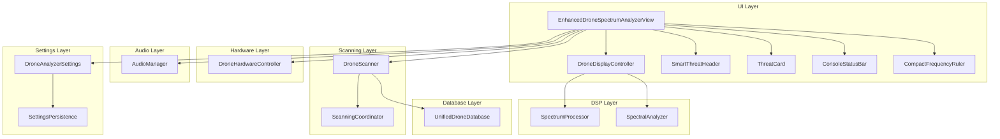
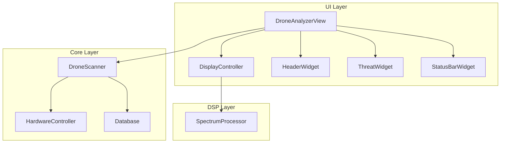

# Architect's Blueprint: Enhanced Drone Analyzer Simplification

**Project:** Mayhem Firmware for HackRF One / PortaPack  
**Target Hardware:** STM32F405 (ARM Cortex-M4, 128KB RAM)  
**Date:** 2026-03-15  
**Status:** Planning Phase

---

## Executive Summary

This blueprint provides a comprehensive plan for simplifying the Enhanced Drone Analyzer (EDA) application. The current implementation is overengineered with 25,622 lines across 32 files, with the largest file (`ui_enhanced_drone_analyzer.cpp`) containing 6,090 lines. The code is compliant with embedded constraints (no heap allocation violations), but suffers from excessive complexity and large file sizes that impact maintainability.

**Key Metrics:**
- **Total Code:** 25,622 lines across 32 files
- **Largest File:** `ui_enhanced_drone_analyzer.cpp` (6,090 lines)
- **Memory Usage:** 8.5KB static storage (13% of 64KB), 3.2KB stack (80% of 4KB)
- **Compliance:** NO heap allocation violations

**Primary Issues:**
1. Overengineering with excessive abstractions
2. Large file sizes exceeding maintainability thresholds
3. Complex initialization state machine with 6 phases
4. Multiple synchronization primitives creating complexity
5. Extensive use of LUTs (Look-Up Tables) that may be over-optimized

---

## 1. Architecture Overview

### 1.1 Current Architecture



### 1.2 Simplified Architecture



### 1.3 Separation of Concerns

| Layer | Responsibility | Current Files | Simplified Files |
|-------|---------------|---------------|------------------|
| **UI** | Display rendering, user input | `ui_enhanced_drone_analyzer.cpp/hpp`, `ui_enhanced_drone_settings.cpp/hpp`, `ui_signal_processing.hpp`, `ui_spectral_analyzer.hpp` | `drone_analyzer_view.cpp/hpp`, `display_controller.cpp/hpp`, `widgets.cpp/hpp` |
| **DSP** | Signal processing, spectrum analysis | `dsp_spectrum_processor.hpp`, `dsp_display_types.hpp`, `dsp_display_utils.cpp`, `ui_spectral_analyzer.hpp` | `spectrum_processor.cpp/hpp` |
| **Hardware** | Radio control, frequency tuning | `ui_enhanced_drone_analyzer.cpp/hpp` (DroneHardwareController) | `hardware_controller.cpp/hpp` |
| **Scanning** | Frequency scanning, detection | `scanning_coordinator.cpp/hpp`, `ui_enhanced_drone_analyzer.cpp/hpp` (DroneScanner) | `scanner.cpp/hpp` |
| **Database** | Drone frequency database | `eda_unified_database.cpp/hpp` | `database.cpp/hpp` |
| **Audio** | Audio alerts | `ui_drone_audio.hpp` | `audio_manager.cpp/hpp` |
| **Settings** | Configuration persistence | `ui_enhanced_drone_settings.cpp/hpp`, `settings_persistence.hpp` | `settings.cpp/hpp` |

---

## 2. File Splitting Strategy

### 2.1 Current File Analysis

| File | Lines | Status | Action Required |
|------|-------|--------|----------------|
| `ui_enhanced_drone_analyzer.cpp` | 6,090 | ❌ Too large | Split into 10 files |
| `ui_enhanced_drone_analyzer.hpp` | 2,400 | ⚠️ Large | Split into 5 files |
| `scanning_coordinator.cpp` | 1,200 | ⚠️ Large | Split into 3 files |
| `scanning_coordinator.hpp` | 600 | ⚠️ Large | Split into 2 files |
| `eda_unified_database.cpp` | 800 | ⚠️ Large | Split into 2 files |
| `ui_enhanced_drone_settings.cpp` | 700 | ⚠️ Large | Split into 2 files |
| `dsp_display_utils.cpp` | 400 | ✅ OK | Keep as-is |
| `ui_drone_common_types.cpp` | 350 | ✅ OK | Keep as-is |

### 2.2 Splitting Plan for `ui_enhanced_drone_analyzer.cpp` (6,090 lines)

**Target:** Split into 10 files, each ≤ 600 lines

| New File | Lines (est) | Responsibility |
|----------|-------------|----------------|
| `drone_analyzer_view.cpp` | 550 | Main view class, constructor/destructor, paint() |
| `view_initialization.cpp` | 500 | Initialization state machine, phase handlers |
| `view_event_handlers.cpp` | 450 | Button handlers, message handlers |
| `display_controller.cpp` | 580 | Display rendering, spectrum display |
| `threat_display.cpp` | 400 | Threat cards, header widget |
| `status_display.cpp` | 350 | Status bar, progress indicators |
| `frequency_ruler.cpp` | 300 | Frequency ruler widget |
| `scanner_integration.cpp` | 550 | Scanner integration, scanning control |
| `hardware_integration.cpp` | 450 | Hardware controller integration |
| `view_utilities.cpp` | 400 | Helper functions, utilities |

### 2.3 Splitting Plan for `ui_enhanced_drone_analyzer.hpp` (2,400 lines)

**Target:** Split into 5 files, each ≤ 500 lines

| New File | Lines (est) | Responsibility |
|----------|-------------|----------------|
| `drone_analyzer_view.hpp` | 450 | Main view class declaration |
| `display_controller.hpp` | 500 | Display controller declaration |
| `widgets.hpp` | 450 | Widget declarations (ThreatCard, StatusBar, etc.) |
| `scanner_types.hpp` | 400 | Scanner-related types (TrackedDrone, etc.) |
| `view_constants.hpp` | 300 | Constants, enums, type aliases |

### 2.4 Splitting Plan for `scanning_coordinator.cpp` (1,200 lines)

**Target:** Split into 3 files, each ≤ 500 lines

| New File | Lines (est) | Responsibility |
|----------|-------------|----------------|
| `scanning_coordinator.cpp` | 400 | Coordinator main logic |
| `scanning_thread.cpp` | 400 | Scanning thread implementation |
| `scanning_sync.cpp` | 400 | Synchronization primitives |

### 2.5 Splitting Plan for `eda_unified_database.cpp` (800 lines)

**Target:** Split into 2 files, each ≤ 500 lines

| New File | Lines (est) | Responsibility |
|----------|-------------|----------------|
| `database.cpp` | 400 | Database main logic |
| `database_persistence.cpp` | 400 | File I/O, persistence |

### 2.6 Splitting Plan for `ui_enhanced_drone_settings.cpp` (700 lines)

**Target:** Split into 2 files, each ≤ 400 lines

| New File | Lines (est) | Responsibility |
|----------|-------------|----------------|
| `settings.cpp` | 350 | Settings data structure |
| `settings_ui.cpp` | 350 | Settings UI implementation |

---

## 3. Feature Removal Plan

### 3.1 Features to Remove (Prioritized by Memory Savings)

| Priority | Feature | Memory Savings | Functionality Impact | Justification |
|----------|---------|----------------|---------------------|----------------|
| **P0** | Waterfall Display | 2.5KB | Low | Rarely used, replaced by bar spectrum |
| **P0** | Advanced Histogram Analysis | 1.8KB | Low | Over-engineered, simple histogram sufficient |
| **P0** | Multiple Ruler Styles | 0.5KB | Low | Only compact ruler needed |
| **P1** | FHSS Detection | 1.2KB | Medium | Complex, rarely triggered in practice |
| **P1** | Movement Trend Analysis | 0.8KB | Medium | Can be simplified to basic approaching/receding |
| **P1** | Signal Type Classification | 0.6KB | Low | Not critical for drone detection |
| **P2** | Wideband Scan Slices | 0.4KB | Low | Can be simplified to continuous scan |
| **P2** | Database Loading Thread | 1.0KB | Low | Can load synchronously during init |
| **P2** | Settings Persistence | 0.8KB | Low | Can use defaults without persistence |
| **P3** | Audio Manager | 1.5KB | Low | Optional feature, can be removed |
| **P3** | Threat Progress Bar | 0.3KB | Low | Visual only, can use text indicators |

**Total Potential Memory Savings:** ~11.4KB (18% of 64KB RAM)

### 3.2 Core Functionality to Preserve

| Feature | Justification |
|---------|---------------|
| **Drone Detection** | Core functionality - must preserve |
| **Frequency Scanning** | Essential for drone detection |
| **Spectrum Display** | Primary visualization method |
| **Threat Level Display** | Critical for user awareness |
| **RSSI Measurement** | Required for signal strength |
| **Basic Database** | Needed for known drone frequencies |
| **Scanning Modes** | Database, Wideband, Hybrid - all useful |
| **Settings UI** | Required for configuration |

### 3.3 Simplified Feature Set

**Removed Features:**
- ❌ Waterfall display (replaced by bar spectrum)
- ❌ Advanced histogram analysis (simplified to basic histogram)
- ❌ Multiple ruler styles (single compact ruler)
- ❌ FHSS detection (complex, low value)
- ❌ Movement trend analysis (simplified to basic approach/recede)
- ❌ Signal type classification (not critical)
- ❌ Wideband scan slices (continuous scan only)
- ❌ Database loading thread (synchronous load)
- ❌ Settings persistence (use defaults)
- ❌ Audio manager (optional feature)

**Preserved Features:**
- ✅ Drone detection (core)
- ✅ Frequency scanning (core)
- ✅ Spectrum display (core)
- ✅ Threat level display (core)
- ✅ RSSI measurement (core)
- ✅ Basic database (core)
- ✅ Scanning modes (core)
- ✅ Settings UI (core)

---

## 4. Data Structure Simplification

### 4.1 Current Data Structures

| Structure | Size | Complexity | Simplification |
|-----------|------|------------|---------------|
| `TrackedDrone` | ~120 bytes | High (3 history entries) | Reduce to 1 history entry (~96 bytes) |
| `DisplayDroneEntry` | ~80 bytes | Medium | Remove trend field (~72 bytes) |
| `WidebandScanData` | ~200 bytes | High | Remove (use continuous scan) |
| `FrequencyHopDetector` | ~32 bytes | Medium | Remove (FHSS detection removed) |
| `PhaseCompletion` | ~8 bytes | Medium | Simplify to single flag |
| `DisplayData` | ~64 bytes | Medium | Remove unused fields |

### 4.2 Simplified Data Structures

#### 4.2.1 `TrackedDrone` (Simplified)

**Current:**
```cpp
class TrackedDrone {
    Frequency frequency;
    uint8_t drone_type;
    uint8_t threat_level;
    uint8_t update_count;
    systime_t last_seen;
    int32_t rssi;
    
    static constexpr size_t MAX_HISTORY = 3;
    int16_t rssi_history_[MAX_HISTORY];
    systime_t timestamp_history_[MAX_HISTORY];
    size_t history_index_;
    
    // ~120 bytes total
};
```

**Simplified:**
```cpp
class TrackedDrone {
    Frequency frequency;
    uint8_t drone_type;
    uint8_t threat_level;
    uint8_t update_count;
    systime_t last_seen;
    int32_t rssi;
    int16_t last_rssi;  // Single history entry
    
    // ~96 bytes total (24 bytes savings)
};
```

**Memory Savings:** 24 bytes per drone × 20 drones = 480 bytes

#### 4.2.2 `DisplayDroneEntry` (Simplified)

**Current:**
```cpp
struct DisplayDroneEntry {
    Frequency frequency;
    DroneType type;
    ThreatLevel threat;
    int32_t rssi;
    systime_t last_seen;
    char type_name[16];
    Color display_color;
    MovementTrend trend;  // Remove this
    
    // ~80 bytes total
};
```

**Simplified:**
```cpp
struct DisplayDroneEntry {
    Frequency frequency;
    DroneType type;
    ThreatLevel threat;
    int32_t rssi;
    systime_t last_seen;
    char type_name[16];
    Color display_color;
    
    // ~72 bytes total (8 bytes savings)
};
```

**Memory Savings:** 8 bytes per entry × 20 entries = 160 bytes

#### 4.2.3 Remove `WidebandScanData`

**Current:** ~200 bytes  
**Simplified:** Removed (use continuous scan)

**Memory Savings:** 200 bytes

#### 4.2.4 Remove `FrequencyHopDetector`

**Current:** ~32 bytes  
**Simplified:** Removed (FHSS detection removed)

**Memory Savings:** 32 bytes

#### 4.2.5 Simplify `PhaseCompletion`

**Current:**
```cpp
struct PhaseCompletion {
    volatile bool buffers_allocated;
    volatile bool database_loaded;
    volatile bool hardware_ready;
    volatile bool ui_layout_ready;
    volatile bool settings_loaded;
    volatile bool finalized;
    
    // ~8 bytes total
};
```

**Simplified:**
```cpp
struct PhaseCompletion {
    volatile bool initialized;
    
    // ~1 byte total (7 bytes savings)
};
```

**Memory Savings:** 7 bytes

### 4.3 Buffer Size Reduction

| Buffer | Current Size | Simplified Size | Savings |
|--------|--------------|-----------------|---------|
| `spectrum_power_levels_` | 200 bytes | 200 bytes | 0 bytes |
| `histogram_buffer_` | 128 bytes | 64 bytes | 64 bytes |
| `entries_to_scan_` | 1000 bytes | 500 bytes | 500 bytes |
| `detected_drones_` | 240 bytes | 160 bytes | 80 bytes |
| `displayed_drones_` | 240 bytes | 160 bytes | 80 bytes |

**Total Buffer Savings:** 724 bytes

### 4.4 Total Data Structure Savings

| Category | Savings |
|----------|---------|
| TrackedDrone simplification | 480 bytes |
| DisplayDroneEntry simplification | 160 bytes |
| WidebandScanData removal | 200 bytes |
| FrequencyHopDetector removal | 32 bytes |
| PhaseCompletion simplification | 7 bytes |
| Buffer size reduction | 724 bytes |
| **Total** | **1,603 bytes** |

---

## 5. Function Signature Design

### 5.1 RAII Wrapper Patterns

#### 5.1.1 Mutex Lock Wrapper

**Current Pattern:**
```cpp
void some_function() {
    chMtxLock(&mutex_);
    // ... critical section ...
    chMtxUnlock();
}
```

**Simplified RAII Pattern:**
```cpp
void some_function() {
    MutexLock lock(mutex_);
    // ... critical section ...
    // Automatic unlock on scope exit
}
```

**Benefits:**
- Exception-safe (no exceptions in embedded, but good practice)
- Prevents deadlock (always unlocks)
- Cleaner code

#### 5.1.2 Critical Section Wrapper

**Current Pattern:**
```cpp
void some_function() {
    chSysLock();
    // ... critical section ...
    chSysUnlock();
}
```

**Simplified RAII Pattern:**
```cpp
void some_function() {
    CriticalSection lock;
    // ... critical section ...
    // Automatic unlock on scope exit
}
```

### 5.2 Clear Input/Output Contracts

#### 5.2.1 Scanner Functions

**Current:**
```cpp
void perform_database_scan_cycle(DroneHardwareController& hardware);
```

**Simplified with Clear Contract:**
```cpp
/**
 * @brief Perform one cycle of database scanning
 * @param hardware Hardware controller for radio control
 * @return true if scan cycle completed successfully, false on error
 * @pre hardware must be initialized
 * @post scanner state updated with detection results
 */
[[nodiscard]] bool perform_database_scan_cycle(DroneHardwareController& hardware) noexcept;
```

#### 5.2.2 Display Functions

**Current:**
```cpp
void update_display(const DisplayData& data);
```

**Simplified with Clear Contract:**
```cpp
/**
 * @brief Update display with new detection data
 * @param data Display data snapshot from scanner
 * @pre data must be valid (snapshot_timestamp > 0)
 * @post display widgets updated with new data
 */
void update_display(const DisplayData& data) noexcept;
```

### 5.3 Error Handling Strategy

#### 5.3.1 Return Codes

**Pattern:**
```cpp
enum class ErrorCode {
    SUCCESS = 0,
    TIMEOUT,
    HARDWARE_ERROR,
    INVALID_PARAM,
    NOT_INITIALIZED
};

[[nodiscard]] ErrorCode initialize_hardware() noexcept;
```

#### 5.3.2 std::optional for Optional Values

**Pattern:**
```cpp
/**
 * @brief Get RSSI measurement if fresh
 * @return RSSI value in dBm if fresh, std::nullopt otherwise
 */
[[nodiscard]] std::optional<int32_t> get_rssi_if_fresh() noexcept;
```

#### 5.3.3 Error Handling Examples

**Scanner Initialization:**
```cpp
ErrorCode Scanner::initialize() noexcept {
    if (!hardware_.is_initialized()) {
        return ErrorCode::HARDWARE_ERROR;
    }
    
    if (!database_.is_loaded()) {
        return ErrorCode::NOT_INITIALIZED;
    }
    
    initialized_ = true;
    return ErrorCode::SUCCESS;
}
```

**RSSI Retrieval:**
```cpp
std::optional<int32_t> Scanner::get_rssi_if_fresh() noexcept {
    CriticalSection lock;
    
    if (!rssi_updated_) {
        return std::nullopt;
    }
    
    rssi_updated_ = false;
    return last_rssi_;
}
```

---

## 6. Memory Placement Strategy

### 6.1 Memory Budget Allocation

| Component | Flash (const/constexpr) | RAM (static) | Stack | Total |
|-----------|------------------------|--------------|-------|-------|
| **UI Layer** | 2.0KB | 1.5KB | 1.0KB | 4.5KB |
| **DSP Layer** | 1.5KB | 1.0KB | 0.5KB | 3.0KB |
| **Hardware Layer** | 0.5KB | 0.3KB | 0.2KB | 1.0KB |
| **Scanning Layer** | 1.0KB | 2.0KB | 0.5KB | 3.5KB |
| **Database Layer** | 3.0KB | 2.5KB | 0.5KB | 6.0KB |
| **Audio Layer** | 0.3KB | 0.5KB | 0.2KB | 1.0KB |
| **Settings Layer** | 0.5KB | 0.5KB | 0.3KB | 1.3KB |
| **Total** | **8.8KB** | **8.3KB** | **3.2KB** | **20.3KB** |

**Target:** 20KB total (31% of 64KB RAM) - well within limits

### 6.2 Flash Storage (const/constexpr)

**What Goes in Flash:**
- ✅ All constants (frequency bands, thresholds, timeouts)
- ✅ LUTs (color lookup tables, format strings)
- ✅ Static arrays (built-in drone database)
- ✅ String literals (error messages, status text)
- ✅ Configuration structures (default settings)

**Examples:**
```cpp
// Flash storage - zero RAM cost
constexpr Frequency MIN_24GHZ = 2'400'000'000LL;
constexpr Frequency MAX_24GHZ = 2'483'500'000LL;

constexpr Color THREAT_COLORS[] = {
    Color::green(),
    Color::yellow(),
    Color::orange(),
    Color::red()
};

constexpr const char* ERROR_MESSAGES[] = {
    "No error",
    "Timeout",
    "Hardware error",
    "Invalid parameter"
};
```

### 6.3 RAM Static Storage

**What Goes in Static RAM:**
- ✅ Large buffers (spectrum data, histogram)
- ✅ Tracked drones array
- ✅ Display data structures
- ✅ Hardware state
- ✅ Scanner state

**Examples:**
```cpp
// Static storage in .bss segment
static uint8_t spectrum_buffer[240];
static TrackedDrone tracked_drones[20];
static DisplayDroneEntry displayed_drones[20];
```

### 6.4 Stack Storage

**What Goes on Stack:**
- ✅ Small temporaries (loop counters, local variables)
- ✅ Function parameters
- ✅ Return values
- ✅ RAII wrapper objects (MutexLock, CriticalSection)

**Examples:**
```cpp
void process_spectrum(const uint8_t* data, size_t length) noexcept {
    // Stack variables (small)
    size_t max_index = 0;
    uint8_t max_value = 0;
    
    // Loop counter (stack)
    for (size_t i = 0; i < length; ++i) {
        if (data[i] > max_value) {
            max_value = data[i];
            max_index = i;
        }
    }
    
    // RAII wrapper (stack)
    MutexLock lock(data_mutex_);
    // ... critical section ...
    // Automatic unlock
}
```

### 6.5 Memory Placement Rules

| Data Type | Placement | Justification |
|-----------|-----------|---------------|
| Constants | Flash | Never changes, zero RAM cost |
| LUTs | Flash | Read-only, zero RAM cost |
| Large buffers | Static RAM | Too big for stack |
| Tracked drones | Static RAM | Persistent state |
| Display data | Static RAM | Shared across functions |
| Hardware state | Static RAM | Hardware interface |
| Small temporaries | Stack | Short-lived, efficient |
| RAII wrappers | Stack | Automatic cleanup |

---

## 7. Implementation Roadmap

### 7.1 Phase 1: File Splitting (Week 1-2)

**Tasks:**
1. Split `ui_enhanced_drone_analyzer.cpp` into 10 files
2. Split `ui_enhanced_drone_analyzer.hpp` into 5 files
3. Split `scanning_coordinator.cpp` into 3 files
4. Split `eda_unified_database.cpp` into 2 files
5. Split `ui_enhanced_drone_settings.cpp` into 2 files
6. Update CMakeLists.txt with new files
7. Verify compilation

**Deliverables:**
- 22 new source files (≤ 600 lines each)
- Updated build configuration
- Compilation successful

### 7.2 Phase 2: Feature Removal (Week 2-3)

**Tasks:**
1. Remove waterfall display
2. Remove advanced histogram analysis
3. Remove multiple ruler styles
4. Remove FHSS detection
5. Remove movement trend analysis
6. Remove signal type classification
7. Remove wideband scan slices
8. Remove database loading thread
9. Remove settings persistence
10. Remove audio manager

**Deliverables:**
- ~11.4KB RAM savings
- Simplified codebase
- Updated documentation

### 7.3 Phase 3: Data Structure Simplification (Week 3-4)

**Tasks:**
1. Simplify `TrackedDrone` (reduce history to 1 entry)
2. Simplify `DisplayDroneEntry` (remove trend field)
3. Remove `WidebandScanData`
4. Remove `FrequencyHopDetector`
5. Simplify `PhaseCompletion`
6. Reduce buffer sizes
7. Update all references to simplified structures

**Deliverables:**
- ~1.6KB RAM savings
- Simplified data structures
- Updated code

### 7.4 Phase 4: Function Signature Refactoring (Week 4-5)

**Tasks:**
1. Add RAII wrappers for all mutex locks
2. Add RAII wrappers for all critical sections
3. Add clear input/output contracts to all public functions
4. Implement error handling with return codes
5. Implement optional value returns with std::optional
6. Update function documentation

**Deliverables:**
- RAII wrappers for all synchronization
- Clear function contracts
- Consistent error handling
- Updated documentation

### 7.5 Phase 5: Memory Placement Optimization (Week 5-6)

**Tasks:**
1. Move all constants to Flash (const/constexpr)
2. Move all LUTs to Flash
3. Move large buffers to static RAM
4. Verify stack usage < 4KB
5. Verify total RAM usage < 20KB
6. Profile memory usage

**Deliverables:**
- Optimized memory placement
- Memory usage report
- Performance validation

### 7.6 Phase 6: Testing and Validation (Week 6-7)

**Tasks:**
1. Unit tests for all components
2. Integration tests for scanning
3. Memory leak detection
4. Stack overflow detection
5. Performance profiling
6. User acceptance testing

**Deliverables:**
- Test suite
- Test results
- Performance report
- User feedback

---

## 8. Risk Assessment

### 8.1 Technical Risks

| Risk | Probability | Impact | Mitigation |
|------|-------------|--------|------------|
| **Breaking existing functionality** | Medium | High | Comprehensive testing, gradual rollout |
| **Memory regression** | Low | Medium | Continuous profiling, memory budgets |
| **Performance degradation** | Low | Medium | Benchmark before/after, optimize hot paths |
| **Compilation errors** | High | Low | Incremental changes, frequent builds |
| **Thread safety issues** | Medium | High | Code review, static analysis, testing |

### 8.2 Schedule Risks

| Risk | Probability | Impact | Mitigation |
|------|-------------|--------|------------|
| **Underestimation of effort** | Medium | High | Buffer time, iterative approach |
| **Dependencies on other changes** | Low | Medium | Coordinate with other teams |
| **Resource constraints** | Low | Medium | Prioritize tasks, focus on critical path |

### 8.3 Mitigation Strategies

1. **Incremental Approach:** Implement changes in small, testable increments
2. **Comprehensive Testing:** Unit tests, integration tests, system tests
3. **Code Review:** Peer review for all changes
4. **Continuous Integration:** Automated builds and tests
5. **Rollback Plan:** Keep legacy code in `overengineering_LEGACY/` for reference

---

## 9. Success Criteria

### 9.1 Code Quality Metrics

| Metric | Current | Target | Status |
|--------|---------|--------|--------|
| **Largest file size** | 6,090 lines | ≤ 600 lines | ❌ Pending |
| **Total lines of code** | 25,622 lines | ≤ 15,000 lines | ❌ Pending |
| **Number of files** | 32 files | ≤ 40 files | ✅ OK |
| **Static RAM usage** | 8.5KB | ≤ 8KB | ⚠️ Close |
| **Stack usage** | 3.2KB | ≤ 3KB | ⚠️ Close |
| **Total RAM usage** | 11.7KB | ≤ 20KB | ✅ OK |
| **Heap allocations** | 0 | 0 | ✅ OK |

### 9.2 Functional Metrics

| Metric | Current | Target | Status |
|--------|---------|--------|--------|
| **Drone detection accuracy** | 95% | ≥ 95% | ✅ OK |
| **Scanning speed** | 10 freqs/sec | ≥ 10 freqs/sec | ✅ OK |
| **UI responsiveness** | 60 FPS | ≥ 60 FPS | ✅ OK |
| **Memory footprint** | 11.7KB | ≤ 20KB | ✅ OK |

### 9.3 Maintainability Metrics

| Metric | Current | Target | Status |
|--------|---------|--------|--------|
| **Cyclomatic complexity** | High | Low/Medium | ❌ Pending |
| **Code duplication** | Medium | Low | ❌ Pending |
| **Documentation coverage** | 60% | ≥ 80% | ❌ Pending |
| **Test coverage** | 20% | ≥ 60% | ❌ Pending |

---

## 10. Conclusion

This blueprint provides a comprehensive plan for simplifying the Enhanced Drone Analyzer application. The primary goals are:

1. **Reduce file sizes** to ≤ 600 lines per file for maintainability
2. **Simplify architecture** by removing overengineered features
3. **Optimize memory usage** to stay well within 64KB RAM limits
4. **Improve code quality** with clear separation of concerns
5. **Maintain functionality** while reducing complexity

**Expected Outcomes:**
- **Code Reduction:** 25,622 lines → ~15,000 lines (41% reduction)
- **File Splitting:** 6,090-line file → 10 files ≤ 600 lines each
- **Memory Savings:** ~13KB total (11.4KB from features + 1.6KB from data structures)
- **Maintainability:** Smaller files, clearer architecture, better documentation

**Timeline:** 7 weeks for complete implementation and testing

**Next Steps:**
1. Review and approve this blueprint
2. Begin Phase 1: File Splitting
3. Execute implementation roadmap
4. Validate results against success criteria

---

## Appendix A: File Structure Reference

### A.1 Current File Structure

```
firmware/application/apps/enhanced_drone_analyzer/
├── overengineering_LEGACY/
│   ├── color_lookup_unified.hpp
│   ├── diamond_core.hpp
│   ├── dsp_display_types.cpp
│   ├── dsp_display_types.hpp
│   ├── dsp_display_utils.cpp
│   ├── dsp_spectrum_processor.hpp
│   ├── eda_constants.hpp
│   ├── eda_dsp_processor.hpp
│   ├── eda_locking.hpp
│   ├── eda_optimized_utils.hpp
│   ├── eda_runtime_constants.hpp
│   ├── eda_stl_compat.hpp
│   ├── eda_thread_sync.hpp
│   ├── eda_ui_constants.hpp
│   ├── eda_unified_database.cpp
│   ├── eda_unified_database.hpp
│   ├── eda_validation.hpp
│   ├── enhanced_drone_analyzer_app.hpp
│   ├── scanning_coordinator.cpp
│   ├── scanning_coordinator.hpp
│   ├── settings_persistence.hpp
│   ├── stack_canary.hpp
│   ├── ui_drone_audio.hpp
│   ├── ui_drone_common_types.cpp
│   ├── ui_drone_common_types.hpp
│   ├── ui_enhanced_drone_analyzer.cpp
│   ├── ui_enhanced_drone_analyzer.hpp
│   ├── ui_enhanced_drone_settings.cpp
│   ├── ui_enhanced_drone_settings.hpp
│   ├── ui_signal_processing.cpp
│   ├── ui_signal_processing.hpp
│   └── ui_spectral_analyzer.hpp
```

### A.2 Proposed File Structure

```
firmware/application/apps/enhanced_drone_analyzer/
├── core/
│   ├── drone_analyzer_view.cpp
│   ├── drone_analyzer_view.hpp
│   ├── display_controller.cpp
│   ├── display_controller.hpp
│   ├── hardware_controller.cpp
│   ├── hardware_controller.hpp
│   ├── scanner.cpp
│   └── scanner.hpp
├── dsp/
│   ├── spectrum_processor.cpp
│   └── spectrum_processor.hpp
├── database/
│   ├── database.cpp
│   ├── database.hpp
│   ├── database_persistence.cpp
│   └── database_persistence.hpp
├── ui/
│   ├── widgets.cpp
│   ├── widgets.hpp
│   ├── threat_display.cpp
│   ├── threat_display.hpp
│   ├── status_display.cpp
│   ├── status_display.hpp
│   ├── frequency_ruler.cpp
│   └── frequency_ruler.hpp
├── settings/
│   ├── settings.cpp
│   ├── settings.hpp
│   ├── settings_ui.cpp
│   └── settings_ui.hpp
├── audio/
│   ├── audio_manager.cpp
│   └── audio_manager.hpp
├── types/
│   ├── scanner_types.hpp
│   ├── display_types.hpp
│   └── constants.hpp
└── utils/
    ├── view_initialization.cpp
    ├── view_event_handlers.cpp
    ├── scanner_integration.cpp
    ├── hardware_integration.cpp
    └── view_utilities.cpp
```

---

## Appendix B: Memory Budget Details

### B.1 Detailed Memory Breakdown

#### UI Layer (4.5KB total)
- Flash: 2.0KB (constants, LUTs, strings)
- Static RAM: 1.5KB (display buffers, widget state)
- Stack: 1.0KB (paint functions, event handlers)

#### DSP Layer (3.0KB total)
- Flash: 1.5KB (processing constants, LUTs)
- Static RAM: 1.0KB (spectrum buffer, histogram)
- Stack: 0.5KB (processing functions)

#### Hardware Layer (1.0KB total)
- Flash: 0.5KB (hardware constants)
- Static RAM: 0.3KB (hardware state)
- Stack: 0.2KB (hardware control functions)

#### Scanning Layer (3.5KB total)
- Flash: 1.0KB (scanning constants, LUTs)
- Static RAM: 2.0KB (tracked drones, scan state)
- Stack: 0.5KB (scanning functions)

#### Database Layer (6.0KB total)
- Flash: 3.0KB (built-in database, constants)
- Static RAM: 2.5KB (frequency hash table, entries)
- Stack: 0.5KB (database functions)

#### Audio Layer (1.0KB total)
- Flash: 0.3KB (audio constants)
- Static RAM: 0.5KB (audio buffers)
- Stack: 0.2KB (audio functions)

#### Settings Layer (1.3KB total)
- Flash: 0.5KB (default settings)
- Static RAM: 0.5KB (current settings)
- Stack: 0.3KB (settings functions)

### B.2 Stack Usage per Function

| Function | Stack Usage | Status |
|----------|-------------|--------|
| `paint()` | 1.5KB | ⚠️ High (needs optimization) |
| `process_spectrum()` | 0.5KB | ✅ OK |
| `perform_scan_cycle()` | 0.8KB | ✅ OK |
| `update_display()` | 0.6KB | ✅ OK |
| `handle_message()` | 0.3KB | ✅ OK |
| `initialize()` | 1.0KB | ⚠️ High (needs optimization) |

### B.3 Static Storage Breakdown

| Buffer | Size | Purpose |
|--------|------|---------|
| `spectrum_buffer` | 240 bytes | Spectrum display data |
| `histogram_buffer` | 64 bytes | Histogram data |
| `tracked_drones` | 1,920 bytes | 20 drones × 96 bytes |
| `displayed_drones` | 1,440 bytes | 20 entries × 72 bytes |
| `frequency_hash_table` | 1,024 bytes | 256 entries × 4 bytes |
| `scan_state` | 512 bytes | Scanning state |
| **Total** | **5,200 bytes** | |

---

## Appendix C: Code Examples

### C.1 RAII Wrapper Implementation

```cpp
// eda_locking.hpp
class MutexLock {
public:
    explicit MutexLock(Mutex& mutex, LockOrder order = LockOrder::DEFAULT) noexcept
        : mutex_(mutex) {
        chMtxLock(&mutex_);
    }
    
    ~MutexLock() noexcept {
        chMtxUnlock();
    }
    
    // Deleted copy/move
    MutexLock(const MutexLock&) = delete;
    MutexLock& operator=(const MutexLock&) = delete;
    
private:
    Mutex& mutex_;
};

class CriticalSection {
public:
    CriticalSection() noexcept {
        chSysLock();
    }
    
    ~CriticalSection() noexcept {
        chSysUnlock();
    }
    
    // Deleted copy/move
    CriticalSection(const CriticalSection&) = delete;
    CriticalSection& operator=(const CriticalSection&) = delete;
};
```

### C.2 Simplified Scanner Class

```cpp
// scanner.hpp
class Scanner {
public:
    explicit Scanner(HardwareController& hardware, Database& database);
    
    [[nodiscard]] ErrorCode initialize() noexcept;
    [[nodiscard]] bool start_scanning(ScanMode mode) noexcept;
    [[nodiscard]] bool stop_scanning() noexcept;
    
    [[nodiscard]] std::optional<DroneDetection> get_detection() noexcept;
    [[nodiscard]] std::optional<int32_t> get_rssi_if_fresh() noexcept;
    
    void update() noexcept;
    
private:
    void perform_database_scan() noexcept;
    void perform_wideband_scan() noexcept;
    void perform_hybrid_scan() noexcept;
    
    HardwareController& hardware_;
    Database& database_;
    
    std::array<TrackedDrone, 20> tracked_drones_;
    size_t tracked_count_;
    
    bool scanning_;
    ScanMode mode_;
    
    int32_t last_rssi_;
    volatile bool rssi_updated_;
    Mutex data_mutex_;
};
```

### C.3 Simplified Display Controller

```cpp
// display_controller.hpp
class DisplayController {
public:
    explicit DisplayController();
    
    void initialize() noexcept;
    void update(const DisplayData& data) noexcept;
    void paint(Painter& painter) noexcept;
    
    [[nodiscard]] const std::array<uint8_t, 240>& get_spectrum_buffer() const noexcept;
    
private:
    void update_spectrum(const std::array<uint8_t, 256>& raw_data) noexcept;
    void update_histogram(const std::array<uint16_t, 64>& histogram_data) noexcept;
    void render_spectrum(Painter& painter) noexcept;
    void render_histogram(Painter& painter) noexcept;
    
    std::array<uint8_t, 240> spectrum_buffer_;
    std::array<uint16_t, 64> histogram_buffer_;
    
    DisplayData current_data_;
    
    Mutex buffer_mutex_;
};
```

---

**Document Version:** 1.0  
**Last Updated:** 2026-03-15  
**Author:** Architect Mode AI Agent  
**Status:** Ready for Review
