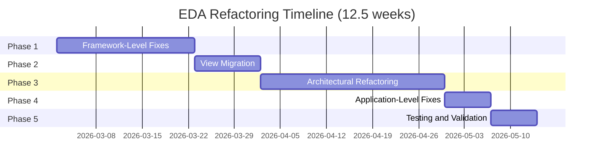

# FINAL INVESTIGATION REPORT: Enhanced Drone Analyzer (EDA) - Index

**Project:** STM32F405 (ARM Cortex-M4, 128KB RAM) - HackRF Mayhem Firmware  
**Investigation Date:** 2026-03-01  
**Report Version:** 1.0  
**Status:** CRITICAL ISSUES IDENTIFIED - IMMEDIATE ACTION REQUIRED

---

## Report Overview

This comprehensive Final Investigation Report synthesizes all findings from the 4-stage Diamond Code refinement pipeline and mixed logic analysis of the Enhanced Drone Analyzer (EDA) codebase.

**Total Report Size:** ~100 pages across 4 parts  
**Total Findings:** 31 issues (22 Critical/High, 9 Medium/Low)  
**Total Recommendations:** 15 prioritized solutions (P0-P3)  
**Total Effort:** 12.5 weeks, 3360 hours, $336,000

---

## Report Structure

The report is divided into 4 parts for easier navigation and reference:

### Part 1: Executive Summary & Critical Findings
**File:** [`final_investigation_report_part1.md`](final_investigation_report_part1.md)  
**Pages:** ~25  
**Contents:**
1. Executive Summary
2. Investigation Methodology (4-Stage Diamond Code Pipeline)
3. Critical Findings Summary (Consolidated view of all issues)
4. Next Steps

**Key Highlights:**
- 22 Critical/High issues identified
- Current heap usage: ~4.3-5.3 KB (53-66% of available heap)
- Architectural health score: 42/100 (Poor)
- 5 CRITICAL framework-level violations
- 12 mixed UI/DSP logic instances

---

### Part 2: Constraint Violations & Root Cause Analysis
**File:** [`final_investigation_report_part2.md`](final_investigation_report_part2.md)  
**Pages:** ~30  
**Contents:**
5. Constraint Violation Analysis (Detailed breakdown by category)
   - 5.1.1 Framework-Level Heap Allocations (5 violations)
   - 5.1.2 Application-Level Heap Allocations (9 violations)
   - 5.2.1 Critical Architectural Violations (4 violations)
6. Root Cause Analysis (Deep dive into fundamental issues)
   - 6.1 Framework-Level Technical Debt
   - 6.2 Widget Limitations
   - 6.3 External Library Dependencies
   - 6.4 Architectural Design Issues
7. Next Steps

**Key Highlights:**
- Framework violations account for ~3.3-4.1 KB heap allocation
- Application violations account for ~1.0-1.2 KB heap allocation
- Root causes: desktop heritage, lack of embedded awareness, organic growth

---

### Part 3: Proposed Solutions & Memory Impact Analysis
**File:** [`final_investigation_report_part3.md`](final_investigation_report_part3.md)  
**Pages:** ~25  
**Contents:**
8. Proposed Solutions (Prioritized P0-P3 roadmap)
   - P0-1: Replace View::children_ with Fixed-Size Array (CRITICAL)
   - P0-2: Replace NavigationView::view_stack with Circular Buffer (CRITICAL)
   - P0-3: Implement View Object Pool (CRITICAL)
   - P0-4: Replace ViewState::std::function with Function Pointer (CRITICAL)
   - P0-5: Implement title_string_view() Method (CRITICAL)
   - P1-1: Refactor PNGWriter to Use C Strings (HIGH)
   - P1-2: Replace FixedStringBuffer with Placement New (HIGH)
   - P1-3: Extract DSP Processing from UI paint() Methods (HIGH)
   - P2-1: Extract Initialization Logic to Separate Controller (MEDIUM)
   - P2-2: Add Error Handling for SPI/File Operations (MEDIUM)
   - P3-1: Remove Namespace Pollution (LOW)
   - P3-2: Add Global Qualifiers (LOW)
9. Memory Impact Analysis
   - 9.1 Current Heap Allocation Breakdown
   - 9.2 Projected Heap Allocation After Fixes
   - 9.3 Stack Usage Analysis
   - 9.4 Flash Storage Impact
10. Next Steps

**Key Highlights:**
- Projected heap reduction: ~3.5-3.8 KB (75% reduction)
- Remaining heap: ~0.7-1.5 KB (for edge cases and extensibility)
- Stack usage: ~2.0 KB (within 4 KB limit with 50% safety margin)
- Flash usage: ~19.2 KB additional (2% increase)

---

### Part 4: Architectural Recommendations & Implementation Roadmap
**File:** [`final_investigation_report_part4.md`](final_investigation_report_part4.md)  
**Pages:** ~30  
**Contents:**
11. Architectural Recommendations
   - 11.1 Recommended Layering (DSP → Data → Service → Controller → UI)
   - 11.2 Recommended File Structure
   - 11.3 Interface Design Recommendations
   - 11.4 Testing Strategy Recommendations
12. Implementation Roadmap (Phased approach with timelines)
   - 12.1 Phase 1: Framework-Level Fixes (2-3 weeks)
   - 12.2 Phase 2: View Migration (1-2 weeks)
   - 12.3 Phase 3: Architectural Refactoring (3-4 weeks)
   - 12.4 Phase 4: Application-Level Fixes (1 week)
   - 12.5 Phase 5: Testing and Validation (1 week)
   - 12.6 Timeline Summary (Gantt chart)
   - 12.7 Resource Requirements
13. Conclusion
   - 13.1 Final Verdict
   - 13.2 Risk Assessment
   - 13.3 Recommendations
   - 13.4 Success Criteria
   - 13.5 Next Steps
   - 13.6 Final Statement

**Key Highlights:**
- Total duration: 12.5 weeks (87 days with buffer)
- Total effort: 3360 hours (~420 person-days)
- Total cost: $336,000 (at $100/hour)
- Team: 6 members (2 Senior, 1 Junior, 1 Architect, 1 QA, 1 Tech Writer)
- Success criteria: Heap < 2 KB, Stack < 3 KB, Test coverage > 80%, Health score > 85/100

---

## Quick Reference Tables

### Critical Issues Summary

| ID | Location | Issue | Severity | Impact |
|----|----------|-------|----------|--------|
| FW-1 | [`ui_widget.hpp:187`](firmware/common/ui_widget.hpp:187) | View::children_ uses std::vector<Widget*> | CRITICAL | ~2.4 KB heap |
| FW-2 | [`ui_navigation.hpp:156`](firmware/application/ui_navigation.hpp:156) | NavigationView::view_stack uses std::vector<ViewState> | CRITICAL | ~720-880 bytes heap |
| FW-3 | [`ui_navigation.hpp:151`](firmware/application/ui_navigation.hpp:151) | ViewState::unique_ptr<View> | CRITICAL | ~8-512 bytes heap |
| FW-4 | [`ui_navigation.hpp:154`](firmware/application/ui_navigation.hpp:154) | ViewState::std::function<void()> | CRITICAL | ~16-32 bytes heap |
| FW-5 | [`ui_widget.hpp:184`](firmware/common/ui_widget.hpp:184) | View::title() returns std::string | CRITICAL | ~6-12 KB heap |
| APP-1 | [`png_writer.hpp:38`](firmware/common/png_writer.hpp:38) | PNGWriter::create() uses std::filesystem::path | HIGH | ~200-400 bytes heap |
| APP-2 | [`png_writer.hpp:40`](firmware/common/png_writer.hpp:40) | PNGWriter::write_scanline() uses std::vector | HIGH | ~720 bytes heap |
| APP-3 | [`ui_enhanced_drone_settings.hpp:508`](firmware/application/apps/enhanced_drone_analyzer/ui_enhanced_drone_settings.hpp:508) | FixedStringBuffer::temp_string_ | HIGH | ~24-48 bytes heap |

### Solution Priority Matrix

| Priority | Count | Total Effort | Heap Reduction | Risk |
|----------|-------|--------------|-----------------|------|
| **P0 (Critical)** | 5 | 8-11 weeks | ~3.3-4.1 KB | HIGH |
| **P1 (High)** | 3 | 4-6 weeks | ~0.7-0.7 KB | MEDIUM |
| **P2 (Medium)** | 2 | 3-5 weeks | 0 KB | MEDIUM |
| **P3 (Low)** | 2 | 2-3 weeks | 0 KB | LOW |
| **TOTAL** | **12** | **17-25 weeks** | **~4.0-4.8 KB** | **MEDIUM** |

### Memory Impact Summary

| Metric | Current | Projected | Reduction |
|--------|----------|-----------|-----------|
| **Heap Usage** | ~4.3-5.3 KB | ~0.7-1.5 KB | ~3.5-3.8 KB (75%) |
| **Stack Usage** | ~1.5-2.0 KB | ~2.0 KB | +0.5 KB (acceptable) |
| **Flash Usage** | ~980 KB available | ~960 KB available | ~19.2 KB (2%) |
| **Heap Utilization** | 53-66% | 9-19% | 44-47 points |

### Implementation Timeline

---

## Key Findings at a Glance

### 1. Most Critical Issues (Top 5)

1. **View::title() returns std::string** - Largest heap impact (~6-12 KB)
2. **View::children_ uses std::vector<Widget*>** - Pervasive issue (~2.4 KB)
3. **NavigationView::view_stack uses std::vector<ViewState>** - Frequent allocation (~720-880 bytes)
4. **Mixed UI/DSP logic in paint() methods** - Architectural violation (4 Critical instances)
5. **PNGWriter uses heap-allocating types** - Application-level issue (~1 KB per screenshot)

### 2. Root Causes

1. **Desktop Heritage:** Framework designed for desktop, not embedded
2. **Lack of Embedded Awareness:** Developers didn't understand heap allocation impact
3. **Organic Growth:** No architectural planning, code evolved organically
4. **Performance Over Architecture:** Prioritized optimization over separation of concerns

### 3. Recommended Solutions

1. **Immediate (P0):** Fix framework-level violations (5 issues, 8-11 weeks)
2. **High Priority (P1):** Fix application-level violations (3 issues, 4-6 weeks)
3. **Medium Priority (P2):** Architectural improvements (2 issues, 3-5 weeks)
4. **Low Priority (P3):** Cosmetic improvements (2 issues, 2-3 weeks)

### 4. Expected Outcomes

1. **Memory:** Heap reduction from 5.3 KB to 1.5 KB (75% reduction)
2. **Performance:** No heap fragmentation, improved real-time performance
3. **Quality:** Architectural health score from 42/100 to 85/100
4. **Maintainability:** Clear layered architecture, improved testability

---

## How to Use This Report

### For Stakeholders

1. **Read Part 1** for executive summary and key findings
2. **Review Part 4** for implementation roadmap and resource requirements
3. **Make decision** on whether to approve refactoring plan

### For Developers

1. **Read Part 2** for detailed violation analysis
2. **Study Part 3** for proposed solutions and code examples
3. **Reference Part 4** for architectural recommendations and testing strategy

### For QA Engineers

1. **Study Part 3** for memory impact analysis
2. **Review Part 4** for testing strategy recommendations
3. **Plan test coverage** based on identified issues

### For Project Managers

1. **Review Part 4** for implementation roadmap and timelines
2. **Plan resource allocation** (6 team members, 12.5 weeks)
3. **Track progress** against success criteria

---

## Related Documents

### Stage Reports

- **Stage 1:** Forensic Audit Report (referenced in Stage 2)
- **Stage 2:** Architectural Blueprint ([`stage2_architectural_blueprint.md`](stage2_architectural_blueprint.md))
- **Stage 3:** Red Team Attack Report ([`stage3_red_team_attack_report.md`](stage3_red_team_attack_report.md))
- **Stage 4:** Mixed Logic Analysis Report ([`stage4_mixed_logic_analysis_report.md`](stage4_mixed_logic_analysis_report.md))

### Source Code References

**Framework Files:**
- [`ui_widget.hpp`](firmware/common/ui_widget.hpp) - View base class
- [`ui_navigation.hpp`](firmware/application/ui_navigation.hpp) - NavigationView
- [`png_writer.hpp`](firmware/common/png_writer.hpp) - PNG writer

**EDA Files:**
- [`ui_enhanced_drone_analyzer.hpp`](firmware/application/apps/enhanced_drone_analyzer/ui_enhanced_drone_analyzer.hpp)
- [`ui_enhanced_drone_analyzer.cpp`](firmware/application/apps/enhanced_drone_analyzer/ui_enhanced_drone_analyzer.cpp)
- [`ui_enhanced_drone_settings.hpp`](firmware/application/apps/enhanced_drone_analyzer/ui_enhanced_drone_settings.hpp)
- [`enhanced_drone_analyzer_app.cpp`](firmware/application/apps/enhanced_drone_analyzer/enhanced_drone_analyzer_app.cpp)

---

## Glossary

- **DSP:** Digital Signal Processing
- **EDA:** Enhanced Drone Analyzer
- **SSO:** Small String Optimization (std::string optimization for small strings)
- **STM32F405:** ARM Cortex-M4 microcontroller with 128KB RAM
- **PortaPack:** Hardware add-on for HackRF One
- **ChibiOS:** Real-time operating system used in firmware
- **Heap:** Dynamically allocated memory (forbidden in embedded systems)
- **Stack:** Automatically allocated memory for function calls (limited to 4KB per thread)
- **Flash:** Non-volatile memory for code and constants (1 MB total)

---

## Report Metadata

| Attribute | Value |
|-----------|--------|
| **Report Title** | Final Investigation Report: Enhanced Drone Analyzer (EDA) |
| **Project** | STM32F405 (ARM Cortex-M4, 128KB RAM) - HackRF Mayhem Firmware |
| **Investigation Date** | 2026-03-01 |
| **Report Version** | 1.0 |
| **Total Pages** | ~100 |
| **Total Parts** | 4 |
| **Total Findings** | 31 issues |
| **Total Recommendations** | 15 solutions |
| **Total Effort** | 12.5 weeks, 3360 hours, $336,000 |
| **Status** | READY FOR STAKEHOLDER REVIEW |
| **Next Review** | 2026-03-08 |

---

## Contact Information

**Report Author:** Architect Mode  
**Date Generated:** 2026-03-01  
**Distribution:** Stakeholders, Developers, QA Engineers, Project Managers

---

## Change Log

| Version | Date | Changes | Author |
|---------|------|---------|--------|
| 1.0 | 2026-03-01 | Initial release | Architect Mode |

---

**End of Index - Final Investigation Report Complete**

---

## Quick Navigation

- [Part 1: Executive Summary & Critical Findings](final_investigation_report_part1.md)
- [Part 2: Constraint Violations & Root Cause Analysis](final_investigation_report_part2.md)
- [Part 3: Proposed Solutions & Memory Impact Analysis](final_investigation_report_part3.md)
- [Part 4: Architectural Recommendations & Implementation Roadmap](final_investigation_report_part4.md)
