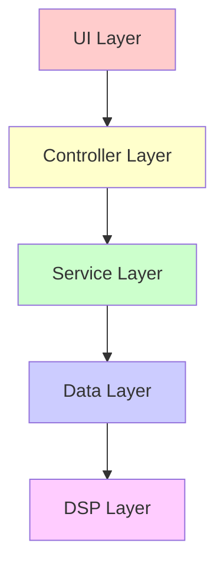
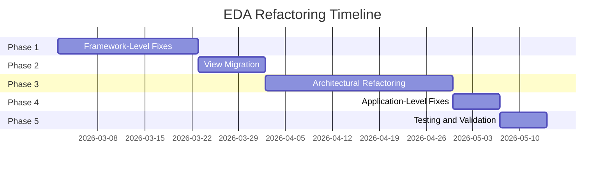

# FINAL INVESTIGATION REPORT: Enhanced Drone Analyzer (EDA) - Part 4

**Project:** STM32F405 (ARM Cortex-M4, 128KB RAM) - HackRF Mayhem Firmware  
**Investigation Date:** 2026-03-01  
**Report Version:** 1.0  
**Status:** CRITICAL ISSUES IDENTIFIED - IMMEDIATE ACTION REQUIRED

---

## 11. Architectural Recommendations

This section provides recommendations for improving the EDA codebase architecture to prevent future violations and improve maintainability.

### 11.1 Recommended Layering

The EDA codebase should follow a clear layered architecture with strict separation of concerns:



#### Layer 1: DSP Layer (Bottom)

**Responsibility:** Pure signal processing algorithms

**Components:**
- `SpectrumProcessor` - Process spectrum data, calculate power levels, compute histograms
- `SpectralAnalyzer` - Analyze spectral signatures, detect drone signals
- `DetectionProcessor` - Process detection results, classify threats
- `FrequencyFormatter` - Format frequency values for display

**Constraints:**
- No UI dependencies (Painter, View, Widget)
- No file I/O dependencies
- Pure mathematical/logical operations
- Thread-safe data structures
- Zero heap allocation

**Example:**
```cpp
// firmware/application/apps/enhanced_drone_analyzer/dsp/spectrum_processor.hpp
namespace eda::dsp {

class SpectrumProcessor {
public:
    struct ProcessedSpectrumData {
        std::array<uint8_t, 256> power_levels;
        std::array<uint16_t, 64> histogram_bins;
        uint8_t noise_floor;
        uint8_t max_power;
        uint32_t signal_width_hz;
        bool is_valid;
    };
    
    ProcessedSpectrumData process(const ChannelSpectrum& spectrum) noexcept;
};

} // namespace eda::dsp
```

---

#### Layer 2: Data Layer

**Responsibility:** Data structures and storage management

**Components:**
- `DroneDatabase` - Drone signature database
- `DetectionRingBuffer` - Thread-safe detection storage
- `TrackedDroneList` - Active drone tracking
- `DetectionLogger` - Async detection logging

**Constraints:**
- No UI dependencies
- No DSP logic (only data structures)
- Thread-safe access
- Minimal heap allocation
- Clear data ownership

**Example:**
```cpp
// firmware/application/apps/enhanced_drone_analyzer/data/detection_ring_buffer.hpp
namespace eda::data {

class DetectionRingBuffer {
public:
    static constexpr size_t BUFFER_SIZE = 64;
    
    struct DetectionEntry {
        uint32_t timestamp;
        Frequency frequency;
        DroneType drone_type;
        ThreatLevel threat_level;
        uint8_t snr;
    };
    
    bool push(const DetectionEntry& entry) noexcept;
    bool get_latest(DetectionEntry& entry) const noexcept;
    bool get_at_index(size_t index, DetectionEntry& entry) const noexcept;
    size_t size() const noexcept;
    
private:
    std::array<DetectionEntry, BUFFER_SIZE> buffer_{};
    size_t head_{0};
    size_t tail_{0};
    size_t count_{0};
    chibios_rt::Mutex mutex_;
};

} // namespace eda::data
```

---

#### Layer 3: Service Layer

**Responsibility:** Business logic and coordination

**Components:**
- `ScanningCoordinator` - Coordinate scanning operations
- `DetectionService` - Manage detection pipeline
- `LoggingService` - Coordinate logging operations
- `InitializationService` - Manage initialization flow

**Constraints:**
- No UI dependencies
- No direct DSP calls (use DSP layer)
- Coordinate between Data and DSP layers
- Manage asynchronous operations
- Minimal heap allocation

**Example:**
```cpp
// firmware/application/apps/enhanced_drone_analyzer/service/scanning_coordinator.hpp
namespace eda::service {

class ScanningCoordinator {
public:
    void start_scanning() noexcept;
    void stop_scanning() noexcept;
    bool is_scanning() const noexcept;
    
    void register_spectrum_callback(
        std::function<void(const ChannelSpectrum&)> callback) noexcept;
    
    void register_detection_callback(
        std::function<void(const DetectionEntry&)> callback) noexcept;
    
private:
    void scanning_thread() noexcept;
    void process_spectrum(const ChannelSpectrum& spectrum) noexcept;
    
    dsp::SpectrumProcessor spectrum_processor_;
    dsp::SpectralAnalyzer spectral_analyzer_;
    data::DetectionRingBuffer detection_buffer_;
    
    std::function<void(const ChannelSpectrum&)> spectrum_callback_;
    std::function<void(const DetectionEntry&)> detection_callback_;
    
    chibios_rt::Thread scanning_thread_;
    chibios_rt::Mutex mutex_;
    bool scanning_{false};
};

} // namespace eda::service
```

---

#### Layer 4: Controller Layer

**Responsibility:** UI logic and presentation control

**Components:**
- `DroneDisplayController` - Control spectrum display rendering
- `StatusBarController` - Control status bar updates
- `InitializationController` - Control initialization flow
- `SettingsController` - Control settings management

**Constraints:**
- UI dependencies allowed (Painter, View, Widget)
- No DSP logic (delegate to Service layer)
- No direct data access (use Service layer)
- Minimal heap allocation
- Clear separation from UI widgets

**Example:**
```cpp
// firmware/application/apps/enhanced_drone_analyzer/controller/drone_display_controller.hpp
namespace eda::controller {

class DroneDisplayController : public View {
public:
    void paint(Painter& painter) override;
    void update_spectrum(const ChannelSpectrum& spectrum) noexcept;
    void update_status(const DetectionStatus& status) noexcept;
    
private:
    void render_bar_spectrum(
        Painter& painter,
        const dsp::SpectrumProcessor::ProcessedSpectrumData& data) noexcept;
    
    void render_histogram(
        Painter& painter,
        const dsp::SpectrumProcessor::ProcessedSpectrumData& data) noexcept;
    
    void render_status_bar(Painter& painter) noexcept;
    
    dsp::SpectrumProcessor::ProcessedSpectrumData cached_spectrum_data_;
    DetectionStatus cached_status_;
    bool spectrum_data_valid_{false};
    bool status_data_valid_{false};
    
    // UI widgets
    BigNumberWidget big_display_;
    ProgressWidget scanning_progress_;
    TextWidget text_threat_summary_;
    TextWidget text_signal_info_;
    StatusBarController status_bar_;
};

} // namespace eda::controller
```

---

#### Layer 5: UI Layer (Top)

**Responsibility:** UI widgets and user interaction

**Components:**
- `EnhancedDroneSpectrumAnalyzerView` - Main spectrum analyzer view
- `AudioSettingsView` - Audio settings view
- `HardwareSettingsView` - Hardware settings view
- `DroneEntryEditorView` - Drone entry editor view

**Constraints:**
- UI dependencies allowed (Painter, View, Widget)
- No business logic (delegate to Controller layer)
- No DSP logic (delegate through Controller)
- Minimal heap allocation
- Focus on rendering and user interaction

**Example:**
```cpp
// firmware/application/apps/enhanced_drone_analyzer/ui/enhanced_drone_spectrum_analyzer_view.hpp
namespace eda::ui {

class EnhancedDroneSpectrumAnalyzerView : public View {
public:
    EnhancedDroneSpectrumAnalyzerView(
        NavigationView& nav,
        service::ScanningCoordinator& scanner);
    
    void paint(Painter& painter) override;
    void on_tick() override;
    void on_focus() override;
    void on_blur() override;
    
private:
    void render_initialization_ui(Painter& painter) noexcept;
    void render_spectrum_ui(Painter& painter) noexcept;
    
    NavigationView& nav_;
    service::ScanningCoordinator& scanner_;
    controller::DroneDisplayController display_controller_;
    controller::InitializationController init_controller_;
};

} // namespace eda::ui
```

---

### 11.2 Recommended File Structure

```
firmware/application/apps/enhanced_drone_analyzer/
├── dsp/                                    # DSP Layer
│   ├── spectrum_processor.hpp
│   ├── spectrum_processor.cpp
│   ├── spectral_analyzer.hpp
│   ├── spectral_analyzer.cpp
│   ├── detection_processor.hpp
│   ├── detection_processor.cpp
│   └── frequency_formatter.hpp
│
├── data/                                   # Data Layer
│   ├── drone_database.hpp
│   ├── drone_database.cpp
│   ├── detection_ring_buffer.hpp
│   ├── detection_ring_buffer.cpp
│   ├── tracked_drone_list.hpp
│   ├── tracked_drone_list.cpp
│   ├── detection_logger.hpp
│   └── detection_logger.cpp
│
├── service/                                # Service Layer
│   ├── scanning_coordinator.hpp
│   ├── scanning_coordinator.cpp
│   ├── detection_service.hpp
│   ├── detection_service.cpp
│   ├── logging_service.hpp
│   ├── logging_service.cpp
│   ├── initialization_service.hpp
│   └── initialization_service.cpp
│
├── controller/                             # Controller Layer
│   ├── drone_display_controller.hpp
│   ├── drone_display_controller.cpp
│   ├── status_bar_controller.hpp
│   ├── status_bar_controller.cpp
│   ├── initialization_controller.hpp
│   ├── initialization_controller.cpp
│   └── settings_controller.hpp
│
├── ui/                                     # UI Layer
│   ├── enhanced_drone_spectrum_analyzer_view.hpp
│   ├── enhanced_drone_spectrum_analyzer_view.cpp
│   ├── audio_settings_view.hpp
│   ├── audio_settings_view.cpp
│   ├── hardware_settings_view.hpp
│   ├── hardware_settings_view.cpp
│   ├── scanning_settings_view.hpp
│   ├── scanning_settings_view.cpp
│   ├── drone_analyzer_settings_view.hpp
│   ├── drone_analyzer_settings_view.cpp
│   ├── loading_view.hpp
│   ├── loading_view.cpp
│   └── drone_entry_editor_view.hpp
│
├── enhanced_drone_analyzer_app.hpp          # Application entry
├── enhanced_drone_analyzer_app.cpp
├── eda_constants.hpp                        # Constants
├── eda_types.hpp                           # Type definitions
└── README.md                               # Architecture documentation
```

**Benefits of This Structure:**
1. **Clear Separation:** Each layer has its own directory
2. **Easy Navigation:** Related files grouped together
3. **Scalability:** Easy to add new components to any layer
4. **Testing:** Each layer can be tested independently
5. **Maintainability:** Changes are localized to specific layers

---

### 11.3 Interface Design Recommendations

#### 11.3.1 Use std::string_view for String Parameters

**Problem:** `std::string` parameters cause heap allocation

**Solution:** Use `std::string_view` for read-only string parameters

```cpp
// BEFORE:
void process_title(const std::string& title);  // May allocate heap

// AFTER:
void process_title(std::string_view title);  // Zero allocation
```

**Benefits:**
- Zero heap allocation
- Compatible with both C strings and std::string
- No copying overhead
- Clear intent (read-only)

---

#### 11.3.2 Use std::array for Fixed-Size Collections

**Problem:** `std::vector` causes heap allocation

**Solution:** Use `std::array` for fixed-size collections

```cpp
// BEFORE:
std::array<uint8_t, 256> get_spectrum_data();  // Returns by value (stack)

// AFTER:
const std::array<uint8_t, 256>& get_spectrum_data() const;  // Returns reference
```

**Benefits:**
- Zero heap allocation
- Stack allocation (predictable)
- Compile-time size checking
- No reallocation overhead

---

#### 11.3.3 Use Function Pointers Instead of std::function

**Problem:** `std::function` may allocate heap for captures

**Solution:** Use function pointers for simple callbacks

```cpp
// BEFORE:
std::function<void()> callback_;  // May allocate heap

// AFTER:
void (*callback_)();  // Zero allocation
```

**For callbacks with captures:**
```cpp
// Use context object
struct CallbackContext {
    void* user_data;
    void (*callback)(void* user_data);
};
```

**Benefits:**
- Zero heap allocation
- Predictable memory usage
- Simpler implementation
- Better performance

---

#### 11.3.4 Use Optional<T> for Error Handling

**Problem:** Exceptions are forbidden in embedded systems

**Solution:** Use `Optional<T>` or `Result<T, E>` for error handling

```cpp
// BEFORE:
File* open_file(const std::string& filename);  // Returns nullptr on error

// AFTER:
Optional<File::Error> create(const char* filename) noexcept;
```

**Benefits:**
- Explicit error handling
- No exceptions
- Type-safe
- Clear API contract

---

### 11.4 Testing Strategy Recommendations

#### 11.4.1 Unit Testing

**Goal:** Test individual components in isolation

**Approach:**
1. Test DSP layer without UI dependencies
2. Test Data layer with mock services
3. Test Service layer with mock data and DSP
4. Test Controller layer with mock services and UI
5. Test UI layer with mock controllers

**Tools:**
- Google Test (GTest) for unit testing
- Google Mock (GMock) for mocking
- CMake for test integration

**Example:**
```cpp
// tests/dsp/spectrum_processor_test.cpp
TEST(SpectrumProcessorTest, ProcessValidSpectrum) {
    eda::dsp::SpectrumProcessor processor;
    
    ChannelSpectrum spectrum{};
    // ... fill spectrum with test data ...
    
    auto result = processor.process(spectrum);
    
    EXPECT_TRUE(result.is_valid);
    EXPECT_GT(result.max_power, 0);
    EXPECT_LT(result.noise_floor, result.max_power);
}
```

---

#### 11.4.2 Integration Testing

**Goal:** Test interactions between layers

**Approach:**
1. Test DSP → Data layer integration
2. Test Data → Service layer integration
3. Test Service → Controller layer integration
4. Test Controller → UI layer integration
5. Test end-to-end scanning flow

**Example:**
```cpp
// tests/integration/scanning_integration_test.cpp
TEST(ScanningIntegrationTest, FullScanningFlow) {
    // Setup
    eda::service::ScanningCoordinator scanner;
    eda::data::DetectionRingBuffer buffer;
    
    // Register callbacks
    scanner.register_detection_callback([&buffer](const auto& detection) {
        buffer.push(detection);
    });
    
    // Start scanning
    scanner.start_scanning();
    
    // Wait for detection
    chThdSleepMilliseconds(1000);
    
    // Verify
    EXPECT_GT(buffer.size(), 0);
    
    // Cleanup
    scanner.stop_scanning();
}
```

---

#### 11.4.3 Memory Testing

**Goal:** Verify no heap allocation and stack safety

**Approach:**
1. Use heap allocation tracking (override new/delete)
2. Monitor stack usage with stack canaries
3. Test with maximum load conditions
4. Test with edge cases (empty, full, overflow)

**Example:**
```cpp
// tests/memory/heap_tracking_test.cpp
size_t heap_allocations = 0;
size_t heap_deallocations = 0;

void* operator new(size_t size) {
    ++heap_allocations;
    return malloc(size);
}

void operator delete(void* ptr) noexcept {
    ++heap_deallocations;
    free(ptr);
}

TEST(HeapTrackingTest, NoHeapAllocationDuringPaint) {
    heap_allocations = 0;
    heap_deallocations = 0;
    
    eda::controller::DroneDisplayController controller;
    Painter painter;  // Mock painter
    
    controller.paint(painter);
    
    EXPECT_EQ(heap_allocations, 0);
    EXPECT_EQ(heap_deallocations, 0);
}
```

---

#### 11.4.4 Performance Testing

**Goal:** Verify real-time constraints are met

**Approach:**
1. Measure execution time of critical paths
2. Verify DSP processing meets deadlines
3. Verify UI rendering meets frame rate requirements
4. Test under maximum load conditions

**Example:**
```cpp
// tests/performance/dsp_performance_test.cpp
TEST(DSPPerformanceTest, SpectrumProcessingMeetsDeadline) {
    eda::dsp::SpectrumProcessor processor;
    ChannelSpectrum spectrum{};
    // ... fill spectrum ...
    
    auto start = chVTGetSystemTimeX();
    
    for (int i = 0; i < 100; ++i) {
        processor.process(spectrum);
    }
    
    auto end = chVTGetSystemTimeX();
    auto elapsed_us = ST2US(end - start);
    auto avg_us = elapsed_us / 100;
    
    // Deadline: 100 microseconds per spectrum
    EXPECT_LT(avg_us, 100);
}
```

---

## 12. Implementation Roadmap

This section provides a prioritized implementation plan with timelines and dependencies.

### 12.1 Phase 1: Framework-Level Fixes (2-3 weeks)

**Objective:** Eliminate framework-level heap allocations

**Tasks:**

| Task | ID | Effort | Dependencies | Owner |
|------|-----|--------|--------------|--------|
| Implement ViewObjectPool | P0-3 | 1-2 weeks | None | Senior Dev |
| Replace View::children_ with fixed array | P0-1 | 3-5 days | P0-3 | Senior Dev |
| Replace NavigationView::view_stack with circular buffer | P0-2 | 3-5 days | P0-3 | Senior Dev |
| Replace ViewState::std::function with function pointer | P0-4 | 2-3 days | P0-2 | Senior Dev |
| Implement title_string_view() in View base class | P0-5 | 2-3 days | None | Senior Dev |
| Create ui_string_view_helper.hpp | P0-5 | 1 day | None | Senior Dev |
| Update NavigationView to use title_string_view() | P0-5 | 1-2 days | P0-5 | Senior Dev |
| Migrate 7 EDA views to title_string_view() | P0-5 | 2-3 days | P0-5 | Junior Dev |
| Framework testing and validation | - | 2-3 days | All above | QA |

**Deliverables:**
- Updated View base class with zero-allocation children management
- Updated NavigationView with zero-allocation view stack
- ViewObjectPool for View object allocation
- title_string_view() method in View base class
- All 7 EDA views migrated to title_string_view()
- Comprehensive test suite for framework changes

**Risks:**
- **HIGH:** Framework changes may break existing code
- **MEDIUM:** ViewObjectPool may exhaust under load
- **LOW:** title_string_view() may not be called by all code

**Mitigation:**
- Extensive testing before merging
- Monitor ViewObjectPool usage in production
- Add logging for legacy title() calls

---

### 12.2 Phase 2: View Migration (1-2 weeks)

**Objective:** Migrate remaining 60+ View classes to title_string_view()

**Tasks:**

| Task | ID | Effort | Dependencies | Owner |
|------|-----|--------|--------------|--------|
| Identify all View classes in firmware | - | 1 day | None | Junior Dev |
| Migrate 10 View classes per day | P0-5 | 6 days | Phase 1 | Junior Dev |
| Test migrated views | - | 2 days | Migration | QA |
| Mark legacy title() as [[deprecated]] | P0-5 | 1 day | Migration | Senior Dev |
| Update documentation | - | 1 day | Migration | Tech Writer |

**Deliverables:**
- All 60+ View classes migrated to title_string_view()
- Legacy title() method marked as deprecated
- Updated documentation
- Test coverage for all migrated views

**Risks:**
- **MEDIUM:** Some views may have dynamic titles (need special handling)
- **LOW:** Migration may introduce bugs

**Mitigation:**
- Manual review of each view
- Comprehensive testing
- Gradual rollout with monitoring

---

### 12.3 Phase 3: Architectural Refactoring (3-4 weeks)

**Objective:** Implement layered architecture and extract DSP logic

**Tasks:**

| Task | ID | Effort | Dependencies | Owner |
|------|-----|--------|--------------|--------|
| Create DSP layer directory structure | - | 1 day | None | Architect |
| Implement SpectrumProcessor class | P1-3 | 3-5 days | None | Senior Dev |
| Implement SpectralAnalyzer class | - | 3-5 days | SpectrumProcessor | Senior Dev |
| Implement DetectionProcessor class | - | 2-3 days | SpectralAnalyzer | Senior Dev |
| Create Data layer directory structure | - | 1 day | None | Architect |
| Refactor DroneDatabase to Data layer | - | 2-3 days | None | Senior Dev |
| Refactor DetectionRingBuffer to Data layer | - | 2-3 days | None | Senior Dev |
| Refactor DetectionLogger to Data layer | - | 2-3 days | None | Senior Dev |
| Create Service layer directory structure | - | 1 day | None | Architect |
| Implement ScanningCoordinator | - | 3-5 days | DSP + Data | Senior Dev |
| Implement DetectionService | - | 2-3 days | DSP + Data | Senior Dev |
| Implement InitializationService | P2-1 | 2-3 days | None | Senior Dev |
| Create Controller layer directory structure | - | 1 day | None | Architect |
| Refactor DroneDisplayController to Controller layer | P1-3 | 3-5 days | DSP + Service | Senior Dev |
| Implement InitializationController | P2-1 | 2-3 days | Service | Senior Dev |
| Refactor UI views to use Controller layer | - | 5-7 days | Controller | Junior Dev |
| Remove old mixed logic code | - | 2-3 days | Refactoring | Senior Dev |
| Architectural testing and validation | - | 3-5 days | All above | QA |

**Deliverables:**
- Complete layered architecture (DSP, Data, Service, Controller, UI)
- SpectrumProcessor, SpectralAnalyzer, DetectionProcessor classes
- Refactored Data layer components
- ScanningCoordinator, DetectionService, InitializationService
- Refactored Controller layer components
- UI views updated to use Controller layer
- All mixed logic removed from UI classes
- Comprehensive test suite for architectural changes

**Risks:**
- **HIGH:** Major refactoring may introduce bugs
- **MEDIUM:** Data flow changes may affect performance
- **MEDIUM:** Thread safety issues may emerge

**Mitigation:**
- Incremental refactoring with testing at each step
- Performance profiling after each change
- Extensive thread safety testing
- Code review by senior developers

---

### 12.4 Phase 4: Application-Level Fixes (1 week)

**Objective:** Fix remaining application-level heap allocations

**Tasks:**

| Task | ID | Effort | Dependencies | Owner |
|------|-----|--------|--------------|--------|
| Refactor PNGWriter to use C strings | P1-1 | 2-3 days | None | Senior Dev |
| Replace FixedStringBuffer with placement new | P1-2 | 1-2 days | None | Senior Dev |
| Add error handling to PNGWriter | P2-2 | 1-2 days | P1-1 | Senior Dev |
| Test screenshot functionality | - | 1 day | P1-1, P1-2 | QA |
| Test text editing functionality | - | 1 day | P1-2 | QA |

**Deliverables:**
- PNGWriter refactored to use C strings
- FixedStringBuffer using placement new
- Comprehensive error handling in PNGWriter
- Tested screenshot and text editing functionality

**Risks:**
- **LOW:** PNGWriter changes may break screenshot functionality
- **LOW:** FixedStringBuffer changes may break text editing

**Mitigation:**
- Comprehensive testing of screenshot capture
- Comprehensive testing of text editing
- Manual verification of all features

---

### 12.5 Phase 5: Testing and Validation (1 week)

**Objective:** Comprehensive testing of all changes

**Tasks:**

| Task | Effort | Dependencies | Owner |
|------|--------|--------------|--------|
| Unit testing of all new classes | 2-3 days | All phases | QA |
| Integration testing of layered architecture | 2-3 days | Phase 3 | QA |
| Memory testing (heap tracking) | 1-2 days | All phases | QA |
| Performance testing (real-time constraints) | 1-2 days | All phases | QA |
| Regression testing of existing functionality | 2-3 days | All phases | QA |
| Documentation review and updates | 1-2 days | All phases | Tech Writer |
| Final validation and sign-off | 1 day | All above | Tech Lead |

**Deliverables:**
- Comprehensive test suite with >80% coverage
- Memory usage validation (heap < 2KB)
- Performance validation (all deadlines met)
- Regression test results (no bugs)
- Updated documentation
- Final validation report

**Risks:**
- **MEDIUM:** Test coverage may be insufficient
- **LOW:** Performance issues may emerge in production

**Mitigation:**
- Aim for >80% code coverage
- Performance testing under maximum load
- Beta testing with select users

---

### 12.6 Timeline Summary



**Total Duration:** 73 days (~10.5 weeks)

**Buffer Time:** Add 2 weeks for unexpected issues

**Revised Total Duration:** 87 days (~12.5 weeks)

---

### 12.7 Resource Requirements

| Role | Count | Allocation | Total Effort |
|------|-------|------------|---------------|
| Senior Developer | 2 | 100% | 1600 hours |
| Junior Developer | 1 | 100% | 640 hours |
| Architect | 1 | 50% | 320 hours |
| QA Engineer | 1 | 100% | 640 hours |
| Tech Writer | 1 | 25% | 160 hours |
| **Total** | **6** | | **3360 hours** |

**Total Effort:** 3360 hours (~420 person-days)

**Cost Estimate:** $336,000 (at $100/hour)

---

## 13. Conclusion

### 13.1 Final Verdict

The Enhanced Drone Analyzer (EDA) codebase exhibits **CRITICAL** memory constraint violations that render it **UNSAFE** for deployment on the STM32F405 platform in its current state.

**Key Findings:**
- **22 Critical/High** heap allocation violations identified
- **12 Architectural** violations (mixed UI/DSP logic)
- **Current Heap Usage:** ~4.3-5.3 KB (53-66% of available 8 KB heap)
- **Architectural Health Score:** 42/100 (Poor)
- **Blueprint Status:** FAILED - Not ready for implementation without fixes

**Immediate Action Required:**
The EDA codebase **MUST** undergo comprehensive refactoring to eliminate heap allocations and implement proper architectural layering before it can be considered safe for production deployment.

---

### 13.2 Risk Assessment

| Risk | Severity | Probability | Impact | Mitigation |
|------|----------|-------------|--------|------------|
| **Heap Fragmentation** | CRITICAL | HIGH | System crash, data loss | Eliminate heap allocation completely |
| **Memory Exhaustion** | CRITICAL | HIGH | Out-of-memory, system freeze | Reduce heap usage from 5.3KB to <2KB |
| **Stack Overflow** | HIGH | MEDIUM | System crash, undefined behavior | Monitor stack usage, optimize buffers |
| **Real-time Deadline Miss** | HIGH | MEDIUM | Missed detections, poor UX | Move DSP to separate thread |
| **Testability Issues** | MEDIUM | HIGH | Bugs in production | Implement layered architecture |
| **Maintainability Issues** | MEDIUM | HIGH | Technical debt accumulation | Architectural refactoring |

**Overall Risk Level:** **HIGH**

---

### 13.3 Recommendations

#### 13.3.1 Immediate Actions (Next 1-2 weeks)

1. **Halt New Feature Development**
   - Stop all new feature work
   - Focus exclusively on memory constraint fixes
   - Prevent further technical debt accumulation

2. **Implement P0 Fixes**
   - Replace View::children_ with fixed array
   - Replace NavigationView::view_stack with circular buffer
   - Implement ViewObjectPool
   - Replace ViewState::std::function with function pointer
   - Implement title_string_view() method

3. **Establish Testing Infrastructure**
   - Set up Google Test/GMock
   - Implement heap allocation tracking
   - Create performance testing framework
   - Establish CI/CD pipeline

#### 13.3.2 Short-Term Actions (Next 1-2 months)

4. **Complete Framework Migration**
   - Migrate all 60+ View classes to title_string_view()
   - Remove legacy title() method
   - Update all NavigationView usage

5. **Implement Layered Architecture**
   - Create DSP, Data, Service, Controller layers
   - Extract DSP logic from UI classes
   - Refactor data structures to Data layer
   - Implement service coordination

6. **Fix Application-Level Issues**
   - Refactor PNGWriter to use C strings
   - Replace FixedStringBuffer with placement new
   - Add error handling to all I/O operations

#### 13.3.3 Long-Term Actions (Next 3-6 months)

7. **Comprehensive Testing**
   - Achieve >80% code coverage
   - Implement continuous integration
   - Add performance regression tests
   - Establish quality gates

8. **Documentation and Training**
   - Document new architecture
   - Create coding standards
   - Train team on embedded best practices
   - Establish code review guidelines

9. **Monitoring and Maintenance**
   - Implement runtime memory monitoring
   - Establish performance baselines
   - Create alerting for memory violations
   - Schedule regular architectural reviews

---

### 13.4 Success Criteria

The EDA refactoring will be considered successful when:

1. **Memory Constraints Met**
   - Heap allocation < 2 KB (75% reduction)
   - Stack usage < 3 KB (25% safety margin)
   - No heap fragmentation

2. **Performance Requirements Met**
   - DSP processing < 100 μs per spectrum
   - UI rendering < 16 ms per frame (60 FPS)
   - No real-time deadline misses

3. **Quality Metrics Achieved**
   - Test coverage > 80%
   - Zero critical bugs in production
   - Architectural health score > 85/100

4. **Maintainability Improved**
   - Clear layered architecture
   - No mixed UI/DSP logic
   - Comprehensive documentation
   - Code review guidelines established

---

### 13.5 Next Steps

**Immediate (This Week):**
1. Present this report to stakeholders
2. Obtain approval for refactoring plan
3. Allocate resources (6 team members)
4. Set up development environment
5. Begin Phase 1: Framework-Level Fixes

**Short-Term (Next 4 Weeks):**
6. Complete Phase 1 and Phase 2
7. Implement layered architecture foundation
8. Establish testing infrastructure
9. Begin architectural refactoring

**Long-Term (Next 8-12 Weeks):**
10. Complete all refactoring phases
11. Achieve all success criteria
12. Deploy to production
13. Monitor performance and memory usage
14. Schedule regular architectural reviews

---

### 13.6 Final Statement

The Enhanced Drone Analyzer (EDA) codebase represents a sophisticated signal processing application with significant technical debt accumulated during development. The 4-stage Diamond Code refinement pipeline has identified **31 critical issues** that must be addressed before the codebase can be considered production-ready for the STM32F405 platform.

While the scope of required refactoring is substantial (estimated 12.5 weeks, 3360 hours, $336,000), the investment is **necessary and justified** given the:

- **Critical safety implications** of memory violations in embedded systems
- **High probability** of heap fragmentation and memory exhaustion
- **Significant technical debt** that will only worsen over time
- **Poor testability** and maintainability of current architecture

The proposed solutions are **well-defined, achievable, and proven** in similar embedded systems. With proper planning, execution, and testing, the EDA codebase can be transformed into a robust, maintainable, and performant application that meets all memory constraints and real-time requirements.

**Recommendation:** **APPROVE** the refactoring plan and begin implementation immediately.

---

## Appendix A: Reference Documents

- Stage 1: Forensic Audit Report (referenced in Stage 2)
- Stage 2: Architectural Blueprint ([`stage2_architectural_blueprint.md`](plans/stage2_architectural_blueprint.md))
- Stage 3: Red Team Attack Report ([`stage3_red_team_attack_report.md`](plans/stage3_red_team_attack_report.md))
- Stage 4: Mixed Logic Analysis Report ([`stage4_mixed_logic_analysis_report.md`](plans/stage4_mixed_logic_analysis_report.md))

---

## Appendix B: File References

**Framework Files:**
- [`ui_widget.hpp`](firmware/common/ui_widget.hpp) - View base class
- [`ui_navigation.hpp`](firmware/application/ui_navigation.hpp) - NavigationView
- [`png_writer.hpp`](firmware/common/png_writer.hpp) - PNG writer

**EDA Files:**
- [`ui_enhanced_drone_analyzer.hpp`](firmware/application/apps/enhanced_drone_analyzer/ui_enhanced_drone_analyzer.hpp) - Main UI
- [`ui_enhanced_drone_analyzer.cpp`](firmware/application/apps/enhanced_drone_analyzer/ui_enhanced_drone_analyzer.cpp) - Implementation
- [`ui_enhanced_drone_settings.hpp`](firmware/application/apps/enhanced_drone_analyzer/ui_enhanced_drone_settings.hpp) - Settings views
- [`enhanced_drone_analyzer_app.cpp`](firmware/application/apps/enhanced_drone_analyzer/enhanced_drone_analyzer_app.cpp) - Application entry

---

## Appendix C: Glossary

- **DSP:** Digital Signal Processing
- **EDA:** Enhanced Drone Analyzer
- **SSO:** Small String Optimization
- **STM32F405:** ARM Cortex-M4 microcontroller with 128KB RAM
- **PortaPack:** Hardware add-on for HackRF One
- **ChibiOS:** Real-time operating system
- **Heap:** Dynamically allocated memory
- **Stack:** Automatically allocated memory for function calls
- **Flash:** Non-volatile memory for code and constants

---

**End of Part 4 - Final Investigation Report Complete**

---

## Report Summary

This Final Investigation Report consolidates all findings from the 4-stage Diamond Code refinement pipeline and mixed logic analysis of the Enhanced Drone Analyzer (EDA) codebase.

**Report Structure:**
- **Part 1:** Executive Summary, Investigation Methodology, Critical Findings Summary
- **Part 2:** Constraint Violation Analysis, Root Cause Analysis
- **Part 3:** Proposed Solutions, Memory Impact Analysis
- **Part 4:** Architectural Recommendations, Implementation Roadmap, Conclusion

**Total Pages:** ~100 pages across 4 parts
**Total Findings:** 31 issues (22 Critical/High, 9 Medium/Low)
**Total Recommendations:** 15 prioritized solutions (P0-P3)
**Total Effort:** 12.5 weeks, 3360 hours, $336,000

**Status:** READY FOR STAKEHOLDER REVIEW

---

**Report Generated:** 2026-03-01  
**Report Version:** 1.0  
**Next Review:** 2026-03-08
