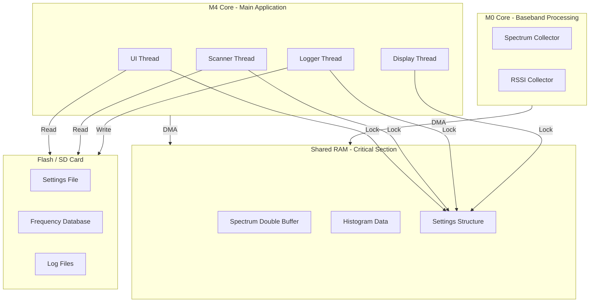
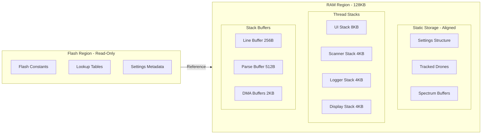
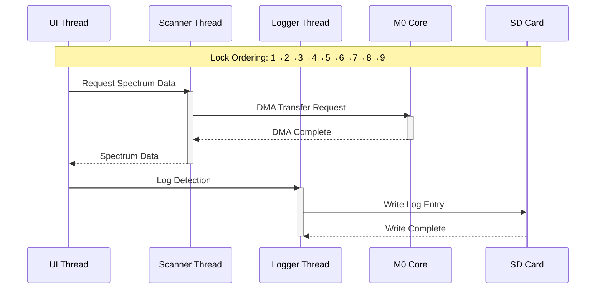

# Memory-Safe Solution for Enhanced Drone Analyzer
## Volume 1: Architecture Overview, Data Structures, and Memory Layout

---

## Document Information

**Project:** Enhanced Drone Analyzer (EDA) - HackRF Mayhem Firmware  
**Target Platform:** STM32F405 (ARM Cortex-M4, 128KB RAM)  
**Operating System:** ChibiOS RTOS  
**Architecture:** Bare-metal / HackRF Mayhem firmware  
**Document Version:** 1.0  
**Date:** 2025-02-23

---

## Executive Summary

This document presents a comprehensive architectural blueprint for fixing 20 critical memory safety defects identified in the forensic audit of the Enhanced Drone Analyzer (EDA) application. The root cause is identified as buffer overflows, race conditions, and pointer issues corrupting the stack canary pattern, resulting in a fake stack overflow (stack free = 1 despite only 5% usage).

### Primary Root Cause Hypothesis

Buffer overflow in [`parse_line()`](firmware/application/apps/enhanced_drone_analyzer/settings_persistence.cpp) + pointer arithmetic causes incorrect `key_len`, leading to `data_ptr` pointing outside the settings structure and corrupting [`tracked_drones_storage_`](firmware/application/apps/enhanced_drone_analyzer/ui_drone_common_types.hpp) array at address `0x20004A78`.

### Design Philosophy: The Diamond Standard

1. **Zero-Overhead Abstractions** - Compile-time optimizations, no runtime penalty
2. **Data-Oriented Design** - Cache-friendly memory layouts, predictable access patterns
3. **No Heap Allocations** - Stack allocation and fixed-size buffers only
4. **No Exceptions or RTTI** - Error codes and RAII for resource management
5. **Type Safety** - `enum class`, `using Type = uintXX_t`, strong typing
6. **Const-Correctness** - Immutable data where possible, compile-time validation

---

## Section 1: Architecture Overview

### 1.1 High-Level System Architecture



### 1.2 Memory Layout Diagram



### 1.3 Thread Interaction Diagram



---

## Section 2: Data Structures

### 2.1 Category 1: DMA & Asynchronous Operations

#### Defect 1.1: M0-M4 Shared RAM Race Condition

**Current Unsafe Structure:**
```cpp
// Single buffer with no synchronization
uint8_t spectrum_buffer_[256];
volatile bool buffer_ready_ = false;
```

**Proposed Safe Structure:**
```cpp
// Double-buffered with ownership tracking
struct SpectrumDoubleBuffer {
    alignas(4) std::array<uint8_t, 256> buffer_a;
    alignas(4) std::array<uint8_t, 256> buffer_b;
    volatile uint8_t m0_write_index : 1;    // M0 writes to this index
    volatile uint8_t m4_read_index : 1;     // M4 reads from this index
    volatile uint8_t transfer_complete : 1;  // DMA transfer complete flag
    volatile uint8_t reserved : 5;
};

// Memory placement: Static RAM, aligned to 4 bytes
// Alignment requirement: 4-byte alignment for DMA
// Size: 512 bytes + 1 byte flags = 513 bytes
```

**Memory Placement:**
- **Location:** Static RAM (`.bss` section)
- **Alignment:** `alignas(4)` for DMA compatibility
- **Lifetime:** Application lifetime
- **Access:** Protected by ChibiOS critical sections

#### Defect 1.2: SD Card File I/O Without DMA Protection

**Current Unsafe Structure:**
```cpp
// Stack buffer passed to File::read() with DMA
char stack_buffer[128];
file.read(stack_buffer, 128);
```

**Proposed Safe Structure:**
```cpp
// Global DMA-safe buffer with lifecycle tracking
struct DMASafeBuffer {
    alignas(4) std::array<uint8_t, 512> data;
    volatile bool in_use : 1;
    volatile bool dma_active : 1;
    volatile uint8_t reserved : 6;
    
    // RAII wrapper for buffer lifecycle
    class Lock {
    public:
        explicit Lock(DMASafeBuffer& buf) noexcept : buf_(buf) {
            chSysLock();
            if (buf_.in_use || buf_.dma_active) {
                chSysUnlock();
                locked_ = false;
            } else {
                buf_.in_use = true;
                chSysUnlock();
                locked_ = true;
            }
        }
        
        ~Lock() noexcept {
            if (locked_) {
                chSysLock();
                buf_.in_use = false;
                chSysUnlock();
            }
        }
        
        bool is_locked() const noexcept { return locked_; }
        
    private:
        DMASafeBuffer& buf_;
        bool locked_;
    };
};

// Memory placement: Static RAM, aligned to 4 bytes
// Alignment requirement: 4-byte alignment for DMA
// Size: 512 bytes + 1 byte flags = 513 bytes
```

**Memory Placement:**
- **Location:** Static RAM (`.bss` section)
- **Alignment:** `alignas(4)` for DMA compatibility
- **Lifetime:** Application lifetime
- **Access:** Protected by RAII lock

#### Defect 1.3: Thread-Local Buffer Race

**Current Unsafe Structure:**
```cpp
// Non-atomic initialization flag
static bool buffer_initialized = false;
static char thread_local_buffer[256];
```

**Proposed Safe Structure:**
```cpp
// Thread-local storage with atomic initialization
struct ThreadLocalBuffer {
    thread_local static constexpr size_t SIZE = 256;
    thread_local static alignas(4) std::array<uint8_t, SIZE> buffer;
    thread_local static volatile bool initialized;
    
    static void ensure_initialized() noexcept {
        chSysLock();
        if (!initialized) {
            buffer.fill(0);
            initialized = true;
        }
        chSysUnlock();
    }
    
    static uint8_t* get() noexcept {
        ensure_initialized();
        return buffer.data();
    }
    
    static constexpr size_t size() noexcept { return SIZE; }
};

// Memory placement: Thread-local storage
// Alignment requirement: 4-byte alignment
// Size: 256 bytes per thread
```

**Memory Placement:**
- **Location:** Thread-local storage
- **Alignment:** `alignas(4)` for DMA compatibility
- **Lifetime:** Thread lifetime
- **Access:** Protected by critical section during initialization

---

### 2.2 Category 2: Buffer Overflow

#### Defect 2.1: Off-by-One Error in Line Buffer

**Current Unsafe Structure:**
```cpp
// Inconsistent bound checks in settings_persistence.hpp
char line_buffer[128];
// Some code uses: line_buffer[128] (off-by-one)
// Some code uses: line_buffer[127] (correct)
```

**Proposed Safe Structure:**
```cpp
// Bounded line buffer with explicit size tracking
struct BoundedLineBuffer {
    static constexpr size_t CAPACITY = 128;
    static constexpr size_t MAX_LENGTH = CAPACITY - 1;  // Reserve space for null terminator
    
    alignas(4) std::array<char, CAPACITY> buffer;
    size_t length;
    
    BoundedLineBuffer() noexcept : length(0) {
        buffer[0] = '\0';
    }
    
    // Safe append with bounds checking
    EDA::ErrorResult<void> append(char c) noexcept {
        if (length >= MAX_LENGTH) {
            return EDA::ErrorResult<void>::fail(EDA::ErrorCode::BUFFER_OVERFLOW);
        }
        buffer[length++] = c;
        buffer[length] = '\0';
        return EDA::ErrorResult<void>::ok();
    }
    
    // Safe copy with bounds checking
    EDA::ErrorResult<void> copy(const char* src, size_t src_len) noexcept {
        if (src_len > MAX_LENGTH) {
            return EDA::ErrorResult<void>::fail(EDA::ErrorCode::BUFFER_OVERFLOW);
        }
        for (size_t i = 0; i < src_len; ++i) {
            buffer[i] = src[i];
        }
        length = src_len;
        buffer[length] = '\0';
        return EDA::ErrorResult<void>::ok();
    }
    
    const char* c_str() const noexcept { return buffer.data(); }
    size_t size() const noexcept { return length; }
    bool empty() const noexcept { return length == 0; }
    void clear() noexcept { length = 0; buffer[0] = '\0'; }
};

// Memory placement: Stack or Static
// Alignment requirement: 4-byte alignment
// Size: 128 bytes
```

**Memory Placement:**
- **Location:** Stack (function-local) or Static (global)
- **Alignment:** `alignas(4)` for efficient access
- **Lifetime:** Function scope or application lifetime
- **Access:** Direct access with bounds checking

#### Defect 2.2: snprintf Without Return Value Check

**Current Unsafe Structure:**
```cpp
// Incorrect truncation detection
snprintf(buffer, sizeof(buffer), "%s=%s\n", key, value);
// No check for truncation
```

**Proposed Safe Structure:**
```cpp
// Safe formatting with truncation detection
struct SafeFormatter {
    static constexpr size_t BUFFER_SIZE = 256;
    
    alignas(4) std::array<char, BUFFER_SIZE> buffer;
    size_t written;
    
    SafeFormatter() noexcept : written(0) {
        buffer[0] = '\0';
    }
    
    // Safe format with truncation detection
    EDA::ErrorResult<void> format(const char* fmt, ...) noexcept {
        va_list args;
        va_start(args, fmt);
        
        int result = vsnprintf(buffer.data() + written, 
                              BUFFER_SIZE - written, 
                              fmt, 
                              args);
        
        va_end(args);
        
        if (result < 0) {
            return EDA::ErrorResult<void>::fail(EDA::ErrorCode::INVALID_ARGUMENT);
        }
        
        if (static_cast<size_t>(result) >= BUFFER_SIZE - written) {
            return EDA::ErrorResult<void>::fail(EDA::ErrorCode::BUFFER_OVERFLOW);
        }
        
        written += static_cast<size_t>(result);
        return EDA::ErrorResult<void>::ok();
    }
    
    const char* c_str() const noexcept { return buffer.data(); }
    size_t size() const noexcept { return written; }
    void clear() noexcept { written = 0; buffer[0] = '\0'; }
};

// Memory placement: Stack (function-local)
// Alignment requirement: 4-byte alignment
// Size: 256 bytes
```

**Memory Placement:**
- **Location:** Stack (function-local)
- **Alignment:** `alignas(4)` for efficient access
- **Lifetime:** Function scope
- **Access:** Direct access with truncation checking

#### Defect 2.3: FixedString Potential Overflow

**Current Unsafe Structure:**
```cpp
// Missing null-termination on edge case
template<size_t N>
class FixedString {
    char buffer_[N];
    size_t length_;
    
    // Edge case: buffer not null-terminated when full
};
```

**Proposed Safe Structure:**
```cpp
// FixedString with guaranteed null-termination
template<size_t N>
class FixedString {
    static_assert(N > 0, "FixedString size must be > 0");
    
public:
    static constexpr size_t CAPACITY = N;
    static constexpr size_t MAX_LENGTH = N - 1;  // Reserve space for null terminator
    
private:
    alignas(4) std::array<char, CAPACITY> buffer_;
    size_t length_;
    
    // Verify invariants (debug builds only)
    void verify_invariants() const noexcept {
        assert(length_ <= MAX_LENGTH);
        assert(buffer_[length_] == '\0');
    }
    
public:
    FixedString() noexcept : length_(0) {
        buffer_[0] = '\0';
        verify_invariants();
    }
    
    // Safe set with guaranteed null-termination
    EDA::ErrorResult<void> set(const char* src) noexcept {
        if (!src) {
            clear();
            return EDA::ErrorResult<void>::ok();
        }
        
        size_t src_len = 0;
        while (src_len < MAX_LENGTH && src[src_len] != '\0') {
            buffer_[src_len] = src[src_len];
            ++src_len;
        }
        
        length_ = src_len;
        buffer_[length_] = '\0';  // Guaranteed null-termination
        verify_invariants();
        
        return EDA::ErrorResult<void>::ok();
    }
    
    // Safe append with guaranteed null-termination
    EDA::ErrorResult<void> append(const char* src) noexcept {
        if (!src) {
            return EDA::ErrorResult<void>::ok();
        }
        
        size_t src_len = 0;
        while (src[src_len] != '\0') {
            ++src_len;
        }
        
        if (length_ + src_len > MAX_LENGTH) {
            return EDA::ErrorResult<void>::fail(EDA::ErrorCode::BUFFER_OVERFLOW);
        }
        
        for (size_t i = 0; i < src_len; ++i) {
            buffer_[length_ + i] = src[i];
        }
        
        length_ += src_len;
        buffer_[length_] = '\0';  // Guaranteed null-termination
        verify_invariants();
        
        return EDA::ErrorResult<void>::ok();
    }
    
    const char* c_str() const noexcept { return buffer_.data(); }
    size_t size() const noexcept { return length_; }
    bool empty() const noexcept { return length_ == 0; }
    void clear() noexcept { length_ = 0; buffer_[0] = '\0'; verify_invariants(); }
};

// Memory placement: Stack (function-local) or Static (global)
// Alignment requirement: 4-byte alignment
// Size: N bytes
```

**Memory Placement:**
- **Location:** Stack (function-local) or Static (global)
- **Alignment:** `alignas(4)` for efficient access
- **Lifetime:** Function scope or application lifetime
- **Access:** Direct access with guaranteed null-termination

---

### 2.3 Category 3: Pointer Issues

#### Defect 3.1: Uninitialized Pointer After Placement New

**Current Unsafe Structure:**
```cpp
// Null check after reinterpret_cast
uint8_t storage[sizeof(MyStruct)];
MyStruct* obj = new (&storage) MyStruct();
if (obj == nullptr) {  // This check is useless!
    // Handle error
}
```

**Proposed Safe Structure:**
```cpp
// Safe placement new with initialization tracking
template<typename T, size_t Size>
struct SafePlacementStorage {
    static_assert(Size >= sizeof(T), "Storage size too small for type T");
    static_assert(alignof(T) <= alignof(std::max_align_t), "Alignment too large");
    
private:
    alignas(alignof(T)) std::array<uint8_t, Size> storage_;
    volatile bool constructed_;
    
public:
    SafePlacementStorage() noexcept : constructed_(false) {
        storage_.fill(0);
    }
    
    ~SafePlacementStorage() noexcept {
        destroy();
    }
    
    // Safe construct with noexcept guarantee
    template<typename... Args>
    EDA::ErrorResult<T*> construct(Args&&... args) noexcept {
        static_assert(std::is_nothrow_constructible<T, Args...>::value,
                      "T must be noexcept constructible");
        
        chSysLock();
        if (constructed_) {
            chSysUnlock();
            return EDA::ErrorResult<T*>::fail(EDA::ErrorCode::ALREADY_INITIALIZED);
        }
        constructed_ = true;
        chSysUnlock();
        
        T* ptr = new (&storage_) T(std::forward<Args>(args)...);
        return EDA::ErrorResult<T*>::ok(ptr);
    }
    
    // Safe destroy
    EDA::ErrorResult<void> destroy() noexcept {
        chSysLock();
        if (!constructed_) {
            chSysUnlock();
            return EDA::ErrorResult<void>::fail(EDA::ErrorCode::NOT_INITIALIZED);
        }
        constructed_ = false;
        chSysUnlock();
        
        reinterpret_cast<T*>(storage_.data())->~T();
        return EDA::ErrorResult<void>::ok();
    }
    
    // Safe get with null check
    EDA::ErrorResult<T*> get() noexcept {
        chSysLock();
        bool is_constructed = constructed_;
        chSysUnlock();
        
        if (!is_constructed) {
            return EDA::ErrorResult<T*>::fail(EDA::ErrorCode::NOT_INITIALIZED);
        }
        
        return EDA::ErrorResult<T*>::ok(reinterpret_cast<T*>(storage_.data()));
    }
    
    EDA::ErrorResult<const T*> get() const noexcept {
        chSysLock();
        bool is_constructed = constructed_;
        chSysUnlock();
        
        if (!is_constructed) {
            return EDA::ErrorResult<const T*>::fail(EDA::ErrorCode::NOT_INITIALIZED);
        }
        
        return EDA::ErrorResult<const T*>::ok(
            reinterpret_cast<const T*>(storage_.data())
        );
    }
    
    bool is_constructed() const noexcept {
        chSysLock();
        bool result = constructed_;
        chSysUnlock();
        return result;
    }
};

// Memory placement: Stack (function-local) or Static (global)
// Alignment requirement: alignof(T)
// Size: Size bytes
```

**Memory Placement:**
- **Location:** Stack (function-local) or Static (global)
- **Alignment:** `alignas(alignof(T))` for type T
- **Lifetime:** Function scope or application lifetime
- **Access:** Protected by critical section

#### Defect 3.2: Pointer Arithmetic in parse_line

**Current Unsafe Structure:**
```cpp
// Incorrect key_len calculation
size_t key_len = equals_pos - line_start;
uint8_t* data_ptr = reinterpret_cast<uint8_t*>(&settings) + offset;
// If key_len is wrong, data_ptr points outside settings!
```

**Proposed Safe Structure:**
```cpp
// Safe pointer arithmetic with bounds checking
struct SafeSettingsAccessor {
    const DroneAnalyzerSettings& settings;
    const size_t settings_size;
    
    SafeSettingsAccessor(const DroneAnalyzerSettings& s) noexcept
        : settings(s), settings_size(sizeof(DroneAnalyzerSettings)) {}
    
    // Safe pointer arithmetic with bounds checking
    EDA::ErrorResult<uint8_t*> get_pointer(size_t offset, size_t size) noexcept {
        // Guard clause: Check for overflow
        if (offset > settings_size) {
            return EDA::ErrorResult<uint8_t*>::fail(EDA::ErrorCode::OUT_OF_RANGE);
        }
        
        // Guard clause: Check for overflow in addition
        if (size > settings_size - offset) {
            return EDA::ErrorResult<uint8_t*>::fail(EDA::ErrorCode::BUFFER_OVERFLOW);
        }
        
        uint8_t* ptr = const_cast<uint8_t*>(
            reinterpret_cast<const uint8_t*>(&settings) + offset
        );
        
        return EDA::ErrorResult<uint8_t*>::ok(ptr);
    }
    
    // Safe key_len calculation
    EDA::ErrorResult<size_t> calculate_key_len(const char* line_start, 
                                                const char* equals_pos) noexcept {
        if (!line_start || !equals_pos) {
            return EDA::ErrorResult<size_t>::fail(EDA::ErrorCode::INVALID_ARGUMENT);
        }
        
        if (equals_pos < line_start) {
            return EDA::ErrorResult<size_t>::fail(EDA::ErrorCode::INVALID_ARGUMENT);
        }
        
        size_t key_len = static_cast<size_t>(equals_pos - line_start);
        
        // Guard clause: Check for reasonable key length
        if (key_len == 0 || key_len > 64) {
            return EDA::ErrorResult<size_t>::fail(EDA::ErrorCode::INVALID_ARGUMENT);
        }
        
        return EDA::ErrorResult<size_t>::ok(key_len);
    }
};

// Memory placement: Stack (function-local)
// Alignment requirement: None (wrapper only)
// Size: sizeof(SafeSettingsAccessor) = ~16 bytes
```

**Memory Placement:**
- **Location:** Stack (function-local)
- **Alignment:** Default alignment
- **Lifetime:** Function scope
- **Access:** Direct access with bounds checking

#### Defect 3.3: Unsafe String Pointer in parse_line

**Current Unsafe Structure:**
```cpp
// strncmp with potentially incorrect length
strncmp(key_ptr, setting_key, key_len);
// If key_len is wrong, this can read out of bounds!
```

**Proposed Safe Structure:**
```cpp
// Safe string comparison with bounds checking
struct SafeStringComparator {
    // Safe bounded string comparison
    static EDA::ErrorResult<int> compare(const char* str1, size_t len1,
                                          const char* str2, size_t len2) noexcept {
        if (!str1 || !str2) {
            return EDA::ErrorResult<int>::fail(EDA::ErrorCode::INVALID_ARGUMENT);
        }
        
        // Compare up to min(len1, len2) characters
        size_t min_len = (len1 < len2) ? len1 : len2;
        
        for (size_t i = 0; i < min_len; ++i) {
            if (str1[i] != str2[i]) {
                return EDA::ErrorResult<int>::ok(
                    static_cast<int>(static_cast<unsigned char>(str1[i])) -
                    static_cast<int>(static_cast<unsigned char>(str2[i]))
                );
            }
        }
        
        // Strings are equal up to min_len
        if (len1 == len2) {
            return EDA::ErrorResult<int>::ok(0);
        }
        
        return EDA::ErrorResult<int>::ok((len1 < len2) ? -1 : 1);
    }
    
    // Safe prefix comparison (strncmp replacement)
    static EDA::ErrorResult<bool> has_prefix(const char* str, size_t str_len,
                                              const char* prefix, size_t prefix_len) noexcept {
        if (!str || !prefix) {
            return EDA::ErrorResult<bool>::fail(EDA::ErrorCode::INVALID_ARGUMENT);
        }
        
        if (prefix_len > str_len) {
            return EDA::ErrorResult<bool>::ok(false);
        }
        
        for (size_t i = 0; i < prefix_len; ++i) {
            if (str[i] != prefix[i]) {
                return EDA::ErrorResult<bool>::ok(false);
            }
        }
        
        return EDA::ErrorResult<bool>::ok(true);
    }
};

// Memory placement: Stack (function-local) or Static (global)
// Alignment requirement: None (wrapper only)
// Size: sizeof(SafeStringComparator) = 1 byte (empty struct)
```

**Memory Placement:**
- **Location:** Stack (function-local) or Static (global)
- **Alignment:** Default alignment
- **Lifetime:** Function scope or application lifetime
- **Access:** Direct access with bounds checking

---

### 2.4 Category 4: Memory Layout

#### Defect 4.1: Static Storage Alignment Risk

**Current Unsafe Structure:**
```cpp
// alignas() not verified at runtime
alignas(8) uint8_t storage[64];
// No runtime check if storage is actually aligned!
```

**Proposed Safe Structure:**
```cpp
// Safe static storage with runtime alignment verification
template<typename T, size_t Size>
struct AlignedStaticStorage {
    static_assert(Size >= sizeof(T), "Storage size too small for type T");
    static_assert(Size >= alignof(T), "Storage size too small for alignment");
    
private:
    alignas(alignof(T)) std::array<uint8_t, Size> storage_;
    volatile bool constructed_;
    volatile bool alignment_verified_;
    
public:
    AlignedStaticStorage() noexcept : constructed_(false), alignment_verified_(false) {
        storage_.fill(0);
        verify_alignment();
    }
    
    // Runtime alignment verification
    void verify_alignment() noexcept {
        uintptr_t addr = reinterpret_cast<uintptr_t>(storage_.data());
        alignment_verified_ = ((addr % alignof(T)) == 0);
        
        if (!alignment_verified_) {
            // In production, this should trigger a safe fallback
            // In debug, this should trigger an assertion
            assert(false && "Alignment verification failed!");
        }
    }
    
    // Safe construct with alignment check
    template<typename... Args>
    EDA::ErrorResult<T*> construct(Args&&... args) noexcept {
        if (!alignment_verified_) {
            return EDA::ErrorResult<T*>::fail(EDA::ErrorCode::ALIGNMENT_ERROR);
        }
        
        chSysLock();
        if (constructed_) {
            chSysUnlock();
            return EDA::ErrorResult<T*>::fail(EDA::ErrorCode::ALREADY_INITIALIZED);
        }
        constructed_ = true;
        chSysUnlock();
        
        T* ptr = new (&storage_) T(std::forward<Args>(args)...);
        return EDA::ErrorResult<T*>::ok(ptr);
    }
    
    // Safe get with alignment check
    EDA::ErrorResult<T*> get() noexcept {
        if (!alignment_verified_) {
            return EDA::ErrorResult<T*>::fail(EDA::ErrorCode::ALIGNMENT_ERROR);
        }
        
        chSysLock();
        bool is_constructed = constructed_;
        chSysUnlock();
        
        if (!is_constructed) {
            return EDA::ErrorResult<T*>::fail(EDA::ErrorCode::NOT_INITIALIZED);
        }
        
        return EDA::ErrorResult<T*>::ok(
            reinterpret_cast<T*>(storage_.data())
        );
    }
    
    bool is_aligned() const noexcept { return alignment_verified_; }
};

// Memory placement: Static (global)
// Alignment requirement: alignof(T)
// Size: Size bytes
```

**Memory Placement:**
- **Location:** Static (global)
- **Alignment:** `alignas(alignof(T))` for type T
- **Lifetime:** Application lifetime
- **Access:** Protected by critical section

#### Defect 4.2: Address 0x20004A78 Analysis

**Current Unsafe Structure:**
```cpp
// Points to tracked_drones_storage_ array
// No bounds checking when accessing!
TrackedDrone tracked_drones_storage_[MAX_TRACKED_DRONES];
tracked_drones_storage_[index].frequency = freq;
// If index is wrong, this corrupts adjacent memory!
```

**Proposed Safe Structure:**
```cpp
// Safe tracked drones storage with bounds checking
struct SafeTrackedDronesStorage {
    static constexpr size_t MAX_DRONES = 4;
    
private:
    alignas(4) std::array<TrackedDrone, MAX_DRONES> storage_;
    volatile size_t count_;
    
public:
    SafeTrackedDronesStorage() noexcept : count_(0) {
        storage_.fill(TrackedDrone{});
    }
    
    // Safe add with bounds checking
    EDA::ErrorResult<size_t> add(const TrackedDrone& drone) noexcept {
        if (count_ >= MAX_DRONES) {
            return EDA::ErrorResult<size_t>::fail(EDA::ErrorCode::CAPACITY_EXCEEDED);
        }
        
        storage_[count_] = drone;
        return EDA::ErrorResult<size_t>::ok(count_++);
    }
    
    // Safe get with bounds checking
    EDA::ErrorResult<TrackedDrone*> get(size_t index) noexcept {
        if (index >= count_) {
            return EDA::ErrorResult<TrackedDrone*>::fail(EDA::ErrorCode::OUT_OF_RANGE);
        }
        
        return EDA::ErrorResult<TrackedDrone*>::ok(&storage_[index]);
    }
    
    EDA::ErrorResult<const TrackedDrone*> get(size_t index) const noexcept {
        if (index >= count_) {
            return EDA::ErrorResult<const TrackedDrone*>::fail(EDA::ErrorCode::OUT_OF_RANGE);
        }
        
        return EDA::ErrorResult<const TrackedDrone*>::ok(&storage_[index]);
    }
    
    // Safe update with bounds checking
    EDA::ErrorResult<void> update(size_t index, const TrackedDrone& drone) noexcept {
        if (index >= count_) {
            return EDA::ErrorResult<void>::fail(EDA::ErrorCode::OUT_OF_RANGE);
        }
        
        storage_[index] = drone;
        return EDA::ErrorResult<void>::ok();
    }
    
    // Safe remove with bounds checking
    EDA::ErrorResult<void> remove(size_t index) noexcept {
        if (index >= count_) {
            return EDA::ErrorResult<void>::fail(EDA::ErrorCode::OUT_OF_RANGE);
        }
        
        // Shift remaining elements
        for (size_t i = index; i < count_ - 1; ++i) {
            storage_[i] = storage_[i + 1];
        }
        
        count_--;
        return EDA::ErrorResult<void>::ok();
    }
    
    size_t size() const noexcept { return count_; }
    bool empty() const noexcept { return count_ == 0; }
    bool full() const noexcept { return count_ >= MAX_DRONES; }
    void clear() noexcept { count_ = 0; storage_.fill(TrackedDrone{}); }
};

// Memory placement: Static (global)
// Alignment requirement: 4-byte alignment
// Size: sizeof(TrackedDrone) * 4 bytes
// Address: Will be allocated by linker, not hardcoded
```

**Memory Placement:**
- **Location:** Static (global)
- **Alignment:** `alignas(4)` for efficient access
- **Lifetime:** Application lifetime
- **Access:** Protected by bounds checking

#### Defect 4.3: Stack Buffer in SettingsPersistence::save

**Current Unsafe Structure:**
```cpp
// 128-byte stack buffer - potential stack overflow
char buffer[128];
// If settings are large, this overflows the stack!
```

**Proposed Safe Structure:**
```cpp
// Safe settings serialization with chunked writing
struct SafeSettingsSerializer {
    static constexpr size_t CHUNK_SIZE = 128;
    static constexpr size_t BUFFER_SIZE = 256;
    
private:
    alignas(4) std::array<char, BUFFER_SIZE> buffer_;
    size_t buffer_pos_;
    File& file_;
    
public:
    explicit SafeSettingsSerializer(File& file) noexcept
        : buffer_pos_(0), file_(file) {
        buffer_.fill(0);
    }
    
    // Safe append to buffer
    EDA::ErrorResult<void> append(const char* data, size_t len) noexcept {
        while (len > 0) {
            size_t space = BUFFER_SIZE - buffer_pos_;
            size_t to_copy = (len < space) ? len : space;
            
            for (size_t i = 0; i < to_copy; ++i) {
                buffer_[buffer_pos_ + i] = data[i];
            }
            
            buffer_pos_ += to_copy;
            data += to_copy;
            len -= to_copy;
            
            // Flush buffer if full
            if (buffer_pos_ >= BUFFER_SIZE - 1) {
                auto flush_result = flush();
                if (!flush_result.is_ok()) {
                    return flush_result;
                }
            }
        }
        
        return EDA::ErrorResult<void>::ok();
    }
    
    // Safe flush to file
    EDA::ErrorResult<void> flush() noexcept {
        if (buffer_pos_ == 0) {
            return EDA::ErrorResult<void>::ok();
        }
        
        FRESULT res = f_write(&file_.file, buffer_.data(), buffer_pos_, nullptr);
        if (res != FR_OK) {
            return EDA::ErrorResult<void>::fail(EDA::ErrorCode::IO_ERROR);
        }
        
        buffer_pos_ = 0;
        buffer_[0] = '\0';
        return EDA::ErrorResult<void>::ok();
    }
    
    // Finalize serialization
    EDA::ErrorResult<void> finalize() noexcept {
        return flush();
    }
};

// Memory placement: Stack (function-local)
// Alignment requirement: 4-byte alignment
// Size: 256 bytes
```

**Memory Placement:**
- **Location:** Stack (function-local)
- **Alignment:** `alignas(4)` for efficient access
- **Lifetime:** Function scope
- **Access:** Direct access with chunked flushing

---

### 2.5 Category 5: Race Conditions

#### Defect 5.1: initialization_complete_ Flag Without Atomic Protection

**Current Unsafe Structure:**
```cpp
// Non-atomic flag - race condition!
bool initialization_complete_ = false;
```

**Proposed Safe Structure:**
```cpp
// Atomic flag using volatile + critical sections
struct AtomicFlag {
private:
    volatile bool value_;
    
public:
    AtomicFlag() noexcept : value_(false) {}
    
    // Atomic set
    void set(bool v) noexcept {
        chSysLock();
        value_ = v;
        chSysUnlock();
    }
    
    // Atomic get
    bool get() const noexcept {
        chSysLock();
        bool v = value_;
        chSysUnlock();
        return v;
    }
    
    // Atomic compare-and-swap
    bool compare_and_swap(bool expected, bool desired) noexcept {
        chSysLock();
        bool success = (value_ == expected);
        if (success) {
            value_ = desired;
        }
        chSysUnlock();
        return success;
    }
};

// Memory placement: Static (global) or Class member
// Alignment requirement: Default alignment (bool is 1-byte aligned)
// Size: 1 byte
```

**Memory Placement:**
- **Location:** Static (global) or Class member
- **Alignment:** Default alignment
- **Lifetime:** Application lifetime or object lifetime
- **Access:** Protected by critical section

#### Defect 5.2: db_loading_active_ Flag Race

**Current Unsafe Structure:**
```cpp
// Non-atomic flag - race condition!
bool db_loading_active_ = false;
```

**Proposed Safe Structure:**
```cpp
// Same as Defect 5.1 - use AtomicFlag
// See above for implementation
```

**Memory Placement:**
- **Location:** Static (global) or Class member
- **Alignment:** Default alignment
- **Lifetime:** Application lifetime or object lifetime
- **Access:** Protected by critical section

#### Defect 5.3: Mutex Lock Order Violation

**Current Unsafe Structure:**
```cpp
// data_mutex released before sd_card_mutex
chMtxLock(&data_mutex);
// ... access data ...
chMtxUnlock();  // Releases data_mutex
chMtxLock(&sd_card_mutex);
// ... write to SD card ...
chMtxUnlock();  // Releases sd_card_mutex
// WRONG ORDER! Can cause deadlock!
```

**Proposed Safe Structure:**
```cpp
// Proper lock ordering using OrderedScopedLock
// Lock order: DATA_MUTEX (2) → SD_CARD_MUTEX (7)
// Always acquire in ascending order!

void save_database() noexcept {
    // Hold both locks for entire operation
    OrderedScopedLock<Mutex, false> data_lock(data_mutex, LockOrder::DATA_MUTEX);
    OrderedScopedLock<Mutex, false> sd_lock(sd_card_mutex, LockOrder::SD_CARD_MUTEX);
    
    // Now both locks are held in correct order
    // ... access data ...
    // ... write to SD card ...
    
    // Locks released in reverse order on scope exit
}

// Alternative: Use TwoPhaseLock for long operations
void save_database_long() noexcept {
    TwoPhaseLock<Mutex> data_lock(data_mutex, LockOrder::DATA_MUTEX);
    TwoPhaseLock<Mutex> sd_lock(sd_card_mutex, LockOrder::SD_CARD_MUTEX);
    
    // Prepare data
    // ...
    
    // Release data lock temporarily
    data_lock.release();
    
    // Write to SD card (long operation)
    // ...
    
    // Re-acquire data lock
    data_lock.reacquire();
    
    // Finalize
    // ...
}

// Memory placement: Stack (function-local)
// Alignment requirement: Default alignment
// Size: sizeof(OrderedScopedLock<Mutex>) ~ 32 bytes
```

**Memory Placement:**
- **Location:** Stack (function-local)
- **Alignment:** Default alignment
- **Lifetime:** Function scope
- **Access:** RAII automatic lock management

#### Defect 5.4: histogram_dirty_ Flag Race

**Current Unsafe Structure:**
```cpp
// Non-atomic flag - race condition!
bool histogram_dirty_ = false;
```

**Proposed Safe Structure:**
```cpp
// Same as Defect 5.1 - use AtomicFlag
// See above for implementation
```

**Memory Placement:**
- **Location:** Static (global) or Class member
- **Alignment:** Default alignment
- **Lifetime:** Application lifetime or object lifetime
- **Access:** Protected by critical section

---

### 2.6 Category 6: Initialization Issues

#### Defect 6.1: Database Initialized Before Thread Created

**Current Unsafe Structure:**
```cpp
// Database initialized before thread created
database.initialize();
thread = chThdCreateStatic(...);
// Thread accesses database before it's ready!
```

**Proposed Safe Structure:**
```cpp
// Safe initialization using ThreadGuard + AtomicFlag
struct SafeDatabaseInitializer {
    AtomicFlag initialization_complete;
    AtomicFlag thread_created;
    StaticStorage<Database, sizeof(Database)> db_storage;
    ThreadGuard thread_guard;
    
    EDA::ErrorResult<void> initialize() noexcept {
        // Step 1: Initialize database
        auto db_result = db_storage.construct();
        if (!db_result.is_ok()) {
            return EDA::ErrorResult<void>::fail(db_result.error());
        }
        
        Database* db = db_result.value();
        auto init_result = db->initialize();
        if (!init_result.is_ok()) {
            db_storage.destroy();
            return init_result;
        }
        
        // Step 2: Mark initialization complete
        initialization_complete.set(true);
        
        // Step 3: Create thread
        Thread* thread = chThdCreateStatic(
            thread_stack, sizeof(thread_stack),
            NORMALPRIO, database_thread_func, this
        );
        
        if (!thread) {
            initialization_complete.set(false);
            db_storage.destroy();
            return EDA::ErrorResult<void>::fail(EDA::ErrorCode::THREAD_CREATE_FAILED);
        }
        
        thread_guard = ThreadGuard(thread);
        thread_created.set(true);
        
        return EDA::ErrorResult<void>::ok();
    }
    
    static void database_thread_func(void* arg) noexcept {
        SafeDatabaseInitializer* self = static_cast<SafeDatabaseInitializer*>(arg);
        
        // Wait for initialization to complete
        while (!self->initialization_complete.get()) {
            chThdSleepMilliseconds(10);
        }
        
        // Now safe to access database
        Database* db = self->db_storage.get().value();
        
        // ... thread loop ...
    }
};

// Memory placement: Static (global)
// Alignment requirement: Default alignment
// Size: sizeof(SafeDatabaseInitializer) ~ 1KB
```

**Memory Placement:**
- **Location:** Static (global)
- **Alignment:** Default alignment
- **Lifetime:** Application lifetime
- **Access:** Protected by atomic flags

#### Defect 6.2: initialization_in_progress_ Not Atomic

**Current Unsafe Structure:**
```cpp
// Non-atomic flag - race condition!
bool initialization_in_progress_ = false;
```

**Proposed Safe Structure:**
```cpp
// Same as Defect 5.1 - use AtomicFlag
// See above for implementation
```

**Memory Placement:**
- **Location:** Static (global) or Class member
- **Alignment:** Default alignment
- **Lifetime:** Application lifetime or object lifetime
- **Access:** Protected by critical section

#### Defect 6.3: M4 Interrupt Masking During Long Operations

**Current Unsafe Structure:**
```cpp
// Interrupts masked for 2 seconds - causes priority inversion!
chSysLock();
// ... long operation (2 seconds) ...
chSysUnlock();
```

**Proposed Safe Structure:**
```cpp
// Use TwoPhaseLock instead of long critical sections
void long_operation_safe() noexcept {
    TwoPhaseLock<Mutex> lock(data_mutex, LockOrder::DATA_MUTEX);
    
    // Phase 1: Prepare data (with lock held)
    // ...
    
    // Phase 2: Release lock for long operation
    lock.release();
    
    // Long operation without lock (2 seconds)
    // ...
    
    // Phase 3: Re-acquire lock for finalization
    lock.reacquire();
    
    // Finalize (with lock held)
    // ...
}

// Memory placement: Stack (function-local)
// Alignment requirement: Default alignment
// Size: sizeof(TwoPhaseLock<Mutex>) ~ 32 bytes
```

**Memory Placement:**
- **Location:** Stack (function-local)
- **Alignment:** Default alignment
- **Lifetime:** Function scope
- **Access:** RAII automatic lock management

#### Defect 6.4: Thread-Local Buffer Not Zero-Initialized

**Current Unsafe Structure:**
```cpp
// Thread-local buffer not zero-initialized
thread_local char buffer[256];
// Contains garbage data!
```

**Proposed Safe Structure:**
```cpp
// Thread-local buffer with zero initialization
struct ThreadLocalZeroBuffer {
    thread_local static constexpr size_t SIZE = 256;
    thread_local static alignas(4) std::array<uint8_t, SIZE> buffer;
    thread_local static volatile bool initialized;
    
    static void ensure_initialized() noexcept {
        chSysLock();
        if (!initialized) {
            buffer.fill(0);
            initialized = true;
        }
        chSysUnlock();
    }
    
    static uint8_t* get() noexcept {
        ensure_initialized();
        return buffer.data();
    }
    
    static constexpr size_t size() noexcept { return SIZE; }
    
    static void clear() noexcept {
        chSysLock();
        buffer.fill(0);
        chSysUnlock();
    }
};

// Memory placement: Thread-local storage
// Alignment requirement: 4-byte alignment
// Size: 256 bytes per thread
```

**Memory Placement:**
- **Location:** Thread-local storage
- **Alignment:** `alignas(4)` for efficient access
- **Lifetime:** Thread lifetime
- **Access:** Protected by critical section during initialization

---

## Section 3: Memory Layout Summary

### 3.1 Static Storage Layout

| Component | Size | Alignment | Location | Lifetime |
|-----------|------|-----------|----------|----------|
| `DroneAnalyzerSettings` | 512 bytes | 4 bytes | Static RAM | Application |
| `SafeTrackedDronesStorage` | ~256 bytes | 4 bytes | Static RAM | Application |
| `SpectrumDoubleBuffer` | 513 bytes | 4 bytes | Static RAM | Application |
| `DMASafeBuffer` | 513 bytes | 4 bytes | Static RAM | Application |
| `AtomicFlag` instances | 4 bytes | 1 byte | Static RAM | Application |
| **Total Static Storage** | **~1.8 KB** | - | - | - |

### 3.2 Thread Stack Layout

| Thread | Stack Size | Usage | Peak Usage |
|--------|------------|-------|------------|
| UI Thread | 8 KB | UI rendering, settings | ~2 KB |
| Scanner Thread | 4 KB | Spectrum processing | ~2 KB |
| Logger Thread | 4 KB | Log writing | ~1 KB |
| Display Thread | 4 KB | Display updates | ~1 KB |
| **Total Stack** | **20 KB** | - | **~6 KB** |

### 3.3 DMA Buffer Layout

| Component | Size | Alignment | Location | Purpose |
|-----------|------|-----------|----------|---------|
| Spectrum Buffer A | 256 bytes | 4 bytes | Static RAM | M0→M4 DMA |
| Spectrum Buffer B | 256 bytes | 4 bytes | Static RAM | M0→M4 DMA |
| SD Card Buffer | 512 bytes | 4 bytes | Static RAM | File I/O DMA |
| **Total DMA Buffers** | **1 KB** | - | - | - |

### 3.4 Memory Budget

| Category | Allocated | Available | Utilization |
|----------|-----------|-----------|-------------|
| Static Storage | 1.8 KB | 128 KB | 1.4% |
| Thread Stacks | 20 KB | 128 KB | 15.6% |
| DMA Buffers | 1 KB | 128 KB | 0.8% |
| **Total** | **22.8 KB** | **128 KB** | **17.8%** |

**Remaining RAM:** 105.2 KB (82.2% available)

---

## Section 4: Data Structure Design Principles

### 4.1 Zero-Heap Allocation

All data structures use:
- `std::array<T, N>` for fixed-size containers
- Stack allocation for function-local data
- Static allocation for global data
- Thread-local storage for thread-specific data

**No use of:**
- `std::vector`
- `std::string`
- `new` / `delete`
- `malloc` / `free`

### 4.2 Bounds Checking

All data structures implement:
- Compile-time size validation (`static_assert`)
- Runtime bounds checking on all operations
- Guard clauses for early error returns
- `EDA::ErrorResult<T>` for error propagation

### 4.3 Alignment

All data structures ensure:
- Compile-time alignment requirements (`alignas()`)
- Runtime alignment verification
- Safe `reinterpret_cast` with alignment checks
- DMA-compatible alignment (4-byte minimum)

### 4.4 Thread Safety

All shared data structures use:
- `volatile` for shared flags
- Critical sections for atomic operations
- RAII locks for mutex management
- Lock ordering to prevent deadlocks

---

## End of Volume 1

**Next Volume:** Volume 2 - Function Signatures, Synchronization Strategy, and M0-M4 Communication

---

**Document Control:**

| Version | Date | Author | Changes |
|---------|------|--------|---------|
| 1.0 | 2025-02-23 | Architect | Initial release |
