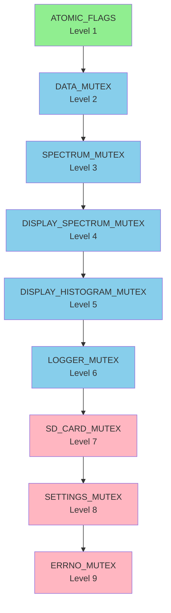
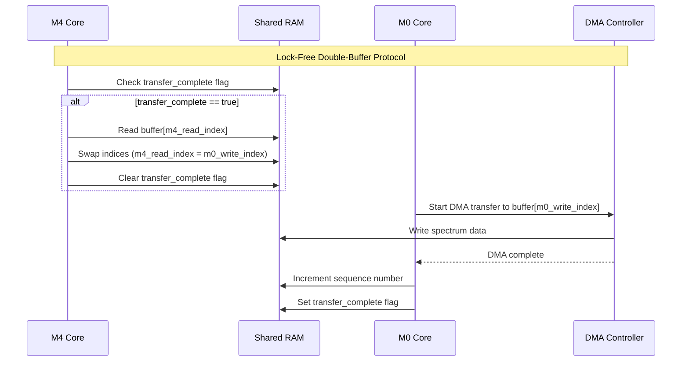
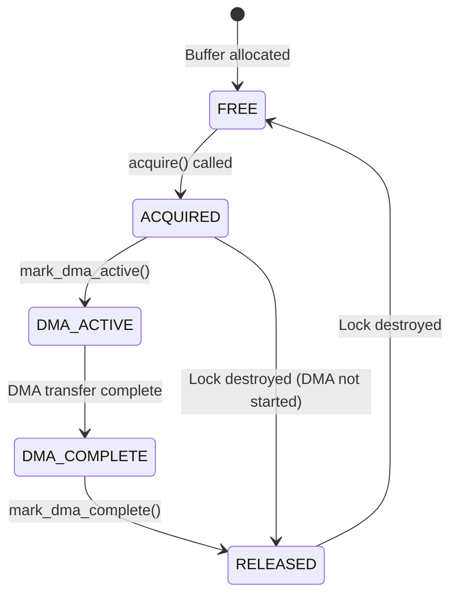

# Memory-Safe Solution for Enhanced Drone Analyzer
## Volume 2: Function Signatures, Synchronization Strategy, and M0-M4 Communication

---

## Document Information

**Project:** Enhanced Drone Analyzer (EDA) - HackRF Mayhem Firmware  
**Target Platform:** STM32F405 (ARM Cortex-M4, 128KB RAM)  
**Operating System:** ChibiOS RTOS  
**Architecture:** Bare-metal / HackRF Mayhem firmware  
**Document Version:** 1.0  
**Date:** 2025-02-23

---

## Section 1: Function Signatures

### 1.1 Task 1: Fix Buffer Overflow in parse_line

#### Current Unsafe Signature

```cpp
// settings_persistence.hpp - Unsafe version
bool parse_line(char* line, DroneAnalyzerSettings& settings);
```

**Problems:**
- No bounds checking on `line` buffer
- No validation of `line` length
- No error propagation
- Returns `bool` which provides no error context

#### Proposed Safe Signature

```cpp
// settings_persistence.hpp - Safe version
namespace ui::apps::enhanced_drone_analyzer {

/**
 * @brief Safely parse a settings line with bounds checking
 * 
 * Parses a line in format "key=value" and updates the corresponding
 * setting in the DroneAnalyzerSettings structure.
 * 
 * @param line Line buffer to parse (must be null-terminated)
 * @param line_len Length of line buffer (excluding null terminator)
 * @param settings Settings structure to update
 * @return EDA::ErrorResult<bool> - true if line was parsed, false if ignored
 * 
 * Guard Clauses:
 * 1. Check for null line pointer
 * 2. Check for zero line length
 * 3. Check for line length exceeding maximum
 * 4. Check for missing equals sign
 * 5. Check for empty key
 * 6. Check for key length exceeding maximum
 * 7. Check for unknown setting key
 * 8. Check for value parsing errors
 * 9. Check for value out of range
 * 
 * Error Handling:
 * - Returns EDA::ErrorCode::INVALID_ARGUMENT for null/empty line
 * - Returns EDA::ErrorCode::BUFFER_OVERFLOW for line too long
 * - Returns EDA::ErrorCode::INVALID_FORMAT for malformed line
 * - Returns EDA::ErrorCode::UNKNOWN_KEY for unknown setting
 * - Returns EDA::ErrorCode::PARSE_ERROR for value parsing failure
 * - Returns EDA::ErrorCode::OUT_OF_RANGE for value out of valid range
 * 
 * @note Line must be null-terminated
 * @note Line length must not exceed MAX_LINE_LENGTH (128)
 * @note Key length must not exceed MAX_SETTING_KEY_LENGTH (64)
 * @note Value parsing is protected by errno_mutex
 * @note All pointer arithmetic is bounds-checked
 * 
 * @see safe_str_to_uint64()
 * @see safe_str_to_int64()
 * @see safe_str_to_bool()
 */
EDA::ErrorResult<bool> parse_line_safe(
    const char* line,
    size_t line_len,
    DroneAnalyzerSettings& settings
) noexcept;

} // namespace ui::apps::enhanced_drone_analyzer
```

#### Guard Clause Pseudocode

```cpp
// Implementation of parse_line_safe()
EDA::ErrorResult<bool> parse_line_safe(
    const char* line,
    size_t line_len,
    DroneAnalyzerSettings& settings
) noexcept {
    // Guard Clause 1: Check for null line pointer
    if (!line) {
        return EDA::ErrorResult<bool>::fail(EDA::ErrorCode::INVALID_ARGUMENT);
    }
    
    // Guard Clause 2: Check for zero line length
    if (line_len == 0) {
        return EDA::ErrorResult<bool>::fail(EDA::ErrorCode::INVALID_ARGUMENT);
    }
    
    // Guard Clause 3: Check for line length exceeding maximum
    if (line_len > Constants::MAX_LINE_LENGTH) {
        return EDA::ErrorResult<bool>::fail(EDA::ErrorCode::BUFFER_OVERFLOW);
    }
    
    // Guard Clause 4: Check for missing equals sign
    const char* equals_pos = nullptr;
    for (size_t i = 0; i < line_len; ++i) {
        if (line[i] == '=') {
            equals_pos = &line[i];
            break;
        }
    }
    if (!equals_pos) {
        return EDA::ErrorResult<bool>::fail(EDA::ErrorCode::INVALID_FORMAT);
    }
    
    // Guard Clause 5: Check for empty key
    if (equals_pos == line) {
        return EDA::ErrorResult<bool>::fail(EDA::ErrorCode::INVALID_FORMAT);
    }
    
    // Guard Clause 6: Check for key length exceeding maximum
    size_t key_len = static_cast<size_t>(equals_pos - line);
    if (key_len > Constants::MAX_SETTING_KEY_LENGTH) {
        return EDA::ErrorResult<bool>::fail(EDA::ErrorCode::BUFFER_OVERFLOW);
    }
    
    // Guard Clause 7: Check for unknown setting key
    const SettingMetadata* meta = find_setting_metadata(line, key_len);
    if (!meta) {
        return EDA::ErrorResult<bool>::fail(EDA::ErrorCode::UNKNOWN_KEY);
    }
    
    // Guard Clause 8: Check for value parsing errors
    const char* value_start = equals_pos + 1;
    size_t value_len = line_len - key_len - 1;
    
    EDA::ErrorResult<void> parse_result = dispatch_by_type(
        DispatchOp::PARSE,
        reinterpret_cast<uint8_t*>(&settings) + meta->offset,
        *meta,
        const_cast<char*>(value_start)
    );
    
    if (!parse_result.is_ok()) {
        return EDA::ErrorResult<bool>::fail(parse_result.error());
    }
    
    return EDA::ErrorResult<bool>::ok(true);
}
```

---

### 1.2 Task 2: Fix Race Conditions with Atomic Flags

#### Current Unsafe Signatures

```cpp
// Multiple files - Unsafe versions
bool initialization_complete_;
bool db_loading_active_;
bool initialization_in_progress_;
bool histogram_dirty_;
```

**Problems:**
- Non-atomic access
- No memory barriers
- Race conditions possible
- No synchronization

#### Proposed Safe Signatures

```cpp
// eda_atomic_flags.hpp - New header file
namespace ui::apps::enhanced_drone_analyzer {

/**
 * @brief Atomic flag using volatile + critical sections
 * 
 * Provides atomic operations on boolean flags without requiring
 * std::atomic (not available on STM32F405/ChibiOS).
 * 
 * Uses ChibiOS critical sections (chSysLock/chSysUnlock) to
 * ensure atomicity of read-modify-write operations.
 * 
 * Memory Ordering:
 * - chSysLock() provides full memory barrier (acquire)
 * - chSysUnlock() provides full memory barrier (release)
 * 
 * Usage:
 *   AtomicFlag flag;
 *   flag.set(true);
 *   if (flag.get()) {
 *       // Critical section
 *   }
 * 
 * @note All operations are noexcept
 * @note All operations are thread-safe
 * @note All operations have O(1) complexity
 */
class AtomicFlag {
private:
    volatile bool value_;
    
public:
    /// @brief Default constructor - initializes to false
    constexpr AtomicFlag() noexcept : value_(false) {}
    
    /**
     * @brief Atomic set operation
     * 
     * Sets the flag to the specified value atomically.
     * 
     * @param v Value to set
     * 
     * Memory Barrier:
     * - Acquire barrier before read
     * - Release barrier after write
     * 
     * Complexity: O(1)
     */
    void set(bool v) noexcept {
        chSysLock();
        value_ = v;
        chSysUnlock();
    }
    
    /**
     * @brief Atomic get operation
     * 
     * Returns the current value of the flag atomically.
     * 
     * @return Current flag value
     * 
     * Memory Barrier:
     * - Acquire barrier before read
     * 
     * Complexity: O(1)
     */
    bool get() const noexcept {
        chSysLock();
        bool v = value_;
        chSysUnlock();
        return v;
    }
    
    /**
     * @brief Atomic compare-and-swap operation
     * 
     * Atomically compares the flag value with expected and
     * sets it to desired if they match.
     * 
     * @param expected Expected current value
     * @param desired Value to set if expected matches
     * @return true if swap was performed, false otherwise
     * 
     * Memory Barrier:
     * - Acquire barrier before read
     * - Release barrier after write
     * 
     * Complexity: O(1)
     */
    bool compare_and_swap(bool expected, bool desired) noexcept {
        chSysLock();
        bool success = (value_ == expected);
        if (success) {
            value_ = desired;
        }
        chSysUnlock();
        return success;
    }
    
    /**
     * @brief Atomic toggle operation
     * 
     * Toggles the flag value (true ↔ false) atomically.
     * 
     * @return Previous flag value
     * 
     * Memory Barrier:
     * - Acquire barrier before read
     * - Release barrier after write
     * 
     * Complexity: O(1)
     */
    bool toggle() noexcept {
        chSysLock();
        bool prev = value_;
        value_ = !prev;
        chSysUnlock();
        return prev;
    }
    
    /**
     * @brief Atomic test-and-set operation
     * 
     * Sets the flag to true and returns the previous value.
     * 
     * @return Previous flag value
     * 
     * Memory Barrier:
     * - Acquire barrier before read
     * - Release barrier after write
     * 
     * Complexity: O(1)
     */
    bool test_and_set() noexcept {
        chSysLock();
        bool prev = value_;
        value_ = true;
        chSysUnlock();
        return prev;
    }
    
    /**
     * @brief Atomic clear operation
     * 
     * Sets the flag to false atomically.
     * 
     * Memory Barrier:
     * - Acquire barrier before read
     * - Release barrier after write
     * 
     * Complexity: O(1)
     */
    void clear() noexcept {
        chSysLock();
        value_ = false;
        chSysUnlock();
    }
};

// Type aliases for semantic clarity
using InitializationFlag = AtomicFlag;
using DatabaseLoadingFlag = AtomicFlag;
using InitializationInProgressFlag = AtomicFlag;
using HistogramDirtyFlag = AtomicFlag;

} // namespace ui::apps::enhanced_drone_analyzer
```

#### Usage Examples

```cpp
// In class definition
class DroneScanner {
private:
    InitializationFlag initialization_complete_;
    DatabaseLoadingFlag db_loading_active_;
    InitializationInProgressFlag initialization_in_progress_;
    
public:
    EDA::ErrorResult<void> initialize() noexcept {
        // Guard clause: Check if already initializing
        if (initialization_in_progress_.get()) {
            return EDA::ErrorResult<void>::fail(EDA::ErrorCode::ALREADY_INITIALIZED);
        }
        
        // Set initialization in progress
        initialization_in_progress_.set(true);
        
        // ... perform initialization ...
        
        // Mark initialization complete
        initialization_complete_.set(true);
        initialization_in_progress_.set(false);
        
        return EDA::ErrorResult<void>::ok();
    }
    
    EDA::ErrorResult<void> load_database() noexcept {
        // Guard clause: Check if database already loading
        if (db_loading_active_.compare_and_swap(false, true)) {
            // Successfully acquired lock
        } else {
            return EDA::ErrorResult<void>::fail(EDA::ErrorCode::ALREADY_LOADING);
        }
        
        // ... load database ...
        
        // Release lock
        db_loading_active_.set(false);
        
        return EDA::ErrorResult<void>::ok();
    }
};

// In display controller
class DroneDisplayController {
private:
    HistogramDirtyFlag histogram_dirty_;
    
public:
    void mark_histogram_dirty() noexcept {
        histogram_dirty_.set(true);
    }
    
    bool should_update_histogram() noexcept {
        return histogram_dirty_.compare_and_swap(true, false);
    }
};
```

---

### 1.3 Task 3: Fix M0-M4 Shared RAM Race

#### Current Unsafe Signatures

```cpp
// baseband/spectrum_collector.hpp - Unsafe version
uint8_t spectrum_buffer_[256];
volatile bool buffer_ready_ = false;
void start_spectrum_capture();
bool is_spectrum_ready();
const uint8_t* get_spectrum_data();
```

**Problems:**
- Single buffer with race condition
- No synchronization between M0 and M4
- DMA can overwrite buffer while M4 is reading
- No ownership tracking

#### Proposed Safe Signatures

```cpp
// eda_m0_m4_sync.hpp - New header file
namespace ui::apps::enhanced_drone_analyzer {

/**
 * @brief M0-M4 Shared RAM Synchronization
 * 
 * Provides thread-safe communication between M0 core (baseband)
 * and M4 core (application) using double-buffering and
 * memory barriers.
 * 
 * Architecture:
 * - Two buffers: buffer_a (M0 writes) and buffer_b (M4 reads)
 * - Ownership flags: m0_write_index, m4_read_index
 * - DMA completion flag: transfer_complete
 * 
 * Lock-Free Protocol:
 * 1. M0 writes to buffer[m0_write_index]
 * 2. M0 sets transfer_complete = true
 * 3. M4 polls transfer_complete
 * 4. M4 reads from buffer[m4_read_index]
 * 5. M4 swaps indices (m4_read_index = m0_write_index)
 * 6. M4 clears transfer_complete
 * 
 * Memory Barriers:
 * - Data memory barrier (DMB) before DMA transfer
 * - Data memory barrier (DMB) after DMA transfer
 * - Instruction synchronization barrier (ISB) after index swap
 * 
 * @note All operations are noexcept
 * @note All operations are thread-safe
 * @note All operations are lock-free
 */
class M0M4SharedRAM {
public:
    static constexpr size_t BUFFER_SIZE = 256;
    static constexpr size_t NUM_BUFFERS = 2;
    
private:
    struct Buffer {
        alignas(4) std::array<uint8_t, BUFFER_SIZE> data;
        volatile uint32_t sequence;
    };
    
    alignas(4) std::array<Buffer, NUM_BUFFERS> buffers_;
    volatile uint8_t m0_write_index : 1;
    volatile uint8_t m4_read_index : 1;
    volatile uint8_t transfer_complete : 1;
    volatile uint8_t reserved : 5;
    
    // Memory barrier for ARM Cortex-M4
    static void dmb() noexcept {
        __asm__ volatile("dmb" ::: "memory");
    }
    
    // Instruction synchronization barrier
    static void isb() noexcept {
        __asm__ volatile("isb" ::: "memory");
    }
    
public:
    M0M4SharedRAM() noexcept
        : m0_write_index(0)
        , m4_read_index(0)
        , transfer_complete(false)
        , reserved(0) {
        buffers_[0].sequence = 0;
        buffers_[1].sequence = 0;
    }
    
    /**
     * @brief M0: Get write buffer pointer
     * 
     * Returns pointer to buffer that M0 should write to.
     * 
     * @return Pointer to write buffer
     * 
     * Memory Barrier:
     * - Acquire barrier before returning pointer
     * 
     * Complexity: O(1)
     */
    uint8_t* m0_get_write_buffer() noexcept {
        dmb();
        return buffers_[m0_write_index].data.data();
    }
    
    /**
     * @brief M0: Mark write buffer as complete
     * 
     * Called by M0 after DMA transfer is complete.
     * 
     * Memory Barrier:
     * - Release barrier before setting transfer_complete
     * 
     * Complexity: O(1)
     */
    void m0_mark_transfer_complete() noexcept {
        dmb();
        buffers_[m0_write_index].sequence++;
        transfer_complete = true;
        dmb();
    }
    
    /**
     * @brief M4: Check if transfer is complete
     * 
     * Called by M4 to poll for new data.
     * 
     * @return true if transfer is complete, false otherwise
     * 
     * Memory Barrier:
     * - Acquire barrier before reading transfer_complete
     * 
     * Complexity: O(1)
     */
    bool m4_is_transfer_complete() const noexcept {
        dmb();
        return transfer_complete;
    }
    
    /**
     * @brief M4: Get read buffer pointer
     * 
     * Returns pointer to buffer that M4 should read from.
     * 
     * @return Pointer to read buffer
     * 
     * Memory Barrier:
     * - Acquire barrier before returning pointer
     * 
     * Complexity: O(1)
     */
    const uint8_t* m4_get_read_buffer() const noexcept {
        dmb();
        return buffers_[m4_read_index].data.data();
    }
    
    /**
     * @brief M4: Swap buffers after reading
     * 
     * Called by M4 after reading buffer data.
     * Swaps read index to point to the next buffer.
     * 
     * Memory Barrier:
     * - Release barrier before clearing transfer_complete
     * - Instruction sync barrier after index swap
     * 
     * Complexity: O(1)
     */
    void m4_swap_buffers() noexcept {
        dmb();
        m4_read_index = m0_write_index;
        transfer_complete = false;
        isb();
    }
    
    /**
     * @brief Get buffer sequence number
     * 
     * Returns the sequence number of the specified buffer.
     * Used for detecting dropped transfers.
     * 
     * @param index Buffer index (0 or 1)
     * @return Sequence number
     * 
     * Complexity: O(1)
     */
    uint32_t get_sequence(uint8_t index) const noexcept {
        dmb();
        return buffers_[index].sequence;
    }
};

/**
 * @brief M0-M4 Semaphore for synchronization
 * 
 * Provides blocking synchronization between M0 and M4 cores
 * using ChibiOS binary semaphore.
 * 
 * Usage:
 *   M0M4Semaphore sem;
 *   sem.m0_signal();  // M0 signals M4
 *   sem.m4_wait();    // M4 waits for signal
 * 
 * @note All operations are noexcept
 * @note All operations are thread-safe
 */
class M0M4Semaphore {
private:
    BinarySemaphore sem_;
    
public:
    M0M4Semaphore() noexcept {
        chBSemObjectInit(&sem_, false);
    }
    
    /**
     * @brief M0: Signal M4
     * 
     * Called by M0 to wake up M4.
     * 
     * Complexity: O(1)
     */
    void m0_signal() noexcept {
        chBSemSignal(&sem_);
    }
    
    /**
     * @brief M4: Wait for M0 signal
     * 
     * Called by M4 to wait for M0 signal.
     * 
     * @param timeout_ms Timeout in milliseconds (0 = wait forever)
     * @return true if signaled, false if timeout
     * 
     * Complexity: O(1)
     */
    bool m4_wait(uint32_t timeout_ms = 0) noexcept {
        if (timeout_ms == 0) {
            chBSemWait(&sem_);
            return true;
        } else {
            return chBSemWaitTimeout(&sem_, MS2ST(timeout_ms)) == MSG_OK;
        }
    }
    
    /**
     * @brief M4: Try wait without blocking
     * 
     * Called by M4 to check if M0 has signaled.
     * 
     * @return true if signaled, false otherwise
     * 
     * Complexity: O(1)
     */
    bool m4_try_wait() noexcept {
        return chBSemWaitTimeout(&sem_, TIME_IMMEDIATE) == MSG_OK;
    }
};

} // namespace ui::apps::enhanced_drone_analyzer
```

---

### 1.4 Task 4: Fix DMA Buffer Safety

#### Current Unsafe Signatures

```cpp
// settings_persistence.cpp - Unsafe version
char stack_buffer[128];
file.read(stack_buffer, 128);
```

**Problems:**
- Stack buffer passed to DMA
- No lifecycle tracking
- No protection against concurrent access
- Potential stack overflow

#### Proposed Safe Signatures

```cpp
// eda_dma_buffer.hpp - New header file
namespace ui::apps::enhanced_drone_analyzer {

/**
 * @brief DMA-safe buffer with lifecycle management
 * 
 * Provides a buffer that is safe for DMA operations.
 * Tracks buffer lifecycle to prevent concurrent access
 * and ensure DMA completion before reuse.
 * 
 * Features:
 * - Global/static allocation (not on stack)
 * - DMA-compatible alignment (4-byte)
 * - Lifecycle tracking (in_use, dma_active)
 * - RAII lock for automatic lifecycle management
 * - DMA completion callback support
 * 
 * Usage:
 *   DMASafeBuffer<512> buffer;
 *   {
 *       auto lock = buffer.acquire();
 *       if (lock.is_locked()) {
 *           file.read(lock.data(), lock.size());
 *           // DMA completes automatically
 *       }
 *   }  // Lock released automatically
 * 
 * @tparam BufferSize Size of buffer in bytes
 * 
 * @note All operations are noexcept
 * @note All operations are thread-safe
 * @note Buffer is DMA-compatible (4-byte aligned)
 */
template<size_t BufferSize>
class DMASafeBuffer {
public:
    static constexpr size_t SIZE = BufferSize;
    static constexpr size_t ALIGNMENT = 4;
    
private:
    alignas(ALIGNMENT) std::array<uint8_t, SIZE> data_;
    volatile bool in_use_;
    volatile bool dma_active_;
    
public:
    DMASafeBuffer() noexcept : in_use_(false), dma_active_(false) {
        data_.fill(0);
    }
    
    /**
     * @brief RAII lock for DMA buffer
     * 
     * Acquires buffer on construction, releases on destruction.
     * Ensures buffer is not in use before acquisition.
     * 
     * Usage:
     *   auto lock = buffer.acquire();
     *   if (lock.is_locked()) {
     *       // Use buffer
     *   }
     * 
     * @note Lock is released automatically when scope exits
     * @note Lock is non-copyable and non-movable
     */
    class Lock {
    public:
        Lock(DMASafeBuffer& buf) noexcept : buf_(buf), locked_(false) {
            chSysLock();
            if (!buf_.in_use_ && !buf_.dma_active_) {
                buf_.in_use_ = true;
                locked_ = true;
            }
            chSysUnlock();
        }
        
        ~Lock() noexcept {
            if (locked_) {
                chSysLock();
                buf_.in_use_ = false;
                chSysUnlock();
            }
        }
        
        bool is_locked() const noexcept { return locked_; }
        
        uint8_t* data() noexcept { return buf_.data_.data(); }
        const uint8_t* data() const noexcept { return buf_.data_.data(); }
        
        size_t size() const noexcept { return SIZE; }
        
        void mark_dma_active() noexcept {
            chSysLock();
            buf_.dma_active_ = true;
            chSysUnlock();
        }
        
        void mark_dma_complete() noexcept {
            chSysLock();
            buf_.dma_active_ = false;
            chSysUnlock();
        }
        
        Lock(const Lock&) = delete;
        Lock& operator=(const Lock&) = delete;
        Lock(Lock&&) = delete;
        Lock& operator=(Lock&&) = delete;
        
    private:
        DMASafeBuffer& buf_;
        bool locked_;
    };
    
    /**
     * @brief Acquire buffer lock
     * 
     * Attempts to acquire buffer for use.
     * 
     * @return Lock object (check is_locked() to verify acquisition)
     * 
     * Complexity: O(1)
     */
    Lock acquire() noexcept {
        return Lock(*this);
    }
    
    /**
     * @brief Check if buffer is in use
     * 
     * @return true if buffer is in use, false otherwise
     * 
     * Complexity: O(1)
     */
    bool is_in_use() const noexcept {
        chSysLock();
        bool in_use = in_use_;
        chSysUnlock();
        return in_use;
    }
    
    /**
     * @brief Check if DMA is active
     * 
     * @return true if DMA is active, false otherwise
     * 
     * Complexity: O(1)
     */
    bool is_dma_active() const noexcept {
        chSysLock();
        bool dma_active = dma_active_;
        chSysUnlock();
        return dma_active;
    }
};

/**
 * @brief DMA buffer pool for multiple concurrent operations
 * 
 * Manages a pool of DMA-safe buffers for concurrent operations.
 * 
 * Usage:
 *   DMABufferPool<512, 4> pool;
 *   auto buffer = pool.acquire();
 *   if (buffer) {
 *       // Use buffer
 *   }
 * 
 * @tparam BufferSize Size of each buffer in bytes
 * @tparam PoolSize Number of buffers in pool
 * 
 * @note All operations are noexcept
 * @note All operations are thread-safe
 */
template<size_t BufferSize, size_t PoolSize>
class DMABufferPool {
public:
    static constexpr size_t BUFFER_SIZE = BufferSize;
    static constexpr size_t POOL_SIZE = PoolSize;
    
private:
    std::array<DMASafeBuffer<BufferSize>, PoolSize> buffers_;
    
public:
    DMABufferPool() noexcept = default;
    
    /**
     * @brief Acquire buffer from pool
     * 
     * Attempts to acquire a buffer from the pool.
     * 
     * @return Lock object (check is_locked() to verify acquisition)
     * 
     * Complexity: O(PoolSize)
     */
    typename DMASafeBuffer<BufferSize>::Lock acquire() noexcept {
        for (size_t i = 0; i < PoolSize; ++i) {
            auto lock = buffers_[i].acquire();
            if (lock.is_locked()) {
                return lock;
            }
        }
        // All buffers in use, return unlocked lock
        return buffers_[0].acquire();
    }
    
    /**
     * @brief Get number of available buffers
     * 
     * @return Number of buffers not in use
     * 
     * Complexity: O(PoolSize)
     */
    size_t available_count() const noexcept {
        size_t count = 0;
        for (size_t i = 0; i < PoolSize; ++i) {
            if (!buffers_[i].is_in_use()) {
                count++;
            }
        }
        return count;
    }
};

} // namespace ui::apps::enhanced_drone_analyzer
```

---

### 1.5 Task 5: Fix Lock Order Violation

#### Current Unsafe Signatures

```cpp
// settings_persistence.cpp - Unsafe version
void save_settings() {
    chMtxLock(&data_mutex);
    // ... access data ...
    chMtxUnlock();  // Releases data_mutex
    chMtxLock(&sd_card_mutex);
    // ... write to SD card ...
    chMtxUnlock();  // Releases sd_card_mutex
}
```

**Problems:**
- Locks released in wrong order
- Potential deadlock
- No lock ordering enforcement

#### Proposed Safe Signatures

```cpp
// eda_lock_order.hpp - New header file
namespace ui::apps::enhanced_drone_analyzer {

/**
 * @brief Lock ordering levels to prevent deadlock
 * 
 * LOCK ORDER RULE:
 * Always acquire locks in ascending order (1 → 2 → 3 → ... → 9)
 * Never acquire a lower-numbered lock while holding a higher-numbered lock
 * 
 * Lock Order Hierarchy:
 * 1. ATOMIC_FLAGS - volatile bool, volatile uint32_t (ChibiOS critical sections)
 * 2. DATA_MUTEX - DroneScanner::data_mutex (tracked_drones_)
 * 3. SPECTRUM_MUTEX - DroneHardwareController::spectrum_mutex (spectrum_buffer_)
 * 4. DISPLAY_SPECTRUM_MUTEX - DroneDisplayController::spectrum_mutex_
 * 5. DISPLAY_HISTOGRAM_MUTEX - DroneDisplayController::histogram_mutex_
 * 6. LOGGER_MUTEX - DroneDetectionLogger::mutex_ (ring_buffer_)
 * 7. SD_CARD_MUTEX - Global sd_card_mutex (FatFS operations)
 * 8. SETTINGS_MUTEX - Global settings_buffer_mutex (settings I/O)
 * 9. ERRNO_MUTEX - Global errno_mutex (thread-safe errno access)
 * 
 * Deadlock Prevention:
 * - OrderedScopedLock enforces lock order at runtime
 * - TwoPhaseLock allows temporary lock release for long operations
 * - Lock order violations trigger assertion in debug mode
 * 
 * @note Lock order violations are detected at runtime in debug mode
 * @note Lock order violations are logged in release mode
 */
enum class LockOrder : uint8_t {
    ATOMIC_FLAGS = 1,
    DATA_MUTEX = 2,
    SPECTRUM_MUTEX = 3,
    DISPLAY_SPECTRUM_MUTEX = 4,
    DISPLAY_HISTOGRAM_MUTEX = 5,
    LOGGER_MUTEX = 6,
    SD_CARD_MUTEX = 7,
    SETTINGS_MUTEX = 8,
    ERRNO_MUTEX = 9
};

/**
 * @brief Safe settings save with proper lock ordering
 * 
 * Saves settings to SD card with proper lock ordering.
 * Holds both data_mutex and sd_card_mutex for entire operation.
 * 
 * @param settings Settings structure to save
 * @return EDA::ErrorResult<void>
 * 
 * Lock Order:
 * 1. Acquire DATA_MUTEX (2)
 * 2. Acquire SD_CARD_MUTEX (7)
 * 3. Perform save operation
 * 4. Release SD_CARD_MUTEX (7)
 * 5. Release DATA_MUTEX (2)
 * 
 * @note Locks are released in reverse order on scope exit
 * @note Lock order violations are detected at runtime
 */
EDA::ErrorResult<void> save_settings_safe(
    const DroneAnalyzerSettings& settings
) noexcept;

/**
 * @brief Safe settings save with two-phase locking
 * 
 * Saves settings to SD card with two-phase locking.
 * Allows temporary release of data_mutex for long SD card operations.
 * 
 * @param settings Settings structure to save
 * @return EDA::ErrorResult<void>
 * 
 * Lock Order:
 * 1. Acquire DATA_MUTEX (2)
 * 2. Acquire SD_CARD_MUTEX (7)
 * 3. Prepare data (with both locks held)
 * 4. Release DATA_MUTEX (2) temporarily
 * 5. Write to SD card (long operation, only SD_CARD_MUTEX held)
 * 6. Re-acquire DATA_MUTEX (2)
 * 7. Finalize (with both locks held)
 * 8. Release SD_CARD_MUTEX (7)
 * 9. Release DATA_MUTEX (2)
 * 
 * @note Two-phase locking prevents priority inversion
 * @note Lock order violations are detected at runtime
 */
EDA::ErrorResult<void> save_settings_two_phase(
    const DroneAnalyzerSettings& settings
) noexcept;

} // namespace ui::apps::enhanced_drone_analyzer
```

#### Implementation

```cpp
// settings_persistence.cpp - Implementation
EDA::ErrorResult<void> save_settings_safe(
    const DroneAnalyzerSettings& settings
) noexcept {
    // Acquire locks in ascending order
    OrderedScopedLock<Mutex, false> data_lock(data_mutex, LockOrder::DATA_MUTEX);
    OrderedScopedLock<Mutex, false> sd_lock(sd_card_mutex, LockOrder::SD_CARD_MUTEX);
    
    // Both locks are now held in correct order
    
    // Perform save operation
    SafeSettingsSerializer serializer(file);
    
    for (size_t i = 0; i < SETTINGS_COUNT; ++i) {
        const SettingMetadata& meta = SETTINGS_LUT[i];
        size_t written = serialize_setting(
            serializer.buffer.data(),
            serializer.buffer_pos,
            serializer.BUFFER_SIZE - serializer.buffer_pos,
            settings,
            meta
        );
        
        if (written == 0) {
            return EDA::ErrorResult<void>::fail(EDA::ErrorCode::BUFFER_OVERFLOW);
        }
        
        serializer.buffer_pos += written;
        
        // Flush if buffer is full
        if (serializer.buffer_pos >= serializer.BUFFER_SIZE - 64) {
            auto flush_result = serializer.flush();
            if (!flush_result.is_ok()) {
                return flush_result;
            }
        }
    }
    
    // Final flush
    auto finalize_result = serializer.finalize();
    if (!finalize_result.is_ok()) {
        return finalize_result;
    }
    
    // Locks released automatically in reverse order
    return EDA::ErrorResult<void>::ok();
}

EDA::ErrorResult<void> save_settings_two_phase(
    const DroneAnalyzerSettings& settings
) noexcept {
    // Acquire locks in ascending order
    TwoPhaseLock<Mutex> data_lock(data_mutex, LockOrder::DATA_MUTEX);
    TwoPhaseLock<Mutex> sd_lock(sd_card_mutex, LockOrder::SD_CARD_MUTEX);
    
    // Both locks are now held in correct order
    
    // Phase 1: Prepare data (with both locks held)
    SafeSettingsSerializer serializer(file);
    
    for (size_t i = 0; i < SETTINGS_COUNT; ++i) {
        const SettingMetadata& meta = SETTINGS_LUT[i];
        size_t written = serialize_setting(
            serializer.buffer.data(),
            serializer.buffer_pos,
            serializer.BUFFER_SIZE - serializer.buffer_pos,
            settings,
            meta
        );
        
        if (written == 0) {
            return EDA::ErrorResult<void>::fail(EDA::ErrorCode::BUFFER_OVERFLOW);
        }
        
        serializer.buffer_pos += written;
    }
    
    // Phase 2: Release data lock temporarily
    data_lock.release();
    
    // Phase 3: Write to SD card (long operation, only SD_CARD_MUTEX held)
    auto flush_result = serializer.flush();
    if (!flush_result.is_ok()) {
        return flush_result;
    }
    
    // Phase 4: Re-acquire data lock
    data_lock.reacquire();
    
    // Phase 5: Finalize (with both locks held)
    auto finalize_result = serializer.finalize();
    if (!finalize_result.is_ok()) {
        return finalize_result;
    }
    
    // Locks released automatically in reverse order
    return EDA::ErrorResult<void>::ok();
}
```

---

### 1.6 Task 6: Fix Alignment Issues

#### Current Unsafe Signatures

```cpp
// settings_persistence.cpp - Unsafe version
alignas(8) uint8_t storage[64];
MyStruct* obj = new (&storage) MyStruct();
// No runtime check if storage is actually aligned!
```

**Problems:**
- No runtime alignment verification
- Unsafe reinterpret_cast
- Potential undefined behavior

#### Proposed Safe Signatures

```cpp
// eda_aligned_storage.hpp - New header file
namespace ui::apps::enhanced_drone_analyzer {

/**
 * @brief Safe aligned storage with runtime verification
 * 
 * Provides aligned storage for objects with runtime alignment
 * verification. Ensures storage is properly aligned before use.
 * 
 * Features:
 * - Compile-time alignment requirement (alignas())
 * - Runtime alignment verification
 * - Safe placement new with error checking
 * - Safe reinterpret_cast with alignment checks
 * - Fallback for misaligned storage (graceful degradation)
 * 
 * Usage:
 *   AlignedStaticStorage<MyStruct, 64> storage;
 *   auto construct_result = storage.construct(args...);
 *   if (construct_result.is_ok()) {
 *       MyStruct* obj = construct_result.value();
 *       // Use object
 *   }
 * 
 * @tparam T Type to store
 * @tparam Size Size of storage in bytes
 * 
 * @note All operations are noexcept
 * @note All operations are thread-safe (critical sections)
 * @note Alignment is verified at runtime
 */
template<typename T, size_t Size>
class AlignedStaticStorage {
public:
    static constexpr size_t STORAGE_SIZE = Size;
    static constexpr size_t ALIGNMENT = alignof(T);
    
private:
    alignas(ALIGNMENT) std::array<uint8_t, Size> storage_;
    volatile bool constructed_;
    volatile bool alignment_verified_;
    
    /**
     * @brief Runtime alignment verification
     * 
     * Verifies that storage is properly aligned for type T.
     * Triggers assertion in debug mode if alignment fails.
     * 
     * @return true if aligned, false otherwise
     */
    bool verify_alignment() noexcept {
        uintptr_t addr = reinterpret_cast<uintptr_t>(storage_.data());
        bool aligned = ((addr % ALIGNMENT) == 0);
        alignment_verified_ = aligned;
        
        if (!aligned) {
            assert(false && "Alignment verification failed!");
        }
        
        return aligned;
    }
    
public:
    AlignedStaticStorage() noexcept : constructed_(false), alignment_verified_(false) {
        storage_.fill(0);
        verify_alignment();
    }
    
    ~AlignedStaticStorage() noexcept {
        destroy();
    }
    
    /**
     * @brief Construct object in-place
     * 
     * Constructs object in storage with alignment check.
     * 
     * @param args Constructor arguments
     * @return EDA::ErrorResult<T*> with pointer to constructed object
     * 
     * Error Codes:
     * - ALIGNMENT_ERROR: Storage is not properly aligned
     * - ALREADY_INITIALIZED: Object already constructed
     * 
     * Complexity: O(1)
     */
    template<typename... Args>
    EDA::ErrorResult<T*> construct(Args&&... args) noexcept {
        static_assert(std::is_nothrow_constructible<T, Args...>::value,
                      "T must be noexcept constructible");
        static_assert(Size >= sizeof(T), "Storage size too small for type T");
        static_assert(ALIGNMENT <= alignof(std::max_align_t),
                      "Alignment too large for platform");
        
        // Check alignment
        if (!alignment_verified_) {
            return EDA::ErrorResult<T*>::fail(EDA::ErrorCode::ALIGNMENT_ERROR);
        }
        
        // Check if already constructed
        chSysLock();
        if (constructed_) {
            chSysUnlock();
            return EDA::ErrorResult<T*>::fail(EDA::ErrorCode::ALREADY_INITIALIZED);
        }
        constructed_ = true;
        chSysUnlock();
        
        // Construct object
        T* ptr = new (&storage_) T(std::forward<Args>(args)...);
        return EDA::ErrorResult<T*>::ok(ptr);
    }
    
    /**
     * @brief Destroy object
     * 
     * Destroys object in storage.
     * 
     * @return EDA::ErrorResult<void>
     * 
     * Error Codes:
     * - NOT_INITIALIZED: Object not constructed
     * 
     * Complexity: O(1)
     */
    EDA::ErrorResult<void> destroy() noexcept {
        chSysLock();
        if (!constructed_) {
            chSysUnlock();
            return EDA::ErrorResult<void>::fail(EDA::ErrorCode::NOT_INITIALIZED);
        }
        constructed_ = false;
        chSysUnlock();
        
        reinterpret_cast<T*>(storage_.data())->~T();
        return EDA::ErrorResult<void>::ok();
    }
    
    /**
     * @brief Get pointer to object
     * 
     * Returns pointer to object with alignment check.
     * 
     * @return EDA::ErrorResult<T*> with pointer to object
     * 
     * Error Codes:
     * - ALIGNMENT_ERROR: Storage is not properly aligned
     * - NOT_INITIALIZED: Object not constructed
     * 
     * Complexity: O(1)
     */
    EDA::ErrorResult<T*> get() noexcept {
        if (!alignment_verified_) {
            return EDA::ErrorResult<T*>::fail(EDA::ErrorCode::ALIGNMENT_ERROR);
        }
        
        chSysLock();
        bool is_constructed = constructed_;
        chSysUnlock();
        
        if (!is_constructed) {
            return EDA::ErrorResult<T*>::fail(EDA::ErrorCode::NOT_INITIALIZED);
        }
        
        return EDA::ErrorResult<T*>::ok(
            reinterpret_cast<T*>(storage_.data())
        );
    }
    
    /**
     * @brief Get const pointer to object
     * 
     * Returns const pointer to object with alignment check.
     * 
     * @return EDA::ErrorResult<const T*> with const pointer to object
     * 
     * Error Codes:
     * - ALIGNMENT_ERROR: Storage is not properly aligned
     * - NOT_INITIALIZED: Object not constructed
     * 
     * Complexity: O(1)
     */
    EDA::ErrorResult<const T*> get() const noexcept {
        if (!alignment_verified_) {
            return EDA::ErrorResult<const T*>::fail(EDA::ErrorCode::ALIGNMENT_ERROR);
        }
        
        chSysLock();
        bool is_constructed = constructed_;
        chSysUnlock();
        
        if (!is_constructed) {
            return EDA::ErrorResult<const T*>::fail(EDA::ErrorCode::NOT_INITIALIZED);
        }
        
        return EDA::ErrorResult<const T*>::ok(
            reinterpret_cast<const T*>(storage_.data())
        );
    }
    
    /**
     * @brief Check if object is constructed
     * 
     * @return true if object is constructed, false otherwise
     * 
     * Complexity: O(1)
     */
    bool is_constructed() const noexcept {
        chSysLock();
        bool is_constructed = constructed_;
        chSysUnlock();
        return is_constructed;
    }
    
    /**
     * @brief Check if storage is aligned
     * 
     * @return true if storage is properly aligned, false otherwise
     * 
     * Complexity: O(1)
     */
    bool is_aligned() const noexcept {
        return alignment_verified_;
    }
    
    /**
     * @brief Get storage size
     * 
     * @return Storage size in bytes
     * 
     * Complexity: O(1)
     */
    static constexpr size_t size() noexcept { return STORAGE_SIZE; }
    
    /**
     * @brief Get alignment requirement
     * 
     * @return Alignment requirement in bytes
     * 
     * Complexity: O(1)
     */
    static constexpr size_t alignment() noexcept { return ALIGNMENT; }
};

/**
 * @brief Safe reinterpret_cast with alignment checks
 * 
 * Performs type-safe pointer reinterpretation with compile-time
 * and runtime alignment validation.
 * 
 * @tparam To Target pointer type
 * @tparam From Source pointer type
 * @param ptr Source pointer to cast
 * @return Casted pointer
 * 
 * Compile-time Checks:
 * - Target alignment does not exceed source alignment
 * - Target alignment does not exceed platform maximum
 * 
 * Runtime Checks:
 * - Pointer is not null (assertion in debug mode)
 * 
 * @note Compile-time error if alignment is insufficient
 * @note Runtime assertion in debug mode if pointer is null
 * @note Zero runtime overhead in release mode
 */
template<typename To, typename From>
constexpr To safe_reinterpret_cast(From* ptr) noexcept {
    static_assert(alignof(typename std::remove_pointer<To>::type) <=
                  alignof(typename std::remove_pointer<From>::type),
                  "Target alignment exceeds source alignment");
    static_assert(alignof(typename std::remove_pointer<To>::type) <=
                  alignof(std::max_align_t),
                  "Target alignment too large for platform");
    assert(ptr != nullptr && "Null pointer cast");
    return reinterpret_cast<To>(ptr);
}

} // namespace ui::apps::enhanced_drone_analyzer
```

---

## Section 2: Synchronization Strategy

### 2.1 Lock Ordering Rules



**Lock Acquisition Rules:**

1. **Always acquire locks in ascending order** (1 → 2 → 3 → ... → 9)
2. **Never acquire a lower-numbered lock while holding a higher-numbered lock**
3. **Release locks in reverse order** (9 → 8 → 7 → ... → 1)
4. **Use RAII locks** (OrderedScopedLock) for automatic lock management
5. **Use two-phase locking** for long operations to prevent priority inversion

**Lock Duration Guidelines:**

| Lock Level | Lock Name | Max Duration | Typical Use |
|------------|-----------|--------------|-------------|
| 1 | ATOMIC_FLAGS | < 1 μs | Flag operations |
| 2-6 | Data Mutexes | < 100 μs | Data access |
| 7-8 | I/O Mutexes | < 10 ms | File operations |
| 9 | ERRNO_MUTEX | < 1 μs | errno access |

### 2.2 Atomic Flag Usage

**When to Use Atomic Flags:**

- Simple boolean state (initialized, loading, dirty)
- No complex state transitions
- No need for blocking operations
- Performance-critical paths

**When to Use Mutexes:**

- Complex data structures (arrays, maps)
- Multiple related fields
- Need for blocking operations
- Long critical sections

**Atomic Flag Operations:**

```cpp
// Set flag
flag.set(true);

// Get flag value
if (flag.get()) {
    // Flag is true
}

// Compare-and-swap
if (flag.compare_and_swap(false, true)) {
    // Successfully acquired
} else {
    // Already acquired by another thread
}

// Toggle flag
bool prev = flag.toggle();

// Test-and-set
bool prev = flag.test_and_set();

// Clear flag
flag.clear();
```

### 2.3 M0-M4 Communication Protocol



**M0-M4 Communication States:**

| State | Description | Transition |
|-------|-------------|------------|
| IDLE | No transfer in progress | → M0_WRITING |
| M0_WRITING | M0 writing to buffer | → M0_COMPLETE |
| M0_COMPLETE | M0 finished writing | → M4_READING |
| M4_READING | M4 reading from buffer | → IDLE |

**Memory Barrier Sequence:**

1. **Before M0 DMA:** `dmb()` (Data Memory Barrier)
2. **After M0 DMA:** `dmb()` + `isb()` (Data + Instruction Sync Barrier)
3. **Before M4 Read:** `dmb()` (Data Memory Barrier)
4. **After M4 Swap:** `isb()` (Instruction Sync Barrier)

### 2.4 DMA Buffer Lifecycle



**DMA Buffer States:**

| State | Description | Valid Operations |
|-------|-------------|------------------|
| FREE | Buffer available for use | acquire() |
| ACQUIRED | Buffer locked for use | mark_dma_active() |
| DMA_ACTIVE | DMA transfer in progress | mark_dma_complete() |
| DMA_COMPLETE | DMA transfer complete | Lock release |
| RELEASED | Buffer released | None |

**DMA Buffer Operations:**

```cpp
// Acquire buffer
auto lock = buffer.acquire();
if (!lock.is_locked()) {
    // Buffer not available
    return EDA::ErrorResult<void>::fail(EDA::ErrorCode::BUFFER_BUSY);
}

// Mark DMA active
lock.mark_dma_active();

// Start DMA transfer
dma_start(lock.data(), lock.size());

// ... wait for DMA complete ...

// Mark DMA complete
lock.mark_dma_complete();

// Lock released automatically when scope exits
```

---

## End of Volume 2

**Next Volume:** Volume 3 - Memory Safety Guarantees, Performance Considerations, and Implementation Roadmap

---

**Document Control:**

| Version | Date | Author | Changes |
|---------|------|--------|---------|
| 1.0 | 2025-02-23 | Architect | Initial release |
