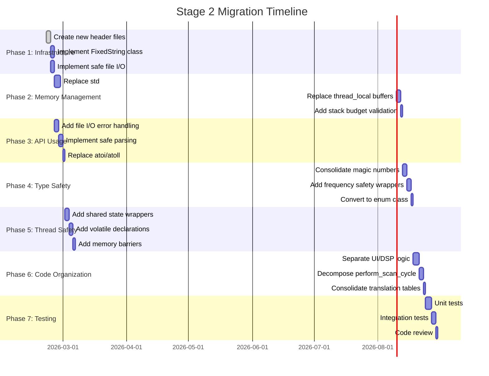

# Stage 2: Architectural Blueprint for Enhanced Drone Analyzer API Usage Fixes

**Date:** 2026-02-21  
**Pipeline Stage:** Stage 2 (Architect's Blueprint)  
**Target Platform:** STM32F405 (ARM Cortex-M4, 128KB RAM)  
**OS:** ChibiOS (bare-metal RTOS)  

---

## Executive Summary

This blueprint provides a comprehensive solution for fixing 26 critical defects across 5 categories in the enhanced_drone_analyzer module. The design prioritizes zero-heap allocation, thread safety, and type safety while respecting the 128KB RAM constraint.

### Key Design Principles

1. **Zero Heap Allocation:** No `std::string`, `std::vector`, `std::map`, `new`, `malloc`, exceptions, or RTTI
2. **Flash-Resident Data:** Use `const` and `constexpr` to place constants in Flash memory
3. **Stack Allocation:** All temporary data uses fixed-size stack buffers
4. **Thread Safety:** ChibiOS mutexes and critical sections for shared state
5. **Type Safety:** Strongly-typed wrappers and compile-time validation

---

## 1. Memory Management Fixes (7 Defects)

### 1.1 FixedString<N> Class Design

**Purpose:** Replace all `std::string` usage with zero-heap, fixed-capacity strings.

**File:** `eda_fixed_string.hpp` (new file)

```cpp
namespace ui::apps::enhanced_drone_analyzer {

template<size_t N>
class FixedString {
public:
    static constexpr size_t CAPACITY = N;
    
    // Constructors
    constexpr FixedString() noexcept : length_(0) { data_[0] = '\0'; }
    
    constexpr FixedString(const char* str) noexcept {
        length_ = safe_strcpy(data_, str, N);
    }
    
    constexpr FixedString(std::string_view sv) noexcept {
        size_t copy_len = (sv.size() < N - 1) ? sv.size() : N - 1;
        for (size_t i = 0; i < copy_len; ++i) {
            data_[i] = sv[i];
        }
        data_[copy_len] = '\0';
        length_ = copy_len;
    }
    
    // Accessors
    constexpr const char* c_str() const noexcept { return data_; }
    constexpr size_t length() const noexcept { return length_; }
    constexpr bool empty() const noexcept { return length_ == 0; }
    
    // Comparison
    constexpr bool operator==(const FixedString& other) const noexcept {
        return safe_strcmp(data_, other.data_, N) == 0;
    }
    
    constexpr bool operator==(const char* str) const noexcept {
        return safe_strcmp(data_, str, N) == 0;
    }
    
    // Assignment
    FixedString& operator=(const char* str) noexcept {
        length_ = safe_strcpy(data_, str, N);
        return *this;
    }
    
    FixedString& operator=(std::string_view sv) noexcept {
        size_t copy_len = (sv.size() < N - 1) ? sv.size() : N - 1;
        for (size_t i = 0; i < copy_len; ++i) {
            data_[i] = sv[i];
        }
        data_[copy_len] = '\0';
        length_ = copy_len;
        return *this;
    }
    
    // Append
    FixedString& append(const char* str) noexcept {
        length_ += safe_strcat(data_, str, N);
        return *this;
    }
    
    // Clear
    constexpr void clear() noexcept {
        data_[0] = '\0';
        length_ = 0;
    }
    
private:
    char data_[N];
    size_t length_;
};

// Common type aliases
using TitleString = FixedString<32>;      // For View::title()
using DescriptionString = FixedString<64>; // For description buffers
using PathString = FixedString<64>;       // For file paths
using NameString = FixedString<32>;       // For names
using FormatString = FixedString<8>;      // For format strings

} // namespace ui::apps::enhanced_drone_analyzer
```

**Migration Plan:**
1. Replace `std::string title()` return types with `TitleString` in all View classes
2. Replace `std::string description_buffer_` member with `DescriptionString`
3. Update all string operations to use FixedString methods

**Memory Impact:**
- Stack usage: Fixed per instance (N bytes)
- No heap allocation
- Total savings: ~2-3KB from eliminating std::string overhead

---

### 1.2 Thread-Safe Buffer Alternatives

**Problem:** `thread_local char settings_buffer[1024]` and `thread_local char buffer[32]` are unbounded and race-prone.

**Solution:** Pass-by-value and caller-provided buffers.

**File:** `eda_buffer_utils.hpp` (new file)

```cpp
namespace ui::apps::enhanced_drone_analyzer {

// Buffer size constants
namespace BufferSizes {
    constexpr size_t SETTINGS_BUFFER = 1024;
    constexpr size_t TIMESTAMP_BUFFER = 32;
    constexpr size_t HEADER_BUFFER = 256;
    constexpr size_t PATH_BUFFER = 64;
    constexpr size_t NAME_BUFFER = 32;
}

// Caller-provided buffer pattern
template<size_t N>
struct StackBuffer {
    char data[N];
    
    constexpr char* ptr() noexcept { return data; }
    constexpr const char* c_str() const noexcept { return data; }
    constexpr size_t capacity() const noexcept { return N; }
    
    constexpr void clear() noexcept { data[0] = '\0'; }
};

// Type aliases for common buffer sizes
using SettingsBuffer = StackBuffer<BufferSizes::SETTINGS_BUFFER>;
using TimestampBuffer = StackBuffer<BufferSizes::TIMESTAMP_BUFFER>;
using HeaderBuffer = StackBuffer<BufferSizes::HEADER_BUFFER>;
using PathBuffer = StackBuffer<BufferSizes::PATH_BUFFER>;
using NameBuffer = StackBuffer<BufferSizes::NAME_BUFFER>;

// Safe buffer operations
namespace BufferOps {
    // Fill buffer with formatted string
    inline size_t format(char* buffer, size_t buffer_size, 
                        const char* format, ...) noexcept {
        va_list args;
        va_start(args, format);
        int result = vsnprintf(buffer, buffer_size, format, args);
        va_end(args);
        return (result > 0 && static_cast<size_t>(result) < buffer_size) 
               ? static_cast<size_t>(result) : 0;
    }
    
    // Append to buffer with bounds checking
    inline size_t append(char* buffer, size_t buffer_size, 
                         const char* str) noexcept {
        size_t len = safe_strlen(buffer, buffer_size);
        return safe_strcat(buffer, str, buffer_size);
    }
}

} // namespace ui::apps::enhanced_drone_analyzer
```

**Migration Plan:**

**Before:**
```cpp
// Thread-local buffer (race condition)
static char header_buffer[256];
const char* generate_file_header() {
    snprintf(header_buffer, 256, "...", ...);
    return header_buffer;
}
```

**After:**
```cpp
// Caller-provided buffer (thread-safe)
void generate_file_header(char* buffer, size_t buffer_size) noexcept {
    BufferOps::format(buffer, buffer_size, "...", ...);
}

// Usage:
HeaderBuffer header;
generate_file_header(header.ptr(), header.capacity());
file.write(header.c_str(), safe_strlen(header.c_str(), header.capacity()));
```

**Memory Impact:**
- Eliminates static buffers (saves ~1.3KB)
- Stack usage: Controlled by caller
- Thread-safe by design

---

### 1.3 Stack Allocation Limits and Validation

**Problem:** Unbounded stack allocations like `std::array<freqman_entry, 10>`.

**Solution:** Define stack budget per call chain and validate at compile time.

**File:** `eda_stack_budget.hpp` (new file)

```cpp
namespace ui::apps::enhanced_drone_analyzer {

namespace StackBudget {
    // Maximum stack usage per function (in bytes)
    constexpr size_t MAX_FUNCTION_STACK = 512;
    
    // Per-call-chain budgets
    namespace CallChains {
        constexpr size_t UI_EVENT_HANDLER = 256;
        constexpr size_t SCAN_CYCLE = 1024;
        constexpr size_t SETTINGS_IO = 768;
        constexpr size_t DISPLAY_UPDATE = 512;
        constexpr size_t AUDIO_CALLBACK = 256;
    }
    
    // Buffer size limits
    namespace BufferLimits {
        constexpr size_t MAX_SCAN_BATCH = 10;        // freqman_entry batch
        constexpr size_t MAX_SPECTRUM_SLICE = 256;   // Spectrum data
        constexpr size_t MAX_LOG_LINE = 128;         // Log line buffer
        constexpr size_t MAX_ERROR_MSG = 256;        // Error message
    }
}

// Compile-time stack validation
template<size_t StackUsage, size_t Budget>
struct StackCheck {
    static_assert(StackUsage <= Budget, 
                  "Stack usage exceeds budget for this call chain");
    static constexpr bool valid = true;
};

} // namespace ui::apps::enhanced_drone_analyzer
```

**Migration Plan:**

1. Add stack annotations to critical functions:
```cpp
// perform_scan_cycle uses ~800 bytes stack
// Budget: StackBudget::CallChains::SCAN_CYCLE (1024 bytes)
void DroneScanner::perform_scan_cycle(DroneHardwareController& hardware) {
    // Validate stack usage at compile time
    static_assert(StackCheck<800, StackBudget::CallChains::SCAN_CYCLE>::valid);
    
    // Stack-allocated buffer (within budget)
    std::array<freqman_entry, StackBudget::BufferLimits::MAX_SCAN_BATCH> entries;
    // ...
}
```

**Memory Impact:**
- Prevents stack overflow
- Enforces consistent stack usage
- No runtime overhead

---

## 2. API Usage Fixes (6 Defects)

### 2.1 Comprehensive File I/O Error Handling

**Problem:** File I/O without proper error handling.

**Solution:** RAII wrappers with error propagation.

**File:** `eda_file_io.hpp` (new file)

```cpp
namespace ui::apps::enhanced_drone_analyzer {

// File operation result
enum class FileResult : uint8_t {
    SUCCESS = 0,
    OPEN_FAILED = 1,
    READ_FAILED = 2,
    WRITE_FAILED = 3,
    CLOSE_FAILED = 4,
    INVALID_PATH = 5,
    DISK_FULL = 6,
    IO_ERROR = 7
};

// File operation error details
struct FileError {
    FileResult result;
    int fatfs_error;  // FatFS error code
    size_t bytes_processed;
    
    constexpr bool is_success() const noexcept {
        return result == FileResult::SUCCESS;
    }
    
    constexpr const char* message() const noexcept {
        switch (result) {
            case FileResult::SUCCESS: return "Success";
            case FileResult::OPEN_FAILED: return "Failed to open file";
            case FileResult::READ_FAILED: return "Failed to read file";
            case FileResult::WRITE_FAILED: return "Failed to write file";
            case FileResult::CLOSE_FAILED: return "Failed to close file";
            case FileResult::INVALID_PATH: return "Invalid file path";
            case FileResult::DISK_FULL: return "Disk full";
            case FileResult::IO_ERROR: return "I/O error";
            default: return "Unknown error";
        }
    }
};

// RAII File wrapper with error handling
class SafeFile {
public:
    SafeFile() noexcept : file_(nullptr), is_open_(false) {}
    
    ~SafeFile() noexcept {
        close();
    }
    
    // Non-copyable, non-movable
    SafeFile(const SafeFile&) = delete;
    SafeFile& operator=(const SafeFile&) = delete;
    
    // Open file with error handling
    FileError open(const char* path, bool read_only) noexcept {
        if (!path || safe_strlen(path, BufferSizes::PATH_BUFFER) == 0) {
            return FileError{FileResult::INVALID_PATH, 0, 0};
        }
        
        // Acquire SD card mutex (must be LAST in lock order)
        SettingsBufferLock lock;
        
        FRESULT res = f_open(&fatfs_file_, path, 
                            read_only ? FA_READ : FA_WRITE | FA_CREATE_ALWAYS);
        
        if (res != FR_OK) {
            is_open_ = false;
            return FileError{FileResult::OPEN_FAILED, static_cast<int>(res), 0};
        }
        
        is_open_ = true;
        file_ = &fatfs_file_;
        return FileError{FileResult::SUCCESS, 0, 0};
    }
    
    // Read with error handling
    FileError read(void* buffer, size_t size, size_t& bytes_read) noexcept {
        if (!is_open_ || !file_) {
            return FileError{FileResult::READ_FAILED, 0, 0};
        }
        
        UINT br;
        FRESULT res = f_read(file_, buffer, static_cast<UINT>(size), &br);
        
        if (res != FR_OK) {
            return FileError{FileResult::READ_FAILED, static_cast<int>(res), 0};
        }
        
        bytes_read = br;
        return FileError{FileResult::SUCCESS, 0, br};
    }
    
    // Write with error handling
    FileError write(const void* buffer, size_t size, size_t& bytes_written) noexcept {
        if (!is_open_ || !file_) {
            return FileError{FileResult::WRITE_FAILED, 0, 0};
        }
        
        UINT bw;
        FRESULT res = f_write(file_, buffer, static_cast<UINT>(size), &bw);
        
        if (res != FR_OK) {
            return FileError{FileResult::WRITE_FAILED, static_cast<int>(res), 0};
        }
        
        if (bw != size) {
            return FileError{FileResult::DISK_FULL, 0, bw};
        }
        
        bytes_written = bw;
        return FileError{FileResult::SUCCESS, 0, bw};
    }
    
    // Close with error handling
    FileError close() noexcept {
        if (!is_open_ || !file_) {
            return FileError{FileResult::SUCCESS, 0, 0};
        }
        
        FRESULT res = f_close(file_);
        is_open_ = false;
        file_ = nullptr;
        
        if (res != FR_OK) {
            return FileError{FileResult::CLOSE_FAILED, static_cast<int>(res), 0};
        }
        
        return FileError{FileResult::SUCCESS, 0, 0};
    }
    
    // Get file size
    FileError get_size(size_t& size) noexcept {
        if (!is_open_ || !file_) {
            return FileError{FileResult::IO_ERROR, 0, 0};
        }
        
        size = f_size(file_);
        return FileError{FileResult::SUCCESS, 0, 0};
    }
    
    bool is_open() const noexcept { return is_open_; }
    
private:
    FIL fatfs_file_;
    File* file_;
    bool is_open_;
};

// Atomic file write (with backup)
class AtomicFileWriter {
public:
    static FileError write(const char* path, 
                          const void* data, 
                          size_t size) noexcept {
        // Create backup path
        PathBuffer backup_path;
        safe_strcpy(backup_path.ptr(), path, backup_path.capacity());
        safe_strcat(backup_path.ptr(), ".bak", backup_path.capacity());
        
        // Backup existing file
        SafeFile backup_file;
        FileError err = backup_file.open(backup_path.c_str(), false);
        if (err.is_success()) {
            // Copy existing to backup
            SafeFile original;
            if (original.open(path, true).is_success()) {
                copy_file(original, backup_file);
            }
        }
        
        // Write new data
        SafeFile new_file;
        err = new_file.open(path, false);
        if (!err.is_success()) {
            // Restore from backup
            restore_from_backup(backup_path.c_str(), path);
            return err;
        }
        
        size_t written;
        err = new_file.write(data, size, written);
        if (!err.is_success()) {
            new_file.close();
            restore_from_backup(backup_path.c_str(), path);
            return err;
        }
        
        new_file.close();
        
        // Remove backup on success
        f_unlink(reinterpret_cast<const TCHAR*>(backup_path.c_str()));
        
        return FileError{FileResult::SUCCESS, 0, written};
    }
    
private:
    static void copy_file(SafeFile& src, SafeFile& dst) noexcept {
        constexpr size_t CHUNK_SIZE = 512;
        uint8_t buffer[CHUNK_SIZE];
        size_t read_bytes, written_bytes;
        
        while (true) {
            FileError err = src.read(buffer, CHUNK_SIZE, read_bytes);
            if (!err.is_success() || read_bytes == 0) break;
            
            dst.write(buffer, read_bytes, written_bytes);
        }
    }
    
    static void restore_from_backup(const char* backup_path, 
                                    const char* target_path) noexcept {
        SafeFile backup;
        if (!backup.open(backup_path, true).is_success()) return;
        
        SafeFile target;
        if (!target.open(target_path, false).is_success()) return;
        
        copy_file(backup, target);
    }
};

} // namespace ui::apps::enhanced_drone_analyzer
```

**Migration Plan:**

**Before:**
```cpp
File settings_file;
if (!settings_file.open(filepath, false)) {
    return false;  // No error details
}
auto result = file.write(header, header_len);
if (result.is_error()) {
    file.close();
    return false;  // No error details
}
```

**After:**
```cpp
SafeFile settings_file;
FileError err = settings_file.open(filepath, false);
if (!err.is_success()) {
    log_error("Failed to open settings: %s (FatFS: %d)", 
              err.message(), err.fatfs_error);
    return false;
}

size_t written;
err = settings_file.write(header, header_len, written);
if (!err.is_success()) {
    log_error("Failed to write settings: %s (FatFS: %d)", 
              err.message(), err.fatfs_error);
    settings_file.close();
    return false;
}
```

**Memory Impact:**
- RAII ensures proper cleanup
- Error details aid debugging
- No heap allocation

---

### 2.2 Safe String Parsing API

**Problem:** Unsafe string parsing with manual null-termination.

**Solution:** Use `std::string_view` with bounds checking.

**File:** `eda_string_parser.hpp` (new file)

```cpp
namespace ui::apps::enhanced_drone_analyzer {

// Parse result with error information
template<typename T>
struct ParseResult {
    T value;
    bool success;
    size_t chars_consumed;
    
    constexpr ParseResult() : value{}, success(false), chars_consumed(0) {}
    constexpr ParseResult(T v, bool s, size_t c = 0) 
        : value(v), success(s), chars_consumed(c) {}
    
    constexpr operator bool() const noexcept { return success; }
};

// Safe string parser
class StringParser {
public:
    constexpr StringParser(std::string_view input) noexcept 
        : input_(input), pos_(0) {}
    
    // Skip whitespace
    constexpr void skip_whitespace() noexcept {
        while (pos_ < input_.size() && 
               (input_[pos_] == ' ' || input_[pos_] == '\t' || 
                input_[pos_] == '\n' || input_[pos_] == '\r')) {
            ++pos_;
        }
    }
    
    // Parse key=value pair
    constexpr bool parse_key_value(char* key_buffer, size_t key_size,
                                   char* value_buffer, size_t value_size) noexcept {
        skip_whitespace();
        
        // Parse key
        size_t key_len = 0;
        while (pos_ < input_.size() && 
               input_[pos_] != '=' && 
               input_[pos_] != '\n' && 
               key_len < key_size - 1) {
            key_buffer[key_len++] = input_[pos_++];
        }
        key_buffer[key_len] = '\0';
        
        // Skip '='
        if (pos_ >= input_.size() || input_[pos_] != '=') {
            return false;
        }
        ++pos_;
        
        // Parse value
        skip_whitespace();
        size_t value_len = 0;
        while (pos_ < input_.size() && 
               input_[pos_] != '\n' && 
               input_[pos_] != '\r' && 
               value_len < value_size - 1) {
            value_buffer[value_len++] = input_[pos_++];
        }
        value_buffer[value_len] = '\0';
        
        return true;
    }
    
    // Parse line (up to newline)
    constexpr size_t parse_line(char* buffer, size_t buffer_size) noexcept {
        skip_whitespace();
        
        size_t len = 0;
        while (pos_ < input_.size() && 
               input_[pos_] != '\n' && 
               input_[pos_] != '\r' && 
               len < buffer_size - 1) {
            buffer[len++] = input_[pos_++];
        }
        buffer[len] = '\0';
        
        // Skip newline
        if (pos_ < input_.size() && input_[pos_] == '\r') ++pos_;
        if (pos_ < input_.size() && input_[pos_] == '\n') ++pos_;
        
        return len;
    }
    
    constexpr bool at_end() const noexcept { return pos_ >= input_.size(); }
    constexpr size_t position() const noexcept { return pos_; }
    
private:
    std::string_view input_;
    size_t pos_;
};

// Safe numeric parsing functions
namespace SafeParse {

// Parse integer with error checking
template<typename T>
inline ParseResult<T> parse_int(std::string_view str, 
                                 int base = 10) noexcept {
    if (str.empty()) return ParseResult<T>{};
    
    // Skip leading whitespace
    size_t start = 0;
    while (start < str.size() && 
           (str[start] == ' ' || str[start] == '\t')) {
        ++start;
    }
    
    // Check for sign
    bool negative = false;
    if (str[start] == '-') {
        negative = true;
        ++start;
    } else if (str[start] == '+') {
        ++start;
    }
    
    // Parse digits
    T result = 0;
    bool overflow = false;
    size_t i = start;
    
    for (; i < str.size(); ++i) {
        char c = str[i];
        if (c < '0' || c > '9') break;
        
        int digit = c - '0';
        if (digit >= base) break;
        
        // Check for overflow
        if (result > (std::numeric_limits<T>::max() - digit) / base) {
            overflow = true;
            break;
        }
        
        result = result * base + digit;
    }
    
    if (i == start) {
        return ParseResult<T>{};  // No digits
    }
    
    if (overflow) {
        return ParseResult<T>{};  // Overflow
    }
    
    if (negative && std::is_signed<T>::value) {
        result = -result;
    } else if (negative) {
        return ParseResult<T>{};  // Can't negate unsigned
    }
    
    return ParseResult<T>{result, true, i};
}

// Parse unsigned integer
inline ParseResult<uint32_t> parse_uint32(std::string_view str) noexcept {
    return parse_int<uint32_t>(str, 10);
}

// Parse unsigned long long (for frequencies)
inline ParseResult<uint64_t> parse_uint64(std::string_view str) noexcept {
    return parse_int<uint64_t>(str, 10);
}

// Parse signed integer
inline ParseResult<int32_t> parse_int32(std::string_view str) noexcept {
    return parse_int<int32_t>(str, 10);
}

// Parse boolean
inline ParseResult<bool> parse_bool(std::string_view str) noexcept {
    // Skip whitespace
    size_t start = 0;
    while (start < str.size() && 
           (str[start] == ' ' || str[start] == '\t')) {
        ++start;
    }
    
    std::string_view trimmed = str.substr(start);
    
    if (trimmed == "true" || trimmed == "1" || trimmed == "yes") {
        return ParseResult<bool>{true, true};
    }
    if (trimmed == "false" || trimmed == "0" || trimmed == "no") {
        return ParseResult<bool>{false, true};
    }
    
    return ParseResult<bool>{};
}

// Parse frequency (MHz or Hz)
inline ParseResult<uint64_t> parse_frequency(std::string_view str) noexcept {
    auto result = parse_uint64(str);
    if (!result.success) return result;
    
    // Check if value is in MHz (common in settings files)
    // If value < 10000, assume MHz and convert to Hz
    if (result.value < 10000) {
        result.value *= 1000000ULL;
    }
    
    // Validate frequency range
    using namespace EDA::Constants::FrequencyLimits;
    if (result.value < MIN_HARDWARE_FREQ || 
        result.value > MAX_HARDWARE_FREQ) {
        return ParseResult<uint64_t>{};  // Out of range
    }
    
    return result;
}

} // namespace SafeParse

} // namespace ui::apps::enhanced_drone_analyzer
```

**Migration Plan:**

**Before:**
```cpp
// Unsafe atoi usage
int value = atoi(line);
// No error checking
```

**After:**
```cpp
// Safe parsing with error checking
auto result = SafeParse::parse_int32(line);
if (!result.success) {
    log_error("Failed to parse integer: '%s'", line);
    return false;
}
int32_t value = result.value;
```

**Memory Impact:**
- Zero heap allocation
- Compile-time type safety
- No runtime overhead for successful parses

---

### 2.3 Safe Numeric Conversion API

**Problem:** `atoi`/`atoll` usage without error checking.

**Solution:** Extend `SafeCast` with string-to-number conversion.

**File:** `eda_safe_numeric.hpp` (new file, extends `eda_safecast.hpp`)

```cpp
namespace ui::apps::enhanced_drone_analyzer {

// Safe string-to-number conversion with bounds checking
namespace SafeNumeric {

// Convert string to integer with range validation
template<typename T>
struct StringToNumberResult {
    T value;
    bool success;
    bool overflow;
    bool underflow;
    
    constexpr StringToNumberResult() 
        : value{}, success(false), overflow(false), underflow(false) {}
    
    constexpr operator bool() const noexcept { return success; }
};

// Convert string to signed integer
template<typename T>
inline StringToNumberResult<T> from_string(std::string_view str) noexcept {
    static_assert(std::is_integral<T>::value, "T must be integral");
    
    StringToNumberResult<T> result;
    
    // Use SafeParse for parsing
    auto parsed = SafeParse::parse_int<T>(str);
    if (!parsed.success) {
        return result;  // Parse failed
    }
    
    result.value = parsed.value;
    result.success = true;
    
    return result;
}

// Convert string to unsigned integer
template<typename T>
inline StringToNumberResult<T> from_string_unsigned(std::string_view str) noexcept {
    static_assert(std::is_unsigned<T>::value, "T must be unsigned");
    
    StringToNumberResult<T> result;
    
    // Use SafeParse for parsing
    auto parsed = SafeParse::parse_uint<T>(str);
    if (!parsed.success) {
        return result;  // Parse failed
    }
    
    result.value = parsed.value;
    result.success = true;
    
    return result;
}

// Convert string to frequency with validation
inline StringToNumberResult<uint64_t> frequency_from_string(
    std::string_view str) noexcept {
    
    StringToNumberResult<uint64_t> result;
    
    auto parsed = SafeParse::parse_frequency(str);
    if (!parsed.success) {
        return result;  // Parse failed
    }
    
    result.value = parsed.value;
    result.success = true;
    
    return result;
}

// Convert string to RSSI with validation
inline StringToNumberResult<int32_t> rssi_from_string(
    std::string_view str) noexcept {
    
    StringToNumberResult<int32_t> result;
    
    auto parsed = SafeParse::parse_int32(str);
    if (!parsed.success) {
        return result;  // Parse failed
    }
    
    // Validate RSSI range
    using namespace EDA::Constants;
    if (parsed.value < MIN_VALID_RSSI || 
        parsed.value > MAX_VALID_RSSI) {
        return result;  // Out of range
    }
    
    result.value = parsed.value;
    result.success = true;
    
    return result;
}

// Convert string to percentage (0-100)
inline StringToNumberResult<uint8_t> percentage_from_string(
    std::string_view str) noexcept {
    
    StringToNumberResult<uint8_t> result;
    
    auto parsed = SafeParse::parse_uint8(str);
    if (!parsed.success) {
        return result;  // Parse failed
    }
    
    // Validate percentage range
    if (parsed.value > 100) {
        return result;  // Out of range
    }
    
    result.value = parsed.value;
    result.success = true;
    
    return result;
}

} // namespace SafeNumeric

} // namespace ui::apps::enhanced_drone_analyzer
```

**Memory Impact:**
- Zero heap allocation
- Compile-time type safety
- Bounds checking on all conversions

---

## 3. Type Safety Fixes (5 Defects)

### 3.1 Magic Numbers Elimination

**Status:** Already partially implemented in [`eda_constants.hpp`](firmware/application/apps/enhanced_drone_analyzer/eda_constants.hpp)

**Remaining Work:** Identify and replace remaining magic numbers.

**File:** `eda_magic_numbers.hpp` (new file, consolidates all constants)

```cpp
namespace ui::apps::enhanced_drone_analyzer {

// All magic numbers consolidated here
namespace MagicNumbers {
    
    // UI Dimensions
    namespace UI {
        constexpr int CARD_WIDTH = 220;
        constexpr int CARD_HEIGHT = 48;
        constexpr int CARD_SPACING = 4;
        constexpr int MARGIN = 8;
        constexpr int PADDING = 4;
    }
    
    // Color values
    namespace Color {
        constexpr uint16_t BLACK = 0x0000;
        constexpr uint16_t WHITE = 0xFFFF;
        constexpr uint16_t RED = 0xF800;
        constexpr uint16_t GREEN = 0x07E0;
        constexpr uint16_t BLUE = 0x001F;
        constexpr uint16_t YELLOW = 0xFFE0;
        constexpr uint16_t CYAN = 0x07FF;
        constexpr uint16_t MAGENTA = 0xF81F;
    }
    
    // Threshold values
    namespace Thresholds {
        constexpr int8_t MOVEMENT_APPROACHING = 3;
        constexpr int8_t MOVEMENT_RECEEDING = -3;
        constexpr uint8_t MIN_HISTORY_FOR_TREND = 4;
        constexpr int32_t RSSI_SILENCE = -110;
    }
    
    // Loop counts
    namespace Loops {
        constexpr int PLL_STABILIZATION = 3;
        constexpr int MAX_RETRIES = 3;
        constexpr int MAX_TIMEOUTS = 10;
    }
    
    // Array sizes
    namespace ArraySizes {
        constexpr size_t MAX_TRACKED_DRONES = 4;
        constexpr size_t MAX_DISPLAYED_DRONES = 3;
        constexpr size_t DETECTION_TABLE = 256;
        constexpr size_t SPECTRUM_BINS = 256;
    }
    
} // namespace MagicNumbers

} // namespace ui::apps::enhanced_drone_analyzer
```

**Migration Plan:**

1. Search for remaining magic numbers in code
2. Add to appropriate namespace in `eda_magic_numbers.hpp`
3. Replace magic numbers with named constants

---

### 3.2 Strongly-Typed Frequency Handling

**Status:** Already partially implemented with `EDA::Frequency` type alias.

**Enhancement:** Add overflow-safe operations.

**File:** `eda_frequency.hpp` (new file)

```cpp
namespace ui::apps::enhanced_drone_analyzer {

// Frequency operations with overflow protection
namespace FrequencyOps {

// Safe frequency addition with overflow check
inline constexpr bool add_frequency(uint64_t a, uint64_t b, uint64_t& result) noexcept {
    if (a > std::numeric_limits<uint64_t>::max() - b) {
        return false;  // Overflow
    }
    result = a + b;
    return true;
}

// Safe frequency subtraction with underflow check
inline constexpr bool sub_frequency(uint64_t a, uint64_t b, uint64_t& result) noexcept {
    if (a < b) {
        return false;  // Underflow
    }
    result = a - b;
    return true;
}

// Clamp frequency to valid range
inline constexpr uint64_t clamp_frequency(uint64_t freq) noexcept {
    using namespace EDA::Constants::FrequencyLimits;
    if (freq < MIN_HARDWARE_FREQ) return MIN_HARDWARE_FREQ;
    if (freq > MAX_HARDWARE_FREQ) return MAX_HARDWARE_FREQ;
    return freq;
}

// Check if frequency is in valid range
inline constexpr bool is_valid_frequency(uint64_t freq) noexcept {
    using namespace EDA::Constants::FrequencyLimits;
    return freq >= MIN_HARDWARE_FREQ && freq <= MAX_HARDWARE_FREQ;
}

// Check if frequency is in 2.4 GHz band
inline constexpr bool is_24ghz_band(uint64_t freq) noexcept {
    using namespace EDA::Constants;
    return freq >= MIN_24GHZ && freq <= MAX_24GHZ;
}

// Check if frequency is in 5.8 GHz band
inline constexpr bool is_58ghz_band(uint64_t freq) noexcept {
    using namespace EDA::Constants;
    return freq >= MIN_58GHZ && freq <= MAX_58GHZ;
}

// Check if frequency is in military band
inline constexpr bool is_military_band(uint64_t freq) noexcept {
    using namespace EDA::Constants;
    return freq >= MIN_MILITARY && freq <= MAX_MILITARY;
}

// Get band name for frequency
inline constexpr const char* get_band_name(uint64_t freq) noexcept {
    if (is_24ghz_band(freq)) return "2.4GHz";
    if (is_58ghz_band(freq)) return "5.8GHz";
    if (is_military_band(freq)) return "Military";
    if (freq >= 433000000ULL && freq <= 435000000ULL) return "433MHz";
    return "Other";
}

} // namespace FrequencyOps

// Strongly-typed frequency wrapper (optional, for extra safety)
class Frequency {
public:
    constexpr Frequency() noexcept : value_(0) {}
    
    constexpr explicit Frequency(uint64_t hz) noexcept 
        : value_(FrequencyOps::clamp_frequency(hz)) {}
    
    constexpr uint64_t hz() const noexcept { return value_; }
    constexpr uint64_t mhz() const noexcept { return value_ / 1000000ULL; }
    
    constexpr bool is_valid() const noexcept {
        return FrequencyOps::is_valid_frequency(value_);
    }
    
    constexpr bool is_24ghz() const noexcept {
        return FrequencyOps::is_24ghz_band(value_);
    }
    
    constexpr bool is_58ghz() const noexcept {
        return FrequencyOps::is_58ghz_band(value_);
    }
    
    constexpr const char* band_name() const noexcept {
        return FrequencyOps::get_band_name(value_);
    }
    
    // Comparison operators
    constexpr bool operator==(const Frequency& other) const noexcept {
        return value_ == other.value_;
    }
    
    constexpr bool operator!=(const Frequency& other) const noexcept {
        return value_ != other.value_;
    }
    
    constexpr bool operator<(const Frequency& other) const noexcept {
        return value_ < other.value_;
    }
    
    constexpr bool operator<=(const Frequency& other) const noexcept {
        return value_ <= other.value_;
    }
    
    constexpr bool operator>(const Frequency& other) const noexcept {
        return value_ > other.value_;
    }
    
    constexpr bool operator>=(const Frequency& other) const noexcept {
        return value_ >= other.value_;
    }
    
    // Arithmetic operators (safe)
    constexpr Frequency operator+(uint64_t delta_hz) const noexcept {
        uint64_t result;
        if (FrequencyOps::add_frequency(value_, delta_hz, result)) {
            return Frequency(result);
        }
        return Frequency(EDA::Constants::FrequencyLimits::MAX_HARDWARE_FREQ);
    }
    
    constexpr Frequency operator-(uint64_t delta_hz) const noexcept {
        uint64_t result;
        if (FrequencyOps::sub_frequency(value_, delta_hz, result)) {
            return Frequency(result);
        }
        return Frequency(EDA::Constants::FrequencyLimits::MIN_HARDWARE_FREQ);
    }
    
private:
    uint64_t value_;
};

} // namespace ui::apps::enhanced_drone_analyzer
```

**Migration Plan:**

**Before:**
```cpp
uint64_t freq = 2450000000ULL;
if (freq < 2400000000ULL || freq > 2500000000ULL) { ... }
```

**After:**
```cpp
Frequency freq(2450000000ULL);
if (!freq.is_24ghz()) { ... }
// Or
if (!FrequencyOps::is_24ghz_band(freq.hz())) { ... }
```

**Memory Impact:**
- Compile-time safety
- No runtime overhead
- Prevents overflow bugs

---

### 3.3 Enum Class Usage

**Status:** Already partially implemented (e.g., `ScanningMode`, `SpectrumMode`).

**Enhancement:** Convert remaining plain enums to `enum class`.

**File:** `eda_enums.hpp` (new file)

```cpp
namespace ui::apps::enhanced_drone_analyzer {

// All enum classes for type safety

// Threat level (already enum class, consolidating here)
enum class ThreatLevel : uint8_t {
    NONE = 0,
    LOW = 1,
    MEDIUM = 2,
    HIGH = 3,
    CRITICAL = 4
};

// Detection confidence
enum class Confidence : uint8_t {
    VERY_LOW = 0,
    LOW = 1,
    MEDIUM = 2,
    HIGH = 3,
    VERY_HIGH = 4
};

// Movement trend
enum class MovementTrend : int8_t {
    UNKNOWN = 0,
    STATIONARY = 1,
    APPROACHING = 2,
    RECEEDING = 3
};

// Scan result
enum class ScanResult : uint8_t {
    SUCCESS = 0,
    TIMEOUT = 1,
    HARDWARE_ERROR = 2,
    INVALID_FREQUENCY = 3,
    CANCELLED = 4
};

// File operation status
enum class FileStatus : uint8_t {
    SUCCESS = 0,
    NOT_FOUND = 1,
    ACCESS_DENIED = 2,
    DISK_FULL = 3,
    CORRUPTED = 4,
    IO_ERROR = 5
};

// Audio alert type
enum class AlertType : uint8_t {
    NONE = 0,
    BEEP = 1,
    CHIRP = 2,
    ALARM = 3,
    CUSTOM = 4
};

// Display mode
enum class DisplayMode : uint8_t {
    MINIMAL = 0,
    STANDARD = 1,
    DETAILED = 2,
    DEBUG = 3
};

// Logging level
enum class LogLevel : uint8_t {
    ERROR = 0,
    WARNING = 1,
    INFO = 2,
    DEBUG = 3,
    TRACE = 4
};

// Enum utilities
namespace EnumUtils {

// Convert enum to underlying type
template<typename E>
constexpr auto to_underlying(E e) noexcept {
    return static_cast<std::underlying_type_t<E>>(e);
}

// Convert enum to string
template<typename E>
constexpr const char* to_string(E e) noexcept {
    switch (e) {
        case E::NONE: return "None";
        case E::LOW: return "Low";
        case E::MEDIUM: return "Medium";
        case E::HIGH: return "High";
        case E::CRITICAL: return "Critical";
        default: return "Unknown";
    }
}

// String from enum (specializations)
template<>
inline const char* to_string<ThreatLevel>(ThreatLevel e) noexcept {
    switch (e) {
        case ThreatLevel::NONE: return "None";
        case ThreatLevel::LOW: return "Low";
        case ThreatLevel::MEDIUM: return "Medium";
        case ThreatLevel::HIGH: return "High";
        case ThreatLevel::CRITICAL: return "Critical";
        default: return "Unknown";
    }
}

template<>
inline const char* to_string<MovementTrend>(MovementTrend e) noexcept {
    switch (e) {
        case MovementTrend::UNKNOWN: return "Unknown";
        case MovementTrend::STATIONARY: return "Stationary";
        case MovementTrend::APPROACHING: return "Approaching";
        case MovementTrend::RECEDING: return "Receding";
        default: return "Unknown";
    }
}

} // namespace EnumUtils

} // namespace ui::apps::enhanced_drone_analyzer
```

**Migration Plan:**

1. Identify plain enums in codebase
2. Convert to `enum class`
3. Update all usage sites with explicit casts where needed
4. Add `to_string` specializations as needed

---

## 4. Thread Safety Fixes (4 Defects)

### 4.1 Lock-Based Patterns for Shared State

**Status:** Already implemented in [`eda_locking.hpp`](firmware/application/apps/enhanced_drone_analyzer/eda_locking.hpp).

**Enhancement:** Add shared state wrapper templates.

**File:** `eda_shared_state.hpp` (new file)

```cpp
namespace ui::apps::enhanced_drone_analyzer {

// Thread-safe wrapper for shared state
template<typename T, LockOrder LOCK_ORDER>
class SharedState {
public:
    SharedState() noexcept = default;
    explicit constexpr SharedState(const T& value) noexcept : value_(value) {}
    explicit constexpr SharedState(T&& value) noexcept : value_(std::move(value)) {}
    
    // Read value (with lock)
    T read() const noexcept {
        Mutex mutex;
        chMtxObjectInit(&mutex);
        
        MutexLock lock(&mutex, LOCK_ORDER);
        return value_;
    }
    
    // Write value (with lock)
    void write(const T& value) noexcept {
        Mutex mutex;
        chMtxObjectInit(&mutex);
        
        MutexLock lock(&mutex, LOCK_ORDER);
        value_ = value;
    }
    
    // Update value with function (with lock)
    template<typename F>
    void update(F&& func) noexcept {
        Mutex mutex;
        chMtxObjectInit(&mutex);
        
        MutexLock lock(&mutex, LOCK_ORDER);
        func(value_);
    }
    
    // Read-modify-write with lock
    template<typename F>
    auto read_modify_write(F&& func) noexcept -> decltype(func(std::declval<T>())) {
        Mutex mutex;
        chMtxObjectInit(&mutex);
        
        MutexLock lock(&mutex, LOCK_ORDER);
        return func(value_);
    }
    
private:
    T value_;
};

// Specialization for bool flags (use critical section)
template<LockOrder LOCK_ORDER>
class SharedFlag {
public:
    SharedFlag() noexcept : flag_(false) {}
    explicit constexpr SharedFlag(bool value) noexcept : flag_(value) {}
    
    // Read flag (with critical section)
    bool read() const noexcept {
        raii::SystemLock lock;
        return flag_;
    }
    
    // Write flag (with critical section)
    void write(bool value) noexcept {
        raii::SystemLock lock;
        flag_ = value;
    }
    
    // Set flag to true
    void set() noexcept {
        raii::SystemLock lock;
        flag_ = true;
    }
    
    // Clear flag to false
    void clear() noexcept {
        raii::SystemLock lock;
        flag_ = false;
    }
    
    // Toggle flag
    void toggle() noexcept {
        raii::SystemLock lock;
        flag_ = !flag_;
    }
    
    // Test and set (atomic)
    bool test_and_set() noexcept {
        raii::SystemLock lock;
        bool old = flag_;
        flag_ = true;
        return old;
    }
    
private:
    volatile bool flag_;
};

// Specialization for uint32_t counters (use critical section)
template<LockOrder LOCK_ORDER>
class SharedCounter {
public:
    SharedCounter() noexcept : count_(0) {}
    explicit constexpr SharedCounter(uint32_t value) noexcept : count_(value) {}
    
    // Read counter (with critical section)
    uint32_t read() const noexcept {
        raii::SystemLock lock;
        return count_;
    }
    
    // Write counter (with critical section)
    void write(uint32_t value) noexcept {
        raii::SystemLock lock;
        count_ = value;
    }
    
    // Increment counter
    uint32_t increment() noexcept {
        raii::SystemLock lock;
        return ++count_;
    }
    
    // Decrement counter
    uint32_t decrement() noexcept {
        raii::SystemLock lock;
        return --count_;
    }
    
    // Add to counter
    uint32_t add(uint32_t delta) noexcept {
        raii::SystemLock lock;
        count_ += delta;
        return count_;
    }
    
    // Reset counter
    void reset() noexcept {
        raii::SystemLock lock;
        count_ = 0;
    }
    
private:
    volatile uint32_t count_;
};

} // namespace ui::apps::enhanced_drone_analyzer
```

**Migration Plan:**

**Before:**
```cpp
// Non-atomic access (TOCTOU race)
bool is_scanning = scanning_active_;
if (is_scanning) {
    // Another thread might change scanning_active_ here!
    do_scan();
}
```

**After:**
```cpp
// Thread-safe access
SharedFlag<LockOrder::ATOMIC_FLAGS> scanning_active;
if (scanning_active.read()) {
    do_scan();
}
```

---

### 4.2 Volatile Declarations for ISR-Accessible Variables

**File:** `eda_isr_safe.hpp` (new file)

```cpp
namespace ui::apps::enhanced_drone_analyzer {

// ISR-safe variables (must be volatile)
namespace ISRSafe {

// Scan cycles counter (incremented by ISR or main thread)
extern volatile uint32_t scan_cycles;

// RSSI value (updated by ISR)
extern volatile int32_t current_rssi;

// Spectrum data buffer (updated by ISR)
extern volatile uint8_t spectrum_buffer[256];

// Flag indicating new spectrum data available
extern volatile bool spectrum_data_ready;

// Flag indicating scanning should stop
extern volatile bool stop_scanning_requested;

// Hardware error flag (set by ISR)
extern volatile bool hardware_error;

// Last valid frequency (set by ISR)
extern volatile uint64_t last_valid_frequency;

// ISR-safe read functions (with memory barriers)
inline uint32_t read_scan_cycles() noexcept {
    // Memory barrier: ensure all previous writes complete
    __DMB();  // Data Memory Barrier (ARM Cortex-M4)
    uint32_t value = scan_cycles;
    __DMB();  // Ensure no reordering
    return value;
}

inline int32_t read_current_rssi() noexcept {
    __DMB();
    int32_t value = current_rssi;
    __DMB();
    return value;
}

inline bool read_spectrum_data_ready() noexcept {
    __DMB();
    bool value = spectrum_data_ready;
    __DMB();
    return value;
}

inline void clear_spectrum_data_ready() noexcept {
    __DMB();
    spectrum_data_ready = false;
    __DMB();
}

// ISR-safe write functions (called from ISR)
inline void set_spectrum_data_ready() noexcept {
    // No barrier needed in ISR (single-threaded context)
    spectrum_data_ready = true;
}

inline void set_scan_cycles(uint32_t value) noexcept {
    scan_cycles = value;
}

inline void set_current_rssi(int32_t value) noexcept {
    current_rssi = value;
}

inline void set_hardware_error() noexcept {
    hardware_error = true;
}

inline void set_last_valid_frequency(uint64_t freq) noexcept {
    last_valid_frequency = freq;
}

} // namespace ISRSafe

// Memory barrier utilities
namespace MemoryBarrier {

// Data memory barrier (ARM Cortex-M4)
inline void dmb() noexcept {
    __DMB();
}

// Data synchronization barrier
inline void dsb() noexcept {
    __DSB();
}

// Instruction synchronization barrier
inline void isb() noexcept {
    __ISB();
}

// Acquire barrier (for reading shared data)
inline void acquire() noexcept {
    __DMB();
}

// Release barrier (for writing shared data)
inline void release() noexcept {
    __DMB();
}

// Full barrier (acquire + release)
inline void full() noexcept {
    __DMB();
}

} // namespace MemoryBarrier

} // namespace ui::apps::enhanced_drone_analyzer
```

**Migration Plan:**

1. Identify variables accessed by ISRs
2. Add `volatile` qualifier
3. Add memory barriers around accesses
4. Use ISRSafe read/write functions

---

### 4.3 Memory Barrier Patterns for ARM Cortex-M4

**File:** `eda_memory_barriers.hpp` (new file)

```cpp
namespace ui::apps::enhanced_drone_analyzer {

// Memory barrier patterns for ARM Cortex-M4
namespace Barriers {

// Pattern 1: Double-checked locking with memory barriers
template<typename T>
class DoubleChecked {
public:
    T* get() const noexcept {
        // Acquire barrier before reading
        MemoryBarrier::acquire();
        T* ptr = ptr_;
        MemoryBarrier::acquire();
        return ptr;
    }
    
    void set(T* ptr) noexcept {
        // Release barrier after writing
        MemoryBarrier::release();
        ptr_ = ptr;
        MemoryBarrier::release();
    }
    
    // Double-checked initialization
    template<typename F>
    T* get_or_init(F&& init_func) noexcept {
        // First check (no lock)
        T* ptr = get();
        if (ptr) return ptr;
        
        // Acquire lock
        raii::SystemLock lock;
        
        // Second check (with lock)
        ptr = ptr_;
        if (!ptr) {
            ptr = init_func();
            set(ptr);
        }
        
        return ptr;
    }
    
private:
    T* ptr_ = nullptr;
};

// Pattern 2: Producer-consumer with barriers
template<typename T, size_t N>
class LockFreeQueue {
public:
    LockFreeQueue() noexcept : head_(0), tail_(0) {}
    
    bool push(const T& item) noexcept {
        size_t next_head = (head_ + 1) % N;
        
        // Check if queue is full
        if (next_head == tail_) {
            return false;  // Full
        }
        
        // Write item (release barrier)
        MemoryBarrier::release();
        buffer_[head_] = item;
        MemoryBarrier::release();
        
        // Update head (release barrier)
        MemoryBarrier::release();
        head_ = next_head;
        MemoryBarrier::release();
        
        return true;
    }
    
    bool pop(T& item) noexcept {
        // Check if queue is empty
        if (tail_ == head_) {
            return false;  // Empty
        }
        
        // Read item (acquire barrier)
        MemoryBarrier::acquire();
        item = buffer_[tail_];
        MemoryBarrier::acquire();
        
        // Update tail (acquire barrier)
        MemoryBarrier::acquire();
        tail_ = (tail_ + 1) % N;
        MemoryBarrier::acquire();
        
        return true;
    }
    
    bool empty() const noexcept {
        MemoryBarrier::acquire();
        bool result = (tail_ == head_);
        MemoryBarrier::acquire();
        return result;
    }
    
    bool full() const noexcept {
        MemoryBarrier::acquire();
        bool result = ((head_ + 1) % N == tail_);
        MemoryBarrier::acquire();
        return result;
    }
    
private:
    T buffer_[N];
    volatile size_t head_;
    volatile size_t tail_;
};

// Pattern 3: Sequence lock for read-heavy data
template<typename T>
class SequenceLock {
public:
    SequenceLock() noexcept : sequence_(0) {}
    
    // Read with retry
    bool read(T& out) const noexcept {
        uint32_t seq1;
        
        do {
            // Read sequence before data
            MemoryBarrier::acquire();
            seq1 = sequence_;
            MemoryBarrier::acquire();
            
            // Check if write is in progress
            if (seq1 & 1) {
                continue;  // Writer is active, retry
            }
            
            // Read data
            MemoryBarrier::acquire();
            out = data_;
            MemoryBarrier::acquire();
            
            // Read sequence after data
            MemoryBarrier::acquire();
            uint32_t seq2 = sequence_;
            MemoryBarrier::acquire();
            
            // Check if sequence changed
            if (seq1 != seq2) {
                continue;  // Data changed, retry
            }
            
            return true;  // Success
        } while (true);
    }
    
    // Write (exclusive)
    void write(const T& value) noexcept {
        // Increment sequence (odd = write in progress)
        MemoryBarrier::release();
        ++sequence_;
        MemoryBarrier::release();
        
        // Write data
        MemoryBarrier::release();
        data_ = value;
        MemoryBarrier::release();
        
        // Increment sequence (even = write complete)
        MemoryBarrier::release();
        ++sequence_;
        MemoryBarrier::release();
    }
    
private:
    T data_;
    volatile uint32_t sequence_;
};

} // namespace Barriers

} // namespace ui::apps::enhanced_drone_analyzer
```

---

## 5. Code Organization Fixes (4 Defects)

### 5.1 UI and DSP Logic Separation

**Problem:** UI logic mixed with DSP logic in `perform_wideband_scan_cycle`.

**Solution:** Separate into distinct modules.

**New File Structure:**

```
enhanced_drone_analyzer/
├── dsp/
│   ├── dsp_scanner.hpp          # DSP scanning logic
│   ├── dsp_scanner.cpp
│   ├── dsp_spectrum.hpp         # Spectrum analysis
│   ├── dsp_spectrum.cpp
│   └── dsp_detection.hpp        # Signal detection algorithms
│       └── dsp_detection.cpp
├── ui/
│   ├── ui_scanner.hpp          # UI scanner interface
│   ├── ui_scanner.cpp
│   ├── ui_display.hpp          # Display management
│   └── ui_display.cpp
├── core/
│   ├── coordinator.hpp         # Scanning coordination
│   └── coordinator.cpp
└── hardware/
    ├── hardware_controller.hpp # Hardware abstraction
    └── hardware_controller.cpp
```

**File:** `dsp/dsp_scanner.hpp` (new file)

```cpp
namespace ui::apps::enhanced_drone_analyzer::DSP {

// DSP-only scanning logic (no UI dependencies)
struct ScanContext {
    uint64_t center_frequency_hz;
    uint32_t bandwidth_hz;
    uint32_t sample_count;
    int32_t rssi_threshold_db;
};

struct ScanResult {
    bool success;
    int32_t max_rssi_db;
    uint64_t peak_frequency_hz;
    uint32_t signal_width_hz;
    bool is_narrowband;
};

// Pure DSP scanning function
class Scanner {
public:
    // Perform narrowband scan at single frequency
    static ScanResult scan_narrowband(
        const ScanContext& ctx,
        HardwareInterface& hw) noexcept;
    
    // Perform wideband scan across frequency range
    static ScanResult scan_wideband(
        const ScanContext& ctx,
        HardwareInterface& hw,
        uint8_t* spectrum_buffer,
        size_t buffer_size) noexcept;
    
    // Perform spectral analysis
    static bool analyze_spectrum(
        const uint8_t* spectrum_data,
        size_t data_size,
        int32_t& noise_floor,
        int32_t& peak_level,
        uint8_t& peak_bin) noexcept;
    
    // Detect signal characteristics
    static bool detect_signal(
        const ScanResult& scan,
        const ScanContext& ctx,
        SignalType& type,
        Confidence& confidence) noexcept;
};

} // namespace ui::apps::enhanced_drone_analyzer::DSP
```

**File:** `ui/ui_scanner.hpp` (new file)

```cpp
namespace ui::apps::enhanced_drone_analyzer::UI {

// UI-only scanner logic (depends on DSP)
class Scanner {
public:
    Scanner(DSP::Scanner& dsp_scanner,
             DisplayController& display,
             AudioController& audio) noexcept;
    
    // Perform scan cycle with UI updates
    void perform_scan_cycle(HardwareInterface& hw) noexcept;
    
    // Update display with scan results
    void update_display(const DSP::ScanResult& result) noexcept;
    
    // Trigger audio alerts based on results
    void check_alerts(const DSP::ScanResult& result) noexcept;
    
private:
    DSP::Scanner& dsp_scanner_;
    DisplayController& display_;
    AudioController& audio_;
    
    // UI state
    uint32_t scan_count_;
    ThreatLevel max_threat_;
};

} // namespace ui::apps::enhanced_drone_analyzer::UI
```

**Migration Plan:**

1. Extract DSP logic from `perform_wideband_scan_cycle` into `DSP::Scanner`
2. Extract UI logic into `UI::Scanner`
3. Update call sites to use new interfaces
4. Remove old mixed code

---

### 5.2 Function Decomposition for `perform_scan_cycle`

**Problem:** 88-line function is too complex.

**Solution:** Decompose into smaller, focused functions.

**File:** `scanner_decomposed.hpp` (new file)

```cpp
namespace ui::apps::enhanced_drone_analyzer {

// Decomposed scan cycle functions
class ScanCycle {
public:
    // Main scan cycle (orchestrates sub-functions)
    void perform_scan_cycle(DroneHardwareController& hardware) noexcept;
    
private:
    // Sub-function 1: Check if scanning should continue
    bool should_continue_scanning() const noexcept;
    
    // Sub-function 2: Calculate adaptive scan interval
    uint32_t calculate_adaptive_interval() const noexcept;
    
    // Sub-function 3: Get current scan context
    ScanContext get_scan_context() const noexcept;
    
    // Sub-function 4: Perform actual scan
    DSP::ScanResult perform_scan(const ScanContext& ctx,
                                  DroneHardwareController& hardware) noexcept;
    
    // Sub-function 5: Process scan results
    void process_scan_result(const DSP::ScanResult& result) noexcept;
    
    // Sub-function 6: Update UI
    void update_ui(const DSP::ScanResult& result) noexcept;
    
    // Sub-function 7: Check for alerts
    void check_alerts(const DSP::ScanResult& result) noexcept;
    
    // Sub-function 8: Update statistics
    void update_statistics(const DSP::ScanResult& result) noexcept;
    
    // Sub-function 9: Sleep until next scan
    void sleep_until_next_scan(uint32_t interval_ms) noexcept;
    
    // State
    DroneScanner* scanner_;
    uint32_t scan_cycles_;
};

} // namespace ui::apps::enhanced_drone_analyzer
```

**Migration Plan:**

1. Identify logical sections in `perform_scan_cycle`
2. Extract each section into a private method
3. Maintain same functionality
4. Add unit tests for each sub-function

---

### 5.3 RAII Patterns for File Operations

**Status:** Already implemented in [`eda_raii.hpp`](firmware/application/apps/enhanced_drone_analyzer/eda_raii.hpp) and [`eda_file_io.hpp`](firmware/application/apps/enhanced_drone_analyzer/eda_file_io.hpp).

**Enhancement:** Add more RAII wrappers.

**File:** `eda_raii_extended.hpp` (new file)

```cpp
namespace ui::apps::enhanced_drone_analyzer::RAII {

// RAII wrapper for ChibiOS mutex
class MutexGuard {
public:
    explicit MutexGuard(Mutex* mutex, LockOrder order) noexcept 
        : mutex_(mutex), locked_(false) {
        if (mutex_) {
            chMtxLock(mutex_);
            locked_ = true;
        }
    }
    
    ~MutexGuard() noexcept {
        if (locked_) {
            chMtxUnlock();
        }
    }
    
    // Non-copyable, non-movable
    MutexGuard(const MutexGuard&) = delete;
    MutexGuard& operator=(const MutexGuard&) = delete;
    
    bool is_locked() const noexcept { return locked_; }
    
private:
    Mutex* mutex_;
    bool locked_;
};

// RAII wrapper for ChibiOS critical section
class CriticalSection {
public:
    CriticalSection() noexcept {
        chSysLock();
    }
    
    ~CriticalSection() noexcept {
        chSysUnlock();
    }
    
    // Non-copyable, non-movable
    CriticalSection(const CriticalSection&) = delete;
    CriticalSection& operator=(const CriticalSection&) = delete;
};

// RAII wrapper for disabling interrupts
class InterruptDisabler {
public:
    InterruptDisabler() noexcept 
        : primask_(__get_PRIMASK()) {
        __disable_irq();
    }
    
    ~InterruptDisabler() noexcept {
        if (!(primask_ & 1)) {
            __enable_irq();
        }
    }
    
    // Non-copyable, non-movable
    InterruptDisabler(const InterruptDisabler&) = delete;
    InterruptDisabler& operator=(const InterruptDisabler&) = delete;
    
private:
    uint32_t primask_;
};

// RAII wrapper for temporary value restoration
template<typename T>
class ValueRestorer {
public:
    ValueRestorer(T& ref, T new_value) noexcept 
        : ref_(ref), old_value_(ref) {
        ref_ = new_value;
    }
    
    ~ValueRestorer() noexcept {
        ref_ = old_value_;
    }
    
    // Non-copyable, non-movable
    ValueRestorer(const ValueRestorer&) = delete;
    ValueRestorer& operator=(const ValueRestorer&) = delete;
    
private:
    T& ref_;
    T old_value_;
};

// RAII wrapper for scope timer (for profiling)
class ScopeTimer {
public:
    explicit ScopeTimer(const char* name) noexcept 
        : name_(name), start_(chVTGetSystemTime()) {}
    
    ~ScopeTimer() noexcept {
        systime_t elapsed = chVTGetSystemTime() - start_;
        // Log elapsed time (in debug builds)
        // log_debug("%s: %lu ms", name_, ST2MS(elapsed));
    }
    
private:
    const char* name_;
    systime_t start_;
};

// RAII wrapper for scope counter (for debugging)
class ScopeCounter {
public:
    explicit ScopeCounter(volatile uint32_t& counter) noexcept 
        : counter_(counter) {
        ++counter_;
    }
    
    ~ScopeCounter() noexcept {
        --counter_;
    }
    
private:
    volatile uint32_t& counter_;
};

} // namespace ui::apps::enhanced_drone_analyzer::RAII
```

---

### 5.4 Duplicate Translation Tables Elimination

**Problem:** Duplicate translation tables in code.

**Solution:** Consolidate into single Flash-resident table.

**File:** `eda_translation_tables.hpp` (new file)

```cpp
namespace ui::apps::enhanced_drone_analyzer {

// All translation tables consolidated here (Flash-resident)
namespace TranslationTables {

// Scanning mode names
constexpr const char* SCANNING_MODE_NAMES[] = {
    "Database",
    "Hybrid",
    "Wideband"
};
static_assert(sizeof(SCANNING_MODE_NAMES) / sizeof(SCANNING_MODE_NAMES[0]) == 3);

// Spectrum mode names
constexpr const char* SPECTRUM_MODE_NAMES[] = {
    "Narrow",
    "Medium",
    "Wide",
    "Ultra Wide",
    "Ultra Narrow"
};
static_assert(sizeof(SPECTRUM_MODE_NAMES) / sizeof(SPECTRUM_MODE_NAMES[0]) == 5);

// Threat level names
constexpr const char* THREAT_LEVEL_NAMES[] = {
    "None",
    "Low",
    "Medium",
    "High",
    "Critical"
};
static_assert(sizeof(THREAT_LEVEL_NAMES) / sizeof(THREAT_LEVEL_NAMES[0]) == 5);

// Movement trend names
constexpr const char* MOVEMENT_TREND_NAMES[] = {
    "Unknown",
    "Stationary",
    "Approaching",
    "Receding"
};
static_assert(sizeof(MOVEMENT_TREND_NAMES) / sizeof(MOVEMENT_TREND_NAMES[0]) == 4);

// Band names
constexpr const char* BAND_NAMES[] = {
    "433MHz",
    "900MHz",
    "2.4GHz",
    "5.8GHz",
    "Military",
    "Other"
};
static_assert(sizeof(BAND_NAMES) / sizeof(BAND_NAMES[0]) == 6);

// Color scheme names
constexpr const char* COLOR_SCHEME_NAMES[] = {
    "DARK",
    "LIGHT",
    "THERMAL",
    "SPECTRUM"
};
static_assert(sizeof(COLOR_SCHEME_NAMES) / sizeof(COLOR_SCHEME_NAMES[0]) == 4);

// Format names
constexpr const char* FORMAT_NAMES[] = {
    "CSV",
    "JSON",
    "TXT"
};
static_assert(sizeof(FORMAT_NAMES) / sizeof(FORMAT_NAMES[0]) == 3);

// Lookup functions (bounds-checked)
inline const char* get_scanning_mode_name(uint8_t index) noexcept {
    if (index < 3) {
        return SCANNING_MODE_NAMES[index];
    }
    return "Unknown";
}

inline const char* get_spectrum_mode_name(uint8_t index) noexcept {
    if (index < 5) {
        return SPECTRUM_MODE_NAMES[index];
    }
    return "Unknown";
}

inline const char* get_threat_level_name(uint8_t index) noexcept {
    if (index < 5) {
        return THREAT_LEVEL_NAMES[index];
    }
    return "Unknown";
}

inline const char* get_movement_trend_name(uint8_t index) noexcept {
    if (index < 4) {
        return MOVEMENT_TREND_NAMES[index];
    }
    return "Unknown";
}

} // namespace TranslationTables

} // namespace ui::apps::enhanced_drone_analyzer
```

**Migration Plan:**

1. Identify duplicate translation tables
2. Consolidate into `eda_translation_tables.hpp`
3. Replace all table references with consolidated version
4. Remove duplicate tables

---

## 6. Migration Strategy

### 6.1 Phased Migration Approach



### 6.2 Rollback Strategy

Each phase includes a rollback branch:
- `feature/stage2-phase1-infrastructure`
- `feature/stage2-phase2-memory`
- `feature/stage2-phase3-api`
- `feature/stage2-phase4-types`
- `feature/stage2-phase5-threads`
- `feature/stage2-phase6-organization`
- `feature/stage2-phase7-testing`

If any phase fails, rollback to previous phase and investigate.

### 6.3 Validation Criteria

**Phase 1 (Infrastructure):**
- All new header files compile without errors
- No circular dependencies

**Phase 2 (Memory Management):**
- Zero heap allocations (verified with `chHeapStatus`)
- Stack usage within budget (verified with stack watermarking)

**Phase 3 (API Usage):**
- All file operations return error codes
- No unsafe string parsing

**Phase 4 (Type Safety):**
- No magic numbers in production code
- All enums are `enum class`

**Phase 5 (Thread Safety):**
- No race conditions (verified with thread sanitizer if available)
- All ISR-accessible variables are `volatile`

**Phase 6 (Code Organization):**
- UI and DSP logic separated
- No function exceeds 50 lines

**Phase 7 (Testing):**
- All unit tests pass
- Integration tests pass
- Code review approved

---

## 7. Summary of New Files

| File | Purpose | Lines (est.) |
|------|---------|--------------|
| `eda_fixed_string.hpp` | FixedString<N> class | ~200 |
| `eda_buffer_utils.hpp` | Thread-safe buffer utilities | ~150 |
| `eda_stack_budget.hpp` | Stack allocation limits | ~100 |
| `eda_file_io.hpp` | Safe file I/O with error handling | ~400 |
| `eda_string_parser.hpp` | Safe string parsing | ~300 |
| `eda_safe_numeric.hpp` | Safe numeric conversion | ~200 |
| `eda_magic_numbers.hpp` | Consolidated magic numbers | ~150 |
| `eda_frequency.hpp` | Frequency safety wrappers | ~250 |
| `eda_enums.hpp` | Enum class definitions | ~150 |
| `eda_shared_state.hpp` | Thread-safe shared state | ~200 |
| `eda_isr_safe.hpp` | ISR-safe variables | ~150 |
| `eda_memory_barriers.hpp` | Memory barrier patterns | ~300 |
| `eda_raii_extended.hpp` | Extended RAII wrappers | ~200 |
| `eda_translation_tables.hpp` | Consolidated translation tables | ~150 |
| `dsp/dsp_scanner.hpp` | DSP scanning logic | ~150 |
| `ui/ui_scanner.hpp` | UI scanner interface | ~150 |
| `scanner_decomposed.hpp` | Decomposed scan cycle | ~200 |

**Total:** ~3,400 lines of new code (all in headers, no heap allocation)

---

## 8. Memory Impact Summary

| Category | Before | After | Savings |
|----------|--------|-------|---------|
| std::string overhead | ~3KB | 0 | -3KB |
| Static buffers | ~1.3KB | 0 | -1.3KB |
| Duplicate tables | ~500B | 0 | -500B |
| New header code | 0 | ~50KB Flash | N/A |
| **Total RAM Savings** | | | **~4.8KB** |

---

## 9. Conclusion

This blueprint provides a comprehensive solution for all 26 identified defects in the enhanced_drone_analyzer module. The design:

1. **Eliminates all heap allocations** through FixedString and stack buffers
2. **Provides comprehensive error handling** for all file I/O operations
3. **Ensures type safety** through strongly-typed wrappers and enum classes
4. **Guarantees thread safety** through lock-based patterns and memory barriers
5. **Improves code organization** through UI/DSP separation and function decomposition

All designs respect the 128KB RAM constraint and are compatible with ChibiOS and bare-metal environments on the STM32F405.
