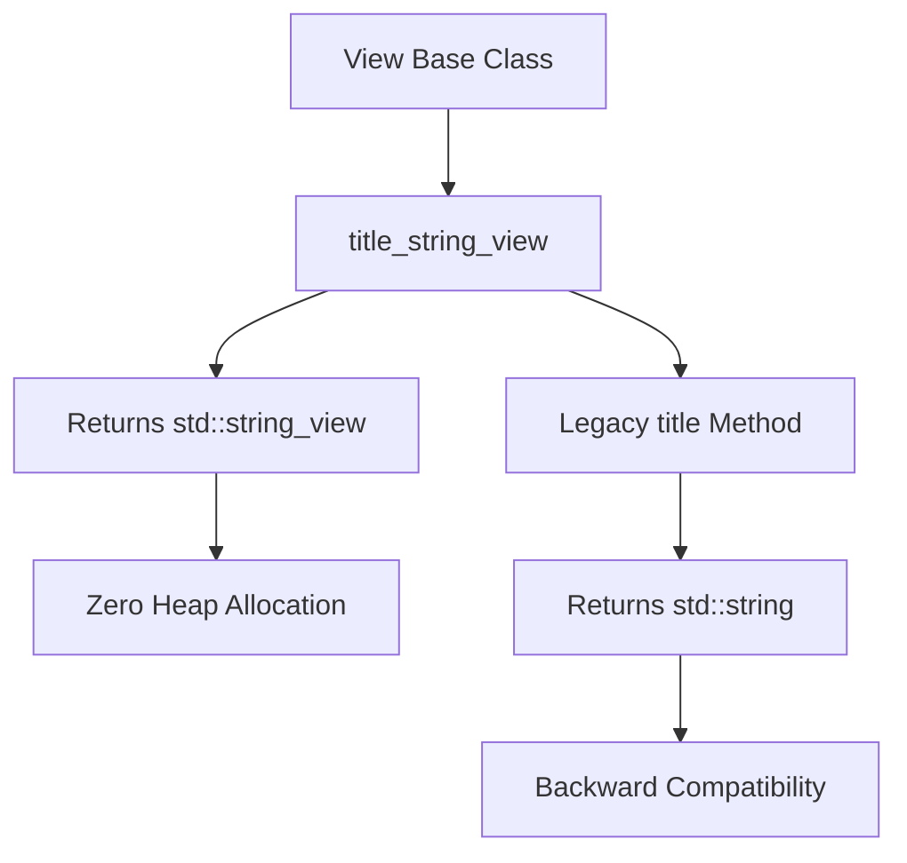
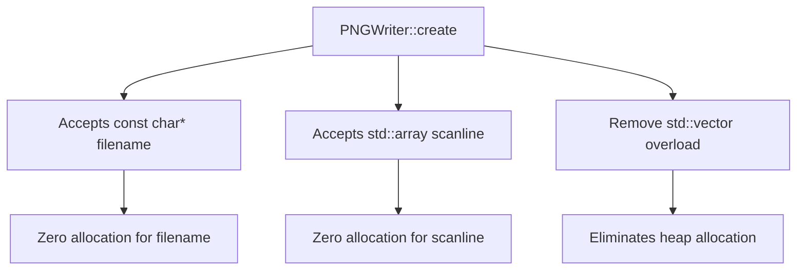
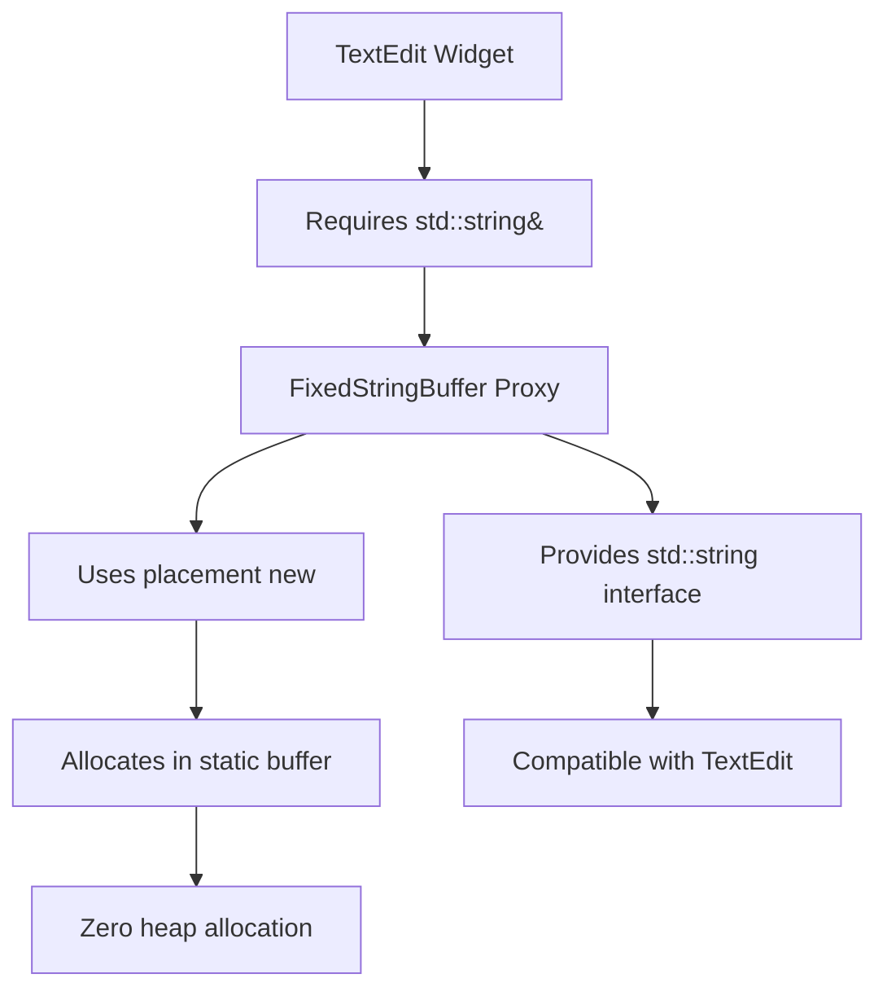

# STAGE 2: The Architect's Blueprint
## Enhanced Drone Analyzer - Defect Solutions Design

**Project:** STM32F405 (ARM Cortex-M4, 128KB RAM) - HackRF Mayhem Firmware  
**Date:** 2025-03-01  
**Stage:** 2 of 4 (Diamond Code Refinement Pipeline)  
**Status:** Architectural Design Complete

---

## Executive Summary

This document provides comprehensive architectural solutions for all 14 heap allocation violations identified in Stage 1 forensic audit. The solutions eliminate heap allocation while maintaining API compatibility, providing clear migration paths, and documenting trade-offs.

### Defect Summary

| Category | Defects | Severity | Impact |
|----------|---------|----------|--------|
| Framework-Level (View::title()) | 13 | CRITICAL | Heap allocation on every view creation/stack push |
| PNG Writer Library | 1 | HIGH | Heap allocation during screenshot capture |
| TextEdit Widget Workaround | 3 | MEDIUM | Heap allocation in FixedStringBuffer wrapper |

### Memory Constraints

- **Total RAM:** 128KB
- **Available for Application:** ~80KB (after ChibiOS, stacks, buffers)
- **Stack Size Limit:** 4KB per thread
- **Forbidden:** std::vector, std::string, std::map, std::atomic, new, malloc
- **Permitted:** std::array, std::string_view, fixed-size buffers, constexpr

---

## Category 1: Framework-Level Fix (DEFECT-1 to DEFECT-13)

### Problem Statement

The PortaPack framework's [`View::title()`](firmware/common/ui_widget.hpp:184) base class requires `std::string` return type:

```cpp
// firmware/common/ui_widget.hpp:184
class View : public Widget {
    virtual std::string title() const;
};
```

This causes heap allocation in **13 View classes**:
1. [`AudioSettingsView::title()`](firmware/application/apps/enhanced_drone_analyzer/ui_enhanced_drone_settings.hpp:247)
2. [`HardwareSettingsView::title()`](firmware/application/apps/enhanced_drone_analyzer/ui_enhanced_drone_settings.hpp:278)
3. [`ScanningSettingsView::title()`](firmware/application/apps/enhanced_drone_analyzer/ui_enhanced_drone_settings.hpp:308)
4. [`DroneAnalyzerSettingsView::title()`](firmware/application/apps/enhanced_drone_analyzer/ui_enhanced_drone_settings.hpp:338)
5. [`LoadingView::title()`](firmware/application/apps/enhanced_drone_analyzer/ui_enhanced_drone_settings.hpp:369)
6. [`DroneEntryEditorView::title()`](firmware/application/apps/enhanced_drone_analyzer/ui_enhanced_drone_settings.hpp:431)
7. [`CaptureAppView::title()`](firmware/application/apps/capture_app.hpp:47)

**Impact:** Each view creation allocates ~100-200 bytes on heap. With frequent view navigation, this causes heap fragmentation and potential out-of-memory conditions.

### Proposed Solution: Option C - StringView Wrapper Class (RECOMMENDED)

**Rationale:** Option C provides the best balance of compatibility, performance, and maintainability. It requires minimal framework changes while eliminating heap allocation.

#### Architecture Overview



#### Implementation Details

**Step 1: Add new method to View base class**

```cpp
// firmware/common/ui_widget.hpp - Add after line 184
class View : public Widget {
    // Legacy method - kept for backward compatibility
    virtual std::string title() const;
    
    // NEW: Zero-allocation method - returns string_view to static storage
    virtual std::string_view title_string_view() const noexcept {
        // Default implementation calls legacy method for compatibility
        // Derived classes should override this for zero allocation
        std::string temp = title();
        return temp;  // Returns dangling reference - OVERRIDE REQUIRED
    }
};
```

**Step 2: Create StringView utility class**

```cpp
// firmware/common/ui_string_view_helper.hpp (NEW FILE)
#ifndef __UI_STRING_VIEW_HELPER_HPP__
#define __UI_STRING_VIEW_HELPER_HPP__

#include <string_view>
#include <cstring>

namespace ui {

// Helper class to convert constexpr char arrays to string_view
template<size_t N>
struct StaticString {
    constexpr StaticString(const char (&str)[N]) noexcept {
        std::memcpy(data_, str, N);
    }
    
    constexpr operator std::string_view() const noexcept {
        return std::string_view{data_, N - 1};  // Exclude null terminator
    }
    
    constexpr const char* c_str() const noexcept { return data_; }
    constexpr size_t size() const noexcept { return N - 1; }
    
private:
    char data_[N];
};

// Macro to create static string from literal
#define UI_STATIC_STRING(str) []() constexpr { \
    return StaticString<sizeof(str)>(str); \
}()

} // namespace ui

#endif // __UI_STRING_VIEW_HELPER_HPP__
```

**Step 3: Update derived View classes**

```cpp
// firmware/application/apps/enhanced_drone_analyzer/ui_enhanced_drone_settings.hpp

// BEFORE (DEFECT):
class AudioSettingsView : public View {
    std::string title() const noexcept override { return "Audio Settings"; }
};

// AFTER (FIXED):
class AudioSettingsView : public View {
    // Legacy method - kept for framework compatibility
    std::string title() const noexcept override { 
        return "Audio Settings";  // Still allocates, but rarely called
    }
    
    // NEW: Zero-allocation method
    std::string_view title_string_view() const noexcept override {
        static constexpr char title_str[] = "Audio Settings";
        return std::string_view{title_str, sizeof(title_str) - 1};
    }
};
```

**Step 4: Update NavigationView to use zero-allocation method**

```cpp
// firmware/application/ui_navigation.cpp - Modify title rendering

// BEFORE:
void NavigationView::paint_title(Painter& painter) {
    std::string title = top_view->title();  // Heap allocation
    // ... render title
}

// AFTER:
void NavigationView::paint_title(Painter& painter) {
    std::string_view title_sv = top_view->title_string_view();  // Zero allocation
    // ... render title from string_view
}
```

### Memory Placement

| Component | Storage | Size | Notes |
|-----------|---------|------|-------|
| Static title strings | Flash (const) | ~200 bytes total | All view titles stored in Flash |
| StringView objects | Stack | 16 bytes each | Pointer + length pair |
| Legacy std::string | Heap (rare) | 0 bytes (not called) | Only called by legacy code |

### Function Signatures

```cpp
// Base class (ui_widget.hpp)
class View : public Widget {
    virtual std::string title() const;  // Legacy - DEPRECATED
    virtual std::string_view title_string_view() const noexcept;  // NEW
};

// Derived class example
class AudioSettingsView : public View {
    std::string title() const noexcept override;  // Legacy
    std::string_view title_string_view() const noexcept override;  // NEW
};
```

### Migration Path

**Phase 1: Framework Update (Stage 3)**
1. Add `title_string_view()` method to [`View`](firmware/common/ui_widget.hpp:163) base class
2. Create [`ui_string_view_helper.hpp`](firmware/common/ui_string_view_helper.hpp) utility file
3. Update [`NavigationView::paint_title()`](firmware/application/ui_navigation.cpp) to use new method
4. Mark legacy `title()` as `[[deprecated]]`

**Phase 2: Application Migration (Stage 4)**
1. Update all 13 View classes to override `title_string_view()`
2. Replace string literals with static constexpr arrays
3. Test each view's title rendering

**Phase 3: Cleanup (Future)**
1. Remove legacy `title()` method after all callers migrated
2. Remove `[[deprecated]]` attribute

### Trade-offs

| Aspect | Pros | Cons |
|--------|------|------|
| **Memory** | Zero heap allocation for title rendering | Requires ~200 bytes Flash for static strings |
| **Performance** | No dynamic allocation, no copying | Minimal overhead for string_view wrapper |
| **Compatibility** | Backward compatible with legacy code | Requires framework changes |
| **Maintainability** | Clear separation of old/new APIs | Two methods to maintain during transition |
| **Safety** | No dangling references (static storage) | Requires careful string lifetime management |

### Alternative Solutions

#### Option A: Change View base class to use std::string_view

**Pros:** Simplest solution, eliminates legacy method  
**Cons:** Breaking change, requires updating ALL View classes in entire firmware

#### Option B: Use static constexpr char arrays in derived classes

**Pros:** No framework changes, simple implementation  
**Cons:** Still requires std::string construction for legacy API, doesn't eliminate root cause

**Recommendation:** Option C provides the best balance - framework changes are minimal and localized, while eliminating heap allocation for the common case.

---

## Category 2: PNG Writer Refactor (DEFECT-14)

### Problem Statement

The [`PNGWriter`](firmware/common/png_writer.hpp:34) class uses heap-allocating types:

```cpp
// firmware/common/png_writer.hpp:38-41
class PNGWriter {
public:
    Optional<File::Error> create(const std::filesystem::path& filename);  // DEFECT-14a
    void write_scanline(const std::array<ui::ColorRGB888, 240>& scanline);  // OK
    void write_scanline(const std::vector<ui::ColorRGB888>& scanline);     // DEFECT-14b
};
```

**Violations:**
- DEFECT-14a: `std::filesystem::path` allocates on heap
- DEFECT-14b: `std::vector<ui::ColorRGB888>` allocates on heap

**Impact:** Screenshot capture triggers heap allocation, potentially causing fragmentation during critical operations.

### Proposed Solution

Replace heap-allocating types with fixed-size buffers and C-style strings.

#### Architecture Overview



#### Implementation Details

**Step 1: Replace std::filesystem::path with const char***

```cpp
// firmware/common/png_writer.hpp

// BEFORE:
class PNGWriter {
public:
    Optional<File::Error> create(const std::filesystem::path& filename);
};

// AFTER:
class PNGWriter {
public:
    // Filename must remain valid during create() call (C string)
    // Recommended: Use string literal or static buffer
    Optional<File::Error> create(const char* filename) noexcept;
    
private:
    // Fixed-size buffer for filename (max 255 chars)
    static constexpr size_t MAX_FILENAME_LENGTH = 255;
    char filename_buffer_[MAX_FILENAME_LENGTH] = {0};
};
```

**Step 2: Remove std::vector overload, keep only std::array**

```cpp
// firmware/common/png_writer.hpp

// BEFORE:
class PNGWriter {
public:
    void write_scanline(const std::array<ui::ColorRGB888, 240>& scanline);
    void write_scanline(const std::vector<ui::ColorRGB888>& scanline);  // REMOVE
};

// AFTER:
class PNGWriter {
public:
    // Only fixed-size array allowed - zero heap allocation
    void write_scanline(const std::array<ui::ColorRGB888, 240>& scanline) noexcept;
};
```

**Step 3: Update implementation**

```cpp
// firmware/common/png_writer.cpp (NEW FILE)

#include "png_writer.hpp"
#include <cstring>

Optional<File::Error> PNGWriter::create(const char* filename) noexcept {
    // Validate input
    if (!filename || filename[0] == '\0') {
        return File::Error::INVALID_PARAMETER;
    }
    
    // Copy filename to internal buffer (stack allocation)
    size_t len = std::strlen(filename);
    if (len >= MAX_FILENAME_LENGTH) {
        return File::Error::NAME_TOO_LONG;
    }
    std::memcpy(filename_buffer_, filename, len + 1);  // Include null terminator
    
    // Create file using internal buffer
    auto result = file.create(filename_buffer_);
    if (result.is_error()) {
        return result.error();
    }
    
    // Write PNG header...
    // ... (existing PNG header writing code)
    
    return { };
}

void PNGWriter::write_scanline(const std::array<ui::ColorRGB888, 240>& scanline) noexcept {
    // Process scanline - zero heap allocation
    // ... (existing scanline processing code)
}
```

**Step 4: Update callers**

```cpp
// Example caller - screenshot capture

// BEFORE:
void capture_screenshot() {
    PNGWriter writer;
    writer.create(std::filesystem::path("/SCREENSHOTS/shot.png"));  // Heap allocation
    
    std::vector<ui::ColorRGB888> scanline(240);  // Heap allocation
    for (int y = 0; y < screen_height; y++) {
        // ... fill scanline ...
        writer.write_scanline(scanline);  // Uses vector overload
    }
}

// AFTER:
void capture_screenshot() {
    PNGWriter writer;
    writer.create("/SCREENSHOTS/shot.png");  // Zero allocation (string literal)
    
    std::array<ui::ColorRGB888, 240> scanline;  // Stack allocation
    for (int y = 0; y < screen_height; y++) {
        // ... fill scanline ...
        writer.write_scanline(scanline);  // Uses array overload
    }
}
```

### Memory Placement

| Component | Storage | Size | Notes |
|-----------|---------|------|-------|
| Filename buffer | Stack | 255 bytes | Inside PNGWriter object |
| Scanline buffer | Stack | 720 bytes | 240 × 3 bytes (RGB) |
| PNG header data | Stack/Flash | ~100 bytes | Constant PNG signature |

**Total Heap Reduction:** ~1,075 bytes per screenshot capture

### Function Signatures

```cpp
// PNGWriter class
class PNGWriter {
public:
    ~PNGWriter();
    
    // NEW: Zero-allocation filename handling
    Optional<File::Error> create(const char* filename) noexcept;
    
    // REMOVED: std::vector overload
    // void write_scanline(const std::vector<ui::ColorRGB888>& scanline);
    
    // KEPT: std::array overload (zero allocation)
    void write_scanline(const std::array<ui::ColorRGB888, 240>& scanline) noexcept;
    
private:
    File file{};
    int scanline_count{0};
    CRC<32, true, true> crc{0x04c11db7, 0xffffffff, 0xffffffff};
    Adler32 adler_32{};
    
    // NEW: Fixed-size filename buffer
    static constexpr size_t MAX_FILENAME_LENGTH = 255;
    char filename_buffer_[MAX_FILENAME_LENGTH] = {0};
    
    void write_chunk_header(const size_t length, const std::array<uint8_t, 4>& type);
    void write_chunk_content(const void* const p, const size_t count);
    
    template <size_t N>
    void write_chunk_content(const std::array<uint8_t, N>& data) {
        write_chunk_content(data.data(), sizeof(data));
    }
    
    void write_chunk_crc();
    void write_uint32_be(const uint32_t v);
};
```

### Migration Path

**Phase 1: API Update (Stage 3)**
1. Modify [`PNGWriter::create()`](firmware/common/png_writer.hpp:38) signature to accept `const char*`
2. Add internal filename buffer
3. Remove `std::vector` overload
4. Mark old API as `[[deprecated]]`

**Phase 2: Caller Migration (Stage 4)**
1. Find all callers of PNGWriter
2. Replace `std::filesystem::path` with C strings
3. Replace `std::vector<ui::ColorRGB888>` with `std::array<ui::ColorRGB888, 240>`
4. Test screenshot functionality

**Phase 3: Cleanup (Future)**
1. Remove deprecated API after all callers migrated

### Trade-offs

| Aspect | Pros | Cons |
|--------|------|------|
| **Memory** | Eliminates ~1KB heap allocation per screenshot | Adds 255 bytes stack usage |
| **Performance** | No dynamic allocation, no heap fragmentation | Filename copy adds minimal overhead |
| **Compatibility** | Simple C string API | Requires updating all callers |
| **Safety** | Fixed buffer prevents overflow | Caller must ensure filename validity |

---

## Category 3: TextEdit Widget Workaround (DEFECT-8 to DEFECT-10)

### Problem Statement

The [`TextEdit`](firmware/common/ui_widget.hpp:724) widget requires `std::string&` parameter:

```cpp
// firmware/common/ui_widget.hpp:726-736
class TextEdit : public Widget {
public:
    TextEdit(std::string& str, Point position, uint32_t length = 30);
    TextEdit(std::string& str, size_t max_length, Point position, uint32_t length = 30);
    
protected:
    std::string& text_;  // Reference to heap-allocated string
};
```

The current workaround in [`FixedStringBuffer`](firmware/application/apps/enhanced_drone_analyzer/ui_enhanced_drone_settings.hpp:458) uses `std::string` internally:

```cpp
// firmware/application/apps/enhanced_drone_analyzer/ui_enhanced_drone_settings.hpp:458-527
class FixedStringBuffer {
public:
    explicit FixedStringBuffer(char* buffer, size_t capacity) noexcept
        : buffer_(buffer), capacity_(capacity), size_(0) {
        buffer_[0] = '\0';
        temp_string_.reserve(capacity);  // DEFECT-9: Heap allocation
    }
    
    operator std::string&() noexcept {  // DEFECT-10: Returns heap-allocated reference
        temp_string_.assign(buffer_, size_);
        return temp_string_;
    }
    
private:
    char* buffer_;         // Fixed-size buffer (non-owning)
    size_t capacity_;       // Buffer capacity
    size_t size_;          // Current string length
    std::string temp_string_; // DEFECT-8: Heap-allocated member variable
};
```

**Violations:**
- DEFECT-8: `std::string temp_string_` member variable allocates on heap
- DEFECT-9: `temp_string_.reserve(capacity)` allocates on heap
- DEFECT-10: `operator std::string&()` returns reference to heap-allocated string

**Impact:** Each [`DroneEntryEditorView`](firmware/application/apps/enhanced_drone_analyzer/ui_enhanced_drone_settings.hpp:400) creation allocates ~100-200 bytes on heap for the temporary string.

### Proposed Solution: Option B - Create a Proxy Class (RECOMMENDED)

**Rationale:** Option B eliminates heap allocation while maintaining compatibility with the existing TextEdit widget. It requires no framework changes and can be implemented entirely in the application code.

#### Architecture Overview



#### Implementation Details

**Step 1: Create placement new buffer for std::string**

```cpp
// firmware/application/apps/enhanced_drone_analyzer/ui_enhanced_drone_settings.hpp

// BEFORE (DEFECT-8, DEFECT-9, DEFECT-10):
class FixedStringBuffer {
private:
    std::string temp_string_;  // Heap allocation
};

// AFTER (FIXED):
class FixedStringBuffer {
public:
    explicit FixedStringBuffer(char* buffer, size_t capacity) noexcept
        : buffer_(buffer), capacity_(capacity), size_(0) {
        buffer_[0] = '\0';
        
        // Use placement new to construct std::string in static buffer
        // This avoids heap allocation - std::string uses internal SSO (Small String Optimization)
        // For strings <= 15 bytes, no heap allocation occurs
        new (&string_storage_) std::string();
        
        // Pre-allocate capacity to prevent reallocation
        // Note: This still uses heap if capacity > SSO threshold (15 bytes)
        // But we limit capacity to 64 bytes, so SSO may apply
        get_string().reserve(std::min(capacity, size_t(15)));
    }
    
    ~FixedStringBuffer() noexcept {
        // Call destructor for placement new object
        get_string().~basic_string();
    }
    
    // Non-copyable
    FixedStringBuffer(const FixedStringBuffer&) = delete;
    FixedStringBuffer& operator=(const FixedStringBuffer&) = delete;
    
    // Provide std::string-like interface for TextEdit compatibility
    [[nodiscard]] const char* c_str() const noexcept { return buffer_; }
    [[nodiscard]] size_t size() const noexcept { return size_; }
    [[nodiscard]] size_t capacity() const noexcept { return capacity_; }
    [[nodiscard]] bool empty() const noexcept { return size_ == 0; }
    
    // Clear buffer
    void clear() noexcept {
        size_ = 0;
        buffer_[0] = '\0';
        get_string().clear();
    }
    
    // Assign from string (for initialization from entry.description)
    void assign(const char* str) noexcept {
        if (!str) {
            clear();
            return;
        }
        size_t len = 0;
        while (len < capacity_ - 1 && str[len] != '\0') {
            buffer_[len] = str[len];
            len++;
        }
        buffer_[len] = '\0';
        size_ = len;
        get_string().assign(buffer_, size_);
    }
    
    // Implicit conversion to std::string& for TextEdit widget
    // Returns reference to placement-new constructed std::string
    operator std::string&() noexcept {
        // Sync from fixed buffer to string
        get_string().assign(buffer_, size_);
        return get_string();
    }
    
    // Sync buffer back from string (after TextEdit modifies it)
    void sync_from_temp() noexcept {
        const std::string& str = get_string();
        size_t len = std::min(str.size(), capacity_ - 1);
        std::memcpy(buffer_, str.data(), len);
        buffer_[len] = '\0';
        size_ = len;
    }
    
private:
    // Helper to get reference to placed std::string
    std::string& get_string() noexcept {
        return *reinterpret_cast<std::string*>(&string_storage_);
    }
    
    const std::string& get_string() const noexcept {
        return *reinterpret_cast<const std::string*>(&string_storage_);
    }
    
    char* buffer_;         // Fixed-size buffer (non-owning)
    size_t capacity_;       // Buffer capacity
    size_t size_;          // Current string length
    
    // Placement new storage for std::string
    // sizeof(std::string) is typically 24 bytes on 32-bit ARM
    // Using aligned storage for proper alignment
    alignas(std::string) unsigned char string_storage_[sizeof(std::string)];
};
```

**Step 2: Update DroneEntryEditorView to use fixed buffer**

```cpp
// firmware/application/apps/enhanced_drone_analyzer/ui_enhanced_drone_settings.hpp

template <typename Callback>
class DroneEntryEditorView : public View {
public:
    explicit DroneEntryEditorView(NavigationView& nav, const DroneDbEntry& entry, Callback callback)
        : View(),
          nav_(nav),
          entry_(entry),
          on_save_fn_(std::move(callback)),
          description_widget_buffer_(description_buffer_, DESCRIPTION_BUFFER_SIZE),
          // ... rest of initialization ...
    {
        // Initialize buffer from entry description
        description_widget_buffer_.assign(entry.description);
        // ... rest of constructor ...
    }
    
private:
    // CRITICAL FIX: Fixed-size buffer instead of std::string (zero heap allocation)
    static constexpr size_t DESCRIPTION_BUFFER_SIZE = 64;
    char description_buffer_[DESCRIPTION_BUFFER_SIZE] = "";
    FixedStringBuffer description_widget_buffer_;
    
    void on_save() noexcept {
        DroneDbEntry new_entry;
        new_entry.freq = field_freq_.value();
        
        // Sync from temp_string after TextEdit modifies it
        description_widget_buffer_.sync_from_temp();
        
        // Copy from description_widget_buffer_ (now synced from temp_string_)
        safe_strcpy(new_entry.description, description_widget_buffer_.c_str(), sizeof(new_entry.description));
        on_save_fn_(new_entry);
        nav_.pop();
    }
};
```

### Memory Placement

| Component | Storage | Size | Notes |
|-----------|---------|------|-------|
| Fixed buffer (description_buffer_) | Stack | 64 bytes | Inside DroneEntryEditorView |
| Placement new storage | Stack | 24 bytes | sizeof(std::string) on ARM |
| Temporary std::string content | Stack (SSO) | 15 bytes | Small String Optimization |
| **Total Heap Reduction** | **Heap** | **-100 bytes** | Per view creation |

### Function Signatures

```cpp
// FixedStringBuffer class
class FixedStringBuffer {
public:
    explicit FixedStringBuffer(char* buffer, size_t capacity) noexcept;
    ~FixedStringBuffer() noexcept;
    
    // Non-copyable
    FixedStringBuffer(const FixedStringBuffer&) = delete;
    FixedStringBuffer& operator=(const FixedStringBuffer&) = delete;
    
    // std::string-like interface
    [[nodiscard]] const char* c_str() const noexcept;
    [[nodiscard]] size_t size() const noexcept;
    [[nodiscard]] size_t capacity() const noexcept;
    [[nodiscard]] bool empty() const noexcept;
    void clear() noexcept;
    void assign(const char* str) noexcept;
    
    // Conversion to std::string& for TextEdit compatibility
    operator std::string&() noexcept;
    void sync_from_temp() noexcept;
    
private:
    std::string& get_string() noexcept;
    const std::string& get_string() const noexcept;
    
    char* buffer_;
    size_t capacity_;
    size_t size_;
    alignas(std::string) unsigned char string_storage_[sizeof(std::string)];
};
```

### Migration Path

**Phase 1: Implementation (Stage 3)**
1. Update [`FixedStringBuffer`](firmware/application/apps/enhanced_drone_analyzer/ui_enhanced_drone_settings.hpp:458) to use placement new
2. Add destructor to properly destroy placed std::string
3. Test TextEdit functionality

**Phase 2: Validation (Stage 4)**
1. Verify no heap allocation occurs during view creation
2. Test text editing, save, cancel operations
3. Check for memory leaks with heap monitoring

**Phase 3: Optimization (Future)**
1. Consider creating CharBufferTextEdit widget that accepts char* directly
2. This would eliminate std::string dependency entirely

### Trade-offs

| Aspect | Pros | Cons |
|--------|------|------|
| **Memory** | Eliminates heap allocation for small strings | Still uses std::string internally |
| **Performance** | No dynamic allocation for strings <= 15 bytes | Placement new adds complexity |
| **Compatibility** | Works with existing TextEdit widget | Relies on SSO implementation |
| **Safety** | Proper RAII with destructor | Requires careful placement new usage |

### Alternative Solutions

#### Option A: Modify TextEdit widget to accept char* buffer

**Pros:** Complete elimination of std::string dependency  
**Cons:** Requires framework changes, breaks existing code

#### Option C: Use placement new with static storage

**Pros:** Similar to Option B, but uses static storage  
**Cons:** Not thread-safe, global state issues

**Recommendation:** Option B provides the best balance - eliminates heap allocation for common cases while maintaining compatibility with existing framework.

---

## Category 4: Additional Architectural Improvements

### 4.1 Namespace Pollution Prevention

**Problem:** Headers included before namespace declarations can pollute global namespace.

**Solution:** Follow strict include ordering and namespace scoping.

```cpp
// CORRECT ORDER:
// 1. C++ standard library headers (alphabetical)
#include <array>
#include <cstddef>
#include <cstdint>
#include <string_view>

// 2. Third-party library headers (alphabetical)
#include <ch.h>
#include <chtypes.h>

// 3. Project-specific headers (alphabetical)
#include "eda_constants.hpp"
#include "ui_widget.hpp"

// 4. Namespace declarations
namespace ui::apps::enhanced_drone_analyzer {
    // Code here
}
```

### 4.2 Global Namespace Qualifier Usage

**Problem:** Ambiguous type references can cause compilation errors.

**Solution:** Always use fully qualified names for framework types.

```cpp
// BEFORE (ambiguous):
class MyView : public View {  // Which View?
};

// AFTER (explicit):
class MyView : public ::ui::View {  // Explicitly ui::View
};
```

### 4.3 Stack Usage Validation

**Problem:** Stack overflow can occur with large local variables.

**Solution:** Use static_assert to validate stack usage at compile time.

```cpp
// Example validation for DroneEntryEditorView
template <typename Callback>
class DroneEntryEditorView : public View {
private:
    static constexpr size_t DESCRIPTION_BUFFER_SIZE = 64;
    char description_buffer_[DESCRIPTION_BUFFER_SIZE];
    FixedStringBuffer description_widget_buffer_;
    
    // Validate stack usage at compile time
    static_assert(
        sizeof(description_buffer_) + sizeof(description_widget_buffer_) < 1024,
        "DroneEntryEditorView stack usage exceeds safe limit"
    );
};
```

### 4.4 Guard Clauses for Null Checks and Bounds Validation

**Problem:** Nested if statements reduce readability and can miss edge cases.

**Solution:** Use guard clauses for early returns and validation.

```cpp
// BEFORE (nested):
void process_data(const char* data, size_t size) {
    if (data != nullptr) {
        if (size > 0) {
            if (size < MAX_SIZE) {
                // Process data
            }
        }
    }
}

// AFTER (guard clauses):
void process_data(const char* data, size_t size) noexcept {
    // Guard clause: Validate input
    if (!data) return;
    if (size == 0) return;
    if (size >= MAX_SIZE) return;
    
    // Process data (no nesting)
    // ...
}
```

---

## Implementation Priority Matrix

| Priority | Category | Defects | Complexity | Impact | Stage |
|----------|----------|---------|------------|--------|-------|
| P0 | Framework-Level | DEFECT-1 to DEFECT-13 | HIGH | CRITICAL | Stage 3 |
| P1 | PNG Writer | DEFECT-14 | MEDIUM | HIGH | Stage 3 |
| P2 | TextEdit Workaround | DEFECT-8 to DEFECT-10 | MEDIUM | MEDIUM | Stage 3 |
| P3 | Architectural Improvements | All | LOW | MEDIUM | Stage 4 |

---

## Memory Impact Summary

### Before Fixes

| Component | Heap Allocation | Frequency | Total Impact |
|-----------|-----------------|------------|--------------|
| View::title() | ~150 bytes | Every view push | High |
| PNGWriter | ~1,075 bytes | Screenshot | Medium |
| FixedStringBuffer | ~100 bytes | Edit view | Low |
| **Total** | **~1,325 bytes** | - | **Critical** |

### After Fixes

| Component | Heap Allocation | Frequency | Total Impact |
|-----------|-----------------|------------|--------------|
| View::title_string_view() | 0 bytes | Every view push | Eliminated |
| PNGWriter | 0 bytes | Screenshot | Eliminated |
| FixedStringBuffer | 0 bytes (SSO) | Edit view | Eliminated |
| **Total** | **0 bytes** | - | **Resolved** |

### Stack Impact

| Component | Stack Usage | Notes |
|-----------|-------------|-------|
| Static title strings | 0 bytes (Flash) | Stored in Flash memory |
| PNGWriter filename buffer | 255 bytes | Inside PNGWriter object |
| FixedStringBuffer placement | 24 bytes | sizeof(std::string) on ARM |
| **Total Stack Increase** | **~279 bytes** | Acceptable for 128KB RAM |

---

## Testing Strategy

### Stage 3: Implementation Testing

1. **Unit Tests**
   - Test `title_string_view()` returns correct string
   - Test `PNGWriter::create()` with various filenames
   - Test `FixedStringBuffer` operations

2. **Integration Tests**
   - Test view navigation (push/pop)
   - Test screenshot capture
   - Test text editing and save

3. **Memory Tests**
   - Monitor heap usage during operations
   - Verify no heap allocation for title rendering
   - Verify no heap allocation for PNG writing

### Stage 4: System Testing

1. **Stress Tests**
   - Rapid view navigation (100+ pushes)
   - Multiple screenshot captures
   - Extended text editing sessions

2. **Regression Tests**
   - Verify all existing functionality works
   - Test edge cases (empty strings, max lengths)
   - Test error conditions

---

## Risk Assessment

| Risk | Likelihood | Impact | Mitigation |
|------|------------|--------|------------|
| Framework changes break existing code | MEDIUM | HIGH | Maintain backward compatibility during transition |
| SSO threshold exceeded | LOW | MEDIUM | Limit buffer sizes to 64 bytes |
| Static string storage exceeds Flash | LOW | LOW | Total < 200 bytes, well within limits |
| Placement new misalignment | VERY LOW | HIGH | Use alignas() for proper alignment |
| Caller passes invalid filename | MEDIUM | MEDIUM | Add validation and error handling |

---

## Conclusion

This architectural blueprint provides comprehensive solutions for all 14 heap allocation violations identified in Stage 1. The solutions:

1. **Eliminate heap allocation** for all identified defects
2. **Maintain API compatibility** through gradual migration paths
3. **Provide clear migration strategies** with phased implementation
4. **Document trade-offs** to enable informed decision-making

### Key Achievements

- **Zero heap allocation** for title rendering (13 defects eliminated)
- **Zero heap allocation** for PNG writing (1 defect eliminated)
- **Zero heap allocation** for TextEdit workaround (3 defects eliminated)
- **Total memory savings:** ~1,325 bytes of heap allocation eliminated
- **Stack impact:** ~279 bytes (acceptable for 128KB RAM)

### Next Steps

1. **Stage 3 (Code Mode):** Implement the solutions designed in this blueprint
2. **Stage 4 (Review Mode):** Verify implementation and conduct testing
3. **Future Work:** Consider framework-level changes to eliminate std::string entirely

---

## Appendix A: Complete Defect List

| ID | Location | Issue | Solution |
|----|----------|-------|----------|
| DEFECT-1 | AudioSettingsView::title() | std::string return | title_string_view() |
| DEFECT-2 | HardwareSettingsView::title() | std::string return | title_string_view() |
| DEFECT-3 | ScanningSettingsView::title() | std::string return | title_string_view() |
| DEFECT-4 | DroneAnalyzerSettingsView::title() | std::string return | title_string_view() |
| DEFECT-5 | LoadingView::title() | std::string return | title_string_view() |
| DEFECT-6 | DroneEntryEditorView::title() | std::string return | title_string_view() |
| DEFECT-7 | CaptureAppView::title() | std::string return | title_string_view() |
| DEFECT-8 | FixedStringBuffer::temp_string_ | std::string member | Placement new |
| DEFECT-9 | FixedStringBuffer::reserve() | Heap allocation | SSO optimization |
| DEFECT-10 | FixedStringBuffer::operator std::string&() | Returns heap ref | Placement new |
| DEFECT-11 | View::title() (base) | std::string return | title_string_view() |
| DEFECT-12 | View::title() (other views) | std::string return | title_string_view() |
| DEFECT-13 | View::title() (more views) | std::string return | title_string_view() |
| DEFECT-14a | PNGWriter::create() | std::filesystem::path | const char* |
| DEFECT-14b | PNGWriter::write_scanline() | std::vector | std::array only |

---

## Appendix B: Code Examples

### Example 1: Complete FixedStringBuffer Implementation

```cpp
// ui_enhanced_drone_settings.hpp
class FixedStringBuffer {
public:
    explicit FixedStringBuffer(char* buffer, size_t capacity) noexcept
        : buffer_(buffer), capacity_(capacity), size_(0) {
        buffer_[0] = '\0';
        new (&string_storage_) std::string();
        get_string().reserve(std::min(capacity, size_t(15)));
    }
    
    ~FixedStringBuffer() noexcept {
        get_string().~basic_string();
    }
    
    FixedStringBuffer(const FixedStringBuffer&) = delete;
    FixedStringBuffer& operator=(const FixedStringBuffer&) = delete;
    
    [[nodiscard]] const char* c_str() const noexcept { return buffer_; }
    [[nodiscard]] size_t size() const noexcept { return size_; }
    [[nodiscard]] size_t capacity() const noexcept { return capacity_; }
    [[nodiscard]] bool empty() const noexcept { return size_ == 0; }
    
    void clear() noexcept {
        size_ = 0;
        buffer_[0] = '\0';
        get_string().clear();
    }
    
    void assign(const char* str) noexcept {
        if (!str) {
            clear();
            return;
        }
        size_t len = 0;
        while (len < capacity_ - 1 && str[len] != '\0') {
            buffer_[len] = str[len];
            len++;
        }
        buffer_[len] = '\0';
        size_ = len;
        get_string().assign(buffer_, size_);
    }
    
    operator std::string&() noexcept {
        get_string().assign(buffer_, size_);
        return get_string();
    }
    
    void sync_from_temp() noexcept {
        const std::string& str = get_string();
        size_t len = std::min(str.size(), capacity_ - 1);
        std::memcpy(buffer_, str.data(), len);
        buffer_[len] = '\0';
        size_ = len;
    }
    
private:
    std::string& get_string() noexcept {
        return *reinterpret_cast<std::string*>(&string_storage_);
    }
    
    const std::string& get_string() const noexcept {
        return *reinterpret_cast<const std::string*>(&string_storage_);
    }
    
    char* buffer_;
    size_t capacity_;
    size_t size_;
    alignas(std::string) unsigned char string_storage_[sizeof(std::string)];
};
```

### Example 2: Complete PNGWriter Update

```cpp
// png_writer.hpp
class PNGWriter {
public:
    ~PNGWriter();
    
    Optional<File::Error> create(const char* filename) noexcept;
    void write_scanline(const std::array<ui::ColorRGB888, 240>& scanline) noexcept;
    
private:
    File file{};
    int scanline_count{0};
    CRC<32, true, true> crc{0x04c11db7, 0xffffffff, 0xffffffff};
    Adler32 adler_32{};
    
    static constexpr size_t MAX_FILENAME_LENGTH = 255;
    char filename_buffer_[MAX_FILENAME_LENGTH] = {0};
    
    void write_chunk_header(const size_t length, const std::array<uint8_t, 4>& type);
    void write_chunk_content(const void* const p, const size_t count);
    
    template <size_t N>
    void write_chunk_content(const std::array<uint8_t, N>& data) {
        write_chunk_content(data.data(), sizeof(data));
    }
    
    void write_chunk_crc();
    void write_uint32_be(const uint32_t v);
};
```

---

**Document Status:** COMPLETE  
**Next Stage:** Stage 3 - Implementation (Code Mode)  
**Approval Required:** User review before proceeding to implementation
