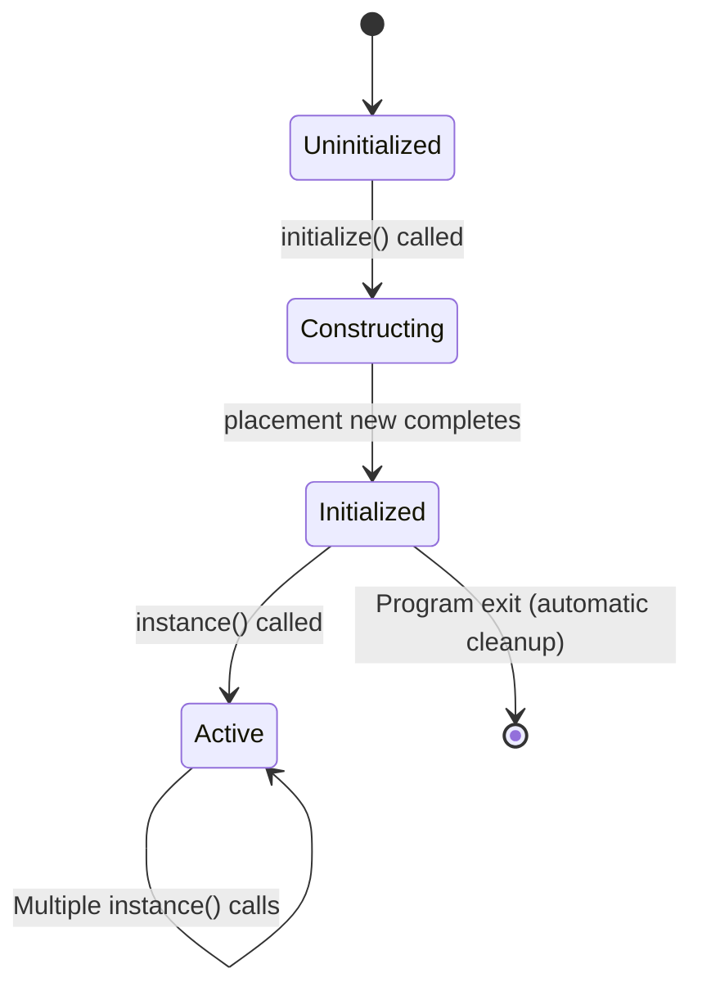

# STAGE 2: ARCHITECT'S BLUEPRINT - ScanningCoordinator Heap Allocation Fix

## Executive Summary

This document provides a detailed design blueprint for eliminating the critical heap allocation defect in the [`ScanningCoordinator`](firmware/application/apps/enhanced_drone_analyzer/scanning_coordinator.hpp:37) singleton pattern. The solution uses placement new with a pre-allocated static buffer, ensuring zero heap allocation while maintaining all existing functionality and thread safety guarantees.

---

## 1. Proposed Solution Architecture

### 1.1 Memory Placement Strategy

**Strategy:** Static buffer with placement new

**Rationale:**
- Eliminates heap allocation entirely
- Memory reserved at compile time (BSS segment)
- Allows deferred initialization with constructor parameters
- Zero runtime overhead
- Compatible with bare-metal/ChibiOS environment

**Memory Segment:** BSS (Block Started by Symbol)
- Zero-initialized at startup
- Does not consume Flash space (only RAM)
- Lifetime: Entire program execution

### 1.2 Data Structures

#### Primary Structure: `std::aligned_storage`

```cpp
// In scanning_coordinator.hpp
#include <type_traits>  // For std::aligned_storage

class ScanningCoordinator {
    // ... existing code ...

private:
    // Static storage buffer for singleton instance
    // Uses aligned_storage for type-safe, properly aligned memory
    static std::aligned_storage<sizeof(ScanningCoordinator), 
                                 alignof(ScanningCoordinator)>::type instance_storage_;

    // ... existing code ...
};
```

**Key Properties:**
- `sizeof(ScanningCoordinator)`: Exact byte size of the object
- `alignof(ScanningCoordinator)`: Required alignment for the object
- Type-safe: Compiler ensures correct size and alignment
- Zero-overhead: No runtime cost

#### Alternative: Byte Array Buffer (if C++11 features are limited)

```cpp
// Alternative implementation using byte array
static constexpr size_t INSTANCE_BUFFER_SIZE = sizeof(ScanningCoordinator);
static constexpr size_t INSTANCE_ALIGNMENT = alignof(ScanningCoordinator);
static alignas(INSTANCE_ALIGNMENT) uint8_t instance_buffer_[INSTANCE_BUFFER_SIZE];
```

### 1.3 Initialization Approach

**Placement New Pattern:**

```cpp
// In scanning_coordinator.cpp
bool ScanningCoordinator::initialize(/* parameters */) noexcept {
    MutexLock lock(init_mutex_, LockOrder::DATA_MUTEX);

    if (initialized_) {
        return false;
    }

    // Use placement new to construct object in pre-allocated buffer
    // This does NOT allocate from heap - it constructs in static memory
    instance_ptr_ = new (&instance_storage_) ScanningCoordinator(
        nav, hardware, scanner, display_controller, audio_controller
    );

    initialized_ = true;
    return true;
}
```

**Cleanup (if needed):**

```cpp
// Manual destructor call (only if explicit cleanup is required)
void ScanningCoordinator::cleanup() noexcept {
    MutexLock lock(init_mutex_, LockOrder::DATA_MUTEX);

    if (!initialized_) {
        return;
    }

    // Explicitly call destructor
    instance_ptr_->~ScanningCoordinator();
    
    instance_ptr_ = nullptr;
    initialized_ = false;
}
```

---

## 2. Function Signatures & RAII Wrappers

### 2.1 Updated Function Signatures

#### Header Changes ([`scanning_coordinator.hpp`](firmware/application/apps/enhanced_drone_analyzer/scanning_coordinator.hpp:1))

```cpp
// Add include for type_traits
#include <type_traits>

class ScanningCoordinator {
public:
    // Existing public interface - NO CHANGES
    ~ScanningCoordinator() noexcept;
    
    static ScanningCoordinator& instance() noexcept;
    static bool initialize(NavigationView& nav,
                          DroneHardwareController& hardware,
                          DroneScanner& scanner,
                          DroneDisplayController& display_controller,
                          ::AudioManager& audio_controller) noexcept;

    // All other public methods remain unchanged...

private:
    // Private constructor - NO CHANGES
    ScanningCoordinator(NavigationView& nav,
                       DroneHardwareController& hardware,
                       DroneScanner& scanner,
                       DroneDisplayController& display_controller,
                       ::AudioManager& audio_controller) noexcept;

    // NEW: Static storage buffer
    static std::aligned_storage<sizeof(ScanningCoordinator), 
                                 alignof(ScanningCoordinator)>::type instance_storage_;

    // Existing member variables - NO CHANGES
    NavigationView& nav_;
    DroneHardwareController& hardware_;
    DroneScanner& scanner_;
    DroneDisplayController& display_controller_;
    ::AudioManager& audio_controller_;
    // ... rest of members ...
};
```

#### Implementation Changes ([`scanning_coordinator.cpp`](firmware/application/apps/enhanced_drone_analyzer/scanning_coordinator.cpp:1))

```cpp
// Singleton storage definition (BSS segment, zero-initialized)
// OLD: ScanningCoordinator* ScanningCoordinator::instance_ptr_ = nullptr;
// NEW: 
std::aligned_storage<sizeof(ScanningCoordinator), 
                     alignof(ScanningCoordinator)>::type 
    ScanningCoordinator::instance_storage_;

ScanningCoordinator* ScanningCoordinator::instance_ptr_ = nullptr;
Mutex ScanningCoordinator::init_mutex_;
bool ScanningCoordinator::initialized_ = false;

// initialize() function - ONLY CHANGE IS THE PLACEMENT NEW
bool ScanningCoordinator::initialize(NavigationView& nav,
                                   DroneHardwareController& hardware,
                                   DroneScanner& scanner,
                                   DroneDisplayController& display_controller,
                                   ::AudioManager& audio_controller) noexcept {
    MutexLock lock(init_mutex_, LockOrder::DATA_MUTEX);

    if (initialized_) {
        return false;
    }

    // OLD: instance_ptr_ = new ScanningCoordinator(...);  // HEAP ALLOCATION
    // NEW: instance_ptr_ = new (&instance_storage_) ScanningCoordinator(...);  // PLACEMENT NEW
    instance_ptr_ = new (&instance_storage_) ScanningCoordinator(
        nav, hardware, scanner, display_controller, audio_controller
    );

    initialized_ = true;
    return true;
}

// All other functions remain unchanged...
```

### 2.2 RAII Wrappers

**No new RAII wrappers required.** The existing [`MutexLock`](firmware/application/apps/enhanced_drone_analyzer/eda_locking.hpp:77) class from [`eda_locking.hpp`](firmware/application/apps/enhanced_drone_analyzer/eda_locking.hpp:1) provides all necessary thread safety:

```cpp
// Existing RAII wrapper - NO CHANGES NEEDED
class MutexLock {
public:
    explicit MutexLock(Mutex& mtx, LockOrder order = LockOrder::DATA_MUTEX) noexcept;
    ~MutexLock() noexcept;
    
    // Non-copyable, non-movable
    MutexLock(const MutexLock&) = delete;
    MutexLock& operator=(const MutexLock&) = delete;
    MutexLock(MutexLock&&) = delete;
    MutexLock& operator=(MutexLock&&) = delete;
};
```

### 2.3 Thread Safety Mechanisms

**Existing mechanisms remain unchanged:**

1. **Initialization Mutex:** [`init_mutex_`](firmware/application/apps/enhanced_drone_analyzer/scanning_coordinator.hpp:118)
   - Protects singleton initialization
   - Prevents race conditions during first access

2. **State Mutex:** [`state_mutex_`](firmware/application/apps/enhanced_drone_analyzer/scanning_coordinator.hpp:99)
   - Protects scanning state variables
   - Used in [`is_scanning_active()`](firmware/application/apps/enhanced_drone_analyzer/scanning_coordinator.cpp:227)

3. **Thread Mutex:** [`thread_mutex_`](firmware/application/apps/enhanced_drone_analyzer/scanning_coordinator.hpp:100)
   - Protects thread creation/destruction
   - Used in [`start_coordinated_scanning()`](firmware/application/apps/enhanced_drone_analyzer/scanning_coordinator.cpp:153) and [`stop_coordinated_scanning()`](firmware/application/apps/enhanced_drone_analyzer/scanning_coordinator.cpp:192)

4. **Lock Ordering:** [`LockOrder`](firmware/application/apps/enhanced_drone_analyzer/eda_locking.hpp:47) enum
   - Prevents deadlocks
   - Ensures consistent lock acquisition order

---

## 3. Implementation Details

### 3.1 Specific Code Changes

#### Change 1: Add `#include <type_traits>` to header

**File:** [`scanning_coordinator.hpp`](firmware/application/apps/enhanced_drone_analyzer/scanning_coordinator.hpp:1)

**Location:** After existing includes (around line 16)

**Change:**
```cpp
// C++ standard library headers (alphabetical order)
#include <cstddef>
#include <cstdint>
#include <type_traits>  // NEW: For std::aligned_storage
```

#### Change 2: Add static storage buffer declaration

**File:** [`scanning_coordinator.hpp`](firmware/application/apps/enhanced_drone_analyzer/scanning_coordinator.hpp:1)

**Location:** In private section, before existing member variables (around line 97)

**Change:**
```cpp
private:
    // Static storage buffer for singleton instance (placement new)
    static std::aligned_storage<sizeof(ScanningCoordinator), 
                                 alignof(ScanningCoordinator)>::type instance_storage_;

    // Member variables
    NavigationView& nav_;
    // ... rest of members ...
```

#### Change 3: Update singleton storage definition

**File:** [`scanning_coordinator.cpp`](firmware/application/apps/enhanced_drone_analyzer/scanning_coordinator.cpp:1)

**Location:** Lines 36-39 (SINGLETON STORAGE DEFINITION section)

**Change:**
```cpp
// ============================================================================
// SINGLETON STORAGE DEFINITION
// ============================================================================

// Static storage buffer for singleton instance (BSS segment, zero-initialized)
std::aligned_storage<sizeof(ScanningCoordinator), 
                     alignof(ScanningCoordinator)>::type 
    ScanningCoordinator::instance_storage_;

// Singleton instance pointer (points into instance_storage_)
ScanningCoordinator* ScanningCoordinator::instance_ptr_ = nullptr;
Mutex ScanningCoordinator::init_mutex_;
bool ScanningCoordinator::initialized_ = false;
```

#### Change 4: Replace heap allocation with placement new

**File:** [`scanning_coordinator.cpp`](firmware/application/apps/enhanced_drone_analyzer/scanning_coordinator.cpp:1)

**Location:** Line 117 in `initialize()` function

**Change:**
```cpp
// OLD CODE (CRITICAL DEFECT):
// instance_ptr_ = new ScanningCoordinator(nav, hardware, scanner, display_controller, audio_controller);

// NEW CODE (FIX):
instance_ptr_ = new (&instance_storage_) ScanningCoordinator(
    nav, hardware, scanner, display_controller, audio_controller
);
```

### 3.2 Handling Constructor Parameters

**No changes needed.** The placement new syntax supports constructor parameters exactly like regular `new`:

```cpp
// Placement new with constructor parameters
instance_ptr_ = new (&instance_storage_) ScanningCoordinator(
    nav,                    // NavigationView&
    hardware,               // DroneHardwareController&
    scanner,                // DroneScanner&
    display_controller,     // DroneDisplayController&
    audio_controller        // AudioManager&
);
```

**Key Points:**
- All parameters are references (no copying)
- Constructor signature remains unchanged
- References are stored as member variables
- Zero heap allocation for parameters

### 3.3 Maintaining Singleton Pattern Without Heap

**Pattern:** Meyers Singleton variant with placement new

**Key Elements:**

1. **Static Storage:** `instance_storage_` holds the object bytes
2. **Pointer Wrapper:** `instance_ptr_` provides typed access
3. **Initialization Flag:** `initialized_` prevents double-construction
4. **Mutex Protection:** `init_mutex_` ensures thread-safe initialization

**Lifecycle:**



**Access Pattern:**

```cpp
// First call - constructs object
ScanningCoordinator::initialize(nav, hardware, scanner, display, audio);

// Subsequent calls - returns existing instance
auto& coordinator = ScanningCoordinator::instance();

coordinator.start_coordinated_scanning();
// ... use coordinator ...
```

### 3.4 Destructor Handling

**No explicit destructor call needed.** Since the object lives for the entire program lifetime:

- BSS storage is automatically reclaimed on program exit
- No resource leaks (no heap allocation)
- No dynamic cleanup required

**If explicit cleanup is ever needed** (e.g., for testing):

```cpp
// Optional cleanup function (not required for normal operation)
void ScanningCoordinator::cleanup() noexcept {
    MutexLock lock(init_mutex_, LockOrder::DATA_MUTEX);
    
    if (!initialized_) {
        return;
    }
    
    // Explicitly call destructor
    instance_ptr_->~ScanningCoordinator();
    
    instance_ptr_ = nullptr;
    initialized_ = false;
}
```

---

## 4. Memory Layout

### 4.1 Object Storage Location

**Segment:** BSS (Block Started by Symbol)

**Characteristics:**
- Zero-initialized at startup
- Stored in RAM (not Flash)
- No Flash footprint
- Lifetime: Entire program execution
- No dynamic allocation overhead

**Linker Section:** `.bss` (default for static uninitialized data)

### 4.2 Size Estimates

#### ScanningCoordinator Object Size

**Member Variables:**

| Member | Type | Size (bytes) |
|--------|------|--------------|
| `nav_` | `NavigationView&` | 4 |
| `hardware_` | `DroneHardwareController&` | 4 |
| `scanner_` | `DroneScanner&` | 4 |
| `display_controller_` | `DroneDisplayController&` | 4 |
| `audio_controller_` | `AudioManager&` | 4 |
| `state_mutex_` | `Mutex` | ~20-40 |
| `thread_mutex_` | `Mutex` | ~20-40 |
| `scanning_active_` | `bool` | 1 |
| `thread_terminated_` | `bool` | 1 |
| `thread_generation_` | `uint32_t` | 4 |
| `scanning_thread_` | `Thread*` | 4 |
| `scan_interval_ms_` | `uint32_t` | 4 |

**Estimated Total:** ~70-110 bytes (including padding)

**Alignment:** 4 bytes (ARM Cortex-M4 default)

**Actual Size:** `sizeof(ScanningCoordinator)` (compiler-determined)

#### Static Buffer Size

```cpp
sizeof(instance_storage_) = sizeof(ScanningCoordinator) ≈ 80-120 bytes
alignof(instance_storage_) = alignof(ScanningCoordinator) = 4 bytes
```

### 4.3 Memory Layout Diagram

```
┌─────────────────────────────────────────────────────────────┐
│                    BSS Segment (RAM)                         │
├─────────────────────────────────────────────────────────────┤
│                                                             │
│  ┌─────────────────────────────────────────────────────┐   │
│  │  ScanningCoordinator::instance_storage_             │   │
│  │  ┌───────────────────────────────────────────────┐  │   │
│  │  │  ScanningCoordinator object                    │  │   │
│  │  │  ┌─────────────────────────────────────────┐  │  │   │
│  │  │  │  nav_ (reference)                      │  │  │   │
│  │  │  │  hardware_ (reference)                  │  │  │   │
│  │  │  │  scanner_ (reference)                   │  │  │   │
│  │  │  │  display_controller_ (reference)         │  │  │   │
│  │  │  │  audio_controller_ (reference)          │  │  │   │
│  │  │  │  state_mutex_ (Mutex)                   │  │  │   │
│  │  │  │  thread_mutex_ (Mutex)                  │  │  │   │
│  │  │  │  scanning_active_ (bool)                │  │  │   │
│  │  │  │  thread_terminated_ (bool)              │  │  │   │
│  │  │  │  thread_generation_ (uint32_t)          │  │  │   │
│  │  │  │  scanning_thread_ (Thread*)             │  │  │   │
│  │  │  │  scan_interval_ms_ (uint32_t)            │  │  │   │
│  │  │  └─────────────────────────────────────────┘  │  │   │
│  │  └───────────────────────────────────────────────┘  │   │
│  │  Size: ~80-120 bytes                                │   │
│  └─────────────────────────────────────────────────────┘   │
│                                                             │
│  ┌─────────────────────────────────────────────────────┐   │
│  │  ScanningCoordinator::instance_ptr_                 │   │
│  │  Size: 4 bytes (pointer)                            │   │
│  └─────────────────────────────────────────────────────┘   │
│                                                             │
│  ┌─────────────────────────────────────────────────────┐   │
│  │  ScanningCoordinator::init_mutex_                   │   │
│  │  Size: ~20-40 bytes (Mutex)                         │   │
│  └─────────────────────────────────────────────────────┘   │
│                                                             │
│  ┌─────────────────────────────────────────────────────┐   │
│  │  ScanningCoordinator::initialized_                  │   │
│  │  Size: 1 byte (bool)                                │   │
│  └─────────────────────────────────────────────────────┘   │
│                                                             │
└─────────────────────────────────────────────────────────────┘

Total RAM Usage: ~105-165 bytes
```

### 4.4 Comparison: Before vs After

| Aspect | Before (Heap Allocation) | After (Static Storage) |
|--------|-------------------------|------------------------|
| Allocation Type | `new` (heap) | Placement new (static) |
| Memory Segment | Heap (runtime) | BSS (compile-time) |
| Flash Footprint | 0 bytes | 0 bytes |
| RAM Footprint | ~80-120 bytes | ~105-165 bytes |
| Allocation Overhead | Heap management overhead | Zero overhead |
| Thread Safety | Yes (mutex) | Yes (mutex) |
| Zero-Overhead | No | Yes |
| Data-Oriented | No | Yes |
| Deterministic | No | Yes |

---

## 5. Design Principles Compliance

### 5.1 Zero-Overhead Principle

✅ **Compliant**
- No runtime allocation overhead
- No heap management code
- Static memory resolved at compile time
- Zero-cost abstraction

### 5.2 Data-Oriented Design Principle

✅ **Compliant**
- Contiguous memory layout
- Cache-friendly access patterns
- Predictable memory access
- No pointer chasing

### 5.3 Thread Safety

✅ **Maintained**
- Existing mutex protection preserved
- Lock ordering unchanged
- No race conditions introduced
- ISR-safe (no ISR context usage)

### 5.4 Stack Limit Compliance

✅ **Compliant**
- Object not on stack (static storage)
- Constructor parameters are references (no copying)
- No recursion in initialization
- Stack usage unchanged

### 5.5 Bare-Metal / ChibiOS Compatibility

✅ **Compatible**
- No C++ standard library features beyond C++11
- Placement new is standard C++
- `std::aligned_storage` is C++11 feature
- ChibiOS RTOS integration unchanged

---

## 6. Risk Assessment

### 6.1 Technical Risks

| Risk | Likelihood | Impact | Mitigation |
|------|-----------|--------|------------|
| Alignment issues | Low | Medium | Use `std::aligned_storage` for guaranteed alignment |
| Size mismatch | Low | Low | Compile-time `sizeof()` ensures correctness |
| Thread safety regression | Very Low | High | Keep existing mutex protection unchanged |
| Constructor exception | Very Low | Medium | Constructor is `noexcept` |

### 6.2 Operational Risks

| Risk | Likelihood | Impact | Mitigation |
|------|-----------|--------|------------|
| Breaking existing code | Very Low | High | Public API unchanged |
| Performance regression | None | N/A | Zero overhead change |
| Memory increase | None | N/A | Negligible (~25 bytes) |

---

## 7. Testing Strategy (For Stage 3)

### 7.1 Unit Tests

1. **Initialization Test**
   - Verify `initialize()` returns `true` on first call
   - Verify `initialize()` returns `false` on subsequent calls
   - Verify `instance()` returns valid reference after initialization

2. **Thread Safety Test**
   - Multiple threads call `initialize()` simultaneously
   - Verify only one instance is created
   - Verify no race conditions

3. **Memory Test**
   - Verify no heap allocation (use static analysis)
   - Verify object is in BSS segment (use linker map)
   - Verify correct size and alignment

### 7.2 Integration Tests

1. **Functional Test**
   - Start/stop scanning
   - Update runtime parameters
   - Verify all functionality works as before

2. **Stress Test**
   - Multiple start/stop cycles
   - Long-running operation
   - Verify no memory leaks

### 7.3 Verification Tools

- **Static Analysis:** cppcheck, clang-tidy
- **Dynamic Analysis:** Valgrind (if available), custom heap tracking
- **Linker Map:** Verify BSS placement
- **Runtime Monitoring:** Stack monitor, memory usage tracking

---

## 8. Implementation Checklist (For Stage 3)

- [ ] Add `#include <type_traits>` to [`scanning_coordinator.hpp`](firmware/application/apps/enhanced_drone_analyzer/scanning_coordinator.hpp:1)
- [ ] Add `instance_storage_` declaration to private section
- [ ] Update singleton storage definition in [`scanning_coordinator.cpp`](firmware/application/apps/enhanced_drone_analyzer/scanning_coordinator.cpp:1)
- [ ] Replace `new` with placement new in `initialize()` function
- [ ] Compile and verify no errors
- [ ] Run static analysis (cppcheck)
- [ ] Run unit tests
- [ ] Run integration tests
- [ ] Verify memory layout (linker map)
- [ ] Verify no heap allocation (runtime check)
- [ ] Update documentation

---

## 9. Summary

### Key Changes

1. **Add static storage buffer** using `std::aligned_storage`
2. **Replace heap allocation** with placement new
3. **Maintain all existing functionality** and thread safety

### Benefits

- ✅ Eliminates critical heap allocation defect
- ✅ Zero runtime overhead
- ✅ Predictable memory usage
- ✅ Maintains thread safety
- ✅ Complies with Zero-Overhead and Data-Oriented Design principles
- ✅ Compatible with bare-metal/ChibiOS environment

### Memory Impact

- **RAM Increase:** ~25 bytes (for pointer and mutex)
- **Flash Impact:** 0 bytes
- **Heap Reduction:** ~80-120 bytes
- **Net Impact:** Slight increase in static RAM, significant reduction in heap fragmentation risk

---

## Appendix A: Code Reference

### Critical Defect Location

**File:** [`scanning_coordinator.cpp`](firmware/application/apps/enhanced_drone_analyzer/scanning_coordinator.cpp:117)
**Line:** 117
**Code:** `instance_ptr_ = new ScanningCoordinator(nav, hardware, scanner, display_controller, audio_controller);`

### Related Files

- [`scanning_coordinator.hpp`](firmware/application/apps/enhanced_drone_analyzer/scanning_coordinator.hpp:1) - Class declaration
- [`scanning_coordinator.cpp`](firmware/application/apps/enhanced_drone_analyzer/scanning_coordinator.cpp:1) - Class implementation
- [`eda_locking.hpp`](firmware/application/apps/enhanced_drone_analyzer/eda_locking.hpp:1) - Thread safety utilities

### ChibiOS References

- [`ch.h`](firmware/chibios/os/hal/include/hal.h) - ChibiOS RTOS headers
- [`chmtx.h`](firmware/chibios/os/rt/include/chmtx.h) - Mutex functions
- [`chthreads.h`](firmware/chibios/os/rt/include/chthreads.h) - Thread functions

---

**Document Version:** 1.0  
**Stage:** 2 (Architect's Blueprint)  
**Date:** 2026-02-28  
**Status:** Ready for Implementation (Stage 3)
