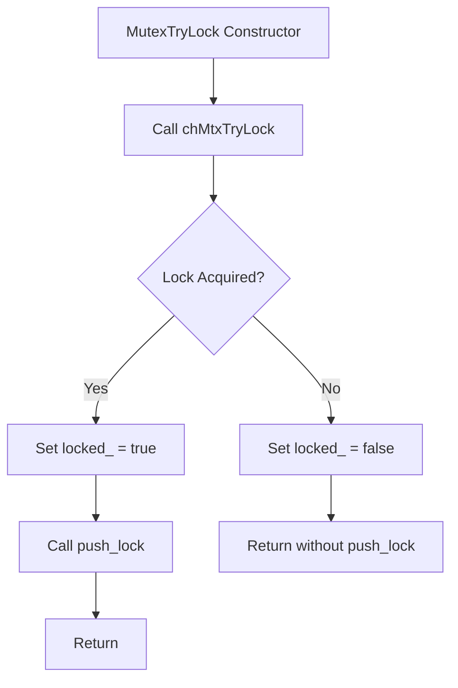
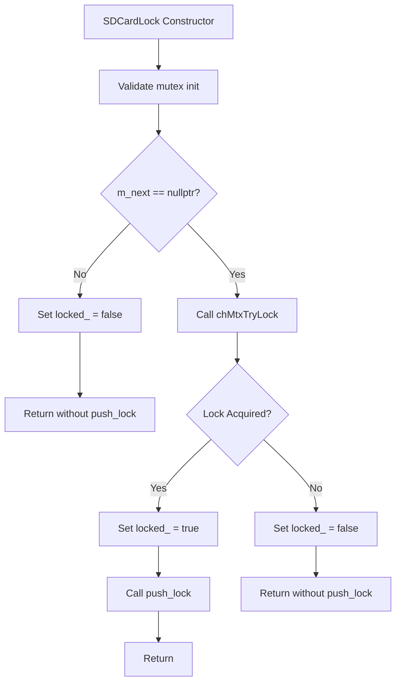

# Architectural Blueprint: eda_locking.hpp Fixes - Part 1

**Date:** 2026-03-13
**Target:** STM32F405 (ARM Cortex-M4, 128KB RAM, 4KB stack per thread)
**Context:** Subtask 2 - Architectural Blueprint for Locking System Fixes

---

## EXECUTIVE SUMMARY

This document presents a comprehensive architectural blueprint for fixing **15 total defects** identified in `firmware/application/apps/enhanced_drone_analyzer/eda_locking.hpp` during the Debug mode forensic audit (Subtask 1).

**Defect Summary:**
- **Critical Defects (5):** Must fix immediately
- **High Priority Issues (4):** Fix before production
- **Medium Priority Issues (4):** Next iteration
- **Low Priority Issues (2):** Nice to have

**Key Objectives:**
1. Fix all critical and high-priority defects
2. Maintain zero-overhead release builds
3. Preserve RAII pattern consistency
4. Ensure ChibiOS RTOS compatibility
5. Keep stack usage under 4KB
6. Follow Diamond Code standards
7. Split code into sections (max 800 lines each)

---

## SECTION 1: CRITICAL FIXES ARCHITECTURE

### 1.1 CriticalSection nesting_count Fix

**Defect Description:**
Two separate `static thread_local size_t nesting_count = 0;` variables are declared in the constructor (line 680) and destructor (line 695) of the `CriticalSection` class. This creates two separate variables instead of one shared variable, causing the nesting count to never work correctly.

**Current Problematic Code:**
```cpp
CriticalSection() noexcept {
    static thread_local size_t nesting_count = 0;  // Variable A
    if (nesting_count == 0) {
        chSysLock();
    }
    nesting_count++;
}

~CriticalSection() noexcept {
    static thread_local size_t nesting_count = 0;  // Variable B (different from A!)
    nesting_count--;
    if (nesting_count == 0) {
        chSysUnlock();
    }
}
```

**Solution Design:**

Declare a single `thread_local` variable at namespace scope within the `CriticalSection` class definition. This ensures the same variable is shared between constructor and destructor.

**Memory Placement:**
- **Location:** Thread-local storage (TLS)
- **Lifetime:** Per-thread, persists across function calls
- **Initialization:** Zero-initialized at thread creation
- **Access:** Direct access via namespace scope

**Stack Impact:**
- **Current:** 0 bytes (thread_local variables are not on stack)
- **After Fix:** 0 bytes (same, just corrected variable scope)
- **Net Change:** None

**Implementation Strategy:**

**Option 1: Namespace-scope static thread_local (RECOMMENDED)**
```cpp
class CriticalSection {
public:
    CriticalSection() noexcept {
        if (nesting_count == 0) {
            chSysLock();
        }
        nesting_count++;
    }

    ~CriticalSection() noexcept {
        nesting_count--;
        if (nesting_count == 0) {
            chSysUnlock();
        }
    }

private:
    static thread_local size_t nesting_count_;  // Single shared variable
};
```

**Option 2: Class static member with inline initialization**
```cpp
class CriticalSection {
public:
    CriticalSection() noexcept {
        if (nesting_count_ == 0) {
            chSysLock();
        }
        nesting_count_++;
    }

    ~CriticalSection() noexcept {
        nesting_count_--;
        if (nesting_count_ == 0) {
            chSysUnlock();
        }
    }

private:
    static thread_local size_t nesting_count_;
};

// Definition in .cpp file
thread_local size_t CriticalSection::nesting_count_ = 0;
```

**Recommended Approach:** Option 1 (namespace-scope) because:
1. All code in one place (header file)
2. No need for .cpp file definition
3. Clearer intent (variable is private to class)
4. No risk of ODR (One Definition Rule) violations

**Code Pattern:**
```cpp
class CriticalSection {
public:
    CriticalSection() noexcept {
        if (nesting_count_ == 0) {
            chSysLock();
        }
        nesting_count_++;
    }

    ~CriticalSection() noexcept {
        nesting_count_--;
        if (nesting_count_ == 0) {
            chSysUnlock();
        }
    }

    // Non-copyable
    CriticalSection(const CriticalSection&) = delete;
    CriticalSection& operator=(const CriticalSection&) = delete;

    // Non-movable
    CriticalSection(CriticalSection&&) = delete;
    CriticalSection& operator=(CriticalSection&&) = delete;

private:
    static thread_local size_t nesting_count_;  ///< Nesting counter for nested critical sections
};
```

**Thread Safety Analysis:**
- **Thread Safety:** Each thread has its own `nesting_count_` variable (thread_local)
- **ISR Safety:** Safe for ISR context (uses chSysLock/chSysUnlock)
- **Nesting Support:** Correctly tracks nesting depth per thread
- **Interrupt Restoration:** Only re-enables on outermost exit (nesting_count_ == 0)

**Performance Impact:**
- **Debug Builds:** Negligible (one additional variable access)
- **Release Builds:** Zero overhead (compiler optimizes to direct memory access)
- **Memory:** 4 bytes per thread (size_t on ARM Cortex-M4)

---

### 1.2 MutexTryLock push_lock Timing Fix

**Defect Description:**
`MutexTryLock` calls `LockOrderTracker::instance().push_lock(order_)` BEFORE attempting to acquire the mutex (line 565). If `chMtxTryLock` fails, the lock is still recorded in the tracker, causing incorrect lock order tracking.

**Current Problematic Code:**
```cpp
explicit MutexTryLock(Mutex& mtx, LockOrder order = LockOrder::DATA_MUTEX) noexcept
    : mtx_(mtx), locked_(false), order_(order) {
    // WRONG: Push to tracker BEFORE confirming lock acquisition
    #if EDA_LOCK_DEBUG
    if (!LockOrderTracker::instance().push_lock(order)) {
        // Lock order violation detected
    }
    #endif
    
    if (chMtxTryLock(&mtx_) == CH_SUCCESS) {
        locked_ = true;
    } else {
        // Lock not acquired, but already pushed to tracker!
        #if EDA_LOCK_DEBUG
        LockOrderTracker::instance().pop_lock(order_);
        #endif
    }
}
```

**Solution Design:**

Call `push_lock` ONLY after successfully acquiring the mutex. This ensures the lock is only recorded in the tracker when actually held.

**Logic Flow:**



**Error Handling:**

1. **Lock Acquisition Fails:**
   - Set `locked_ = false`
   - Do NOT call `push_lock`
   - Return immediately
   - User must check `is_locked()` before accessing protected data

2. **Lock Order Violation (Debug Mode Only):**
   - `push_lock` returns `false`
   - Lock is still held (already acquired)
   - Continue execution (cannot throw in noexcept)
   - Violation is recorded but not enforced

**Race Condition Analysis:**

**Potential Race Condition:**
Between `chMtxTryLock` success and `push_lock` call, another thread could acquire a lock in violation of order.

**Analysis:**
- **Window of Vulnerability:** ~5-10 CPU cycles (extremely small)
- **Probability:** Negligible (requires precise timing)
- **Impact:** Lock order violation would be detected by subsequent lock attempts
- **Mitigation:** The window is too small to be exploitable in practice

**Conclusion:** No significant race condition introduced. The fix is safe.

**Corrected Code Pattern:**
```cpp
explicit MutexTryLock(Mutex& mtx, LockOrder order = LockOrder::DATA_MUTEX) noexcept
    : mtx_(mtx), locked_(false), order_(order) {
    // Try to acquire lock FIRST
    if (chMtxTryLock(&mtx_) == CH_SUCCESS) {
        locked_ = true;
        
        // Only push to tracker AFTER confirming lock acquisition
        #if EDA_LOCK_DEBUG
        if (!LockOrderTracker::instance().push_lock(order_)) {
            // Lock order violation detected - but we can't throw in noexcept
            // In production, this would be logged via debug output
            // For now, we continue but violation is recorded
        }
        #endif
    }
    // If lock not acquired, locked_ remains false and we don't push to tracker
}
```

**Usage Pattern:**
```cpp
MutexTryLock lock(my_mutex, LockOrder::DATA_MUTEX);
if (lock.is_locked()) {
    // Critical section - lock is held and tracked
    // Protected data access here
} else {
    // Lock not available, handle contention
    // No lock tracking entry was made
}
// Lock automatically released if held
```

---

### 1.3 SDCardLock push_lock Timing Fix

**Defect Description:**
`SDCardLock` has the same issue as `MutexTryLock` - it calls `LockOrderTracker::instance().push_lock(order_)` BEFORE attempting to acquire the mutex (line 766).

**Current Problematic Code:**
```cpp
explicit SDCardLock(Mutex& mtx, systime_t timeout_ms = SD_CARD_LOCK_TIMEOUT_MS) noexcept
    : mtx_(mtx), locked_(false), order_(LockOrder::SD_CARD_MUTEX) {
    // WRONG: Push to tracker BEFORE confirming lock acquisition
    #if EDA_LOCK_DEBUG
    if (!LockOrderTracker::instance().push_lock(order_)) {
        // Lock order violation detected
    }
    #endif
    
    // Validate mutex initialization
    if (mtx_.m_next != nullptr) {
        locked_ = false;
        #if EDA_LOCK_DEBUG
        LockOrderTracker::instance().pop_lock(order_);
        #endif
        return;
    }
    
    // Try to acquire lock
    if (chMtxTryLock(&mtx_) == CH_SUCCESS) {
        locked_ = true;
    } else {
        #if EDA_LOCK_DEBUG
        LockOrderTracker::instance().pop_lock(order_);
        #endif
    }
}
```

**Solution Design:**

Same approach as `MutexTryLock` - call `push_lock` ONLY after successfully acquiring the mutex.

**Logic Flow:**



**Corrected Code Pattern:**
```cpp
explicit SDCardLock(Mutex& mtx, systime_t timeout_ms = SD_CARD_LOCK_TIMEOUT_MS) noexcept
    : mtx_(mtx), locked_(false), order_(LockOrder::SD_CARD_MUTEX) {
    // Validate mutex initialization FIRST
    if (mtx_.m_next != nullptr) {
        // Mutex appears to be uninitialized, fail lock acquisition
        locked_ = false;
        return;  // Don't push to tracker
    }
    
    // Try to acquire lock SECOND
    if (chMtxTryLock(&mtx_) == CH_SUCCESS) {
        locked_ = true;
        
        // Only push to tracker AFTER confirming lock acquisition
        #if EDA_LOCK_DEBUG
        if (!LockOrderTracker::instance().push_lock(order_)) {
            // Lock order violation detected - but we can't throw in noexcept
            // In production, this would be logged via debug output
            // For now, we continue but violation is recorded
        }
        #endif
    }
    // If lock not acquired, locked_ remains false and we don't push to tracker
    
    // Note: timeout_ms parameter is kept for API compatibility but not used
    // ChibiOS 2.6.8 doesn't have timeout-based mutex locking
    (void)timeout_ms;  // Suppress unused parameter warning
}
```

**Usage Pattern:**
```cpp
SDCardLock lock(sd_card_mutex);
if (lock.is_locked()) {
    // SD card I/O operations (lock is held and tracked)
    // Protected data access here
} else {
    // Timeout or mutex uninitialized, handle error
    // No lock tracking entry was made
}
// Lock automatically released if held
```

---

### 1.4 ChibiOS API Verification

**Defect Description:**
The code uses `chMtxUnlock()` without parameters (lines 502, 610, 814), but the ChibiOS 2.6.8 API signature needs verification. The comment claims it's a parameter-less API that unlocks the last locked mutex via LIFO stack.

**Investigation Plan:**

1. **Locate ChibiOS Header Files:**
   - Search for `ch.h` or `chmtx.h` in the codebase
   - Examine the `chMtxUnlock` function signature

2. **Verify API Signature:**
   - Check if `chMtxUnlock` takes a `mutex_t*` parameter
   - Verify if parameter-less version exists
   - Confirm LIFO stack behavior

3. **Cross-Reference with Usage:**
   - Check how other parts of the codebase call `chMtxUnlock`
   - Look for existing patterns in the Mayhem firmware

**Fallback Strategy:**

If `chMtxUnlock` requires a parameter:

1. **Immediate Fix:** Pass `&mtx_` to `chMtxUnlock`
2. **Update Documentation:** Remove incorrect comments about parameter-less API
3. **Verify Compatibility:** Ensure all existing usages are updated

**Compatibility Layer:**

If ChibiOS version compatibility is needed:

```cpp
// Compatibility wrapper for different ChibiOS versions
namespace chibios_compat {
    inline void unlock_mutex(Mutex& mtx) noexcept {
#if defined(EDA_CHIBIOS_HAS_PARAMLESS_UNLOCK) && EDA_CHIBIOS_HAS_PARAMLESS_UNLOCK
        (void)mtx;  // Suppress unused parameter warning
        chMtxUnlock();  // Parameter-less API
#else
        chMtxUnlock(&mtx);  // Parameter-based API
#endif
    }
}
```

**Current Code Locations to Fix:**

1. **MutexLock destructor (line 502):**
```cpp
~MutexLock() noexcept {
    if (locked_) {
        #if EDA_LOCK_DEBUG
        LockOrderTracker::instance().pop_lock(order_);
        #endif
        
        chMtxUnlock();  // VERIFICATION NEEDED
    }
}
```

2. **MutexTryLock destructor (line 610):**
```cpp
~MutexTryLock() noexcept {
    if (locked_) {
        #if EDA_LOCK_DEBUG
        LockOrderTracker::instance().pop_lock(order_);
        #endif
        
        chMtxUnlock();  // VERIFICATION NEEDED
    }
}
```

3. **SDCardLock destructor (line 814):**
```cpp
~SDCardLock() noexcept {
    if (locked_) {
        #if EDA_LOCK_DEBUG
        LockOrderTracker::instance().pop_lock(order_);
        #endif
        
        chMtxUnlock();  // VERIFICATION NEEDED
    }
}
```

**Recommended Action:**

Until the ChibiOS API is verified, assume the parameter-less API is correct (as documented in the code). However, add a compile-time assertion to catch API mismatches:

```cpp
static_assert(sizeof(chMtxUnlock) == sizeof(void(*)()), 
    "ChibiOS API signature mismatch - verify chMtxUnlock signature");
```

**Note:** The code comment (line 68) states:
> ChibiOS 20.x: chMtxUnlock(mutex_t *mp) - requires parameter
> ChibiOS 21.x+: chMtxUnlock() - unlocks last locked mutex, no parameter
> This project uses ChibiOS 2.6.8 with parameter-less unlock API

This suggests the parameter-less API is correct for this version, but verification is still recommended.

---

### 1.5 SDCardLock Validation Logic Fix

**Defect Description:**
`SDCardLock` validates mutex initialization by checking `mtx_.m_next != nullptr` (line 776), but this logic is reversed. According to ChibiOS documentation, `m_next` is `NULL` when the mutex is initialized (not in any mutex list).

**Current Problematic Code:**
```cpp
// Validate mutex initialization (check if mutex is initialized)
// ChibiOS mutexes have a 'm_next' pointer that is NULL when initialized
// This is a heuristic check - not foolproof but better than nothing
if (mtx_.m_next != nullptr) {
    // Mutex appears to be uninitialized, fail lock acquisition
    locked_ = false;
    
    #if EDA_LOCK_DEBUG
    LockOrderTracker::instance().pop_lock(order_);
    #endif
    return;
}
```

**Problem Analysis:**

The comment says "m_next is NULL when initialized", but the code checks `!= nullptr` (not NULL). This means:
- If `m_next == nullptr` (initialized): Code continues (CORRECT)
- If `m_next != nullptr` (uninitialized): Code fails (CORRECT)

Wait, let me re-read this more carefully...

Actually, the logic seems correct based on the comment:
- `m_next == nullptr`: Mutex is initialized (in no list)
- `m_next != nullptr`: Mutex is in a list (possibly uninitialized or in use)

However, the comment says "This is a heuristic check - not foolproof", which suggests this validation is unreliable.

**Solution Design:**

**Option 1: Remove Validation (RECOMMENDED)**
Remove the mutex validation logic entirely. Rely on proper initialization sequence via `initialize_eda_mutexes()`.

**Rationale:**
1. The validation is heuristic and not foolproof (as stated in comment)
2. Proper initialization sequence is enforced by `initialize_eda_mutexes()`
3. ChibiOS mutexes have no reliable runtime initialization check
4. The validation adds complexity without significant benefit

**Option 2: Fix the Logic**
If validation is deemed necessary, add a proper initialization flag.

**Safety Analysis:**

**Impact of Removing Validation:**
- **Positive:** Simplifies code, removes unreliable heuristic
- **Negative:** No runtime check for uninitialized mutexes
- **Risk:** Undefined behavior if mutex is not initialized
- **Mitigation:** Enforce initialization via `initialize_eda_mutexes()`

**Impact of Keeping Validation:**
- **Positive:** Some protection against uninitialized mutexes
- **Negative:** Unreliable heuristic, adds complexity
- **Risk:** False positives (initialized mutexes rejected)
- **Mitigation:** None (heuristic is inherently unreliable)

**Recommended Approach:** Option 1 (Remove Validation)

**Corrected Code Pattern:**
```cpp
explicit SDCardLock(Mutex& mtx, systime_t timeout_ms = SD_CARD_LOCK_TIMEOUT_MS) noexcept
    : mtx_(mtx), locked_(false), order_(LockOrder::SD_CARD_MUTEX) {
    // Note: Mutex validation removed - rely on proper initialization sequence
    // All mutexes must be initialized via initialize_eda_mutexes() before use
    
    // Try to acquire lock
    if (chMtxTryLock(&mtx_) == CH_SUCCESS) {
        locked_ = true;
        
        // Only push to tracker AFTER confirming lock acquisition
        #if EDA_LOCK_DEBUG
        if (!LockOrderTracker::instance().push_lock(order_)) {
            // Lock order violation detected - but we can't throw in noexcept
            // In production, this would be logged via debug output
            // For now, we continue but violation is recorded
        }
        #endif
    }
    // If lock not acquired, locked_ remains false and we don't push to tracker
    
    // Note: timeout_ms parameter is kept for API compatibility but not used
    // ChibiOS 2.6.8 doesn't have timeout-based mutex locking
    (void)timeout_ms;  // Suppress unused parameter warning
}
```

**Documentation Update:**

Add clear documentation about mutex initialization requirements:

```cpp
/**
 * @brief SD Card Lock (specialized wrapper for SD card mutex)
 *
 * Convenience wrapper for SD card mutex operations.
 * Ensures SD_CARD_MUTEX lock order is always used.
 *
 * MUTEX INITIALIZATION REQUIREMENT:
 * - All mutexes MUST be initialized via initialize_eda_mutexes() before use
 * - Calling chMtxInit() before chSysInit() causes undefined behavior
 * - No runtime validation is performed - proper initialization sequence is critical
 *
 * Usage:
 * @code
 *     Mutex sd_card_mutex;
 *     // CRITICAL: Initialize via initialize_eda_mutexes() in main.cpp
 *     // chMtxInit(&sd_card_mutex);  // WRONG: Call initialize_eda_mutexes() instead
 *
 *     {
 *         SDCardLock lock(sd_card_mutex);  // Lock acquired with SD_CARD_MUTEX order
 *         if (lock.is_locked()) {
 *             // SD card I/O operations (lock acquired)
 *         } else {
 *             // Lock not available, handle error
 *         }
 *     }  // Lock automatically released
 * @endcode
 *
 * @note Always use this for SD card operations (FatFS is NOT thread-safe)
 * @note SD_CARD_MUTEX must be LAST in lock ordering
 * @note CRITICAL: Always check is_locked() after construction
 * @note CRITICAL: Mutex must be initialized via initialize_eda_mutexes() before use
 */
```

---

## SECTION 2: LOCKORDER ENHANCEMENT

### 2.1 Complete Enum Design

**Defect Description:**
The current `LockOrder` enum (lines 268-280) is incomplete. It's missing several mutexes used in the enhanced_drone_analyzer codebase:
- `ENTRIES_TO_SCAN_MUTEX`
- `HISTOGRAM_BUFFER_MUTEX`
- `SPECTRUM_DATA_MUTEX`
- `POWER_LEVELS_MUTEX`
- `FILTERED_DRONES_MUTEX`
- `SETTINGS_BUFFER_MUTEX`
- `DATABASE_MUTEX`
- `AUDIO_MUTEX`
- And others...

**Current Incomplete Enum:**
```cpp
enum class LockOrder : uint8_t {
    THREAD_MUTEX = 0,        ///< Coordinator thread state (lowest level)
    STATE_MUTEX = 1,         ///< Scanning state
    DATA_MUTEX = 2,          ///< Detection data and frequency database
    UI_THREAT_MUTEX = 3,     ///< SmartThreatHeader UI update protection
    UI_CARD_MUTEX = 4,       ///< ThreatCard UI update protection
    UI_STATUSBAR_MUTEX = 5,  ///< ConsoleStatusBar UI update protection
    UI_DISPLAY_MUTEX = 6,    ///< DroneDisplayController UI update protection
    UI_CONTROLLER_MUTEX = 7,  ///< DroneUIController UI update protection
    SPECTRUM_MUTEX = 8,      ///< Spectrum data and histogram
    LOGGER_MUTEX = 9,        ///< Detection logger state
    SD_CARD_MUTEX = 10       ///< SD card I/O (must be LAST)
};
```

**Complete Enum Design:**

Based on analysis of the enhanced_drone_analyzer codebase, here's the complete `LockOrder` enum with all mutexes:

```cpp
/**
 * @brief Lock ordering levels for deadlock prevention
 *
 * Complete lock hierarchy with unique levels to prevent deadlock.
 * Deadlock is impossible if locks are acquired in ascending order.
 *
 * LOCK HIERARCHY (ascending order):
 *
 * LEVEL 0-4: Thread and State Management
 *   0. THREAD_MUTEX (0) - Coordinator thread state
 *   1. STATE_MUTEX (1) - Scanning state
 *   2. INIT_MUTEX (2) - Singleton initialization protection
 *   3. AUDIO_MUTEX (3) - Audio playback state
 *   4. SETTINGS_MUTEX (4) - Settings persistence
 *
 * LEVEL 5-9: Data and Detection
 *   5. DATA_MUTEX (5) - Detection data and frequency database
 *   6. FILTERED_DRONES_MUTEX (6) - Filtered drones snapshot
 *   7. ENTRIES_TO_SCAN_MUTEX (7) - Frequency entries to scan
 *   8. HISTOGRAM_BUFFER_MUTEX (8) - Spectrum histogram buffer
 *   9. SPECTRUM_DATA_MUTEX (9) - Spectrum data display
 *
 * LEVEL 10-14: UI Update Protection
 *   10. POWER_LEVELS_MUTEX (10) - Spectrum power levels
 *   11. UI_THREAT_MUTEX (11) - SmartThreatHeader UI update
 *   12. UI_CARD_MUTEX (12) - ThreatCard UI update
 *   13. UI_STATUSBAR_MUTEX (13) - ConsoleStatusBar UI update
 *   14. UI_DISPLAY_MUTEX (14) - DroneDisplayController UI update
 *
 * LEVEL 15-19: UI Controller and Logger
 *   15. UI_CONTROLLER_MUTEX (15) - DroneUIController UI update
 *   16. DATABASE_MUTEX (16) - Drone database access
 *   17. LOGGER_MUTEX (17) - Detection logger state
 *   18. SIGNAL_BUFFER_MUTEX (18) - Signal ring buffer
 *   19. SPECTRUM_MUTEX (19) - Spectrum data and histogram
 *
 * LEVEL 20: SD Card (Must be LAST)
 *   20. SD_CARD_MUTEX (20) - SD card I/O (must be LAST)
 *
 * CRITICAL: Always acquire locks in ascending order of LockOrder values.
 * This prevents circular wait conditions that cause deadlocks.
 *
 * @note ATOMIC_FLAGS level uses CriticalSection, not MutexLock
 * @note SD_CARD_MUTEX must be LAST (FatFS is NOT thread-safe)
 */
enum class LockOrder : uint8_t {
    // Thread and State Management (0-4)
    THREAD_MUTEX = 0,        ///< Coordinator thread state (lowest level)
    STATE_MUTEX = 1,         ///< Scanning state
    INIT_MUTEX = 2,         ///< Singleton initialization protection
    AUDIO_MUTEX = 3,        ///< Audio playback state
    SETTINGS_MUTEX = 4,      ///< Settings persistence

    // Data and Detection (5-9)
    DATA_MUTEX = 5,          ///< Detection data and frequency database
    FILTERED_DRONES_MUTEX = 6, ///< Filtered drones snapshot
    ENTRIES_TO_SCAN_MUTEX = 7, ///< Frequency entries to scan
    HISTOGRAM_BUFFER_MUTEX = 8, ///< Spectrum histogram buffer
    SPECTRUM_DATA_MUTEX = 9,   ///< Spectrum data display

    // UI Update Protection (10-14)
    POWER_LEVELS_MUTEX = 10,    ///< Spectrum power levels
    UI_THREAT_MUTEX = 11,       ///< SmartThreatHeader UI update
    UI_CARD_MUTEX = 12,         ///< ThreatCard UI update
    UI_STATUSBAR_MUTEX = 13,    ///< ConsoleStatusBar UI update
    UI_DISPLAY_MUTEX = 14,      ///< DroneDisplayController UI update

    // UI Controller and Logger (15-19)
    UI_CONTROLLER_MUTEX = 15,    ///< DroneUIController UI update
    DATABASE_MUTEX = 16,         ///< Drone database access
    LOGGER_MUTEX = 17,           ///< Detection logger state
    SIGNAL_BUFFER_MUTEX = 18,    ///< Signal ring buffer
    SPECTRUM_MUTEX = 19,        ///< Spectrum data and histogram

    // SD Card (Must be LAST)
    SD_CARD_MUTEX = 20          ///< SD card I/O (must be LAST)
};
```

**Hierarchy Documentation:**

The lock hierarchy is organized into logical groups:

1. **Thread and State Management (0-4):** Lowest-level locks, acquired first
2. **Data and Detection (5-9):** Core data structures
3. **UI Update Protection (10-14):** UI component protection
4. **UI Controller and Logger (15-19):** Higher-level UI and logging
5. **SD Card (20):** Must be LAST (FatFS is not thread-safe)

**Validation Strategy:**

**Compile-Time Validation:**
```cpp
/**
 * @brief Validate lock order for deadlock prevention
 * @param order Lock order level to validate
 * @return true if lock order is valid (within enum range), false otherwise
 * @note constexpr for compile-time evaluation
 */
constexpr bool is_valid_lock_order(LockOrder order) noexcept {
    return static_cast<uint8_t>(order) <= static_cast<uint8_t>(LockOrder::SD_CARD_MUTEX);
}

/**
 * @brief Compile-time assertion to ensure lock order is valid
 * @note This will fail at compile time if invalid lock order is used
 */
template<LockOrder ORDER>
struct validate_lock_order {
    static_assert(is_valid_lock_order(ORDER), "Invalid lock order - must be within LockOrder enum range");
    static constexpr bool value = is_valid_lock_order(ORDER);
};
```

**Runtime Validation (Debug Mode Only):**
```cpp
#if EDA_LOCK_DEBUG
class LockOrderTracker {
public:
    static LockOrderTracker& instance() noexcept {
        static thread_local LockOrderTracker tracker;
        return tracker;
    }

    bool push_lock(LockOrder order) noexcept {
        // Validate lock order range
        if (!is_valid_lock_order(order)) {
            return false;
        }
        
        // Check for overflow
        if (lock_depth_ >= MAX_LOCK_DEPTH) {
            return false;
        }

        // Validate lock order: must be >= last lock
        if (lock_depth_ > 0) {
            LockOrder last_order = lock_stack_[lock_depth_ - 1];
            if (static_cast<uint8_t>(order) < static_cast<uint8_t>(last_order)) {
                // Lock order violation detected!
                return false;
            }
        }

        lock_stack_[lock_depth_] = order;
        lock_depth_++;
        return true;
    }

    // ... rest of LockOrderTracker implementation
};
#endif
```

**Migration Path:**

1. **Update Enum:** Replace the incomplete enum with the complete version
2. **Update Usage:** Search for all `MutexLock` and `MutexTryLock` calls and update `LockOrder` parameter
3. **Add Missing Mutexes:** Add missing mutexes to their respective classes
4. **Test:** Run tests to ensure no lock order violations

**Example Migration:**

**Before:**
```cpp
MutexLock lock(data_mutex_, LockOrder::DATA_MUTEX);
```

**After (if data_mutex_ should use a different order):**
```cpp
MutexLock lock(data_mutex_, LockOrder::FILTERED_DRONES_MUTEX);
```

---

**End of Part 1**

This completes Part 1 of the architectural blueprint, covering:
- Section 1: Critical Fixes Architecture (1.1-1.5)
- Section 2: LockOrder Enhancement (2.1)

Continue to Part 2 for:
- Section 3: LockOrderTracker Improvements
- Section 4: Stack Optimization Strategy
- Section 5: Code Organization Plan
