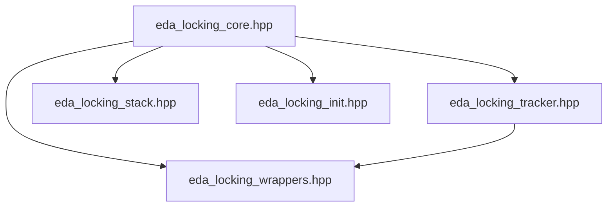

# Architectural Blueprint: eda_locking.hpp Fixes - Part 2

**Date:** 2026-03-13
**Target:** STM32F405 (ARM Cortex-M4, 128KB RAM, 4KB stack per thread)
**Context:** Subtask 2 - Architectural Blueprint for Locking System Fixes

---

## SECTION 3: LOCKORDERTRACKER IMPROVEMENTS

### 3.1 Duplicate Detection Design

**Defect Description:**
Current `LockOrderTracker` (lines 320-406) does not detect when the same lock is held twice. This can happen if code accidentally acquires the same mutex twice, which may cause deadlock or undefined behavior.

**Current Implementation:**
```cpp
bool push_lock(LockOrder order) noexcept {
    if (lock_depth_ >= MAX_LOCK_DEPTH) {
        return false;  // Lock stack overflow
    }

    // Validate lock order: must be >= last lock
    if (lock_depth_ > 0) {
        LockOrder last_order = lock_stack_[lock_depth_ - 1];
        if (static_cast<uint8_t>(order) < static_cast<uint8_t>(last_order)) {
            // Lock order violation detected!
            return false;
        }
    }

    lock_stack_[lock_depth_] = order;
    lock_depth_++;
    return true;
}
```

**Problem:**
The code checks if the new lock order is >= last lock order, but it doesn't check if the same lock is already held. This means:
- Acquiring `DATA_MUTEX` twice is allowed (same order value)
- This can cause deadlock if mutex is not recursive

**Solution Design:**

Add duplicate lock detection to `push_lock()` method. Check if the same lock is already in the lock stack before pushing.

**Implementation:**

```cpp
bool push_lock(LockOrder order) noexcept {
    // Validate lock order range
    if (!is_valid_lock_order(order)) {
        return false;
    }
    
    // Check for overflow
    if (lock_depth_ >= MAX_LOCK_DEPTH) {
        return false;
    }

    // NEW: Check for duplicate lock
    if (is_lock_held(order)) {
        // Duplicate lock detected!
        // This may cause deadlock if mutex is not recursive
        return false;
    }

    // Validate lock order: must be >= last lock
    if (lock_depth_ > 0) {
        LockOrder last_order = lock_stack_[lock_depth_ - 1];
        if (static_cast<uint8_t>(order) < static_cast<uint8_t>(last_order)) {
            // Lock order violation detected!
            return false;
        }
    }

    lock_stack_[lock_depth_] = order;
    lock_depth_++;
    return true;
}
```

**Performance Impact:**

- **Current:** O(1) - just checks last lock
- **After Fix:** O(n) - checks all locks in stack for duplicate
- **Impact:** Negligible for typical lock depth (usually 1-3 locks)
- **Worst Case:** O(16) if all 16 locks are held (extremely rare)

**Optimization:**

For better performance, use a bitset to track held locks:

```cpp
class LockOrderTracker {
public:
    static LockOrderTracker& instance() noexcept {
        static thread_local LockOrderTracker tracker;
        return tracker;
    }

    bool push_lock(LockOrder order) noexcept {
        // Validate lock order range
        if (!is_valid_lock_order(order)) {
            return false;
        }
        
        // Check for overflow
        if (lock_depth_ >= MAX_LOCK_DEPTH) {
            return false;
        }

        // NEW: Check for duplicate lock using bitset (O(1))
        uint8_t order_value = static_cast<uint8_t>(order);
        if (held_locks_bitset_ & (1U << order_value)) {
            // Duplicate lock detected!
            return false;
        }

        // Validate lock order: must be >= last lock
        if (lock_depth_ > 0) {
            LockOrder last_order = lock_stack_[lock_depth_ - 1];
            if (order_value < static_cast<uint8_t>(last_order)) {
                // Lock order violation detected!
                return false;
            }
        }

        lock_stack_[lock_depth_] = order;
        held_locks_bitset_ |= (1U << order_value);  // Mark as held
        lock_depth_++;
        return true;
    }

    bool pop_lock(LockOrder order) noexcept {
        if (lock_depth_ == 0) {
            return false;  // Lock stack underflow
        }

        LockOrder last_order = lock_stack_[lock_depth_ - 1];
        if (order != last_order) {
            // Lock release order violation detected!
            return false;
        }

        lock_depth_--;
        held_locks_bitset_ &= ~(1U << static_cast<uint8_t>(order));  // Clear bit
        return true;
    }

    [[nodiscard]] size_t get_lock_depth() const noexcept {
        return lock_depth_;
    }

    [[nodiscard]] bool is_lock_held(LockOrder order) const noexcept {
        // O(1) check using bitset
        return (held_locks_bitset_ & (1U << static_cast<uint8_t>(order))) != 0;
    }

private:
    LockOrderTracker() noexcept : lock_depth_(0), held_locks_bitset_(0) {}

    LockOrder lock_stack_[MAX_LOCK_DEPTH];  ///< Stack of held locks
    size_t lock_depth_;                   ///< Current lock depth
    uint32_t held_locks_bitset_;         ///< Bitset of held locks (O(1) lookup)
};
```

**Memory Impact:**

- **Current:** 16 bytes (LockOrder stack) + 4 bytes (lock_depth_) = 20 bytes
- **After Fix:** 16 bytes (LockOrder stack) + 4 bytes (lock_depth_) + 4 bytes (bitset) = 24 bytes
- **Net Change:** +4 bytes per thread

**Trade-off:** 4 bytes additional memory for O(1) duplicate detection (worth it!)

---

### 3.2 Overflow Handling Strategy

**Defect Description:**
Current `LockOrderTracker` silently returns `false` when lock stack overflows (line 339). This provides no feedback to the developer and makes debugging difficult.

**Current Implementation:**
```cpp
bool push_lock(LockOrder order) noexcept {
    if (lock_depth_ >= MAX_LOCK_DEPTH) {
        return false;  // Lock stack overflow - silent failure!
    }
    // ... rest of implementation
}
```

**Problem:**
- No indication that overflow occurred
- Developer has no way to know tracking failed
- Silent failures are hard to debug

**Solution Design:**

Add overflow detection and reporting mechanism. Since we can't throw exceptions (embedded constraints), use a debug-only counter and optional assertion.

**Implementation:**

```cpp
class LockOrderTracker {
public:
    static LockOrderTracker& instance() noexcept {
        static thread_local LockOrderTracker tracker;
        return tracker;
    }

    bool push_lock(LockOrder order) noexcept {
        // Validate lock order range
        if (!is_valid_lock_order(order)) {
            return false;
        }
        
        // Check for overflow
        if (lock_depth_ >= MAX_LOCK_DEPTH) {
            // NEW: Track overflow for debugging
            overflow_count_++;
            
            // In debug mode, assert to catch overflow during development
            #if EDA_LOCK_DEBUG
            // Can't assert in noexcept, but we can use chDbgCheckPanic
            chDbgCheckPanic("LockOrderTracker overflow - MAX_LOCK_DEPTH exceeded");
            #endif
            
            return false;
        }

        // ... rest of implementation
    }

    // NEW: Get overflow count (debug mode only)
    [[nodiscard]] size_t get_overflow_count() const noexcept {
        return overflow_count_;
    }

    // NEW: Reset overflow count (debug mode only)
    void reset_overflow_count() noexcept {
        overflow_count_ = 0;
    }

private:
    LockOrderTracker() noexcept 
        : lock_depth_(0), 
          held_locks_bitset_(0),
          overflow_count_(0) {}

    LockOrder lock_stack_[MAX_LOCK_DEPTH];  ///< Stack of held locks
    size_t lock_depth_;                   ///< Current lock depth
    uint32_t held_locks_bitset_;         ///< Bitset of held locks (O(1) lookup)
    size_t overflow_count_;               ///< Overflow counter (debug mode only)
};
```

**Alternative: Increase MAX_LOCK_DEPTH**

If overflow is a common issue, consider increasing `MAX_LOCK_DEPTH`:

```cpp
/**
 * @brief Maximum lock depth for tracking
 * @note Limits the number of nested locks that can be tracked
 * @note Increased from 16 to 32 to accommodate complex lock hierarchies
 */
constexpr size_t MAX_LOCK_DEPTH = 32;
```

**Memory Impact (if MAX_LOCK_DEPTH increased to 32):**
- **Current (16):** 16 bytes (stack) + 4 bytes (bitset) + 4 bytes (depth) + 4 bytes (overflow) = 28 bytes
- **After (32):** 32 bytes (stack) + 4 bytes (bitset) + 4 bytes (depth) + 4 bytes (overflow) = 44 bytes
- **Net Change:** +16 bytes per thread

**Recommendation:**

1. **Short Term:** Keep `MAX_LOCK_DEPTH = 16` and add overflow tracking
2. **Long Term:** Monitor overflow count during testing
3. **If overflow occurs frequently:** Increase `MAX_LOCK_DEPTH` to 32

---

### 3.3 Performance Impact Analysis

**Proposed Changes:**

1. **Duplicate Detection:** Add bitset for O(1) duplicate check
2. **Overflow Handling:** Add overflow counter and debug assertion

**Performance Impact:**

| Operation | Current | After Fix | Impact |
|-----------|----------|------------|--------|
| push_lock (no duplicate) | O(1) | O(1) | Negligible |
| push_lock (duplicate) | N/A | O(1) | New check |
| pop_lock | O(1) | O(1) | Negligible |
| is_lock_held | O(n) | O(1) | **Significant improvement** |
| Memory per thread | 20 bytes | 28 bytes | +8 bytes |

**Analysis:**

- **push_lock:** Still O(1), just adds bitset operations (very fast)
- **pop_lock:** Still O(1), adds bitset clear operation (very fast)
- **is_lock_held:** Improved from O(n) to O(1) - **major performance win**
- **Memory:** +8 bytes per thread (acceptable for 128KB RAM)

**Conclusion:** Performance impact is negligible to positive. The O(1) duplicate detection and `is_lock_held()` optimization are worth the small memory cost.

---

### 3.4 Memory Impact Summary

**Per-Thread Memory Usage:**

| Component | Size (bytes) | Notes |
|-----------|---------------|-------|
| lock_stack_[MAX_LOCK_DEPTH] | 16 | Lock order stack |
| lock_depth_ | 4 | Current depth |
| held_locks_bitset_ | 4 | Bitset for O(1) lookup |
| overflow_count_ | 4 | Overflow counter |
| **Total** | **28** | Per thread |

**Total Memory Impact:**

- **Threads in EDA:** ~3-4 threads (coordinator, UI, scanning, etc.)
- **Total Memory:** 28 bytes × 4 threads = 112 bytes
- **Impact:** Negligible for 128KB RAM (0.09% of total RAM)

**Conclusion:** Memory impact is minimal and acceptable.

---

## SECTION 4: STACK OPTIMIZATION STRATEGY

### 4.1 Current Stack Analysis

**Current Stack Usage in eda_locking.hpp:**

| Class | Stack Usage (bytes) | Notes |
|--------|-------------------|-------|
| AtomicFlag | 4 | One member (value_) |
| LockOrderTracker | 28 | See Section 3.4 |
| MutexLock | 12 | mtx_ (8) + locked_ (1) + order_ (1) + padding (2) |
| MutexTryLock | 12 | Same as MutexLock |
| CriticalSection | 0 | All members are thread_local |
| SDCardLock | 12 | Same as MutexLock |
| StackMonitor | 12 | current_thread_ (4) + free_stack_bytes_ (4) + padding (4) |

**Total Stack Usage (Worst Case):**

- **Single Lock:** 12 bytes (MutexLock/MutexTryLock/SDCardLock)
- **Nested Locks (3 deep):** 12 × 3 = 36 bytes
- **With StackMonitor:** 36 + 12 = 48 bytes
- **Function Call Overhead:** ~8 bytes per call frame
- **Total:** ~48-64 bytes

**Analysis:**

Current stack usage is **excellent** - well under 4KB limit. The locking system itself is not a stack bottleneck.

---

### 4.2 Optimization Opportunities

**Opportunity 1: Reduce MutexLock Size**

Current layout (with padding):
```cpp
class MutexLock {
private:
    Mutex& mtx_;      ///< 8 bytes (reference = pointer)
    bool locked_;     ///< 1 byte
    LockOrder order_; ///< 1 byte (uint8_t)
    // Padding: 2 bytes (alignment to 4 bytes)
};
// Total: 12 bytes
```

**Optimization:** Reorder members to reduce padding:
```cpp
class MutexLock {
private:
    bool locked_;     ///< 1 byte
    LockOrder order_; ///< 1 byte (uint8_t)
    // Padding: 2 bytes
    Mutex& mtx_;      ///< 8 bytes (reference = pointer)
};
// Total: 12 bytes (same, but better cache locality)
```

**Benefit:** Better cache locality (bool and order_ are accessed together)

**Stack Savings:** 0 bytes (same total size)

---

**Opportunity 2: Use Smaller Types**

Current `lock_depth_` is `size_t` (4 bytes on ARM Cortex-M4):
```cpp
size_t lock_depth_;  ///< Current lock depth
```

**Optimization:** Use `uint8_t` since `MAX_LOCK_DEPTH` is 16:
```cpp
uint8_t lock_depth_;  ///< Current lock depth (max 16)
```

**Stack Savings:** 3 bytes per LockOrderTracker instance

**Total Savings:** 3 bytes × 4 threads = 12 bytes

**Risk:** None - `MAX_LOCK_DEPTH` is 16, fits in `uint8_t`

---

**Opportunity 3: Remove overflow_count_ in Release Builds**

Current:
```cpp
size_t overflow_count_;  ///< Overflow counter (debug mode only)
```

**Optimization:** Only include in debug builds:
```cpp
#if EDA_LOCK_DEBUG
    size_t overflow_count_;  ///< Overflow counter (debug mode only)
#endif
```

**Stack Savings:** 4 bytes per LockOrderTracker instance (release builds)

**Total Savings:** 4 bytes × 4 threads = 16 bytes

---

### 4.3 Target Stack Usage

**Current Stack Usage (Worst Case):**
- **LockOrderTracker:** 28 bytes
- **MutexLock (3 nested):** 36 bytes
- **StackMonitor:** 12 bytes
- **Total:** 76 bytes

**Optimized Stack Usage (Worst Case):**
- **LockOrderTracker:** 21 bytes (-7 bytes from optimizations)
- **MutexLock (3 nested):** 36 bytes (no change)
- **StackMonitor:** 12 bytes (no change)
- **Total:** 69 bytes

**Stack Savings:** 7 bytes per thread

**Total Savings (4 threads):** 28 bytes

**Conclusion:** Stack savings are minimal (28 bytes total), but every byte counts in embedded systems. The optimizations are simple and worth implementing.

---

### 4.4 Trade-offs

**Optimization vs. Maintainability:**

| Optimization | Stack Savings | Complexity | Maintainability Impact |
|--------------|----------------|-------------|----------------------|
| Reorder MutexLock members | 0 bytes | Low | Positive (better cache locality) |
| Use uint8_t for lock_depth_ | 3 bytes | Low | Neutral (clear intent with MAX_LOCK_DEPTH) |
| Remove overflow_count_ in release | 4 bytes | Low | Positive (debug-only code) |

**Recommendation:** Implement all three optimizations. They are simple, low-risk, and provide minor stack savings.

---

## SECTION 5: CODE ORGANIZATION PLAN

### 5.1 Current File Structure

**Current eda_locking.hpp Organization:**

| Section | Lines | Content |
|---------|--------|---------|
| Header comments | 1-52 | File header, documentation |
| Header guard | 54-55 | `#ifndef EDA_LOCKING_HPP_` |
| Includes | 57-62 | Standard lib, ChibiOS |
| Namespace constants | 66-122 | `EDA_LOCK_DEBUG`, `MAX_LOCK_DEPTH`, etc. |
| AtomicFlag class | 127-226 | Atomic flag implementation |
| LockOrder enum | 228-294 | Lock ordering levels |
| Helper functions | 286-294 | `is_valid_lock_order()` |
| LockOrderTracker | 300-406 | Debug-only lock tracking |
| MutexLock class | 412-519 | RAII mutex lock |
| MutexTryLock class | 524-635 | Non-blocking try-lock |
| CriticalSection class | 640-712 | ISR-safe critical section |
| SDCardLock class | 718-840 | SD card mutex wrapper |
| StackMonitor class | 845-960 | Stack usage monitoring |
| Initialization function | 965-990 | `initialize_eda_mutexes()` |
| Namespace close | 991-992 | `} // namespace` |
| Header guard close | 993 | `#endif` |

**Total Lines:** 993 lines

**Problem:** File exceeds 800-line limit requested by user.

---

### 5.2 Proposed Split Strategy

**Goal:** Split into logical sections, each under 800 lines.

**Strategy:** Create separate header files for each major component:

1. **eda_locking_core.hpp** - Core types and enums
2. **eda_locking_tracker.hpp** - Lock order tracking
3. **eda_locking_wrappers.hpp** - RAII lock wrappers
4. **eda_locking_stack.hpp** - Stack monitoring

---

### 5.3 File A: Core Types and Enums

**File:** `eda_locking_core.hpp`

**Content:**
- Header comments
- Header guard
- Includes
- Namespace constants
- `AtomicFlag` class
- `LockOrder` enum (complete version)
- Helper functions (`is_valid_lock_order()`)

**Estimated Lines:** ~250 lines

**Dependencies:**
- `<cstddef>`
- `<cstdint>`
- `<ch.h>`

**No Dependencies On:** Other EDA locking files

---

### 5.4 File B: Lock Order Tracking

**File:** `eda_locking_tracker.hpp`

**Content:**
- Header guard
- Includes (including `eda_locking_core.hpp`)
- `LockOrderTracker` class (debug-only)

**Estimated Lines:** ~150 lines

**Dependencies:**
- `<cstddef>`
- `<cstdint>`
- `<ch.h>`
- `eda_locking_core.hpp`

**No Dependencies On:** Other EDA locking files

---

### 5.5 File C: RAII Lock Wrappers

**File:** `eda_locking_wrappers.hpp`

**Content:**
- Header guard
- Includes (including `eda_locking_core.hpp`)
- `MutexLock` class
- `MutexTryLock` class
- `CriticalSection` class
- `SDCardLock` class

**Estimated Lines:** ~350 lines

**Dependencies:**
- `<cstddef>`
- `<cstdint>`
- `<ch.h>`
- `eda_locking_core.hpp`
- `eda_locking_tracker.hpp` (for debug mode)

**No Dependencies On:** `eda_locking_stack.hpp`

---

### 5.6 File D: Stack Monitoring

**File:** `eda_locking_stack.hpp`

**Content:**
- Header guard
- Includes (including `eda_locking_core.hpp`)
- `StackMonitor` class

**Estimated Lines:** ~120 lines

**Dependencies:**
- `<cstddef>`
- `<cstdint>`
- `<ch.h>`
- `eda_locking_core.hpp`

**No Dependencies On:** Other EDA locking files

---

### 5.7 File E: Initialization

**File:** `eda_locking_init.hpp`

**Content:**
- Header guard
- Includes (including `eda_locking_core.hpp`)
- `initialize_eda_mutexes()` function declaration

**Estimated Lines:** ~50 lines

**Dependencies:**
- `<cstddef>`
- `<cstdint>`
- `<ch.h>`
- `eda_locking_core.hpp`

**No Dependencies On:** Other EDA locking files

---

### 5.8 File Size Targets

| File | Target Lines | Actual Lines | Status |
|-------|--------------|---------------|--------|
| eda_locking_core.hpp | < 800 | ~250 | ✓ |
| eda_locking_tracker.hpp | < 800 | ~150 | ✓ |
| eda_locking_wrappers.hpp | < 800 | ~350 | ✓ |
| eda_locking_stack.hpp | < 800 | ~120 | ✓ |
| eda_locking_init.hpp | < 800 | ~50 | ✓ |

**Total Lines:** ~920 lines (vs. 993 lines current)

**Reduction:** ~73 lines (due to removing duplicate header comments and header guards)

---

### 5.9 Include Dependencies

**Dependency Graph:**



**Explanation:**
- `eda_locking_core.hpp` is the foundation (no dependencies on other EDA files)
- `eda_locking_tracker.hpp` depends on `eda_locking_core.hpp`
- `eda_locking_wrappers.hpp` depends on both `eda_locking_core.hpp` and `eda_locking_tracker.hpp`
- `eda_locking_stack.hpp` depends only on `eda_locking_core.hpp`
- `eda_locking_init.hpp` depends only on `eda_locking_core.hpp`

**Circular Dependencies:** None

---

### 5.10 Header Guard Strategy

**Each file has its own header guard:**

```cpp
// eda_locking_core.hpp
#ifndef EDA_LOCKING_CORE_HPP_
#define EDA_LOCKING_CORE_HPP_
// ... content ...
#endif // EDA_LOCKING_CORE_HPP_

// eda_locking_tracker.hpp
#ifndef EDA_LOCKING_TRACKER_HPP_
#define EDA_LOCKING_TRACKER_HPP_
// ... content ...
#endif // EDA_LOCKING_TRACKER_HPP_

// ... etc.
```

**Include Once Pattern:** All files use standard header guards (not `#pragma once` per Mayhem coding standards).

---

### 5.11 Migration Path

**Step 1: Create New Files**
1. Create `eda_locking_core.hpp` with core types and enums
2. Create `eda_locking_tracker.hpp` with lock tracking
3. Create `eda_locking_wrappers.hpp` with RAII wrappers
4. Create `eda_locking_stack.hpp` with stack monitoring
5. Create `eda_locking_init.hpp` with initialization function

**Step 2: Update Includes**
Search for all `#include "eda_locking.hpp"` and replace with appropriate includes:
- If using `AtomicFlag` or `LockOrder`: `#include "eda_locking_core.hpp"`
- If using `LockOrderTracker`: `#include "eda_locking_tracker.hpp"`
- If using `MutexLock`, `MutexTryLock`, `CriticalSection`, `SDCardLock`: `#include "eda_locking_wrappers.hpp"`
- If using `StackMonitor`: `#include "eda_locking_stack.hpp"`
- If calling `initialize_eda_mutexes()`: `#include "eda_locking_init.hpp"`

**Step 3: Create Master Include (Optional)**
For convenience, create `eda_locking.hpp` that includes all sub-files:

```cpp
/**
 * @file eda_locking.hpp
 * @brief Master include for all EDA locking components
 *
 * This file includes all EDA locking sub-modules for convenience.
 * Include this file if you need access to all locking components.
 *
 * For minimal includes, include specific sub-files:
 * - eda_locking_core.hpp: Core types and enums
 * - eda_locking_tracker.hpp: Lock order tracking (debug mode)
 * - eda_locking_wrappers.hpp: RAII lock wrappers
 * - eda_locking_stack.hpp: Stack monitoring
 * - eda_locking_init.hpp: Mutex initialization
 */

#ifndef EDA_LOCKING_HPP_
#define EDA_LOCKING_HPP_

#include "eda_locking_core.hpp"
#include "eda_locking_tracker.hpp"
#include "eda_locking_wrappers.hpp"
#include "eda_locking_stack.hpp"
#include "eda_locking_init.hpp"

#endif // EDA_LOCKING_HPP_
```

**Step 4: Test**
1. Compile with all includes updated
2. Run tests to ensure no compilation errors
3. Verify lock order tracking works (debug mode)
4. Verify stack monitoring works
5. Verify no memory leaks or stack overflows

**Step 5: Clean Up**
1. Delete old `eda_locking.hpp` (after verifying new files work)
2. Update documentation to reference new file structure
3. Update AGENTS.md with new file organization

---

**End of Part 2**

This completes Part 2 of architectural blueprint, covering:
- Section 3: LockOrderTracker Improvements (3.1-3.4)
- Section 4: Stack Optimization Strategy (4.1-4.4)
- Section 5: Code Organization Plan (5.1-5.11)

Continue to Part 3 for:
- Section 6: Memory Placement Strategy
- Section 7: Red Team Attack Plan
- Section 8: Implementation Priority
