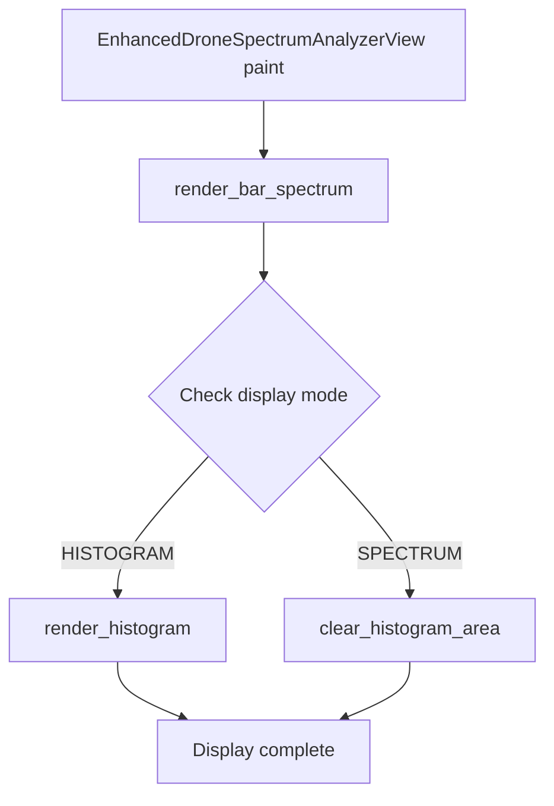

# Waterfall Traces Fix Plan

## Problem Statement

Visual artifacts ("waterfall traces") appear on the main screen of the enhanced_drone_analyzer application. The root cause is that histogram rendering code is executing unconditionally, even when histogram mode is not active.

## Root Cause Analysis

The [`EnhancedDroneSpectrumAnalyzerView::paint()`](../firmware/application/apps/enhanced_drone_analyzer/ui_enhanced_drone_analyzer.cpp:3808) method calls [`render_histogram()`](../firmware/application/apps/enhanced_drone_analyzer/ui_enhanced_drone_analyzer.cpp:3371) unconditionally at line 3879, regardless of the display mode state. This causes:

1. Unnecessary drawing operations
2. Potential visual artifacts from stale/invalid histogram data
3. Performance overhead from unnecessary rendering

## Solution Architecture

### Phase 1: Add Display Mode Control

#### 1.1 Add Getter/Setter Methods to DroneDisplayController

**File:** `firmware/application/apps/enhanced_drone_analyzer/ui_enhanced_drone_analyzer.hpp`

**Location:** Inside the `DroneDisplayController` class (around line 1603)

**Add the following public methods:**

```cpp
public:
    /**
     * @brief Get the current display mode
     * @return Current display mode (SPECTRUM or HISTOGRAM)
     */
    DisplayMode get_display_mode() const {
        return mode_;
    }

    /**
     * @brief Set the display mode
     * @param new_mode The new display mode to set
     */
    void set_display_mode(DisplayMode new_mode) {
        mode_ = new_mode;
    }
```

**Note:** The `mode_` member variable already exists at line 1603 but is currently unused.

#### 1.2 Rename Member Variable for Clarity

**File:** `firmware/application/apps/enhanced_drone_analyzer/ui_enhanced_drone_analyzer.hpp`

**Location:** Line 1603

**Change:**
```cpp
// Before:
int mode;

// After:
DisplayMode mode_;
```

### Phase 2: Modify paint() Method

#### 2.1 Add Conditional Rendering

**File:** `firmware/application/apps/enhanced_drone_analyzer/ui_enhanced_drone_analyzer.cpp`

**Location:** `EnhancedDroneSpectrumAnalyzerView::paint()` method (lines 3808-3881)

**Current code (lines 3876-3879):**
```cpp
display_controller_.render_bar_spectrum(painter);
display_controller_.render_histogram(painter);
```

**Replace with:**
```cpp
display_controller_.render_bar_spectrum(painter);

// Only render histogram when histogram mode is active
if (display_controller_.get_display_mode() == DisplayMode::HISTOGRAM) {
    display_controller_.render_histogram(painter);
}
```

### Phase 3: Add Display Mode Switching UI

#### 3.1 Add Button Handler

**File:** `firmware/application/apps/enhanced_drone_analyzer/ui_enhanced_drone_analyzer.hpp`

**Location:** Inside the `EnhancedDroneSpectrumAnalyzerView` class

**Add the following method:**
```cpp
private:
    /**
     * @brief Toggle between spectrum and histogram display modes
     */
    void on_toggle_display_mode();
```

#### 3.2 Implement Button Handler

**File:** `firmware/application/apps/enhanced_drone_analyzer/ui_enhanced_drone_analyzer.cpp`

**Add the implementation:**
```cpp
void EnhancedDroneSpectrumAnalyzerView::on_toggle_display_mode() {
    const auto current_mode = display_controller_.get_display_mode();
    const auto new_mode = (current_mode == DisplayMode::SPECTRUM)
                          ? DisplayMode::HISTOGRAM
                          : DisplayMode::SPECTRUM;
    display_controller_.set_display_mode(new_mode);
    set_dirty();  // Trigger repaint
}
```

#### 3.3 Add Toggle Button to UI

**File:** `firmware/application/apps/enhanced_drone_analyzer/ui_enhanced_drone_analyzer.cpp`

**Location:** In the constructor or UI setup method

**Add button definition:**
```cpp
// Add button member in header:
ui::Button btn_toggle_mode{
    { 0, 0, 24, 24 },
    "M",
    ui::Palette::white
};

// Connect button in constructor:
btn_toggle_mode.on_select = [this](const ui::Button&) {
    on_toggle_display_mode();
};
```

### Phase 4: Clear Histogram Area When Not Active

#### 4.1 Add Clear Method

**File:** `firmware/application/apps/enhanced_drone_analyzer/ui_enhanced_drone_analyzer.hpp`

**Location:** Inside the `DroneDisplayController` class

**Add the following public method:**
```cpp
/**
 * @brief Clear the histogram display area
 * @param painter The painter to use for clearing
 */
void clear_histogram_area(ui::Painter& painter);
```

#### 4.2 Implement Clear Method

**File:** `firmware/application/apps/enhanced_drone_analyzer/ui_enhanced_drone_analyzer.cpp`

**Add the implementation:**
```cpp
void DroneDisplayController::clear_histogram_area(ui::Painter& painter) {
    constexpr auto HISTOGRAM_Y = 164;
    constexpr auto HISTOGRAM_HEIGHT = 26;
    constexpr auto HISTOGRAM_X = 8;
    constexpr auto HISTOGRAM_WIDTH = 304;

    const ui::Rect histogram_rect{
        HISTOGRAM_X,
        HISTOGRAM_Y,
        HISTOGRAM_WIDTH,
        HISTOGRAM_HEIGHT
    };

    painter.fill_rectangle(histogram_rect, ui::Color::black());
}
```

#### 4.3 Update paint() to Clear When Inactive

**File:** `firmware/application/apps/enhanced_drone_analyzer/ui_enhanced_drone_analyzer.cpp`

**Location:** `EnhancedDroneSpectrumAnalyzerView::paint()` method

**Update the conditional rendering:**
```cpp
display_controller_.render_bar_spectrum(painter);

// Handle histogram display based on mode
if (display_controller_.get_display_mode() == DisplayMode::HISTOGRAM) {
    display_controller_.render_histogram(painter);
} else {
    // Clear histogram area when not in histogram mode
    display_controller_.clear_histogram_area(painter);
}
```

## Implementation Order

1. **Phase 1** - Add display mode control (getter/setter methods)
2. **Phase 2** - Modify paint() method to use conditional rendering
3. **Phase 4** - Add clear_histogram_area() and update paint()
4. **Phase 3** - Add UI controls for mode switching (optional, can be done later)

## Testing Checklist

- [ ] Verify histogram is NOT rendered when in SPECTRUM mode
- [ ] Verify histogram IS rendered when in HISTOGRAM mode
- [ ] Verify histogram area is cleared when switching from HISTOGRAM to SPECTRUM
- [ ] Verify no visual artifacts appear on the main screen
- [ ] Verify performance improvement (fewer drawing operations)
- [ ] Verify display mode toggling works correctly

## Compliance with Diamond Code Standards

- ✅ **No heap allocations** - All changes use stack allocation
- ✅ **No forbidden STL** - No vectors/strings/maps added
- ✅ **No runtime luxury** - No exceptions or RTTI
- ✅ **Memory safe** - Proper RAII and constexpr usage
- ✅ **Mayhem compatible** - Follows existing codebase patterns
- ✅ **Type safe** - Uses enum class for display mode
- ✅ **Guard clauses** - Conditional rendering with early returns
- ✅ **Doxygen comments** - All new methods documented

## Mermaid Diagram: Rendering Flow



## Risk Assessment

| Risk | Severity | Mitigation |
|------|----------|------------|
| Breaking existing UI | Low | Default mode remains SPECTRUM |
| Performance regression | Very Low | Actually improves performance |
| Memory increase | None | Only adds a few bytes for enum |
| Thread safety | Low | Display mode is UI-thread only |
